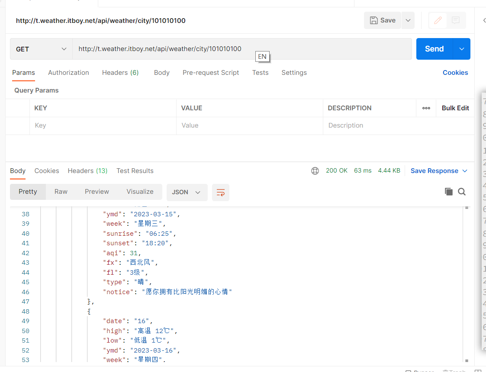

# Web、HTTP 和 CGI 之间的关系

TinyHTTPd 虽是迷你 Web 服务器程序，代码简短，完整涉及到 HTTP、TCP、CGI等基本协议，先来看一下这三者对于Web服务的作用。


HTTPS与Web服务器框架


CGI

**作用:**  一些程序中间处理器,  调用系统中的其他程序和数据库交互.==可以把web服务器必做狙击手    CGI程序就是狙击手的观察员==

**CGI功能:**

+ 简单功能：计数器、生成包含日期、天气等的页面
+ 中等难度的功能：图象映象、动画
+ 高级任务：后端数据库操作、搜索引擎、多重动态页面

以前的服务器会存储一些静态的HTML文件，客户端要求要了就给他，但现在更多的有动态需求、需要现场生成。我们的服务器做不到，就通过CGI程序代劳，我觉得**上面的博客中的这张图**比较好


也就是服务器没法直接去数据库(DB)或者其他的啥的给用户返回了，就找CGI去调用。博客中的有一句话涉及了我们CGI的实现机理(图中也有)，所以需要记一记：
**服务器要解析出HTTP请求的正文内容写入到CGI程序的标准输入(stdin)中，CGI程序的标准输出(stdout)就作为服务器的返回(应答报文[Response])。**

# 主要代码框架图


# 程序流程解析图


# 预备知识

## 两种架构

+ B/S架构：Browser/Server，浏览器/服务器架构
  		B：浏览器，比如Firefox、Internet EXplorer、Google chrome、Safari、Opera等
  		S：服务器，比如 Apache、nginx等
+ C/S架构：client/Server，客户端/服务器架构
+ B/S架构相对于 c/s架构，客户机上无需安装任何软件，使用浏览器即可访问服务器
  因此，越来越多的 C/S架构正被B/S架构所替代

一般情况下:

+ **客户端：浏览器**
+ **服务器：网站**

网站:---- > 文件夹
网页:---- > 文件:   文本, 图片, 链接, 动图, html

## HTTP请求与响应详解

HTTP协议永远都是客户端发起请求，服务器做出响应
也就是说，请求必定是先从客户端发起的，服务器端在没有接收到请求之前不会发送任何响应
这就无法实现这样一种场景：服务端主动推送消息给客户端

### 无状态

当浏览器第一次发送请求给服务器时，服务器做出了响应
当浏览器第二次发送请求给服务器时，服务器同样可以做出响应，但服务器并不知道第二次的请求和第一次来自同一个浏览器也就是说，服务器是不会记住你是谁的，所以是无状态的

而如果要使HTTP协议有状态，就可以使浏览器访问服务器时，加入 cookie
这样，只要你在请求时有了这个 cookie，服务器就能够通过 cookie知道，你就是之前那个浏览器
这样的话，http 协议就有状态了。

### 1.HTTP==请求报文==由3部分组成（请求行+请求头+请求体）


 **实际的请求报文**


①是请求方法，GET和POST是最常见的HTTP方法，除此以外还包括DELETE、HEAD、OPTIONS、PUT、TRACE。不过，当前的大多数浏览器只支持GET和POST，Spring 3.0提供了一个HiddenHttpMethodFilter，允许你通过“_method”的表单参数指定这些特殊的HTTP方法（实际上还是通过POST提交表单）。服务端配置了HiddenHttpMethodFilter后，Spring会根据_method参数指定的值模拟出相应的HTTP方法，这样，就可以使用这些HTTP方法对处理方法进行映射了。

②为请求对应的URL地址，它和报文头的Host属性组成完整的请求URL，

③是协议名称及版本号。

④是HTTP的报文头，报文头包含若干个属性，格式为“属性名:属性值”，**服务端据此获取客户端的信息。**

⑤是报文体，它将一个页面表单中的组件值通过param1=value1¶m2=value2的键值对形式编码成一个格式化串，它承载多个请求参数的数据。

注意:  不但报文体可以传递请求参数，请求URL也可以通过类于`“/chapter15/user.html? param1=value1&param2=value2”`的方式传递请求参数。

 **更详细的结构图：**

http 请求格式:


请求报体为

```
Request Line<CRLF> //请求行
Header-Name: header-value<CRLF>  //消息报头，一个或者多个
Header-Name: header-value<CRLF>
...
<CRLF> //空行
body//请求正文
```

*请求行*:
请求行由请求方法字段、URL字段和HTTP协议版本字段3个字段组成，它们用空格分隔。
例如请求行：

```c
GET /index.html HTTP/1.1
```

一个字符一个字符的向后读取，直到遇到第一个回车符(\r)

以预览的方式读取回车符的下个一，如果能成功读取，并且为行换符(\n)
则正式接收该数据，此时的c就不满足循环条件的要求，循环结束，刚好读取了第一行


### 2.HTTP的==响应报文==由三部分组成（响应行+响应头+响应体）


**实际的响应报文**


①报文协议及版本；
②状态码及状态描述；
③响应报文头，也是由多个属性组成；
④响应报文体，即我们真正要的“干货”。

**响应状态码:** 

和请求报文相比，响应报文多了一个“响应状态码”，**它以“清晰明确”的语言告诉客户端本次请求的处理结果。**

HTTP的响应状态码由5段组成：

1xx 消息，一般是告诉客户端，请求已经收到了，正在处理，别急…
2xx 处理成功，一般表示：请求收悉、我明白你要的、请求已受理、已经处理完成等信息.
3xx 重定向到其它地方。它让客户端再发起一个请求以完成整个处理。
4xx 处理发生错误，责任在客户端，如客户端的请求一个不存在的资源，客户端未被授权，禁止访问等。
5xx 处理发生错误，责任在服务端，如服务端抛出异常，路由出错，HTTP版本不支持等。

200 OK  处理成功！

303 See Other  我把你redirect到其它的页面，目标的URL通过响应报文头的Location告诉你。

304 Not Modified   告诉客户端，你请求的这个资源至你上次取得后，并没有更改，你直接用你本地的缓存吧，我很忙哦，你能不能少来烦我啊！

404 Not Found  找不到页面。如你在google上找到一个页面，点击这个链接返回404，表示这个页面已经被网站删除了，google那边的记录只是美好的回忆。

500 Internal Server Error   看到这个错误，你就应该查查服务端的日志了，肯定抛出了一堆异常

### 请求方法

HTTP常用的请求方式有很多中，最常用的是 GET和POST
二者最主要的区别就是:

+ GET请求的参数位于URL中，会显示在地址栏上
+ POST 请求的参数位于request bgdy 请求体中

因此，GET请求的安全性不如 POST请求，并且/GET请求的参数有长度限制，而 POST没有

### Postman

HTTP包含客户端和服务端，试想下面的两种情况
服务端开发完毕，而客户端还未完成开发。此时服务端开发人员能否对自己写的服务端程序进行测试呢？
客户端开发人员访问服务端出错，比如无法访问服务端，有没有第三方的测试工具做进一步验证呢:
此时，就用到Postman了
Postman是一个接口测试工具，使用 http开发的人几乎是无人不知的
它主要是用来模拟各种HTTP请求的（比如 GET请求、POST请求等)
在做接口测试的时候，Postman 相当于客户端，它可模拟用户发起的各类HTTP请求，将请求数据发送至服务端，并获取对应的响应结果
接下来，以获取天气北京的天气为例，来介绍Postman的基本使用




# 代码解析

```c++
int get_line(int sock, char* buf, int size)
{
	int i = 0;
	char c = '\0';
	int n;  //用于记录成功读取的字符数目

	while ((i < size - 1) && (c != '\n'))
	{
		n = recv(sock, &c, 1, 0);
		/*
		recv 的 flag 设为0
		此时的recv函数读取tcp buffer中的数据到buf中
		这里是一个字符一个字符的向外读
		*/
		/* DEBUG printf("%02X\n", c); */
		if (n > 0) // 读出数据成功
		{
			if (c == '\r')
			{
				n = recv(sock, &c, 1, MSG_PEEK);
				/*
			  考虑server向client发送数据"_META_DATA_\r\n_USER_DATA_"
			  把flags设置为MSG_PEEK时,仅把tcp buffer中的数据
			  读取到buf中，并不把已读取的数据从tcp buffer中移除，
			  再次调用recv仍可以读到刚才读到的数据
			  */
			  /* DEBUG printf("%02X\n", c); */
				if ((n > 0) && (c == '\n'))
					recv(sock, &c, 1, 0);  // 读出\n
				else
					/*
				如果回车符(\r)的后面不是换行符(\n)
				或者读取失败
				就把当前读取的字符置为换行，从而终止循环
				*/
					c = '\n';
			}
			/*依次向后读取*/
			buf[i] = c;
			i++;
		}
		else
			/*没有成功接收到字符，以换行符结尾，结束循环*/
			c = '\n';
	}
	buf[i] = '\0';

	return(i);
}
```

[(6条消息) Tinyhttpd详解_Anas_南的博客-CSDN博客](https://blog.csdn.net/weixin_43528025/article/details/106197904?utm_medium=distribute.pc_relevant.none-task-blog-2~default~baidujs_baidulandingword~default-4-106197904-blog-120161582.pc_relevant_landingrelevant&spm=1001.2101.3001.4242.3&utm_relevant_index=7)

**CGI执行**


input：由父进程向子进程的输入管道
output：由子进程向父进程的输出管道
1、让子进程去执行cgi，父进程去做I/O操作。

首先将子进程的标准输入重定向为input[0]，将子进程的标准输出重定向为output[1]，这样，子进程的输入来自父进程，子进程的输出是输出到父进程。通过管道进行父子进程的通信。
2、父进程通过recv接收来自客户端的表单输入，并且通过write传给子进程，子进程收到父进程的输入后，执行cgi脚本，执行完后，输出给父进程。父进程通过read读取到子进程的输出后，再通过send发送到客户端。


**个人见解**：由于CGI程序中调用的 scanf 和 printf默认为STDIN 和 STDOUT，为了与父进程通信，故使用dup2函数修改
两者重分别定向到了两个管道的读取端和写入端。则此时printf则是向父进程发送消息，scanf是接受父进程的消息（不怎么了解CGI程序，所以不一定正确）

**过程：**

1. 判断是GET请求还是POST请求，如果是GET请求丢弃请求头，如果是POST请求，获得Content-Length。接下来判断请求长度是否合法，如果请求不合法，调用bad_request。
2. 接下来处理请求成功的情况，先send“正确，HTTP 状态码 200“。
3. 建立cgi_output和cgi_input管道。失败调用cannot_execute。
4. fork一个进程，如果是子进程，调用cgi脚本。
5. 将读写(STDOUT STDIN)文件描述符与cgi_output[1]和cgi_input[0]绑定。关闭另外两个描述符。
6.  设置环境变量，execl执行cgi。
7. 若为父进程，关闭cgi_input的读取端和cgi_output的写入端。
8. 如果为POST请求，需要写入cgi_input,cgi_input输出端已重定向为STDIN 。
9. 父进程从cgi_output读出结果，关闭管道，等待子进程结束。

```c++
// 执行 CGI 脚本
// 参数: 通讯套接字 文件路径 方法 URL
  /**********************************************************************/
void execute_cgi(int client, const char* path,
	const char* method, const char* query_string)
{
	char buf[1024];
	int cgi_output[2];	//创建管道描述符号, 由父进程向子进程的输入管道
	int cgi_input[2];   //创建管道描述符号, 由子进程向父进程的输出管道
	pid_t pid;
	int status;
	int i;
	char c;
	int numchars = 1;
	int content_length = -1; //对 POST 的 HTTP 请求中找出 content_length

	//1.处理报文头(客户端发送的服务请求)阶段

	//判断是GET请求还是POST请求，如果是GET请求丢弃请求头，如果是POST请求，获得Content - Length。
	//接下来判断请求长度是否合法，如果请求不合法，调用bad_request。
	buf[0] = 'A'; buf[1] = '\0';
	if (strcasecmp(method, "GET") == 0)
		/*把所有的 HTTP header 读取并丢弃, 因为此时的参数已经被我们包含在query_string里了，因此我们已经把该拿的都拿到了，直接舍弃报文头没问题！*/
		while ((numchars > 0) && strcmp("\n", buf))  /* read & discard headers */
			numchars = get_line(client, buf, sizeof(buf));
	else if (strcasecmp(method, "POST") == 0) /*POST*/
	{
		/* 对 POST 的 HTTP 请求中找出 content_length */
		//一行一行地读取，并且最后也是读完并舍弃这个报文头
		numchars = get_line(client, buf, sizeof(buf));
		while ((numchars > 0) && strcmp("\n", buf))
		{
			/*利用 \0 进行分隔 */
			buf[15] = '\0';
			/* HTTP 请求的特点*/
			if (strcasecmp(buf, "Content-Length:") == 0)
				content_length = atoi(&(buf[16]));
			numchars = get_line(client, buf, sizeof(buf));
		}
		/*没有找到 content_length */
		if (content_length == -1)
		{
			/*错误请求*/
			bad_request(client);
			return;
		}
	}
	else/*HEAD or other*/
	{
	}

	//2.处理应答报文阶段

	/* 正确，HTTP 状态码 200 */
	sprintf(buf, "HTTP/1.0 200 OK\r\n");
	send(client, buf, strlen(buf), 0);
	/* 创建管道，进程写管道*/
	if (pipe(cgi_output) < 0)
	{
		printf("创建cgi_output管道失败:%m\n");
		/*错误处理*/
		cannot_execute(client);
		return;
	}
	/*建立管道，进程读管道*/
	if (pipe(cgi_input) < 0)
	{
		printf("创建cgi_input管道失败:%m\n");
		/*错误处理*/
		cannot_execute(client);
		return;
	}
	// 使用管道
	if ((pid = fork()) < 0)
	{// 进程开启失败
		/*错误处理*/
		cannot_execute(client);
		return;
	}
	//子进程
	if (pid == 0)
	{
		char meth_env[255];
		char query_env[255];
		char length_env[255];
		/* 把 STDOUT 重定向到 cgi_output 的写入端 */
		dup2(cgi_output[1], STDOUT); // STDOUT 1 表示终端输出
		/* 把 STDIN 重定向到 cgi_input 的读取端 */
		dup2(cgi_input[0], STDIN);   // STDIN 0 表示终端输入
		/* 关闭 cgi_input 的写入端 和 cgi_output 的读取端 */
		/* 关闭 cgi_input 的写入端 和 cgi_output 的读取端 */
		close(cgi_output[0]);
		close(cgi_input[1]);
		/*设置 request_method 的环境变量*/
		sprintf(meth_env, "REQUEST_METHOD=%s", method);
		putenv(meth_env); // 用于改变或增加环境变量的内容
		if (strcasecmp(method, "GET") == 0)
		{
			/*设置 query_string 的环境变量*/
			sprintf(query_env, "QUERY_STRING=%s", query_string);
			putenv(query_env);
		}
		else
		{   /* POST */
			/*设置 content_length 的环境变量*/
			sprintf(length_env, "CONTENT_LENGTH=%d", content_length);
			putenv(length_env);
		}
		/*用 execl 运行 cgi 程序*/
		execl(path, NULL);
		exit(0);
	}
	else
	{   // 父进程
		/* 关闭 cgi_input 的读取端 和 cgi_output 的写入端 */
		close(cgi_output[1]);
		close(cgi_input[0]);
		// 如果是post
		if (strcasecmp(method, "POST") == 0)
		{
			/*接收 POST 过来的数据*/
			for (i = 0; i < content_length; i++)
			{
				recv(client, &c, 1, 0); // 接收来自客户端的表单输入
				/*把 POST 数据写入 cgi_input，现在重定向到 STDIN */
				write(cgi_input[1], &c, 1); // 往管道输入端输入, 发送给子进程
			}
		}
		/*读取 cgi_output 的管道输出到客户端，读到子进程处理后的信息，发送给客户端*/
		while (read(cgi_output[0], &c, 1) > 0) //从管道输出端读取, 父进程通过read读取到子进程的输出后
			send(client, &c, 1, 0); // 发送到客户端
		/*关闭管道*/
		close(cgi_output[0]);
		close(cgi_input[1]);
		/*等待子进程*/
		waitpid(pid, &status, 0);
	}
}
```

其余看文件Tinyhttpd-master

# 程序运行

1、color.cgi脚本没有执行权限，通过`chmod 764 *.cgi`命令，给该文件添加执行权限。

2、index.html没有写的权限，通过`chmod 600 index.html`设置权限。

3、perl安装的路径不对，perl默认的安装路径是/usr/bin/perl，将color.cgi文件第一行的`#!/usr/local/bin/perl -Tw`修改为`#!/usr/bin/perl -Tw`

4、yum install perl-CGI 安装CGI

5、不能放在共享文件夹里

**运行结果: **


参考:

[(6条消息) Tinyhttpd详解_Anas_南的博客-CSDN博客](https://blog.csdn.net/weixin_43528025/article/details/106197904?utm_medium=distribute.pc_relevant.none-task-blog-2~default~baidujs_baidulandingword~default-4-106197904-blog-120161582.pc_relevant_landingrelevant&spm=1001.2101.3001.4242.3&utm_relevant_index=7)