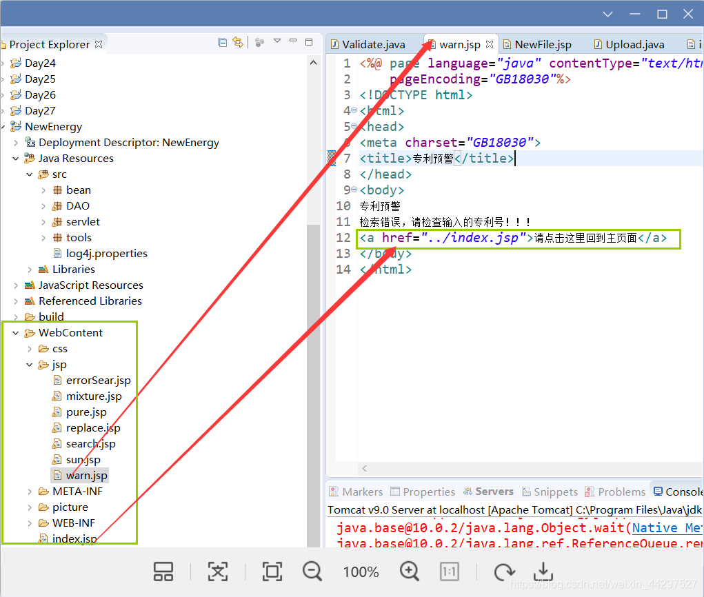
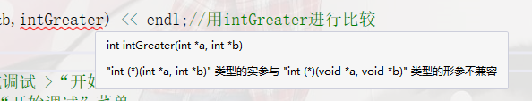

#    01.==C/C++的空指针，NULL，0和nullptr==

## **一、NULL与0**

在C和C++中，NULL和0都可以使用。

C通常使用NULL，C++通常使用0

```c++
#include <stdio.h>
int main(void)
{
    int *p=NULL;
    int *q=0;
    printf("%d %d",p,q);
    //0 0
    return 0;
}
#include <iostream>
using namespace std;
int main()
{
    int *p=NULL;
    int *q=0;
    cout<<p<<" "<<q<<endl;
    //0 0
    return 0;
}
```

问：NULL到底是什么？

答：NULL是一个宏。

问：它的值是多少？

答：C/C++标准规定：它的值是一个空指针常量（null pointer constant），由实现定义。

NULL宏是如何定义的？

答：以gcc或clang编译器为例，NULL的定义大致如下（稍有简化）：

```c++
#if defined(__cplusplus)

 define NULL 0              // C++中使用0作为NULL的值
```

```c++
#else

 define NULL ((void *)0)    // C中使用((void *)0)作为NULL的值

#endif
```

问：什么样的值才能称之为空指针常量？

答：C语言中常数0和(void*)0都是空指针常量；C++中（暂且忽略C++11）常数0是，而(void*)0 不是

问：为什么C中(void*)0是空指针常量，而C++中不是？

答：因为C语言中任何类型的指针都可以（隐式地）转换为void*型，反过来也行。而C++中void*型不能隐式地转换为别的类型指针（例如：int*p = (void*)0;使用C++编译器编译会报错） 

## **二、nullptr(推荐使用)**

nullptr是C++独有的，nullptr还是C++的一个关键字。 读音:"老"

C++引入nullptr是为了解决NULL为0，判断其是指针还是int类型的歧义

```c++
#include <stddef.h>
void foo(int)   {}   // #1
void foo(char*) {}   // #2
int main() 
{
    foo(NULL); 
    //C++会调用#1，认为NULL是0，是int
}
void foo(int)   {}   // #1
void foo(char*) {}   // #2
int main()
{
    foo(nullptr);
    //它会毫无异议地调用#2
}
```


# 02.  ==C++:作用域解析运算符 ::==

## 一 : **用于 :: 命名空间和类**

以下示例显示

1.**范围解析运算符**  如何与  **命名空间  和  类一起使用**：

```c++
namespace NamespaceA{
    int x;
    class ClassA 
    {
        public:
              int x;
    };
}

int main() 
{
	// A namespace name used to disambiguate
	NamespaceA::x = 1;

	// A class name used to disambiguate
	NamespaceA::ClassA a1;
	a1.x = 2;  // 在使用成员函数就不用::了
}
```

2.**没有范围限定符  的  范围解析运算符  表示  全局命名空间:**

```c++
namespace NamespaceA{
    int x;
}

int x;

int main() {
    int x;
    // the x in main()
	x = 0;
// The x in the global namespace
	::x = 1;                  // 没有范围限定符(NamespaceA)  的  范围解析运算符  表示  全局命名空间
// The x in the A namespace
	NamespaceA::x = 2;
}
```

**3.可以使用 范围解析运算符  标识的成员 namespace ，或标识在指令中 nominates 成员的命名空间的命名空间 using** 在下面的示例中，你可以使用 NamespaceC 来限定 ClassB ，即使 ClassB 是在命名空间中声明的， NamespaceB 因为 NamespaceB 是 NamespaceC 由指令在中命名的 using 。

```c++
namespace NamespaceB {
    class ClassB {
    public:
        int x;
    };
}

namespace NamespaceC{
    using namespace NamespaceB;
}

int main() {
    NamespaceB::ClassB b_b;
    NamespaceC::ClassB c_b;      //namespace NamespaceC 里使用了 using namespace NamespaceB;
    b_b.x = 3;
    c_b.x = 4;
}
```

**4.可使用  范围解析运算符   链。** 

在以下示例中，NamespaceD::NamespaceD1 将**标识嵌套的命名空间 NamespaceD1**，并NamespaceE::ClassE::ClassE1 将标识嵌套的类 ClassE1。

```c++
namespace NamespaceD{
    namespace NamespaceD1{
        int x;
    }
}

namespace NamespaceE{
    class ClassE{
    public:
        class ClassE1{
        public:
            int x;
        };
    };
}

int main() {
    NamespaceD:: NamespaceD1::x = 6;   // 可使用范围解析运算符  链
    NamespaceE::ClassE::ClassE1 e1;
    e1.x = 7  ;
}
```


## 二 : **用于 :: 静态成员方法和函数**

+ **没有创建对象  就必须使用范围解析运算符  来调用  类的静态成员(方法和数据)。**

+ **静态数据成员(属性和方法)是在必须在包含类方法的.cpp文件进行初始化 而不是类定义头文件里**

+ **static只需要在头文件声明中写明就行**

+ **同一个静态成员共享数据**

+ 一般写在public中

+ **在成员函数中使用 要全局用::定义 ,    并且不能创建对象来使用因为是共享的**

+ **静态成员函数只能专门为了访问静态数据成员的。 静态成员函数不能调用非静态数据成员和函数  
  静态成员函数   不能被声明为const**

```c++
class ClassG {
public:
    static int get_x() { return x;}
    static int x;                     //
};

int ClassG::x = 6;   //

int main() {
 
    int gx1 = ClassG::x;             //必须  使用范围解析运算符  来调用  类的静态成员(方法和数据)。
    int gx2 = ClassG::get_x();

}
```

```c++
#include<bits/stdc++.h>
using namespace std; 
class test{
	private:
		int x;
		int y;
		public:
			static int num;
			static int Getnum()
			{
				x+=5;//错误，静态成员函数不能调用非静态数据成员
				num+=15;
				return num; 
			}
};

```

例子2:

```c++
/**********************A.h****************************/
#define A_H
class A
{
    static int num1;        //这里只是声明，并没有定义
    int num2;  //声明，在实例化时分配内存
    A();
}
 
#endif

/**************************a.c**************/
#include "a.h"
int A::mun1;     //定义，分配内存，以后A每一个对象（实例）的创建都不再分配内存
void A::A()
{
    num2=1;
    num1=2; //不报错了
}
```


**注意区分 :**   

+ **类中设置const常量,必须使用static并且进行初始化.**
+ **类中如果要使用const也可以使用成员初始化列表 **


---------


## 三: **用于 :: 作用域  枚举**

**作用域内的解析运算符  与  范围枚举 枚举声明的值  一起使用**

+ **如果枚举被定义成公有成员**

  + **在成员函数中不用加**

  + **在非成员函数中, 加上:: 才能够使用**

  所以一把单独写一个:  

  public:
  						enum name{Ａ Ｂ　Ｃ}；

如以下示例中所示：

```c++
enum EnumA{
    First,
    Second,
    Third
};

int main() {
    EnumA enum_value = EnumA::First;   //作用域内的解析运算符  与  范围枚举 枚举声明的值  一起使用
}
```


# static

作用: 

+ **static改变函数和变量的作用域, 定义的函数内部(防止多文件重名)**
+ 1，在程序执行的整个过程中，都不释放内存
+ 2，静态变量在编译时初始化，仅初始化一次`如果没有初始值，将自动初始化为0`
+ 类的静态方法和变量还表示共享 


# 枚举常量的使用

注意:  c++11 出现枚举类

**枚举的定义很简单，和结构体差不多，只需要把关键字 struct 改成 enum：**

```c
enum tag
{
   member,
   ...
};
```

+ **用在数组里就代表索引, 本身就是数字**
+ **枚举变量可以直接输出，输出的是变量的整数值.**
+ **允许的关系运算有：==、<、>、<=、>=、!=等    注意: 必须比较同类型枚举变量而不是整数值**
+ 枚举常量不能是字符常量和整型常量

```c++
枚举常量的缺点是：它的隐含数据类型是整数，其最大值有限，且不能表示浮点数（如PI=3.14159）。
enum letter_set {'a','d','F','s','T'};          //枚举常量不能是字符常量
enum year_set{2000,2001,2002,2003,2004,2005};   //枚举常量不能是整型常量   
```

枚举类型作用:

+ 在实际应用中,有些变量的取值范围是有限的,仅可能只有几个值,如一个星期7天, 一年12个月,一副扑克有4种花色,每一花色有13张牌等。
+ 整型数来表示：直观性差，如1，在别让看来可能就是数字1，或者星期一，或者一月份，难以区分！
+ 由此看出,为提高程序的可读性,引入非数值量即一些有意义的符号是非常必要的。

```c
enum week{ Mon, Tu, We, Th, Fr, Sa, Sun };
```

例子:

```c
// Declare the enumerated type
enum Roster { Tom = 1, Sharon, Bill, Teresa, John };  // 默认0
// Sharon - John will be assigned default values 2-5.
int main()
{
    int who;
    cin >> who;
    switch (who)     // 输入2
    {
        case Tom :
            cout << "Tom's birthday is January 3.\n";
            break;
        case Sharon :
            cout << "Sharon's birthday is April 22.\n";   // 输出
            break;
        case Bill :
            cout << "Bill's birthday is December 19.\n";
            break;
        case Teresa :
            cout << "Teresa's birthday is February 2.\n";
            break;
        case John :
            cout << "John's birthday is June 17.\n";
            break;
        default :
            cout << "Invalid selection\n";
    }
  return 0;
}
```

例子2:

```c
//#define SPACE     0 //空地
//#define WALL      1 //墙
//#define DEST      2 //目的地
//#define BOX       3 //箱子
//#define PLAYER    4 //玩家

enum date
{
	SPACE, WALL, DEST, BOX, PLAYER
};
```

**形参设置:**

```c++
参数设置:
不是类中的:  enum 名称 形参;
是类中:   enum 类名::枚举值

typedef enum
{
    SELLING,
    SOLD,
    BANNED
} State;


------------------
class Myclass {
   ...
public:   
   enum encoding { BINARY, ASCII, ALNUM, NUM };  // encoding可以不写
   Myclass(enum Myclass::encoding);
   ...
}
Myclass::Myclass(enum Myclass::encoding enc) {
   ...
}
```

**枚举与::**

**如果是类中的枚举, 被定义成公有成员**

+ **在成员函数中不用加**
+ **在非成员函数中, 加上:: 才能够使用**

其他地方的枚举:  直接用


# 联合体


# ==类常量==

## 1. 对于整形

注意  :  1, 2 仅适用于[整型](https://so.csdn.net/so/search?q=整型&spm=1001.2101.3001.7020)变量，

1. **static  const   数据成员的初始化**  (只有static const的整型)

```c++
static：
对于类内static变量，仅能在头文件中声明，在实现文件中初始化。
static int SIZE1;            // 仅声明，不能初始化
static double pi1;
```

2. **枚举 (不用写变量名)**

注意:  **在类声明中只用const 是不能直接在声明中初始化的的**


## 2. 对于字符串

```c++
static const char *const filePath;
```

例子:

```c++
头文件:
public:
    User();
    ~User();
    static const char *const filePath;        //
    void writeInfoToFlie();

--------------------------------------
cpp函数:
#include <cstring>

const char *const User::filePath = "../build/data/user.txt";   //

User::User(/* args */)
{
    userData dat = {};
}
```

---------------


# 03.  ==类型转换问题==

记忆:

| 类型名             | 类型                         | 字节 | 表示范围                            |
| ------------------ | ---------------------------- | ---- | ----------------------------------- |
| char               | 字符型                       | 1    | -128 ~127                           |
| unsigned char      | 无符号字符型                 | 1    | 0 ~255                              |
| signed char        | 有符号字符型（与字符型相同） | 1    | -128 ~127                           |
| int                | 整型                         | *    | 与机器有关- 2147483648 ~ 2147483647 |
| unsigned int       | 无符号整型                   | *    | 与机器有关                          |
| signed int         | 有符号整型（与整型相同）     | *    | 与机器有关                          |
| short int          | 短整型                       | 2    | -32,768~ 32,767                     |
| unsigned short int | 无符号短整型                 | 2    | 0~65,535                            |
| signed short int   | 有符号短整型（与短整型相同） | 2    | -32,768~ 32,767                     |
| long int           | 长整型                       | 4    | -2,147,483,648 ~2,147,483,647       |
| signed long int    | 有符号长整型（与长整型相同） | 4    | -2,147,483,648 ~ 2,147,483,647      |
| unsigned long int  | 无符号长整型                 | 4    | 0~4,294,967,295                     |
| float              | 浮点型                       | 4    | 3.4E +/- 38 (7位有效数字)           |
| double             | 双精度型                     | 8    | 1.7E +/- 308 (15位有效数字)         |
| long double        | 长双精度型                   | 10   | 1.2E +/- 4932 (19位有效数字)        |

==注:  int在16位机上是2字节,    loog在64位机上是8字节,   float  小数点6位,  double 小数点15位==

 int  一般  2 * 10^9

## 一 : 隐式类型转换:

### 1.数值类型:

**将一种类型的数据  赋值给   另外一种类型的变量时    就会发生自动类型转换，例如：**

ps:  ==先进行算数运算后 就会等到一个对应得值**==之后**再进行类型转换**

```c++
float f = 100;
//100 是 int 类型的数据，需要先转换为 float 类型才能赋值给变量 f。
//再如：
int n = f;
//f 是 float 类型的数据，需要先转换为 int 类型才能赋值给变量 n。

//先进行算数运算后就会等到一个对应得值之后,再进行类型转换
(int)(x+y);   //把表达式 x+y 的结果转换为 int 整型
```

--------

```c++
int a = 0;
long b = a + 1;              // int 转换为 long

long if (a == b) {}          // 默认的operator==需要a的类型和b相同，因此也发生转换}
```

==int转成long是向上转换，通常不会有太大问题，==  而long到int则很可能导致数据丢失，因此要尽量避免后者。

转换规则:


**注意 : 对字符 强制转换得不到 相应得数字  而是ascii码**

A 97    a 65    0 48

### 2.类 类型:

```c++
class A{};
class B: public A  {};    //B是子类

void Fun(A& a);
B b;
Fun(b);                  //使用子类对象代替父类对象是可以的，也是因为隐式类型转换。
```

-------

```c++
class Test
{
	public:
		Test(int i);    //构造函数
};

Test t1 = 1;  //正确，由于强制类型转换，1先被Test构造函数构造成Test对象，然后才被赋值给t1
Test t2(1);   //正确
```

这种情况有时候很好，如果程序员的本意就是如此，那可以省去好几行代码。
有时这种情况看起来就不那么好，可能是一个错误，但是它却奇迹般的没有导致错误，要是因此产生一个bug，那么将是灾难性的。
**使用c++  explicit关键词:  表示只能显式的进行转换:**

```c++
//explic关键词的用法
class Test
{
	public:
		explicit Test(int i);
};
Test t2 = 1;  //编译报错
Test t2(2);   //编译没问题
```


## 二.显示类型强制转换

### 1. c语言的方式

语法:   Tyoe b = (Type)a

```cpp
int i = 1;
char a = (char )i;

int *p = &i;
int address = (int )p;
```


### 2.标准C++的类型转换符：

static_cast、dynamic_cast、reinterpret_cast、和const_cast。

**总结:**

+ **结论1:程序员必须清楚的知道要转变的变量，转换前是什么类型,转换后是什么类型，以及转换后有什么后果**

+ **结论2:一般情况下，不建议类型转换，避免进行类型转换**


#### (a).    static_cast

**语法：static_cast < type-id > ( exdivssion )**** 
主要有如下几种用法：
①**用于类层次结构中基类和子类之间指针或引用的转换:**
                **进行上行转换（把子类的指针或引用转换成基类表示)**；

```c++
//转换具有继承关系的对象指针

//父类指针转成子类指针
Animal* ani = NULL;
Cat* cat = static_cast<Cat*>(ani) ;

//子类指针转成父类指针
Cat* soncat = NULL;
Animal* anifather = static_cast<Animal*>(soncat) ;
```

②**用于基本数据类型之间的转换**，如把int转换成char 或者 把int转换成enum。这种转换的安全性也要开发人员来保证。

```c++
double a = 10/3;                            // 3
double a = static_cast<double>(10)/3;       // 3.3333
```

③**把空指针转换成目标类型的空指针。**(可能会报错)

```c++
int *p = NULL;
char *p = staic<char *>(p);
```

④**把任何类型的表达式转换成void类型。**

注意：static_cast不能转换掉exdivssion的const、volitale、或者__unaligned属性。

④**有继承关系的 引用**


##### **结论**

**static_cast 用于:**

+ **内置的数据类型**

+ **具有继承关系的指针或者引用**


---------------


#### (b).   dynamic_cast

**语法：dynamic_cast < type-id > ( exdivssion )**


**dynamic_cast主要用于类层次间的上行转换和下行转换，还可以用于类之间的交叉转换。**
在类层次间进行上行转换时，dynamic_cast和static_cast的效果是一样的；在进行下行转换时，dynamic_cast具有类型检查的功能，比static_cast更安全。

子类转父类 由大转小 ok,  反过来 不一定可以

```c++
class B{
public:
int m_iNum;
virtual void foo();
};

class D:public B{
public:
char *m_szName[100];
};

void func(B *pb){
D *pd1 = static_cast<D *>(pb);
D *pd2 = dynamic_cast<D *>((pb);
}
```

在上面的代码段中，如果pb指向一个D类型的对象，pd1和pd2是一样的，并且对这两个指针执行D类型的任何操作都是安全的；
但是，如果pb指向的是一个B类型的对象，那么pd1将是一个指向该对象的指针，对它进行D类型的操作将是不安全的（如访问m_szName），
而pd2将是一个空指针。

另外要注意：B要有虚函数，否则会编译出错；static_cast则没有这个限制。
这是由于运行时类型检查需要运行时类型信息，而这个信息存储在类的虚函数表（
关于虚函数表的概念，详细可见）中，只有定义了虚函数的类才有虚函数表，
没有定义虚函数的类是没有虚函数表的。

另外，dynamic_cast还支持交叉转换（cross cast）。如下代码所示。

```c++
class A{
public:
int m_iNum;
virtual void f(){}
};

class B:public A{
};

class D:public A{
};

void foo(){
B *pb = new B;
pb->m_iNum = 100;

D *pd1 = static_cast<D *>((pb); //compile error
D *pd2 = dynamic_cast<D *>((pb); //pd2 is NULL
delete pb;
}
```

在函数foo中，使用static_cast进行转换是不被允许的，

将在编译时出错；而使用 dynamic_cast的转换则是允许的，结果是空指针。

##### **结论**

**dynamic  用于**:

+ **只能转换具有继承关系的指针或者引用**

+ **最好(只能)由子类型 转成 基类型**

------------


#### (c).    const_cast

**语法：const_cast< type-id > (exdivssion)**

**作用: 增加或去除变量的const或volatile属性。**

```
**常量指针被转化成非常量指针，并且仍然指向原来的对象；**
**常量引用被转换成非常量引用，并且仍然指向原来的对象；常量对象被转换成非常量对象。**
```

Voiatile和const类试。举如下一例：

```c++
class B
{
   public:
         int m_iNum;
}
void foo()
{
      const B b1;        //
      b1.m_iNum = 100;   //error  必须但是进行初始化
    
      B b2 = const_cast<B>((b1);
      b2. m_iNum = 200;            //ok
}
```

上面的代码编译时会报错，因为b1是一个常量对象，不能对它进行改变；
使用const_cast把它转换成一个常量对象，就可以对它的数据成员任意改变。注意：b1和b2是两个不同的对象。

```c++
class A
{
	private:
		int a = 10;
		const int* p1 =  &a;
		int* p2 = const_cast<int*>(p1);
		*p2 = 20;             // 通过这样的代码 修改a的值
}
```


#### (d).reinterpret_cast(不建议用)

**语法：reinterpret_cast< type-id >(exdivssion)**

强制类型转换 可以是指针、引用、算术类型、函数指针或者成员指针。


----------


# 04.  ==算术运算符==

> +-*/%

## 一.数值运行时的转换

1. **如果某一运算数是 `long double` 类型，将其它运算数转为 `long double` 类型**

2. **如果某一运算数是 `double` 类型，将其它运算数转为 `double` 类型**

3. **如果某一运算数是 `float` 类型，将其它运算数转为 `float` 类型**

4. 两个运算数都是整数的情况：

   1. **首先，进行整数提升整数提升规则**
      - 值域小于等于 int 值域的类型转换为 int 类型
      - 值域小于等于 unsigned int 值域的类型转化为 unsigned int 类型
   2. 提升后，如果两个运算数类型相同，直接计算
   3. 否则，如果两个运算数同为负数 或 同为正数，将等级小的类型转化为等级大的类型，然后计算
   4. 否则，如果无符号的运算数的等级大于等于有符号的运算数的等级，将有符号的运算数先转化为无符号的运算数，再计算
   5. 否则，如果有符号的运算数的类型的值域大于无符号的运算数的类型的值域，则，将无符号的运算数转换为有符号的运算数，再计算
   6. 否则，将两个运算数都转化为有符号数对应的无符号类型，然后计算

5. **浮点型赋值给整型时 : **

   - float 类型转换为 double 类型

   - **浮点型赋值给整型时，不会四舍五入，会直接舍去小数部分的数据**，也可以认为是执行了下取整运算。**一个浮点型若是小数部分为0，直接输出必然是不带小数点的**。

   - ```c++
     - 例如float a=3; 你若想输出3.0， 输出代码要这样写：cout << showpoint << a;
     ```

## 二.**算数运算:**

### 1.最重要的两给运算:

==**核心:  先进行算数运算后就会等到一个对应得值**==之后**再进行类型转换**

​           **如:**   

```c++
 double b = 3/4;     // 显示得是0 而不是0.75 
                     // 因为 3/4 得到结果是 0  才会再进行类型转换(int-->double)  0转换成double是0.0                         但是默认不显示.0得情况
```


- **注**：在 `C++11` 中：

  - 对于除法（`/`），**结果将向 `0` 取整  不会四舍五入**，  例如：`-1/2 == 0`

    ​                                //注：除数不能为0     **两个整数相除，结果依然是整数(小数部分丢掉)**

  - 对于取模（`%`），**结果符号与被除数相同** ，例如：`-5 % -2 == -1`

    ​                                //**注：不能是两个小数，且除数不能为0.x  取模运算只针对整数**。

    #### (a). 求余的运算规律

    将两个整数看作是正数，再作除法运算:

    1.能整除时，其值为 0
    2.不能整除时，其值  =  后×整商-前，    差值的符号与前相同。
    
    
  
  ```
     例如：计算下 mod(7,-3) 的值
  不能整除，看作正数
     第一步，7 除以 3 得到的商为 2；
     第二步：3 * 2 - 7 = -1
     第三步：差值的符号与被除数相同，被除数是正数 7，所以最后得余数为 1
     其实就是乘法表 差
  ————————————————
  ```
  
  
  
  **余数的妙用**

每行打印n个 

```c++
if( i % 每行输出个数 == 每行输出个数  +( i的初始值 - 1 )          // i 初始值为 0
```

```c

void fun()
{
    for (int i = 0; i < 10; i++)
    {
        printf("%d", i + 1);
        if (i % 3 == 2)             //  3 + 0 - 1 = 2
            printf("\n");
    }
    
}

//结果
123
456
789
10
```


----------------

### 2.其余相关运算和代码解释:

   **注**：

   - 浮点数之间的运算结果依旧是浮点数
   - 无符号的整数之间的运算结果依旧是无符号的整数
   - 有符号的整数之间的运算结果依旧是有符号的整数

~~~c++
 #include <iostream>
 using namespace std;
 int main()
 {
 	//加减乘运算:
 	int a1 = 10;
 	int b1 = 20;
 	cout << a1 + b1 << endl;    // 30
 	cout << a1 - b1 << endl;    // -10
 	cout << a1 * b1 << endl;    // 200
      
     
     //除法:
    int a1 = 10;
 	int b1 = 20;
 	cout << a1 / b1 << endl;       // 0 两个整数相除，结果依然是整数，不包含小数部分
 	double b3 = 0.36;
    double b4 = 0.42;
    cout << b3 / b4 << endl;     // 0.857143 两个小数可以相除
     //注：除数不能为0
 
     
    //求模运算(求余数)
    int c1 = 10;
    int c2 = 3;
    cout << c1 % c2 << endl; // 1
    //8 % 4     2余0    0
    //9 % 4     2余1    1
    //注：两个小数是不能进行求模运算的，且除数不能为0.x
     
 
    //前置递增：先让变量加1，然后再进行表达式的运算
    int k1 = 10;
    int k2 = ++k1 * 10;
    cout << "k1=" << k1 << endl;     // k1=11
    cout << "k2=" << k2 << endl;     // k2=110
     
 
    //后置递增：先进行表达式的运算，后让变量加1
    int l1 = 10;
    int l2 = l1++ * 10;
    cout << "l1=" << l1 << endl;    // l1=11
    cout << "l2=" << l2 << endl;    // l2=100
         
     
     return 0;
 }
~~~


​         

​     


# 05. ==退出:==

## 一 . return 语句

return 语句的作用:
     ( 1 ) return 从当前的方法中退出,  返回到调用该方法的语句处,  继续向下执行。
     ( 2 ) return 返回一个值给调用该方法的语句，返回值的数据类型必须与方法的声明中的返回值的类型一致。
     ( 3 ) return后面也可以不带参数，不带参数就是返回空，其实主要目的就是用于中断函数执行，返回调用函数

-----------------

### 1 . 函数if 中有return 退出函数

return是函数直接返回, 也就是结束该函数

 **在一个函数内任意位置调用return, 直接退出函数**

```c++
function_1()
{
   if(a!=b)
   {
     //代码段2;
     return ...;
    }
     //代码段1;
}
```

+ if判断正确，会执行代码段2，然后执行代码段2后面的return，  此时function_1执行结束，

​        将不再执行return之后的所有语句，所以不会执行代码段1

+ 那如果if判断错误，会跳过代码段2，直接执行代码段1

**返回0 或者 1 或者 -1都是在特定环境定义的。 比如在VC中提供的工具Error lookup中 0代表，操作成功完成。 1代表函数不正确。 -1是在子函数中使用**

+ ps:  main函数的return是返回给系统的，在系统层面，一般0表示exe执行成功，非0表示exe执行失败
+ 


### 2.循环中的  if  + return  循环找出条件/答案,  退出函数

  (在函数中调用的for循环常用)

该方法用处之一：循环找出条件/答案，

+ 如果循环结束答案没有找到就执行下面的语句

+ 如果找到答案，那就直接将方法抛弃。

ps: **如果是在函数中调用的for循环，可以用return；直接==退出当前函数执行==  从而达到退出for循环的目的  **

```c++
#include <iostream>
using namespace std;
void test(int &i)
{

     for(i=0;i<=5;i++)
    {
          if(i==2)    
          return;           //  在函数中调用的for循环
     }
}

int main(int argc,char *argv[])
{
    int i;
    test(i);
    cout<<"return的i："<<i<<endl;
    return 0;
 }
```

++++


## 二 . break 语句   (循环常用)

.break 语句的作用
    （1）**当break在循环体内时，强行终止整个循环的执行结束整个循环过程，不再判断执行循环的条件是否成立，直接转向循环体下面的语句。**
    （2）**当break出现在循环体中的switch语句体内时，其作用只是跳出对应的switch语句体。**
'break' 用在循环语句块中, 只要执行到break语句, Matlab就会退出该循环, 但是它只能退出一层循环, 假如现在有内外两层循环, 在内层循环中执行break只会退出内层的循环.
break常和判断语句一起是使用.

### if + break  循环找出条件/答案

**for循环中满足条件后使用break语句**

```
#include <iostream>
using namespace std;

int main(int argc,char *argv[])
{
    int i;
    for(i=0;i<=5;i++)
    {
        if(i==2)
          break;
    }
    cout<<i<<endl;
    return 0;
}
```


****


## 三 .  exit 函数(仅使用来处理出错的情形)

+ (1). 必须包含 `<cstdlib>` 头文件

+ 语法: **exit(EXIT_FAILURE);**    failure 费你儿
+ ==仅使用 exit 函数来处理出错的情形==


++++


# 06. ==字符串:==

##  一 、c风格(char型)

### 1 . 基础

存储字符串有两种形式：

+ 字符数组形式：char str[20];
+ 字符指针形式：char* pc;

字符常量:  

+ 使用单引号 如:  's' 对应ascii码的83.    注意: "s" 实际上表示所在的地址. 

+ 严格意义来说字符就是   特殊字符 + 0-9数字字符 + 英文大小写字符   **不如 不能定义字符' 77 '**

---------------

[字符数组](ht)：存储字符的数组,**表示字符只能用单引号**  如: 'y'

[字符串](http) ：是使用最频繁的字符数组，是**一个特殊的字符数组,**  **字符串的结尾有一个字符\0,**表示字符串的结束。

字符串的优势在于输入/输出和赋初值/输入输出不需要使用循坏。   字符数组需要用循环依次输出每个字符。

----------

**char 可以定义字符数组，也可以定义字符串 :**

+ char 定义字符数组

```c++
char b[]={'h','e','l','l','j'};          //声明字符数组， 不加数字表示自动根据初值个数确定数组长度  只有初始化才能这样
----
char c[3];   
c[0]= 'I′;
c[1]= 'a';
c[2]= 'v′;
```

注意: char 字符数组可以放整数的

**第一种情况：**

char字符占用一个字节，本身就是以整数表示； char可以表示-128-127， unsigned char 0-255;

**第二种情况：**

你想把 int 类型存放到char 数组，这也是可以的，只要数组有足够的内存；

比如一般int 占 4个字节，要存储它至少定义char num[4]；

比如 int a = 500;  char num[4]; 

可以通过memcpy(num, &a, sizeof(int)), 这样就把整形变量写入了char的num数组里。

+ char  定义字符串

```c++
char b[]={'h','e','l','l','o','/0'};    //声明字符串,字符串的结尾有一个字符\0,
-----
char b[]="hello";      //定义字符串,用双引号括起, '/0'计算机去完成
char *p = b;
cout << b;           // 输出的是hello
cout << *p;          // 指针指向首地址，所以输出为 h
cout << p            // 输出整个字符串
    
//常量字符串:
const char *p = "Hello world";  //字符指针变量初始化方式
char *p = "Hello world";  // 也属于字符串常量
```

```c++
//可以操过创建的数组长度的
#include <iostream>
#include <cstring>

int main(void)
{
    char a[3];
    std::cout << "1:----";
    std::cin >> a;
    std::cout << a << std::endl;
    std::cout << sizeof(a) << std::endl;
    std::cout << std::strlen(a);

}

//结果:
PS C:\Users\16658\Desktop\ctest\12.5> .\a.exe    
1:----123456
123456
3  // 定义的数组长度
6  // 数组可见长度
    
   ---------------------------------------------------------- 
    // 数组可见长度 可以大于 定义的数组长度的,计算机不会保错的
    // 先要确保不大于 方法:
    // 输入成功并且超过定义的数组最大值进行忽略(一般整行输入可能超过)
    cin.get(a, size);
    while (std::cin && std::cin.get() != '\n')  // 丢掉超过定义数组长度的字符串
        continue;
```

###  2. 遍历char字符串

只能遍历, 得到元素, 因为本质是数组

以下都对

```c++
//法1
while (p[i] != '\0')    // 遍历整个字符串
{          
    i++;
} 

//法2
// strcpy的实现就是用的这个
while (*p != '\0')
{
    p++;                  //指针的运算--->索引的移动
} 

//法3
char ch[] = "dsasadf";
for (int i = 0; i < strlen(ch)l i++)
{
    cout << ch[i];
}

------------
char ch[] = "dsasadf";
char *p = ch;
//可以使用printf("%s", p);得到  //不能直接printf("%s", *p)得到
while (*p)
{
    printf("%c", *p);
    p++;
}
```

**打印字符串,    通过首地址打印**

```c
char *p = "dshgh";
// // std::cout << *p;
// std::string s = "sfdjaj";
printf("%s", p);
```


### ==常用函数==

==需要头文件 <cstring>  命名空间std==        

1. size() 计算类型长度, 一般不用

   

2. **sizeof()   计算整个数组的长度**   

   + 注意:  sizeof是无符号的 , 要使用正负 需要强转

   + 延申:    

     ```c++
     字节数:  sizeof(类型) * 元素个数
     
     字符串: sizeof(name)
         
     数组长度:  arr只能是数组名
     一维:
     int len = sizeof(arr) / sizeof(int);
     二维:
     int row = sizeof(arr)/sizeof(arr[0]);
     int col = sizeof(arr[0]) / sizeof(int);
     //记忆 二维数组名的是 一维指针数组的大小 理解成 一行
     
     结构体数组长度:
     int len = sizeof(personArr) / sizeof(struct Person);
     
     结构体大小:
     sizeof(struct Person)
     ```
     
     

3. **strlen()**计算可见字符的长度,**并不把'/0'计算在内**

   ```c++
   字符串设置的长度是可见字符数目 + 1及strlen()+1 因为包含了\0结束符至少要留出一个计算机 ，而字符数组的长度就是字符的数目。
   ```

   

4. **strcpy(s1,s2)**   	拷贝字符串 s2 到字符串 s1   (因为**数组不能直接赋值**),   

   + 是指针一般还要和new连用, 
   + 是 char[] 一般也直接用
   + **先清空, 重新分配内存 , 再赋值**

   ```c++
   // ch的字符串 s1 _ch是字符串 s2 
   
   // 1.先清空
   if (ch != NULL)
   {
       delete ch;
       ch = NULL;   
   }
   // 2.重新分配内存
   len = std::strlen(_ch);
   ch = new char[len + 1];
   // 3再赋值
   std::strcpy(ch,_ch);
   ```

   

5. strncpy (拷贝到位置 , 起始,  个数)  strncpy为拷贝n个  [字符串到目标数组，目标数组应比n要大]

   

6. **memcpy**(str1, cstr2, size_t n)    **str2** -- 指向要复制的数据源， **n** -- 要被复制的字节数。   //从前开始覆盖原有部分数据:    **常用于内存之间的拷贝 **比如拷贝数组

   ```c++
   //注意 1. new和new[]的区别
   // new 用于单个对象或实例的创建，就是调用类的构造函数。
   // new [] 用于创建对象或实例的数组实例，并且地址是连续的。(内存分配的时候有可能不连续，但地址链表是连续的。)
   
   char * temp = new char[eleSize];   //用char * temp = new char会报错   
   // 交换元素
   // memcpy 用于内存之间的拷贝
   memcpy(temp, pJPlus, eleSize);
   memcpy(pJPlus, pJ, eleSize);
   memcpy(pJ, temp, eleSize)
   ```

   ```c++
   memcpy(temp, pJPlus, sizeof(pJPlus);  赋值整个数组
   ```

   

   ```c++
   int temp[5];
   memcpy(temp, arr, sizeof(int)*5);
   
   // each
   for (int i = 0; i < 5; i++)
   {
   	printf("%d ", temp[i]);
   }
   ```

   

7.  **memcmp  ** 内存比较，不仅可以比较字符串，还可以比较其他的内存

     **比较的是第一个不同数据的大小**

   进行比较的数据源要转换成指针        **n** -- 要比较的的字节数:  sizeof(类型) * 元素个数

   ```c++
   int arr[5] =  { 1,2,6,4,5};
   int arr1[5] = { 1,2,5,4,5 };
   int ok = memcmp(arr, arr1, sizeof(int) * 5);   // 比较前面的5个
   int ok1 = strcmp(arr, arr1);
   printf(" %d\n", ok, ok1)
       
   结果:
   1
   ```


8. **memset** 按字节对内存进行初始化  

   **常用来字符串清零,   或者一维指针数组用来置0操作,  整个结构体置0**  这里的0包括nULL 和 "  "

   注意结构体中用来string不能使用memset

   ```c++
   char str[5] = "dsaasd"
   memset(str, 0, sizeof(str));   //数组可以用这个得到整个数组的字节数
   ```

   ```c++
   char num[5];
   memset(num, 127, sizeof(char) * 5);
   // or memset(num, 127, sizeof(num));
   for(int i = 0; i < 5; i++)
   {
   	printf("%d ", num[i]);
   }
   ```

   

9. **strcat(s1,s2)	   连接字符串 s 2 到字符串 s1 的末尾**

   ```c++
   char dest[20]="hello ";
   strcat(dest, "maye");
   puts(dest);             // hello maye
   ```


10. strlen(s1)	         返回可见字符串 s1 的长度**   ==重要==


11. **strcmp(s1,s2)**	   返回s1与s2的比较结果,  **比较的是第一个不同字符的ascll码 **

     **这里 ,  char[] 和 char * 可以比较的**     // **一般char 的数组进行比较的话都必须用这个进行比较**

       补充ascll码值:  记忆  48 , 65 97大小写字符相差32

    int strcasecmp (const char *s1, const char *s2);

    ```c++
    strcmp(s1，s2)
    当s1<s2时， 返回值 <0；
    当s1==s2时，返回值 =0；
    当s1>s2时， 返回值 >0。
    ```

    ```c++
    char b[] = "111a";
    char c[] = "111c";
    
    //char b[] = "1";  66
    //char c[] = "c";  98
    if (strcmp(b, c) > 0)
        printf("b");
    else
        printf("c");
    //结果都是:
    c
    ```

    ```c++
    #include <stdio.h>
    #include <string.h>
    
    
    int main(void)
    {
    	char name[8][10] = {
    		"maye",
    		"多方行",
    		"winter",
    		"se",
    		"运动",
    	};
    
    	for (int i = 1; i < 5; i++)
    	{
            if (strcmp(name[i], name[i - 1]) < 0)
            {
                char t[10] = {0};
                strcpy(t, name[i]);
                strcpy(name[i], name[i - 1]);
                strcpy(name[i - 1], t);
            }		
    	}
    
    	// each
    	for (int i = 0; i < 5; i++)
    	{
    		puts(name[i]);
    	}
    
    	return 0;
    }
    
    // 结果
    maye
    winter
    se
    多方行
    运动
    ```

       

12. **strchr(s1,ch)	     在字符串中查找字符val返回一个指针，存在返回val的，指向字符串s1中字符ch的第一次出现的位置**，没有返回NULL

    ```c++
    // 原型 char *strchr(const char *str, int c)
    
    const char str[] = "http://www.runoob.com";
    const char ch = '.';
    char *ret;
    ret = strchr(str, ch);
    //结果:  .runoob.com
    -----------------
        
    //用处:
    //heroId: 100
     char *  pos = strchar(buf, ":");
     strncpy(config[index].key, buf, pos - buf)  // buf-->heroId: 100\n  // pos-->: 100
     strncpy(config[index].key, pos+1, strlen(pos + 1) - 1) // pos--> 100  //-1不要换行
    ```

    

13. **strstr(s1,s2)	     在字符串中查找子串substr返回一个指针，指向字符串s1中s2的第一次出现的位置**

    ```c++
    char words[] = "hello every one,My name's maye";
    puts(strstr(words, "one"));
    
    //结果:
    one,My name's maye
    ```

    

++++

###  3 . **指针与字符数组、  指针与字符串 和 储存多串字符串**

- [x] 指针指向  字符数组

```c++
char b[] = { 'h','e','l','l','o' };   // 字符数组

char *pchar = b;   //它是指向字符串的首个字母 
cout << *pchar;   //该语句输出 h
//cout << b;      //不要用这个方式输出，输出的是 hello加一些乱码字
cout << b[0];     //该语句输出 h

//指针访问每个字符并输出 hello
for (size_t i = 0; i < 5; i++)
{
        cout << *pchar;
        pchar++;
}
```


- [x] 指针指向  字符串

```c++
char str[] = "we are poor";    // 字符串

char *p = str;            //它是指向字符串的首个字母 
cout << *p;   //该语句输出 w
cout << p[0];     //该语句输出 w

//指针访问每个字符并输出  we are poor
while (*p != '\0')
{
    cout << *p;
    p++;                  //指针的运算--->索引的移动
} 
```

- [x]  储存多串字符串

```c
char* str1[5];
for (int i = 0; i < 5; i++)
{
	str1[i] = malloc(10);
	gets_s(str1[i],10);
}
```


-------------


### **4.  遇到char* 必须用new  +  strcpy() **

**char * 的基础知识 : **

+ **可以指向 字符串的指针(其实严格来说，它是指向 字符串的==首个字母==)** 取地址   得到的是**字符数组首地址 **即&ps[0].

+ **可以指向  一串常量字符串 (一般用const char*) :**

+ ```c++
  char *p;
  p="Hello world";
  -------
  char *p = "Hello world";  //字符指针变量初始化方式
  
  //一般会加const使用:
  const char *p = "Hello world";  // c++要加
  cout << p;  // 打印
  ```

--------------

**方法1 ;   要添加 < cstring > 头文件** 

通过     **普通数组  +  strncpy()函数**

```c++
#include <cstring>
class A
{
	char ch[20];
public:
	A(char* _ch):ch(_ch) {}
}

A(char* _ch)                
{
	std::strncpy(ch,_ch, 20);   // strncpy(ch,_ch, 20) 第三个参数 要cp多少个过去
    if (strlen(nm) >= 20)
        name[19] = '\0';   // 新数组的最后一个元素应该是空
}   
```

   

通过    **对类属性**  **使用动态数组(指针)  + strcpy()函数**

```c++
#include <ctring>   
class A
{
	char* ch;
public:
    A();
	A(cosnt  char* _ch);
    //一定要有一个delete [] array_name  // 释放数组开放的内存
    ~A(){ delete []ch; }
}

//默认构造
 A()
 {
    ch = new char[10];
	std::strcpy(ch, "哈哈");
 }
// 一级指针 就ok 相对于按值 所以一般都会加const
A(cosnt char* _ch)                
{
    //核心:
    ch = NULL // 先置空  (可选)
    len = std::strlen(_ch);
    ch = new char[len + 1];
	std::strcpy(ch,_ch);
}   

```

--------------


**方法2 : 也可以直接改用string类**

```c++
#include <string>     // 不是string
class A
{
	std::string ch;
public:
	A(cont std::string & ch_):ch( ch_ ) {}
}
```


**对非类属性:** 

用一级指针 只能算是按值拷贝

需要二级指针  算按指针传递

+++++

```c
//对函数调用而言 : 
void allocateSpac2(char ** pp)
{
    char * temp = malloc(100);
    memset(temp, 0, 100);
    strcpy(temp, "hello world");
    *pp = temp;
    printf("aaa%s\n", *pp);   //"hello world"
}


void test03()
{
    char * p = NULL;
    allocateSpac2(&p);
    printf("%s\n", p);    //"hello world"
}
```


--------------


### const char*  问题:

**`指针指向的是一个const* char类型， 即不能通过当前的指针对字符串的内容作出修改`**

### 一 : 注意const的两个概念：

​       char * const   [指向字符的  静态指针]
​       const char *    [指向静态字符  的指针]   它的意思是指针指向的内容是不能被修改的

**前者const修饰的是指针，代表不能改变指针**
**后者const修饰的是char，代表字符值不能改变，但是指针可以变，也就是说该指针可以指针其他的const char。**

**const变量是不能修改本身但是可以 赋值 给 另一个变量**

### 二:指针的赋值之间的关系:

即非const指针  不能指向(接受)const数据（数据为非指针类型）。

即const指针     既可以指向(及**把const或非const数据的地址赋给const指向的指针是可以的**)const数据又可以指向非const数据（**数据为非指针类型**）。 最好是对应更严谨

==能这样做的原因 : 传递的实参时候是 数组而数组名就是地址==

二级间接关系中，需要注意const指针的赋值。


##  二 、 c++风格(string容器)

**string的特性**

和char*类型的字符串的对比:

+ **Char*是一个指针，String是一个类**
  + string封装了char*，管理这个字符串，是一个 char*型的容器。*
+ **String封装了很多实用的成员方法**
  + 查找find，拷贝copy，删除delete替换replace，插入insert
+ **不用考虑内存释放和越界**
  + string管理char*所分配的内存。每一次string 的复制,取值都由string类负责维护
    不用担心复制越界和取值越界等。

--------


### 1. 基础

+ **需要头文件 <string>**  
+ **它位于名称空间std中，因此必须使用using编译指令或者std::string来引用它**

==注意:==  

+ **string变量的末尾没有“\0”字符**
+ **用+号进行字符串的连接是最常用的操作**

+ **注意:  单字符,字符串 能和==string定义的变量==拼接**  其他的不管是字符还是字符串更不能互相拼接

```c++
string str;
for (char ch: s) 
{
    if (isalnum(ch)) 
    {
        str += tolower(ch);
    }
}

// 下面的语法是错误的
string nameSeed = "ABCDE";
for (int i = 0; i < 5; i++)
{
    Player p;
    p.mName = "dd" + nameSeed[i];  // err
    cout << p.mName;
}
```


```c++
string s = "hello world";
int len = s.length();
cout<<len<<endl;
```

###  2. 初始化

```c++
#include <iostream>
using namespace std;

int main() 
{
	string str1 = "test01" ;    //"test01"
	string str2( 5, 'c' );      //  'ccccc'
	string str3( "Now is the time..." );  // "Now is the time..."
	string str4( str3, 11, 4 );           // time
}

  char ch = s[0]
```

具体实现:

```c++
C++string 初始化的几种方式


//方式一 ：最简单直接, 直接赋值
string str1 = "test01" ;


//方式二 ：
string( size_type length, char ch );
以length为长度的ch的拷贝（即length个ch）
string str2( 5, 'c' );  //  str2 'ccccc'

方式三 ：
string( const char *str );
string str3( "Now is the time..." );


方式四：
string( string &str, size_type index, size_type length );

以index为索引开始的子串，长度为length, 
string str4( str3, 11, 4 );  //将str3

```

### ==常用方法==

**操作string字符串的函数 ：**

1. **append() – 在字符串的末尾添加字符**

   ```c++
   strring a1 = "a1";
   string a2 = "a2";
   a2.append(a1);
   cout << a2;
   
   // 结果:
   a1a2
   ```

   

2. find() – 在字符串中查找字符串第一次出现的位置   **返回开始的索引**

   ​     (1). **可以查找  子字符串**

   ```c++
   string name("dsfAnna11qijiashe");
   int pos = name.find("Anna11");
   
   if(pos == string::npos)     
       cout<<"Anna not found!\n";
   else
       cout << "找到了在" << pos;
   
   // 结果
   找到了在3
   ```

   + 注意:   ==**没有  返回的是 -1; 或者 string::npos  并 不是 0**==
   + 判断都用 != -1
   
   ```c++
   string str("hello world");
   
   string::size pos=str.find_first_of("h");   //
   
   if(pos != string::npos)  
   {
   	....// 查找到了
   } //没有 find返回string::npos
   ```
   
   -------------
   
   ​      (2). **子串  是由主串字符构成的**
   
   ```c++
   bool b1 = true;
   ......
   for (auto c: word) 
   {
       b1 &= m1[c];    //m1是 子串的hash,  hash没有 返回值为null
   }
   ..........
   if (b1)   // 子串的字符是主串构成
       ans.push_back(word);
   ```


使用样例：

string str1("the usage of find can you use it");

string str2("the");

上面定义出了两个字符串；

```c++
str1.find(str2);           // 从串str1中查找时str2，返回str2中首个字符在str1中的地址

str1.find(str2, 5);        //  从str1的第5个字符开始查找str2

str1.find("usage");      //  如果usage在str1中查找到，返回u在str1中的位置

str1.find("o");           //  查找字符o并返回地址

str1.find("of big",2, 2);    //  从str1中的第二个字符开始查找of big的前两个字符
```

**1、find_first_of()函数**

**正向查找在原字符串中第一个与指定字符串（或字符）中的某个字符匹配的字符，返回它的位置。若查找失败，则返回npos。（npos定义为保证大于任何有效下标的值。）**

如果在一个字符串str1中查找另一个字符串str2，如果str1中含有str2中的任何字符，则就会查找成功.

```c++
比如：
string str1("I am change");
string  str2("about");
int k=str1.find_first_of(str2);    //k返回的值是about这5个字符中任何一个首次在str1中出现的位置；

// 2
```

**2、find_last_of()函数****逆向查找在原字符串中最后一个与指定字符串（或字符）中的某个字符匹配的字符，返回它的位置。若查找失败，则返回npos。（npos定义为保证大于任何有效下标的值。）**


1. rfind() –字符串中查找字符串最后一次出现的位置     **返回开始的索引**

    

2. insert() – 插入字符

    **/在n的位置插入**

    ```c++
    string& insert(int pos，const char* s);
    //插入字符串string& insert(int pos，const string& str);//插入字符串
    
    string& insert(int pos，int n, char c);  //在指定位置插入n个字符
    ```

    ```c++
    string s = "12345";
    s.insert(3, "1111");   // 只能是" "不能放变量进去报错
    cout << s << endl;
    
    // 结果
    123111145
    ```

    

3. erase  (int pos，int n = npos);    //删除从Pos开始的n个字符

    ```c++
    string s = "12345";
    s.erase(0, 2);
    cout << s << endl;
    
    // 结果
    345
    ```

    

4. compare 函数 (**比较字符大小都能用)**

    ```c++
    compare(s1，s2)
    当s1 < s2时， 返回-1；
    当s1 == s2时，返回值= 0；
    当s1 > s2时， 返回1。
    比较时参考字典顺序，排越前面的越小。大写的A比小写的a小。
    ```

    ```c++
    string s1 = "abcd";
    string s2 = "abce";
    
    if (s1.compare(s2) == 0)
    {
        cout << "字符串相等" 
    }
    else
    {
        cout << "不相等"
    }
    
    //结果
     "不相等"
    ```

    

5. size()   返回字符串的长度

    

6. **length() / size()– 返回字符串的长度(不需要+1操作)**   `C++中string类size()   ength()函数的返回值是无符号数`**          **// 下标也比这个小**

   **使用时要    int   len =  a.size()**

   

7. **replace()  – 替换字符串**   (起始的索引,  个数, 字符串)

   ```c++
   string s = "12345";
   s.replace(0, 2, "111")
       
   // 结果:
   111345
   ```

   

8. **substr()  – 返回某个范围子字符串**  //    (起始的索引,  个数)

    一个参数就表示到末尾   t=   substr(l)*// 从l到len;*  

    ```c++
    举一个例子吧
    string str = "codoncodon";
    所以提取前三个字符，可以用 string str1 = str.substr(0,3);
    提取4-6 string str2 = str.substr(4,3);
    然后7-9 string str3 = str.substr(7,3);
    //此函数需要注意一点是函数的第二个参数为字符数目，而不是下标值，
    ```

      


### 4. 遍历字符串的三种方式

就以：把[字符串](https://so.csdn.net/so/search?q=字符串&spm=1001.2101.3001.7020)“1234”转换为整形1234，为例来说明

①常规方式（下标+[operator](https://so.csdn.net/so/search?q=operator&spm=1001.2101.3001.7020)[])

1. ```c++
   #include <iostream>
   #include <string>
   #include <vector>
   #include <list>
   
   using namespace std;
   
   int StrToInt1(string str)
   {
   	  int value = 0;
         for (size_t i = 0; i < str.size(); i++)  //
          { 
          			 value *= 10;
      				 value += str[i] - '0';
          }
          return value;
       }
   
   ```
   
   

②使用迭代器[遍历](https://so.csdn.net/so/search?q=遍历&spm=1001.2101.3001.7020)字符串

1. ```c++
   #include <iostream>
   #include <string>
   #include <vector>
   #include <list>
   using namespace std;
    
   int StrToInt2(string str)
       {
           //迭代器--在STL中，不破坏封装的情况下去访问容器
       int value = 0;
       string::iterator it = str.begin();//返回第一个位置的迭代器（类似于指针）
       while (it != str.end())//str.end()是最后一个数据的下一个位置
       {
           value *= 10;
           value += (*it - '0');
           it++;
       }
       cout << endl;
    
       vector<int> v;//顺序表的迭代器
       v.push_back(1);
       v.push_back(2);
       v.push_back(3);
       vector<int>::iterator vit = v.begin();
       while (vit != v.end())
       {
           cout << *vit << "";
           vit++;
       }
       cout << endl;
    
       return value;
   }
   ```
   
   

③新式for循环 （第三种字符串遍历方式源自于c++11）

1. ```c++
   #include <iostream>
   #include <string>
   #include <vector>
   #include <list>
   using namespace std;
    
   int StrToInt3(string str)
       {
           int value = 0;
           for (auto ch : str)   //ch依次取的是str里面的字符,直到取完为止
           {
               value *= 10;
               value += (ch - '0');
           }
           return value;
       }
    
   int main()
   {
       cout << StrToInt3("1234") << endl;
       system("pause");
       return 0;
   }
   ```

需要注意的是：新式for循环的底层是用迭代器实现的

---------------


### 5. String判断非空

在校验一个String类型的变量是否为空时，通常存在3中情况：

1. 是否为 null
2. 是否为 ""
3. 是否为**空字符串**(引号中间有空格)  如： "   "。
4. **判断里面有一个字符是空 '  '**

String为空的三种状态：null, ""和new String()，

#### **常用非空判断方法**

**String为空的三种状态：null, ""和new String()，**

判断某字符串为空的标准是 str==null       或 str.length()==0，

非空判断一

if( str!=null  &&  str.length()>0 ) { 执行代码 }


```c++
if``(s.empty())``//成立则为空
...

if (s == ' ')    // 判空
```


## 三 、字符串类型之间的转换

### ==字符串类型之间的转换： string、const char*、 char* 、char[]相互转换==

#### 总结:

```c++
#include <iostream>

using namespace std;

/*
	string、 const char* 、 char* 、 char[]相互转换
*/

/***************************************************************************/
//转 string:  都是直接赋值即可(甚至包括字符char都可以直接赋值(不能z)给string类型的变量)
int test01()
{
	cout << "\n转 string: " << endl;
	string str = "HelloWorld";
	str = 'H';
	cout << str << endl;    // H
	cout << str + "!" << endl;      // H!

	// 字符 转 string 返回值
	char c = 'c';
	string s(1, c);
	return 0;
}

// string 转 char* , const char* :   c_str()只能转成 char*
int test02()
{
	cout << "\nstring 转 char* , const char*: " << endl;
	std::string str = "HelloWorld!";
	char* c = nullptr;
	const char* constc = nullptr;
	constc = str.c_str();
	c = const_cast<char*>(constc);      //const char*类型转char*类型
	cout << c << endl;
	return 0;
}

/***************************************************************************/
//转 char[]:  string通过逐个赋值，char 和const char* 借助strncpy_s()
int test03()
{
	cout << "\n转 char[]: " << endl;
	//string转char[]
	std::string str = "HelloWorld!";
	char arrc1[20] = {0};
	for (int i = 0; i < str.length(); i++)
	{
		arrc1[i] = str[i];
	}
	cout << arrc1 << endl;

	//const char*转char[]
	const char* constc = "Hello World!";
	char arrc2[20] = {0};
	strncpy_s(arrc2, constc, 20);
	cout << arrc2 << endl;

	////char*转char[]
	//char* c = "HelloWorld!";
	//char arrc[20] = {0};
	//strncpy_s(arrc, c, 20);
	//printf_s("%s\n", c);

	return 0;
}

//char[] 转 const char*, string:  都是直接赋值即可
int test04()
{
	cout << "\nchar[] 转 const char*, string: " << endl;
	char arrc[20] = "HelloWorld!";

	std::string str;
	const char* constc = nullptr;
	char* c = nullptr;

	str = arrc;            //char[]类型转string类型
	constc = arrc;         //char[]类型转const char* 类型
	c = arrc;              //char[]类型转char*类型
	cout << str << " " << constc << " " << c << endl;

	return 0;
}

/***************************************************************************/
//char* 转 const char*:  直接赋值
int test05()
{
	cout << "\nchar* 转 const char*: " << endl;
	char* c = (char*)"HelloWorld!";        // (char*)"HelloWorld!"软件原因
	const char* constc = nullptr;
	constc = c;
	cout << constc << endl;

	return 0;
}

// const char* 转 char*: 强制即可
int test06()
{
	cout << "\nconst char* 转 char*: " << endl;
	const char* constc = "Hello World!";
	char* c = nullptr;
	c = const_cast<char*>(constc);           //const char*类型转char*类型
	cout << c << endl;

	return 0;
}

int main(void)
{
	test01();
	test02();
	test03();
	test04();
	test05();
	test06();
	return 0;
}
```


一、转换表格

源格式->目标格式	string	char*	const char*	char[]
string                       	NULL	直接赋值	直接赋值	直接赋值
char  *								strcpy	NULL	const_cast	char*=char
const char *					c_str()	直接赋值	NULL	const char*=char;
char[]								copy()	strncpy_s()	strncpy_s()	NULL
二、总结方法：

**变成string, 直接赋值。** 甚至包括字符char都可以直接赋值给string类型的变量  

```c++
int main()
{
    std::string a = "23";
    a = 'd';
    std::cout << a << std::endl;   // d
    std::cout << a + "dssda";      // ddssda
    return 0;
}   
```

**变成char[]。--->   string逐个赋值，char* const char* strncpy_s()。**

**char[]变成别的，直接赋值。**

**char * 变const  char* **容易，

**const char    *  变char   *   麻烦。<const_cast><char*>(constchar*);****

**string变char *    用  c_str()。**

**字符 转 string**


```c++
char c = 'c';
string s(1, c);
```


```
string(1, c);
```


**1、string转为其他类型**

①、string转const char*

```c++
    std::string str = "HelloWorld!";     //初始化string类型，并具体赋值
    const char* constc = nullptr;         //初始化const char*类型，并赋值为空
    constc= str.c_str();                 //string类型转const char*类型
```

②、string转char*

```c++
    std::string str = "HelloWorld!";     //初始化string类型，并具体赋值
    char* c = nullptr;                    //初始化char*类型，并赋值为空
    const char* constc = nullptr;         //初始化const char*类型，并赋值为空
    constc= str.c_str();                 //string类型转const char*类型
    c= const_cast<char*>(constc);        //const char*类型转char*类型
```

③、string转char[]

```c++
    std::string str = "HelloWorld!";      //初始化string类型，并具体赋值
    char arrc[20] = {0};                   //初始化char[]类型，并赋值为空
    for (int i = 0; i < str.length(); i++) //string类型转char[]类型
    {
        arrc[i]=str[i];
    }

---------------
    
    
  string id = addUser();
  int i;
  for (i = 0; i < id.length(); i++) // string类型转char[]类型
  {
    u.id[i] = id[i];     //  u.id[i] ---> char[64]
  }
  cout << u.id;


```


**2、const char*转为其他类型**

①const char*转string

```c++
    const char* constc = "Hello World!";     //初始化const char* 类型，并具体赋值
    std::string str;                        //初始化string类型
    str= constc;                            //const char*类型转string类型
```

②const char*转char*

```c++
    const char* constc = "Hello World!";     //初始化const char* 类型，并具体赋值
    char* c = nullptr;                       //初始化char*类型
    c= const_cast<char*>(constc);           //const char*类型转char*类型
```


③const char*转char[]

```c++
    const char* constc = "Hello World!";     //初始化const char* 类型，并具体赋值
    char arrc[20] = { 0 };                   //初始化char[]类型，并赋值为空
    strncpy_s(arrc,constc,20);              //const char*类型转char[]类型
    printf_s("%s\n", constc);                //打印const char*
```

 **3、char*转为其他类型**

①char*转string

```c++
    char* c = "HelloWorld!";           //初始化char* 类型，并具体赋值
    std::string str;                   //初始化string类型
    str= c;                            //char*类型转string类型
    printf_s("%s\n", c);                //打印char*
```


②char*转const char*

```c++
    char* c = "HelloWorld!";         //初始化char* 类型，并具体赋值
    const char* constc = nullptr;     //初始化const char* 类型，并具体赋值
    constc= c;                       //char*类型转const char* 类型
```


③char*转char[]

```c++
直接赋值。 char* c = "HelloWorld!";         //初始化char* 类型，并具体赋值
    char arrc[20] = { 0 };           //初始化char[] 类型，并具体赋值
    strncpy_s(arrc,c,20);             //char*类型转char[] 类型
    printf_s("%s\n", c);              //打印char*
```

4**、char[]转为其他类型**

```c++
    char arrc[20] = "HelloWorld!";//初始化char[] 类型并具体赋值

    std::string str;                 //初始化string
    const char* constc = nullptr;   //初始化const char*
    char*c = nullptr;                //初始化char*

    str= arrc;                     //char[]类型转string类型
    constc= arrc;             //char[]类型转const char* 类型
    c= arrc;                        //char[]类型转char*类型


```

**5  . string字符串 与 char  * 字符串 的转换**

**string转换成c风格 :  c_str()**

```c++
string filename = "test.txt";
ifstream  in ;
in.open(filename.c_str());  //  为了使用文件打开函数，必须将string类型的变量  转换为字符串数组
```

3.int 转 string

// 转成字符串进行判断       

```c++
int x;

string s = to_string(x);  
```


### ==数字和字符串拼接成字符串==

核心  : to_string(数字);

```c++
//纯C++风格
void test2()
{
    string s = "陈明东";
    int a = 52;
    double b = .1314;
    ostringstream oss;                  
    oss << s << a << b;                  //  存入 oss, 通过自动转换对应匹配
    cout << oss.str() << endl;
}
//C++11新特性
void test3()
{
    int a = 520;
    float b = 5.20;
    string str = "dong";
    string res = str + to_string(a);
    cout << res << endl;
    res = str + to_string(b);
    res.resize(8);
    cout << res << endl;
}

//第一种C风格的转化(以前一直喜欢的  sprintf 功能强大)
void test()
{
    char *s = "dong";
    int a = 52;
    float b = .1314;
    char *buf = new char[strlen(s) + sizeof(a) + 1];
    sprintf(buf, "%s%d%.4f", s, a, b);
    printf("%s\n", buf);
```


### 整数转字符串 不足位自动补零

```c++
#include <iostream>

#include <sstream>
#include <iomanip>

using namespace std;

void main()
{
	int num = 1024;
	stringstream ss;
	ss << setw(5) << setfill('0') << num ;
	string str;
	ss >> str;         //将字符流传给 str
	//str = ss.str();  //也可以
	cout << str;
}

// 输出 01024
```


## 三 、 参数类型string的引用 和const char*合理性分析

函数参数使用string的引用还是const char*，哪个更合适？

两种方式的函数声明如下：

```c++
void func(const char* s);
void func(char *s)  // 当想修改字符串的内容时
    
-------------
    
void func(const std::string &s);       // 注意 std 别忘记写
```

**当源是string时**：

```c++
void funcstr(const std::string& s) { std::cout << s; }
void funcchar(const char* s) { std::cout << s; }
int main() 
{
    std::string s("fdsfds");
    funcstr(s);            // 参数 string
    funcchar(s.c_str());   // 参数 const char*  ---> 就代表转入字符串
    return 0;
}

//  两种方式没啥区别，都能满足需求，性能也差不多。
```

然而**，当源是**"xxxx"这种**普通字符串**时：

```c++
void funcstr(const std::string& s) { std::cout << s; }
void funcchar(const char* s) { std::cout << s; }
int main() 
{
    funcstr("dsdd");    // string&
    funcchar("dddd");   // char* s    
    return 0;
}
```

可以分析出来，当传递的是"xxxx"这种串时(直接传实参"xxx")，**string方式会**自动创建出个临时对象，临时对象的构造和析构会**降低性能。**

再一个，string（basic_string）是个封装类，它占用的空间肯定比const char*更大.

然后总结一下：

**const char\*相比于string的优点**：

- 适配性更好，C语言和C++都适用
- 效率更高，**当传递的是"xxxx"这种普通字符串时**，string方式比较耗费性能的
- 还是效率，string占用的空间比const char*更大

**string相比于const char\*的两个优点**：

- 方便，不需要关心是否释放相关内存，不需要担心内存泄漏问题

- **有些string是const char*不能替代的，比如一个string中间有'\0'，使用const char*作为参数传递过去会被截断的，也就不符合需求**

  

**分析 函数的参数为char * 的情况(实参只能是一个数组):**

注意: char数组      不同于常规的数组 需要把数组个数写出来

```cpp
size_t myStrlen(char *s)  /*注定了这个函数的实参只能是一个数组，
而不能是一个常量,就是char *s = "hello";的s不能被传进来*/ 
=============或===============
size_t myStrlen(const char *s)     //实参可以是常量也可以是数组
{
   int len = 0;
   while(s[len]){
      len++;
   }
   return len;
}

int main()
{
  const char *s = "hello";
  //指向一个字符串常量的地址
  s[0] = '1';//通过数组来改都报错！！！
==============================

   char a[6] = "hello";
   a[0] = 1;//正确
   printf("%lu\n",myStrlen(a));
  return 0;
   
}
```

**综上:   选择const char* 一般情况下是最好的选择,除非确实想修改原始数据**

-------------------------

 **遇到的一些问题:**

const char*****是不能直接赋值到char*的,这样编译都不能通过, (前提 : 违背了非指针)

‘char*‘ 也是不能直接赋值 ‘char [20]‘  这样编译都不能通过

-----

+ error: incompatible types in assignment of ‘char*‘ to ‘char [20]‘

产生的原因：赋值不兼容类型

```c++
class A
{
	char ch[20];
public:
	A(char* _ch):ch(_ch) {}
}
```

**不可以直接拿char* /const char* 给char[]赋值**

--------


## 四 、字符/串的输入输出

注意 : 

+ 都是先放在缓冲区里
+ cin  使用空白(空格、制表符和换行符) 来确定字符串的结束位置，cin 在获取字符数组输入时只读取一个单词。读取该单词后，cin将该字符串放到数组中,并自动在结尾添加空字符。

### 缓存区


相关概念:    输入和输出相对程序面说的

+ 键盘输入数据到程序       标准输入input

+ 程序数据输出到显示器   标准输出ouput

+ 标准输入  + 标准输出  =   标准  I/0

+ 文件的输出和输出叫    文件  I/O


```c++
cout 和 cin;  //全局流对象输出数据到显示器
cerr;         //标准错误输出数据到显示器
clog;         //标准日志输出数据到显示器
//cerr没有缓冲区  
//clog有缓冲区
```

------

缓冲区:   相当于一块内存


--------------------


### 标准输入流

#### **单字符输入:**

1. **使用抽取运算符  >>**  ----->读取缓存区中的单字符  但是 跳过空白字符 **默认会换行的**

   如:    核心 :  **单**

   ```c++
   char ch;
   cin >> ch;   ---->  存储 单字符 <--- 跳过空白(不考虑空白)
       
   ------------
       
   char ch[100];
   cin >> ch;   ----> 存储 单个单词<--- 跳过空白(不考虑空白)
   ```

2. **==>>  单字符输入的用法==**

   + **菜单选项应用**

     ```c++
     //例子:**菜单选项**
     cout  << "a. annoy client" 
           << "b. bill client\n" 
           <<"c. calm client d. deceive client\n""g.\n"；
     cout << "Enter a, b, c, d, or q: ";
     char ch;
     cin >> ch;  // 一定别写在一起
     while (ch !='q')
     {
         while (std::cin.get() != '\n')
             continue;
     	switch(ch)      
     	{
     	   ....
     	}
     	cout << "Enter a,b,c,d,or q:
     	cin >> ch;  //
     }
     ```
   
     
   
   + **读取数字的循环** +   **处理用户去输入字符串的 情况**
   
     (1).
   
     ```c++
     int num;
     cout << "...";
     while (cin >> num)  // 输入成功(只要是数字都算作成功)
     {  
         .........
         重置
         cout << "..."
     }
     //处理用户输入出错的情况  因为输入错误时字符留在了缓存区.
     cin.clear();
     while (cin.get() != '\n')
         continue;
     ```
   
     效果: 没次用户数字,    .....    ,按字母才会退出
   
     (2.)
   
     ```c++
     for (int i = 0, i < size, i++)
     {
         ...........
     	while (!(cin.arr[i]))  // 当输入错误时才会进行
     	{
     		cin.clear();
     		while (cin.get() != '\n')
        			 continue;
         }
         ...........
     }
     ```
   
     ------------

  

3. **成员函数 get(char &)**  ----->读取缓存区中的下一个字符(包括 : 空格、制表符和换行符)  (**一般与循换结合也能显示出字符串的样子**)

   ==get(char &)从缓冲区要数据 ,  阻塞的等待用户输入  // 读取一个字符  比如: 用户输入asdf , 缓存区只有sdf了, cin.get(ch) 拿走 a==

   如:

   ```c++
   int ct = 0;
   
   char ch;
   std::cout << "Enter characters";
   std::cin.get(ch);          // use the cin.get() function
   while (ch != '\n')
   {
   	std::cout << ch;
   	ct ++;
   	std::cin.get(ch);     // use it again
   }
   std::cout << ch << std::endl;
   ```

   ```c++
   //结果:
   hello the world 
   ```

   

4. **成员函数 get(void)**  ------>读取缓存区中的下一个字符 (空格、制表符和换行符),并且返回读取的值  (**一般用来清空缓冲区** )       

   如:

   ```c++
   int ct = 0;
   char ch;
   std::cout << "Enter characters";
   ch = std::cin.get();          // use the cin.get() function
   while (ch != '\n')            //
   {
   	std::cout << ch;
   	ct ++;
   	ch = std::cin.get();     // use it again
   }
   std::cout << ch << std::endl;
   ```

------------


#### **字符串输入:**

1. **==成员函数 getline()==** --------**> 默认丢掉换行符----->一行输入**

   + istream & **getline(char* , int)**          

     如:

     ```c++
     const int Size = 20;
     char name[Size];
     std::cout << "Enter characters";
     cin.getline(name, Size);
     std::cout << name;       //show result
     ```

     

   +  istream & getline(char* , int, char)  

     如:

     ```c++
     const int Size = 20;
     char name[Size];
     std::cout << "Enter characters";
     cin.getline(name, Size, '#');      //遇到#才停止捕获,回车也不管用
     std::cout << name;       //show result
     ```

     ```c++
     输入:
     hello the world 
     ha 
     world#jj
         
     结果:
     hello the world 
     ha 
     world 
     ```

   

   ==**string 整行输入**==---->**不用再考虑混合情况 干掉回车**

   **getline(cin,  string)**
   **需要注意的是再输入时系统会自动把换行符丢弃，因此不需要使用cin.ignore来去处换行符。**

   #### getline()

   - <1> 接收一个字符串，可以接收空格并输出，需包含头文件 `#include <string>`
     和 cin.getline() 类似，但是 cin.getline() 属于 iostream 流，而 getline() 属于 string 流，是不一样的两个函数

   ```cpp
   void Getline()
   {
   	string str;
   	getline(cin, str);
   	cout << "str = " << str << endl;
   }
   123456
   ```

   

   

2. 成员函数 **get(variable, Size) ----->与getline的区别:并不会丢弃换行符,留在缓冲区里**    ---最特别

   + istream & get(char* , int)

   + 一般和 cin.get() 结合使用,读走  留在缓冲区里没有丢弃的换行符

   + 例子:

     ```c++
     const int Size = 20;
     char name[Size];
     std::cout << "Enter characters";
     cin.get(name, Size).get();          //遇到#才停止捕获,回车也不管用
     std::cout << name;  
     ```

-----------


#### ==混合输入字符串和数字:==

1. 一定要先把回车干掉

2. 方法: 

3. ```c++
   // 数字 ----> 字符串   // 缓冲区中只有单个字符时:
   std::cin.get()  ----> 通过读取下一个字符
   ```

3. ```c++
   // 字符串 -----> 数字  // 干掉缓冲区的回车 //超过定义的数组最大值进行忽略  //缓冲区里东西很多时:   
   while (std::cin.get() != '\n')
       continue;
   
   // 输入成功并且超过定义的数组最大值进行忽略(一般整行输入可能超过)
   cin.get(a, size);
   while (std::cin && std::cin.get() != '\n')
       continue;
   ```
   
5. c语言中

   ```c
   char e;
   while ((e = getchar()) == '\n');
   printf("字符: %c", e);
   ```

   

----

#### 补充:   ignore ,  peek 和 putback

**ignore   n.  忽略 忽视**

```c++
//cin.ignore忽略当前的字符l
void test02()
{
    char ch;
    cin.get(ch); //从缓冲区要数据阻塞等待用户输入  // 读取一个字符  比如: 用户输入asdf , 缓存区只有sdf了, cin.get(ch) 拿走 a   
    cout << ch << endl;  // 输出 a
    cin.ignore();        //忽略当前字符从缓冲区取走了  s
    cin.get(ch);
    cout << ch << endl;   // b
}

//结果
asdf
a
d
```


-------------

**peek    v. 偷看，窥视**

```c++
void test03 (){
    cout << "请输入数组或者字符串:" << endl;
    char ch;
    ch = cin.peek();   //偷窥一下缓冲区，返回第一个字符if (ch >= 'O’&& ch<= '9'){
    if (ch >= '9' && ch <= '9')
        int number;
        cin >> number;
        cout << "您输入的是数字:" << number << endl;
    }
    else {
    	char buf[256] = { 0 };
        cin >> buf;
   		cout << "您输入的是字符串:" << buf << end1;
    }
}
```


----------------

**putback  n. 放回；**

```c++
//cin. putback cin.get
void test04(){
    cout << "请输入字符串或者数字:" << endl;
    char ch;
    cin.get(ch);  //从缓冲区取走一个字符
    if (ch >= 'O’&& ch<= '9 ){
        //ch放回到缓冲区
        cin. putback(ch);
        int number;
        cin >>number;
        cout <<"您输入的是数字:" << number << endl;
    }
    else {
        cin. putback(ch);
        char buf[256] = { 0 };
        cin >> buf;
        cout << buf << endl;
    }
}


// 结果:
请输入字符串者数字:
123
您输入的数字是:123
```


------------------


### 标准输出流

##### 1. 一般方式

+ cout.flush()    //刷新缓冲区

  ```c++
  cout << "hello world";
  cout.flush();
  
  ```

  

+ cout.put()    //向缓冲区写字符

  ```c++
  cout.put('p');
  
  //结果:
  p
  ```

  

+ cout.write()     //二进制流的输出 // 向缓冲区写字符串

  ```c++
  cout.write("hello Zhaosi!", strlen("hello Zhaosi!"));
  
  //结果:
  "hello Zhaosi!"
  ```

  

+ cout.setf(标记)     // 输出不同格式

+ cout.width()  

+ cout.fill()

  ```c++
  int number = 10;
  cout << number<< endl;// 10
  cout.unsetf(ios::dec);  //卸载当前默认的的10进制输出方式
  
  
  cout.setf(ios::oct) ; //八进制输出
  cout.setf(ios::showbase);  // 显示 0x 或者  0 好区分
  cout << number <<endl;//012
  cout.unsetf(ios::oct);  //卸载当前默认的的八进制输出方式
  
  
  cout.setf(ios::hex) ; //十六进制输出
  cout.setf(ios::showbase);  // 显示 0x 或者  0 好区分
  cout << number <<endl; //0xa
  
  
  cout.width(10);        
  cout.fill('*');
  cout.setf(ios::left);
  cout << number <<endl;   //0xa**********
  ```

  

##### 2. 通过控制符(推荐)

头文件 #include <iomanip>

```c++
#include <iomanip>

int number2 =10;
cout << hex              // 使用十六进制
    << setiosflags(ios::showbase)
    << setw(10)
    << setfill('*')
    << setiosflags(ios::1eft)
    << number2 << endl;      //0xa**********

cout << dec << number2 << endl; // 10
```

**用处:**

```c++
 #include <iomanip>
stringstream ss;
ss << setw(5) << setfill('0') << 88;  // 写  //5位数不足0代替
string str;
ss >> str;   //读

//结果:
00088
```

--------------

```c++
void show(Student* stu, int n)
{
	for (int i = 0; i < n; i++)
	{
		cout << "学号: " << setiosflags(ios::left) << setw(15) << stu[i].number
			<< "姓名: " << setiosflags(ios::left) << setw(15) << stu[i].name
			<< "分数: " << setiosflags(ios::left) << setw(15) << stu[i].score << endl;
	}
}
```


```c++
#include <iostream>
#include <iomanip> 
using namespace std;

int main() 
{ 
cout<<"第一章"<<endl; 
cout<<" "; 
cout<<setiosflags(ios::left) << setw(7); //设置输出宽度为7，left对齐方式 
cout<<"1.1"; 
cout<<"什么是C语言"; 
cout<<resetiosflags(ios::left); //取消对齐方式 
cout<<setfill('.')<<setw(30)<<1<<endl; //宽度为30，填充为'.'输出 
cout<<setfill(' '); //恢复填充为空格 
cout<<" "; 
cout<<setw(7)<<setiosflags(ios::left); //设置宽度为7，left对齐方式 
cout<<"1.11"; 
cout<<"C语言的历史"; 
cout<<resetiosflags(ios::left); //取消对齐方式 
cout<<setfill('.')<<setw(30)<<58<<endl; //宽度为30，填充为'.'输出 
cout<<setfill(' ')<<"第二章"<<endl; 
return 0;
} 
```


##  五  、常用的大小写转换


１、如果使用[string类](https://so.csdn.net/so/search?q=string类&spm=1001.2101.3001.7020)，可以使用#include <algorithm>里的如下方法进行大小写转换；

　　**transform(str.begin(),str.end(),str.begin(),  ::tolower);**

ps: **是::tolower，不是::tolower()**

```cpp
string str;
    cin>>str;
    ///转小写
    transform(str.begin(),str.end(),str.begin(),::tolower);
    cout<<"转化为小写后为："<<str<<endl;
    transform(str.begin(),str.end(),str.begin(),::toupper);
    cout<<"转化为大写后为："<<str<<endl;

```


2. **如果用char数组，可以用到下面的内容实现转换**


------------


# 06 文件读写

## 步骤1:包含头文件 #include < fstream >

## 步骤2：创建流对象

包括：1）ofstream : 写文件 （2）ifstream : 读文件 （3）fsream : 读写文件

如：

```c++
ifstream  fin；  // 读
    
ofstream fout;   // 写
```

## 步骤3：打开文件

打开文件 fin.open ("文件路径" ,打开方式)

**打开方式包括：**

1. ios::in    读文件 
2. ios::out  写文件（直接用的话会丢丢弃已有数据，即隐含为trunc）**一般和4连用**
3. ios::binary 二进制方式
4. ios:app 追加写（要配合out使用，直接写的话会隐含用 ios：：out
5. ios::trunc 覆盖写（要配合out使用）
6. ios::out | ios::binary 二进制写
7. ……

**最好把文件名用全局变量定义出来**

```c++
string filename = “./test.txt"
或
const char* filename = “./test.txt"
```

**********************************************************************

如：

```c++
ifstream fin.open("/home/bing/slambook14/slambook/ch2/test1.txt",ios::in); 

或者 
ofstream  fout("/home/bing/slambook14/slambook/ch2/test1.txt", ios::out | ios:app)
```

###  一 . 向流中读入数据，最后关闭流

```c++
fin << x << " " << y << endl;
fin.close();
```

**判断文件打开是否成功 :**

```c++
if(!fin.is_open())
{
   cerr << "Can't open" << fileName << "file for output.\n";
}
```


### 二.  向流中写入数据，最后关闭流

```cpp
fout << x << " " << y << endl;
fout.close();
```


```c++
C++文件输出的<<运算在文本输出模式下很好用，其后边可以直接跟float、int、double数字的类型，其会将他们转为对应的字符的ASCLL，最后将他们输出到文件。

ofstream fcout(filePath, ios_base::out);

char a[] = "abcdef";

int b = 1; int c = 2;

fcout << a << b << c;
```

-----------


## 步骤4：读写数据

### 前提: 申请读空间

```c
//申请读空间：
char buf[1024]={0};
```


###   **第一种读的方式（按元素直接读）：**

```c++
//申请读空间：
char buf[1024]={0};    就是临时申请一个 1024大的读空间（又叫buffer)，并且初始化为0。
while (fin >> buf)
{
    cout << buf << endl;//每一次的buf是空格或回车键（即白色字符）分开的元素
}
文件：
1 2 3
a b c
112
geya
读取结果：
1
2
3
a
b
c
112
geya
    
    
string ch2;
fin >> ch2;
```


### **第二种读的方式（使用getline按行读）：**

```c++
char buf[1024]={0};
while(fin.getline(buf,sizeof(buf)))
{
    std::cout<<buf<<std::endl;
} 
文件：
1 2 3
a b c
112
geya
读取结果：
1 2 3
a b c
112
geya
```


### **第三种读的方式直接读到字符变量中)：**

若已知文件里头数据的顺序，则直接定义字符变量存储单个元素，**以白色字符为分割**

```c++
char a,s1,s2,s3,s4,s5;
std::string s6;
fin >> a >> s1 >> s2 >> s3>>s4>>s5>>s6;
std::cout<<a<<" "<<s1<<" "<<s2<<" "<<s3<<" "<<s4<<" "<<s5<<" "<<s6;

文件：
1 2 3
a b c
112
geya
读取结果：
1 2 3 a b c 112
```


###  第四种读的方式(读以逗号隔开的文本)

如果给出以下数组：

23，12，34，56，33

则：

```cpp
vector<int> data;
	int tmp;
while (cin >> tmp) {
	data.push_back(tmp);
	if (cin.get() == '\n') break;
}
```

如果给出矩阵：

12，23，34

23，45，56

34，45，76

则：

```cpp
vector<vector<int>> arr;	
vector<int> a;
while (cin>>num) {
    a.push_back(num);
    if (cin.get() == '\n'){
       arr.push_back(a);
       a.clear();
  }
}
```

如果给出以下数列：

dsfsd,sdsf,sdf,ftry,hyrdr

```cpp
	vector<string> data;
	string tmp;
	while (cin>>tmp) {
		if (cin.get() == '\n') break;
	}
```


----------


## 步骤5：数据类型转换

**一般默认从文件中读取的是字符格式或者字符串格式的数据**,    当要读出来存入成int,double就可以使用sstream


**==方法一：直接定义负责接受的变量数据类型，按行分后再按单词分==**

### 下面这个例子就是实际应用中经常用到的例子，比如一个人有多个手机号：

一行代表一个人的信息，以行为单位存储信息：

```c++
#include "libHelloSLAM.h"
#include<iostream>
#include<fstream>
#include<string>
#include<vector>
#include <sstream>

struct people{
    std::string name;
    std::vector<int> phonenum;
};

int main( int argc, char** argv )
{
    std::ifstream fin;
    fin.open("test.txt");
    if(!fin.is_open())
    {
        std::cerr<<"cannot open the file";
}
    
    
char line[1024]={0};
std::vector<people> People;
//从文件中提取“行”
while(fin.getline(line,sizeof(line)))    // 都是用循环
{
    //定义局部变量
    people p;
    //从“行”中提取“单词”
    std::stringstream word(line);
    word >> p.name ;
    int num;
    while(word >> num)
        p.phonenum.push_back(num);
    People.push_back(p);
}
 std::cout<<People[1].name<<"'s phonenumber is:"<< People[1].phonenum[1];  

}
```

文件：
gyb 1333 12212
lck 212  33113
ddl 332  41311

输出：
lck's phonenumber is:33113

==最重要的是以下两个==：

--------------

**//从文件中提取“行”**

**用循环 +   fin.getline(line, sizeof(line))**

**//从“行”中提取“单词”**
**std::stringstream word(line);**

---

**这里用到了stringstream，需要包含<sstream>，<sstream> 主要用来进行数据类型的自动转换**

+ 注意: 一般情况下 字符 强转 int 的转的ascill码

**如：**

```cpp
#include <string>
#include <sstream>
#include <iostream>
#include <stdio.h>
using namespace std;
 int main()
{
    stringstream sstream;
    string strResult;
    int nValue = 1000;
 
    // 将int类型的值放入输入流中
    sstream << nValue;
    // 从sstream中抽取前面插入的int类型的值，赋给string类型
    sstream >> strResult;
     
     cout << "[cout]strResult is: " << strResult << endl;
    printf("[printf]strResult is: %s\n", strResult.c_str());
//这里的  str() 方法是将 stringstream 类型转换为 string 类型
     return 0;
}
```


## 其他：

补充看到的orbslam中的读取文件的代码

```cpp
void LoadImages(const string &strPathToSequence, vector<string> &vstrImageFilenames, 
                vector<double> &vTimestamps)
{
    // step 1 读取时间戳文件
    ifstream fTimes;
    string strPathTimeFile = strPathToSequence + "/times.txt";
    fTimes.open(strPathTimeFile.c_str());
    while(!fTimes.eof())
    {
        string s;
        getline(fTimes,s);
        // 当该行不为空的时候执行
        if(!s.empty())
        {
            stringstream ss;
            ss << s;
            double t;
            ss >> t;
            // 保存时间戳
            vTimestamps.push_back(t);
        }

    string strPrefixLeft = strPathToSequence + "/image_0/";
    const int nTimes = vTimestamps.size();
    vstrImageFilenames.resize(nTimes);

    for(int i=0; i<nTimes; i++)
    {
        stringstream ss;
        ss << setfill('0') << setw(6) << i;
        vstrImageFilenames[i] = strPrefixLeft + ss.str() + ".png";
    }
```

**********************************************************************


```cpp
//多文件，按文件名顺序读写
//使用boost::format进行字符串的格式化
boost::format fmt("./%s/%d.%s");
for(int i =0 ;i<5;i++)
cv::imread((fmt%"color"%(i+1)%"png").str())
```

*****************************************************************************

读特定列：

```cpp
int main()
{
    ifstream ff1;
    ff1.open("/home/bing/ORB/ORB_SLAM2/LiGT/LiGT_results.txt");    
    if(!ff1.is_open()) 
        cerr<<"can not open";

    char line[1024] = {0};
    float globalt[1000][3];
    int ii=0;
    while(ff1.getline(line,sizeof(line)))
    {

        std::stringstream word(line);
        for(int qq=0; qq<12; qq++)
        {
            float tamp;
            word>>tamp;
            //   cout<< tamp<< "   "<<qq<<endl;
            if (qq == 9)   
                globalt[ii][0] = tamp;
            if (qq == 10)
                globalt[ii][1] = tamp;
            if (qq == 11)
                globalt[ii][2]= tamp;
            }
            ii++;
        }
	}
}
```

*****************************************************************************

有些参数太多，改起来又要重新编译，所以最好用超参数定义在外部txt文件中，其定义和读取举例如下：

```cpp
using namespace std;
using namespace cv;
 bool config::GetFile(const string &filename)
{
    if (config_ == NULL)
          config_ = std::shared_ptr<config>(new config);
    else
        config_->file_ = FileStorage(filename.c_str(), FileStorage::READ);
    
    if(config_->file_.isOpened() == false)
    {
        cerr<<"con not open";
        return false;
    }
    return true;
    
}
static T GetParameter(const string &key)
{
    return T(config_->file_[key]);
    
}


dataset_ = Dataset::Ptr(new Dataset(Config::Get<std::string>("dataset_dir")));
```

************************************************************************8

```cpp
 ifstream fin(dataset_path_ + "/calib.txt");
 if (!fin) {
 LOG(ERROR) << "cannot find " << dataset_path_ << "/calib.txt!";
 return false;
        }

 for (int i = 0; i < 4; ++i){   //一共有P0,P1,P2,P3四个相机，这里就是要把四个相机的参数全部读取到
            //前三个字符是P0：所以这里定义了一个长度为3的字符数组，读完这三个字符后就遇到了第一个空格，fin将会跳过这个空格，读取参数
 char camera_name[3];
 for (int k = 0; k < 3; ++k) {
 fin >> camera_name[k];
            }

            //将相机后面对应的12个参数读入到projection_data[12]中
 double projection_data[12];
 for (int k = 0; k < 12; ++k) {
 fin >> projection_data[k];
            }
```


代码:


--------


# stringstream的用法

**stringstream可以进行 cin 和 cout的操作**

 **一、**

//Example：**可以用于分割被空格、制表符等符号分割的字符串**

```c
#include<iostream>  
#include<sstream>        //istringstream 必须包含这个头文件
#include<string>  
using namespace std;  
int main(){  
    string str="i am a boy";  
    istringstream is(str);  
    string s;  
    while(is>>s)  {  
        cout<<s<<endl;  
    }  
} 
```

输出结果：

```text
i
am
a
boy
```


```c++
fin里是 2.5e+11
string ch2;
fin >> ch2;   // 从fin中取一个
stringstream ch(ch2);
ch >> RadiusCanvas;
cout << RadiusCanvas;  //2.5e+11
```


 **二、**

//Example：**stringstream、istringstream、ostringstream的构造函数和用法**

```c
#include <iostream>
#include <sstream>
int main()
{
    // default constructor (input/output stream) 默认构造函数(输入/输出流)
    std::stringstream buf1;
    buf1 << 7;
    int n = 0;
    buf1 >> n;
    std::cout << "buf1 = " << buf1.str() << " n = " << n << '\n';
 
    // input stream  输入流
    std::istringstream inbuf("-10");
    inbuf >> n;
    std::cout << "n = " << n << '\n';
 
    // output stream in append mode (C++11) // 追加模式下的输出流(c++ 11)
    std::ostringstream buf2("test", std::ios_base::ate);
    buf2 << '1';
    std::cout << buf2.str() << '\n';
}
```

输出结果：

```text
buf1 = 7 n = 7
n = -10
test1
```


 **三、**

//Example：stringstream的.str()方法

```c
#include <sstream>
#include <iostream>
int main()
{
    int n;
 
    std::istringstream in;  // 也可以用in(“12”)
    in.str("1 2");
    in >> n;
    std::cout << "after reading the first int from \"1 2\", the int is "
              << n << ", str() = \"" << in.str() << "\"\n";
 
    std::ostringstream out("1 2");
    out << 3;
    std::cout << "after writing the int '3' to output stream \"1 2\""
              << ", str() = \"" << out.str() << "\"\n";
 
    std::ostringstream ate("1 2", std::ios_base::ate);
    ate << 3;
    std::cout << "after writing the int '3' to append stream \"1 2\""
              << ", str() = \"" << ate.str() << "\"\n";
}
```

输出结果：

```text
after reading the first int from "1 2", the int is 1, str() = "1 2"
after writing the int '3' to output stream "1 2", str() = "3 2"
after writing the int '3' to append stream "1 2", str() = "1 23"
```


注意事项：

> 由于stringstream构造函数会特别消耗内存，似乎不打算主动释放内存(或许是为了提高效率)，但如果你要在程序中用同一个流，反复读写大量的数据，将会造成大量的内存消耗，因些这时候，需要适时地清除一下缓冲 (用 stream.str("") )。

----------


# c语言文件读写


# 电脑文件路径问题


**绝对路径**:    在电脑硬盘上的路径
**相对路径**:    相对于某一项目或者某一文件而言的路径

-------------------

+ 绝对路径:

​	   绝对路径还是比较好掌握的，比如我电脑存在一张图片路径为:C:\Users\lenovo\Pictures\Saved Pictures 			\picture.jpg

​		


+  相对路径:

  下符号代表的含义:

  ```c
  / 根目录
  . / 页面所在目录(相当于不写，直接写文件或图片名字)
  . ./ 页面所在文件夹上一级目录
  ```

  

1.同一个文件夹下相互引用(同级文件)

+ 直接引用文件名或图片名即可.


2.引用其他文件夹目录下的文件

- 如下，index.jsp 和j sp文件夹是同一级目录，search.jsp在jsp文件夹下
- 


3.引用上一级目录下的文件

+ 如下，index.jsp和jsp在同一个文件夹下，warn.jsp是jsp下的文件，相对于warn.jsp来说index.jsp是它的上一级文件，在warn.jsp中引用index.jsp
+ 


--------------

**总结 : ** 同一个文件夹里，直接用    向上相差一个文件可以用一下../     工程以外直接用绝对路径


# 07.  指针

核心思路:     要使用指针,指针先申请有内存.  空地址和申请过的内存的不能解引用和直接使用拷贝

```c
// 一级指针 指向 普通类型的地址 或者 一级指针指向一级
// 二级指针 指向 一级指针的地址 或者 二级指针指向二级
// 同级指向 用不用解引用看具体情况 --> 如果是动态数组看元素是什么类型,不考虑实参类型了
// 一级指针解引用等于值   
// 二级指针解引用等于一级指针
// 指针名 表示地址  //字符串指针名表示首地址但是直接输出指针名输出就是字符串

--------------
指针初始化 : int *p = 必须是地址;   // 普通类型必须是间接 .  数组和字符串常量可以直接
指针赋值:  必须是已分配了内存的指针(给他一个地址就是给他申请过的内存空间) 
指针置空: p = NULL;
-------------
    
形参类型设置:
对  int(取地址 &int) ---> int*
对  int * (取地址 &int *) -----> int **

数组:
数组名一般情况下是 首地址, 指针类型 及 arr <--> int * 类型
int arr[] = {1,2,3,4,5};
int *p = arr;  -----> p 就是(用法完全等价)arr   p[1] = arr[1]
对 &p  ----> &arr 可以推出 arr是数组指针-----> *p 就是 arr    (*p)[1] = arr[1]
传递数组后 指针名 是 数组;   及 数组名[i] 等于 指针名[i];  数组怎么用到对应的指针数组就怎么用
遍历 正常数组的方式;
    

字符串:
字符串指针名表示首地址但是直接输出指针名输出就是字符串
char * p = "dsgja";
遍历 一般用while循环+指针移动 也可以用数组的方式;
遇到char* 必须new

    
结构体指针:
前提结构体必须先声明.
指向另一个结构体 或者 先动态开辟内存 反正不能直接初始化
当结构体中没有指针类型,就可以在结构体之间赋值  结构1 = 结构2
当结构体中有指针类型,必须逐个元素取赋值
struct name
{
    int a;
    char b[122];
    int c[10];
};

void test05()
{
    name *p = new name;
    p->a = 10;
    //char数组
    strcpy(p->b, "bbb");     // 只能用strcpy();
    int a[10] = {0};
    // int 数组
    for (int i = 0; i < 10; i++)
    {
        p->c[i] = a[i];
    }
}
```

重要:      **数组之间是不能直接赋值的**


--------------

##    指针的传递

==明确:  空指针和野指针都属于没有开辟内存==

```c++ 
Node * head, *p;  // ok 
Node * head, p;   // err
```


### 3.1 空指针和野指针

#### 3.1.1 空指针

​	含义：特殊的指针变量，表示**不指向任何东西**

​	作用：指针变量创建的时候，可以初始化为NULL, 本质上是0.

​	注意：不要对空指针进行解引用操作

```c
int *p = NULL;
*p = 100;              //错的
```


#### 3.1.2 野指针

​	含义：野指针**指向**一个**已释放的内存(空地址)** 或者 **未申请过的内存空间  (给他计算机一个地址就是给他申请过的内存空间 )**

​	注意：不要对野指针进行解引用操作


```C
void test01(){
    
	char *p = NULL;
    
	//给p指向的内存区域拷贝内容
	strcpy(p, "1111"); //err
    p1 = "hello world";  // ok  // 以为字符串是地址  // 这个是字符串常量 一定不能修改

	char *q = 0x1122;   // 0x1122;没有申请过
	//给q指向的内存区域拷贝内容
	strcpy(q, "2222"); //err		
}
```


----------

**1. 给指针分配内存的指针进行同级和地址:     等价于按指针传递效果一样**

```c
void fun(int *n)
{
    *n = 90;
    printf("%d\n", *n);
}

void test01()
{
    int a = 1;
    int *p = &a;
    fun(&a);
    printf("%d\n", a);
    // fun(p);
    // printf("%d\n", *p);
}
```

```c
结果均是:
90
90
```


**2. 野指针 : 主调函数中没有给指针分配内存，如果要按指针传递的话  被调函数必须需要利用高级指针进行操作或者利用返回值**   // 用同级指针相当于按值传递  // 严重的会报错

```c
void fun1(int *n)
{
   *n = 90;
    printf("%d\n", *n);
}

void fun2(int *n)
{
    int t = 70;
    n = &t;
    printf("%d\n", *n);
}

void fun3(int **n)
{
    *n = 90;
    printf("%d\n", *n);
}

void test01()
{
    int *t = NULL;
    fun1(t)  // 报错
    fun2(t);  // 1
    fun3(&t)  // 2 
    printf("%d", t);
}
```

 fun2(t);

```c
70
0
```

 fun2(t);

```c
90
90
```

----

**例子二**

利用高级指针 

```c
//利用高级指针  // 并且最好使用一个临时变量方便delete
void allocateSpac2(char ** pp)
{
    char * temp = malloc(100);
    memset(temp, 0, 100);
    strcpy(temp, "hello world");
    *pp = temp;
    printf("aaa%s\n", *pp);
}
void test03()
{
    char * p = NULL;
    allocateSpac2(&p);
    printf("%s\n", p);
}
```

例子2:

```c
void fun1(char **pre)
{
    *pre = new char[100];
    strcpy(*pre, "dsgj");
    cout << *pre << endl;
}

int main(void)
{
    char *a;
    fun1(&a);
    cout << a;
    return 0;
}
```

-----------

利用返回值   --->  **数组是不能直接返回的**

```c
//利用返回值
char* allocateSpace3()
{
    char *temp = malloc(100);   // 临时变量
    memset(temp, 0, 100);
    strcpy(temp, "hello world");
    return temp;
}

void test04()
{
    char *p = NULL;
    p = allocateSpace3();
    printf("%s\n", p);
}
```


C++成员函数后加&的作用是什

函数重载，其实你自己做个实验就知道了。

像下面这样： 

struct Arg { int i = 1; int aget() && { std::cout<<"in aget &&\n"; return i; } int& aget() & { std::cout<<"in aget &\n"; return i; } }; int main(int argc, const char * argv[]) { Arg g1 { 5 }; g1.aget(); std::move(g1).aget(); return 0; }

一:

**函数名称前面加引用符号“&”的意思是返回引用类型。**
格式：类型标识符 &函数名（形参列表及类型说明）{ //函数体}。


在内存中不产生被返回值的副本；（注意：正是因为这点原因，所以返回一个局部变量的引用是不可取的。因为随着该局部变量生存期的结束，相应的引用也会失效，产生runtime error。

————————————————

二、*
函数名称前面加指针符号“*”，代表它是函数指针。
函数指针是一个指向函数的指针，函数指针表示一个函数的入口地址。使用函数指针的好处就是在处理“在运行时根据数据的具体状态来选择相应的处理方式”这种需求时更加灵活。

定义一个函数指针
指针是变量，所以函数指针也是变量，因此可以使用变量定义的方式来定义函数指针，对于普通的指针，可以这么定义：

int a=10;
int *pa=&a;

这里，pa是一个指向整型的指针，定义这个指针的形式为：

int * pa;

它说明了两点：（1）这是一个指针（2）这是一个指向整型变量的指针

以下给出三个函数指针定义的形式，第一个是C语言的函数指针，第二个和第三个是C++的函数指针的定义形式（都是指向非静态函数成员的函数指针）：

int (*pFunction)(float,char,char)=NULL;

int (MyClass::*pMemberFunction)(float,char,char)=NULL;

int (MyClass::*pConstMemberFunction)(float,char,char) const=NULL;

首先，要记住一点的就是形式一定要具备完备性，能表达出我们所要表达的内容，即指向函数这个事实。我们知道普通变量指针可以指向对应类型的任何变量，同样函数指针也应该能够指向对应类型的任何变量。

对应的函数类型靠什么来确定？这个我们可以想一下C++的函数重载靠什么来区分不同的函数？

这里，函数类型是靠这几个方面来确定的：（1）函数的参数个数（2）函数的参数类型（3）函数的返回值类型。所以我们要设计一种形式，这种形式定义的函数指针能够准确的指向这种函数类型的任何函数。
————————————————

# 数组指针和 二维数组和 结构体变量数组

```c
//数组指针
void test03()
{
	int arr[] = { 1, 2, 3, 4, 5 };

	int(*p)[5]  = &arr;   // 数组指针

	//*p -> arr
	for (int i = 0; i < 5; i++)
	{
		printf("%d\n", (*p)[i]);
	}
}

//二维数组
//void printArray( int(*pArr)[3] ,int len1,int len2 )   // 推荐
void printArray(int pArr[3][3], int len1, int len2)
{
	for (int i = 0; i < len1;i++)
	{
		for (int j = 0; j < len2;j++)
		{
			printf("%d ", pArr[i][j]);
			//printf("%d ",  *(*(pArr + i) + j) );
		}
		printf("\n");;
	}
}

//结构体数组 ----> 是数组, 不要用->取指向成员
void test05()
{
	//栈上分配内存
	struct Person persons[] =
	{
		{ "aaa", 10 },
		{ "bbb", 20 },
		{ "ccc", 30 },
		{ "ddd", 40 },
	};
	int len = sizeof(persons) / sizeof(struct Person);
	printPerson(persons, len);

	//堆区分配内存
	struct Person * personPoint = malloc(sizeof(struct Person) * 4);
	for (int i = 0; i < 4;i++)
	{
		sprintf(personPoint[i].name, "name_%d", i);
		personPoint[i].age = i + 10;
	}

	printPerson(personPoint, 4);

	free(personPoint);
	personPoint = NULL;
}

Good *getGood(int idex) { return goods + idex; }

结构体数组名 + index = 对应的数组
```


# ==结构体==

## 结构体变量定义

c

```c++
typedef struct Student
{    
    ...
}Student;	//加了typedef之后，这里的Student就是struct Student 的别名了

Student maye;
```

c++

```c++
struct Student
{
    ...
}

Student maye;
```

例子:

```c
typedef struct
{
    char id[MAX_LEN];
    char name[MAX_LEN];
    double price;
    char seller_id[MAX_LEN];
    char date[MAX_LEN];
    char description[MAX_LEN];
    
} Good;
```


## 结构体变量初始化

在定义结构体变量的同时通过{}的方式为每一个成员变量进行赋初值

+ **和数组初始化一样**，只能从左边开始逐个初始化，不能跳过
+ 初始化时，类型及顺序要一一对应

创建结构体类型:

```c++
typedef struct 
{
	//这里写Student的属性
	unsigned long long stuno;	//学号
	char name[20];				//姓名
	char age;					//年龄	
}Student;     //结尾的分号不能少，Student是类型名(别名)
```

1. 全部初始化

```c
Student maye = {100,"maye",1,18,666};
```

```c
c中如果不是用起别名的方式
struct Student maye = {100,"maye",1,18,666};
```


2. 部分初始化：未初始化部分自动初始化为0, 按顺序的

```c
Student maye = {100};
```

3. 全部初始化为0

```cpp
Student maye = {0};
```

4. **初始化指定的成员(可以初始化任意成员，不必遵循定义顺序)**

   ==注意:  c特有==

```c
Student maye = {.id = 100,.age = 18};
```

5. 用另一个结构体变量初始化:

```c
Student zc = maye;
zc = (struct Student){200，"zc"};
```


## 结构体变量的使用

要通过结构体变量访问成员，就需要用到成员访问运算符(. 或 ->)~

+ 普通结构体变量访问成员使用 .

```c
struct Student hero = {007,"007特工"};
```

+ 通过结构体指针访问成员使用 ->

```c
struct Student *ph = &hero;
(*ph).name;
ph->name;


//动态在堆区使用指针
struct Student * p2 = malloc(sizeof(struct Person));
p2->age = 20;
strcpy(p2->name, "bbb");
printf("p2 姓名： %s  , 年龄:  %d \n", p2->name, p2->age);
```

## 结构体嵌套

在一个结构体内包含另一个结构体作为其成员，有两种写法。

比如，给学生增加一个出生日期，包含年月日.

**定义 : **

1. 先定义好结构体，然后在另一个结构体中定义结构体变量

```c
struct Date
{
    short year;
    short month;
    short day;
};

struct Student
{
    int id;
    char name[10];
    struct Date birth;	//出生日期
};
```

2. 直接把结构体定义在另一个结构体内。

```c
struct Student
{
    int id;
    char name[10];
    struct Date
	{
    	short year;
    	short month;
    	short day;
	}birth;//出生日期
};
```

**使用:**

+ 当出现结构体嵌套时，必须以级联方式访问结构体成员，即通过成员访问运算符逐级找到最底层的成员。

```c
struct Student maye;
maye.birth.year = 2022;
maye.birth.month = 2;
maye.birth.day = 9;

struct Student zc = {2000,"顽石",{2021,5,14}};
```

## 结构体数组

当作数组用就行

```c
#include <stdio.h>

struct Student
{
    int id;
    char name[10];
    int age;
    char sex;
};
/*
1001 小红 22 F
1002 小明 21 M
1003 小欣 23 F
1004 小天 20 F
1005 小黑 19 M
*/

int main()
{
    struct Student stus[10];
    for (int i = 0; i < 5; i++)
    {
        printf("input %d stu>",i+1);
        scanf("%d %s %d %c",&stus[i].id,stus[i].name,&stus[i].age,&stus[i].sex);
    }

    struct Student maxStu = stus[0];
    for (int i = 0; i < 5; i++)
    {
        if (maxStu.age < stus[i].age)
        {
            maxStu = stus[i];
        }         
    }
    printf("%d %s %d %c\n", maxStu.id,maxStu.name, maxStu.age, maxStu.sex);

    return 0;
}

//结果
input 1 stu>1001 小红 22 F
input 2 stu>1002 小明 21 M
input 3 stu>1003 小欣 23 F
input 4 stu>1004 小天 20 F
input 5 stu>1005 小黑 19 M
1003 小欣 23 F
```

```c
int main()
{
    struct Student stus[10] = {{1001, "小红", 22, 'F'},{1002,"小明" ,21,' M'},{1003,"小欣" ,23, 'F'},{1004, "小天", 20, 'F'},{1005, "小黑", 19, 'M'}};

    struct Student maxStu = stus[0];
    for (int i = 0; i < 5; i++)
    {
        if (maxStu.age < stus[i].age)
        {
            maxStu = stus[i];
        }         
    }
    printf("%d %s %d %c\n", maxStu.id,maxStu.name, maxStu.age, maxStu.sex);

    return 0;
}

// 结果:
1003 小欣 23 F
```

**结构体指针:**
前提必须先声明出一个结构体(类比  类).
**指向另一个结构体 或者 先动态开辟内存 反正不能直接初始化**   重要  (比如 :  Data * p;  之后就直接用会报错)
当结构体中没有指针类型,就可以在结构体之间赋值  结构1 = 结构2
**当结构体中有指针类型,  必须逐个元素取赋值**

**结构体数组的大小: 	int len = sizeof(personArr) / sizeof(struct Person);**

结构体还涉及到  每个元素的首地址问题

```c++
struct name
{
    int a;
    char b[122];
    int c[10];
};

void test05()
{
    name *p = new name;
    p->a = 10;
    //char数组
    strcpy(p->b, "bbb");     // 只能用strcpy();
    int a[10] = {0};
    // int 数组
    for (int i = 0; i < 10; i++)
    {
        p->c[i] = a[i];
    }
}
```

**结构体数组**

```c++
结构体数组
作用：将自定义的结构体放入数组中方便维护
语法：
struct 结构体名 数组名[元素个数] = {{},{},{},.....};
    
    
实例：
#include<iostream>
#include<string>
using namespace std;
//结构体数组
//1.创建一个结构体
struct Student {
	//姓名
	string name;
	//年龄
	int age;
	//分数
	int score;
};
int main() {
	//2.创建一个结构体的数组
	struct Student stuArray[3] = {
		{"张三",78,89},
		{"李四",45,99},
		{"王五",45,88}
	};
	//3.给结构体中数组中的元素赋值
	stuArray[2].name = "赵六";
	stuArray[2].age = 11;
	stuArray[2].score = 99;
	//4.遍历结构体数组
	for (int i = 0; i < 3; i++) {
		cout << "姓名：" << stuArray[i].name << " 年龄：" << stuArray[i].age << " 分数：" << stuArray[i].score << endl;
	}
	system("pause");
	return 0;
}

姓名：张三 年龄：78 分数：89
姓名：李四 年龄：45 分数：99
姓名：赵六 年龄：11 分数：99
请按任意键继续. . .
```


## C++中的结构体内的函数

 在C++中除了类中可以有构造函数和析构函数外，结构体中也可以包含构造函数和析构函数，这是因为结构体和类基本雷同，唯一区别是，类中成员变量默认为私有，而结构体中则为公有。

注意，C++中的结构体是可以有析构函数和构造函数，而C则不允许。而共用体，它是不可能有析构函数和构造函数的。

结构体变量所占内存长度是各成员占的内存长度之和，每个成员分别占有自己的内存单元。共用体变量所占的内存长度等于最长的成员的长度。即它是一种内存覆盖，也就是说，同一块内存在不同的时刻存储不同的值（可以是不同的类型）。


## 结构体赋值问题以及解决

这涉及到一个深浅拷贝的问题

### 结构体不包含指针的情况

```C
struct Person
{
	char name[64];
	int age;
};

void test01()
{
	struct Person p1 = { "Tom", 18 };

	struct Person p2 = { "Jerry", 20 };

	p1 = p2; //逐字节的进行拷贝

	printf("P1 姓名 ： %s, 年龄： %d\n", p1.name, p1.age);
	printf("P2 姓名 ： %s, 年龄： %d\n", p2.name, p2.age);
}
```

### 结构体包含指针的情况

```C
struct Person2
{
	char * name;
	int age;
};

void test02()
{
	struct Person2 p1;
	p1.name =  malloc(sizeof(char)* 64);
	strcpy(p1.name, "Tom");
	p1.age = 18;

	struct Person2 p2;
	p2.name = malloc(sizeof(char)* 128);
	strcpy(p2.name, "Jerry");
	p2.age = 20;

	//赋值
	//p1 = p2;  // 会出错

	//解决方式  手动进行赋值操作
    //核心
	///////////////////////////////////  
	if (p1.name!=NULL)
	{
		free(p1.name);
		p1.name = NULL;
	}

	p1.name = malloc(strlen(p2.name) + 1);
	strcpy(p1.name, p2.name);

	p1.age = p2.age;

	////////////////////////////////////

	printf("P1 姓名 ： %s  年龄： %d\n", p1.name, p1.age);
	printf("P2 姓名 ： %s, 年龄： %d\n", p2.name, p2.age);

	//堆区开辟的内容 自己管理释放
	if (p1.name != NULL)
	{
		free(p1.name);
		p1.name = NULL;
	}

	if (p2.name != NULL)
	{
		free(p2.name);
		p2.name = NULL;
	}

}
```

**总结：当结构体中包含堆区的指针，要利用深拷贝解决浅拷贝的问题**


###  c++表达式左值必须为可修改的左值


当定义一个结构体，里面包含字符数组此时，字符数组不能直接用 **=**号赋值，需要用strcpy来进行赋值。

-----------------------

## c++ 非静态成员引用必须与特定对象相对


使用C++类成员时，遇到错误显示：非静态成员引用必须与特定对象相对

代码片段为：

struct TreeNode {
	int val;
	TreeNode *left;
	TreeNode *right;
	TreeNode(int x) : val(x), left(NULL), right(NULL) {}
	
};
class Solution {
public:
	//static TreeNode* invertTree(TreeNode* root) {	//解决方法
	TreeNode* invertTree(TreeNode* root) {
		if (root == NULL)  return root;
		TreeNode* right = invertTree(root->right);
		TreeNode* left = invertTree(root->left);
		root->left = right;
		root->right = left;
		return root;
	}
};
int main(){
    TreeNode* root = new TreeNode(1);
	TreeNode* root_copy = Solution::invertTree(root);	//	错误位置
}

解决方法是：
将以上类的成员函数声明为static。或者函数调用时用ClassName.MemberName的方式。
原因如下：
类的成员有两种：静态成员和实例成员（包括实例和函数）。实例成员的存储空间属于具体的实例，不同实例（对象）的同名成员拥有不同的存储空间；静态成员的存储空间是固定的，与具体的实例（对象）无关，被该类的所有实例共享。

访问静态成员
可以用ClassName::MemberName,
也可以用ClassName.MemberNme，
但最好用前者，因为很容易就可以判定成员是静态成员。

访问实例成员
只能用ClassName.MemberName，
不能用ClassName::MemberName.

本例中就是因为用ClassName::MemberName访问实例变量出错。


-----------------


# 08.==c_str , to_string函数  , atoi()和stoi()函数的用法和区别==


## 0. c_str()方法

```c++
string filename = "test.txt";
ifstream  in ;
in.open(filename.c_str());  //  为了使用文件打开函数，必须将string类型的变量  转换为字符串数组
```

**string转换成c风格 :  c_str()**       **//    c风格可以进行字符串相减的操作**

**c风格转换成string :  ** 直接赋值 

## 1、to_string函数

**包含在# include<string>。**

作用是把  **数值类型如int、double、long等 转化为对应  string，**

```c++
int a = 4;
double b = 3.14;
string str1, str2;
str1 = to_string(a);
str2 = to_string(b);
cout << str1 << endl;   //4
cout << str1 << endl;  // 3.14
```

## 2、atoi()和stoi()函数

**把**==数字字符串==转换成int输出
**头文件都是#include<cstring>**  

c语言:  #include <stdlib.h>

**atoi()的**==参数是 const char *==              **// 数字字符10以内也可以   - '0'**

***stoi()的 ==参数是const string==***

1. ```c++
   1. #include <iostream>
      #include<cstring>
   2. using namespace std;
   3. void main()
   4. {
   5.  	char *a = "ac";
   6.  	int s = (int)a;
   7.  	int ss = atoi(a);
   8. }
   ```

   (int)的结果应该是s首地址

   ```c++
   char *s = "1111";
   
   (int)的结果将是0x31313131，十进制。
   
   而 atoi的结果是1111 
   ```


②stoi()会做范围检查，默认范围是在int的范围内的，如果超出范围的话则会runtime error！

而atoi()不会做范围检查，如果超出范围的话，超出上界，则输出上界，超出下界，则输出下界；

```c++
代码：
//myfirst.cpp--displays a message
#include "stdafx.h"
#include <iostream>
#include <set>
#include <string>
using namespace std;

int main()
{
string s1 = "2147482", s2 = "-214748";
string s3 = "214748666666663", s4 = "-21474836488";
cout << stoi(s1) << endl;
cout << stoi(s2) << endl;
cout << atoi(s3.c_str()) << endl;
cout << atoi(s4.c_str()) << endl;
return 0;
}
```

控制台：


# 09. 数据类型

## 一 :  C++的基础数据类型

##### 常用数据类型对应字节数

| 类型          | 32位编译器                                              | 64位编译器                |
| ------------- | ------------------------------------------------------- | ------------------------- |
| char          | 1个字节                                                 | 1个字节                   |
| char*         | 4个字节（32位的寻址空间是2^32, 即32个bit，也就是4个字节 | 8个字节（同理64位编译器） |
| short int     | 2个字节                                                 | 2个字节                   |
| int           | 4个字节                                                 | 4个字节                   |
| unsigned int  | 4个字节                                                 | 4个字节                   |
| float         | 4个字节                                                 | 4个字节                   |
| double        | 8个字节                                                 | 8个字节                   |
| long          | 4个字节                                                 | 8个字节                   |
| long long     | 8个字节                                                 | 8个字节                   |
| unsigned long | 4个字节                                                 | 8个字节                   |

**32位和64位的区别在 long  和 unsigned long上面 一个是4 一个是8**


## 二 :  int、int16、int32、int64、float、float16、float32、float64

在做模型量化的时候，经常遇到这几个类精度表示:


| 类型    |        | 位      |
| ------- | ------ | ------- |
| float16 | 半精读 | 2个字节 |
| float32 | float  | 4个字节 |
| float64 | 双精度 | 8个字节 |

注：

bits：位数

bytes：字节 1bytes = 8 bits

单精度用小数用23位存储，加上默认的小数点前的1为1，2^(23+1) = 16777216.

因为10^7<16777216<10^8,所以说单精度浮点数的有效位数是7位。

双精度的小数位数是52位存储，2^(52+1) = 9007199254740992. 

因为10^16<9007199254740992<10^17，所以双精度的有效位数是16位。


## 三 :  int8_t、int16_t、int32_t、int64_t、uint8_t、size_t、ssize_t等数据类型 :

int_t同类

**int_t 为一个结构的标注**，可以理解为type/typedef的缩写，**表示它是通过typedef定义的，而不是一种新的数据类型。**因为跨平台，不同的平台会有不同的字长，所以利用预编译和typedef可以最有效的维护代码。

| **Specifier** | **Common Equivalent**  | **Signing** | **Bits** | **Bytes** | **Minimum Value**          | **Maximum Value**          |
| ------------- | ---------------------- | ----------- | -------- | --------- | -------------------------- | -------------------------- |
| int8_t        | signed char (有符号的) | Signed      | 8        | 1         | -128                       | 127                        |
| uint8_t       | unsigned char          | Unsigned    | 8        | 1         | 0                          | 255                        |
| int16_t       | short                  | Signed      | 16       | 2         | -32,768                    | 32,767                     |
| uint16_t      | unsigned short         | Unsigned    | 16       | 2         | 0                          | 65,535                     |
| int32_t       | int                    | Signed      | 32       | 4         | -2,147,483,648             | 2,147,483,647              |
| uint32_t      | unsigned int           | Unsigned    | 32       | 4         | 0                          | 4,294,967,295              |
| int64_t       | long long              | Signed      | 64       | 8         | -9,223,372,036,854,775,808 | 9,223,372,036,854,775,807  |
| uint64_t      | unsigned long long     | Unsigned    | 64       | 8         | 0                          | 18,446,744,073,709,551,615 |

如:

```c++
uint8_t  实际上是一个char。所以输出uint8_t类型的变量实际上输出其对应的字符，而不是数值。
例：
uint8_t num = 67;
cout << num << endl;
输出结果：C
```


size_t主要用于计数，如sizeof函数返回值类型即为size_t。在不同位的机器中所占的位数也不同，size_t是无符号数，ssize_t是有符号数。

在32位机器中定义为：typedef  unsigned int size_t; （4个字节）
在64位机器中定义为：typedef  unsigned long size_t;（8个字节）
由于size_t是无符号数，因此，**当变量有可能为负数时，必须使用ssize_t。**因为当有符号整型和无符号整型进行运算时，有符号整型会先自动转化成无符号。

```c++
int main()
{
    unsigned short a;
    short int b = -1;
    a = b;
    cout << "b=" << b << endl;  //b=-1
    cout << "a=" << a << endl;  //a=65535
}
```

此外，int 无论在32位还是64位机器中，都是4个字节, 且带符号，可见size_t与int 的区别之处。


# 12.==if 语句==

重点:

1. **if ( variable == value )   可以等价成 if( value == variable)**

   如   

   ```c++
   规范 :  if (7 == a)
   ```

​        `一定不能用 等号`

2. **test-condition是  考虑极端情况**

3. **经常用到取反的思想**

4. 格式:

   ```c++
   if (...)
   {
   	....
   }
   else if (...)
   {
   	....
   }
   else
   {
   	.....
   }
   ```

   ps : **只有一行语句时是可以省略括号的**


#  if…if…和if…else if的区别


```c++
if (条件1)
{
    //语句1
}

if (条件2)
{
    //语句2
}
```

这种格式中，程序会依次判断条件1和条件2是否成立并根据结果决定是否执行语句1和语句2，也就是说，第一个 if 块和第二个 if 块没有影响（除非在执行第一个 if 块的时候就凶残地 return 了）

而下面这种格式：

```c++
if (条件1) 
{
    //语句1
}
else if (条件2)
{
    //语句2
}
```


if 块和 else if 块本质上是互斥的！也就是说，一旦语句1得到了执行，程序会跳过 else if 块(else if 块中的判断语句以及语句2一定会被跳过)；同时语句2的执行也暗含了条件1判断失败和语句1没有执行；当然还有第3个情况，就是条件1和条件2都判断失败，语句1和语句2都没有得到执行。

最后再说下总结吧 . **就是如果是用的if，那么程序会把所有的if都走一遍。**
如果**用的else if，当遇到符合条件的时候，程序就停止运行了，后面没执行的也不执行了。**


##  if中的^

 **if   (islower(word[i]) ^ islower(word[1]))   / /   一个元素必须由另元素决定**


```c++
if (x >= minx && x <= maxx)
{ 
}

// 写成这个可以提升性能
if( ((unsigned)x - (unsigned)minx) <= ((unsigned)maxx - (unsigned)minx))
{
}
```


---------


# 运算符 &和&&、|和|| 的区别

&&是[逻辑与](https://so.csdn.net/so/search?q=逻辑与&spm=1001.2101.3001.7020)运算符，||是逻辑或运算符，都是逻辑运算符，**两边只能是bool类型**
&与| 既可以进行逻辑运算，又可以进行[位运算](https://so.csdn.net/so/search?q=位运算&spm=1001.2101.3001.7020)，**两边既可以是bool类型，又可以是数值类型**


if (A && B) 如果 A 为 false ，整个[表达式](https://so.csdn.net/so/search?q=表达式&spm=1001.2101.3001.7020)就为 false，不再计算 B 的值了。
if (A & B) 如果 A 为 false ，整个表达式就为 false，但还要计算 B 的值。
if (A && B++) 如果A 为 false，&&不会再计算后面的值
if (A & B++) 如果A 为 false，&则会计算后面的值


----------


# 13. ==逗号运算符==

**逗号表达式两种作用：**

1. 分割：  在**声明语句中**  和**for循化表达式**中  ,**逗号就是分隔符**

   如: 

   ```c++
   int head = 0, tail = 0;     //声明语句中
   
   ---------------------
   int j;
   for (int i = 20, j = 10; j < i; i++, j++)   // for循化表达式
   ```


2. 求值：**在用( ) 中,  属于逗号表达式 其值是第二部分 , 则取右边的值** , **()优先级最高**
   如 :

   ```c++
   printf("%dn" ,x%=(y%=2));  // 从右开始 
   
   printf(" %d\n",(a=a+ 1, a+b, b+1));  //  输出 b+1
   
   c = (17, 234); // c 只能是 234
   
   x=(i=4,j=16,k=42)  // x = 42
   ```


#  14.    ==返回类型==

1. ==  **return 后面 不要返回指向局部变量 或 临时变量的引用/指针**==

2. **对类 :**

   + **一般情况:   返回本身 (this) 可以用引用(或者指针)  .  不是返回局部的,临时的  就可以用引用  (效率更高)**

     如:   *友元函数常用的重载 <<* 

     ```c++
     std::ostream & operator<<(std::ostream &os; const Time &t)
     {
     	os << t.time;
     	return os;   // os不是临时的
     }
     ```

   + **如果方法或者函数 要返回局部对象 就返回对象(按值返回).  ps: 按值返回对象就会调用复制构造函数()**

+++++

1. **有返回类型**表示:  想 **调用这个函数就能得到一个返回结果**,可以用变量接受它(看需求)

   用来处理 (1) 本身就有的数据 并且想用这个函数就能得到一个返回结果,  

2. **无返回类型** 并不是不能用来修改东西,可以通过传递形参的引用或者指针 来**处理.**

   + 用来处理 (1)本身就有的数据 (2) 通过传递形参的引用或者指针来处理实参的东西

   + 没有明确的返回目的
   + 一般类的成员函数中常用

        5. ( 3),(4) 有时候是都能处理同一件事的,
        6. **具体看情况而定**

------------------

> **判断真假的函数  :**

**看自己定义的函数返回类型是什么对应着使用**

1. 用bool类型: 

   + +  **结论：bool类型就是一个特殊的int型，它只有0和非0两种情况。0为false，非0为true）**
     +  所有非零值都将转换为 `true`和零值到 `false` .负数为非零时，它们被转换为 `true`
     
     ```c++
     int func()
     {   if (//满足条件) 
         	return true
         else if (//不满足条件)
             return false
      }
     ```
     
     

2. 用int类型:

   + ```c++
     int func()
     {   if (//满足条件) 
         	return 1
         else if (//不满足条件)
             return 0
      }
     ```

 **技巧:   关系表达式---->就根据真假输出**  真是1,假是0. 有时候可以简化代码

------------

> 返回数组的函数 :


C++中函数是不能直接返回一个[数组](https://so.csdn.net/so/search?q=数组&spm=1001.2101.3001.7020)的，但是数组其实就是指针，所以可以让函数返回指针来实现。

`不能直接返回函数中定义的数组，会被释放掉`

```c++
int main()
{
    float A[3] = { 1, 1, 1};
    float B[3] = { 1, 2,3};
    float *M = add(A, B);   // 接受数组
    cout << M[0] << " " << M[1] << "  "<<M[2]<<endl;
    cout << M[0] << " " << M[1] << "  " << M[2] << endl;
    delete[] M;   //增加
    system("pause");
    return 0;
}

float* add(float a[3], float b[3])
{
    float* sum = new float[3];   // 不能返回一个普通的数组
    sum[0] = a[0] + b[0];
    sum[1] = a[1] + b[1];
    sum[2] = a[2] + b[2];
    return sum;  // 返回数组
}
```


**2 . 返回vector<int> :**

```c++
class Solution {
public:
    vector<int> twoSum(vector<int>& nums, int target) {
        int n = nums.size();
        for (int i = 0; i < n; ++i) {
            for (int j = i + 1; j < n; ++j) {
                if (nums[i] + nums[j] == target) {
                    return {i, j};   // 返回数组
                }
            }
        }
        return {};  // 返回空
    }
};


int target = 9;
vector<int> nums = {2,7,11,15},  result;  // result 定义成一个vector

result = twoSum(nums,target);   /// result 接受 twoSum返回的值
```


# 15. ==形参的类型设置==

(传递实参,给对应形参后--->形参就是实参)

**形参的头文件都在.h中include**

如果**想**传递**(处理的数据)**:

+ 数组 --->指针,  又分为 字符串(字符数组)  和 普通的数组(其他整型数组)

  对 char型数组:

  ```c++
  void func(const char* s);
  void func(char *s)        // 当想修改字符串实参 的内容时
  ```

     对于普通的数组:

  ```c++
  int array(int arr[], int n);
  //里面的函数实现和以前一样
  //方式二:
  int array(int *arr, int n);
  -------------------
  //二维数组
   int array(int arr2[][4],  int m, int n);
   int array(int (*arr2)[4], int m, int n);   //二维数组名 等价与 一维数组的指针
   int array(int **a, int m, int n ;       // a也是当作数组名
  ```

  结构体数组:

  ```c++
  void printPerson( struct Person personArr[], int len)
  结构体数组的长度: :int len = sizeof(personArr) / sizeof(struct Person);
  ```

+ 结构体---->引用或指针(数据结构常用), 后者访问成员数据的时候用箭头(结构体数组除外)

+ 类 ----> 引用

+ 枚举

  ```c++
  不是类中的: enum 名称 形参;
  是类中的:   enum 类名::枚举值
  ```

  

+ 上述不想修改传入的实参数据 就用 const限定 

+ 对引用就跟使用不通变量一样使用就行

+ 其他数据类型(如 int ,char....)---->不想修改就按值,  想修改就指针

+ 函数指针 相关见 p17. 


# 传递二维数组的方法

# 方法一：把参数声明为一个指向数组的指针

```cpp
#include <stdio.h>

void foo(int a[][3], int m, int n)
// 或者
void foo(int (*a)[3], int m, int n) {
    int i = 1;
    int j = 1;
    printf("a[%d][%d]=%d\n", i, j, a[i][j]);
}

int main() {
    int a[2][3] = {
        {1,2,3},
        {4,5,6}
    };
    foo(a, 2, 3);     //
}
```

注意：此时还是需要指定二维数组的列长度，不然函数内部还是无法使用二维下标去访问数组

# 方法二：把参数声明为指向指针的指针

```cpp
#include <stdio.h>

void foo(int **a, int m, int n) {
    int i = 1;
    int j = 1;
    printf("a[%d][%d]=%d\n", i, j, a[i][j]);
}

int main() {
    int a[2][3] = {
        {1,2,3},
        {4,5,6}
    };
    int * p[3];    //

    p[0] = a[0];
    p[1] = a[1];
    p[2] = a[2];
    foo(p, 2, 3);    //
}
```


# 16  ==C++ 宏定义与常量以及volatile==

前言：突然想起很久之前上课时被问及C++ 宏定义与常量的区别，仔细了想了想，并没有答起（尴尬），这次就简单总结一下C++宏常量与常量的区别吧。

1. 宏定义

```c
//多过一个语句（statement），就需要用 do { /*...*/ } while(0) 包裹成单个语句，
#define M() do { a(); b(); } while(0)
```

宏定义是C语言提供的三种预处理中的一种，又称为宏代换、宏替换，简称“宏”，用#define定义，如下：

```
#define Pi 3.1415926
宏常量没有类型，它是在编译前即预编译阶段进行字符替换，就好比如下的例子：
```

```
S = PI * r * r
```

在预编译阶段，直接将PI替换成3.1415926，同时没有类型安全检查，系统也不会为它分配内存。

宏定义使用#undef符号终止宏定义的作用域。

2. 常量

常量则是一种标识符，它的值在运行期间恒定不变。常量使用关键字const定义，如下：

```c
const float PI = 3.14159;
//常量是在运行时进行替换，并且在编译时会进行严格的类型检验，同时系统也会为常量分配内存。
```

3. 区别

如上所述，C++语言可以用const 来定义常量，也可以用#define来定义宏常量。但是两者的区别在于：

**const 常量有数据类型，而宏常量没有数据类型；**
const 常量在运行时进行替换，宏常量则是在预编译截断进行替换，**const 常量在编译阶段会进行类型安全检查，宏常量则不会；**
有些集成化的调试工具可以对const 常量进行调试，但是不能对宏常量进行调试。

4. 附录

在实际使用中，由于**宏常量**在预编译时**只是进行简单的字符替换**，而不会进行编译检查，所有应该特别注意宏常量的使用，譬如如下代码：

```c#
#define N 3 + 2
float a = 2 * N    //预想的值应该是a=10，但实际结果却是a=8，这是因为宏常量N在预编译阶段直接将字符替换，变成了如下代码：float a = 2 * 3 + 2
这也叫宏定义的“边缘效应”。
```

5. **volatile 忽略编译器的优化，保持内存可见性** 

另外，const和volatile是不冲突的：

```
const` `volatile` `int` `a = 10; 
```

const关键字要求变量a不能直接被写入，而volatile关键字要求每次读取数据的时候，都要从a所在的内存中读取，并不会改变变量a的值。


**总结**

**在C++ 程序中只使用const 常量，(const 常量完全取代宏常量)**

--------


# 内联函数 和 宏函数

## 什么时候函数适合定义为内联

1.  函数尽量的短(<10行)

1. 函数简单(不能有复杂语句while,switch等)
2. 内联函数不能递归调用自己
3. 虚函数不能内联

## 内联函数和宏定义的区别

1. 宏由预处理器在预处理阶段展开,内联函数是由编译器控制的。
2. 在编译的时候，内联函数直接被嵌入到目标代码中去，而宏只是一个简单的文本替换。
3. 内联函数是函数,可以进行诸如类型安全检查、语句是否正确等编译功能。宏不是函数,不具有这样的功能。
4. 内联函数在运行时可调试，宏定义不可以。

方式:

```c++
inline int Max (int a, int b)
{
    if(a >b)
        return a;
    return b;
}
```


类定义的[内联函数](https://so.csdn.net/so/search?q=内联函数&spm=1001.2101.3001.7020)分为以下3种：
1.隐式内联

```cpp
class Person
{
public:
	Person(const string &name)
	{
		Name = name;
	}
    void printName()//printName 定义在类里面是隐式内联函数
	{
		cout << Name << endl;
	}
private:
	string Name;
};
```

2）在类里面显示声明，在类外面定义

```cpp
class Person
{
public:
	Person(const string &name)
	{
		Name = name;
	}
    inline void printName();//成员被函数前加了inline是显式内联函数
	//在类里面显式声明
private:
	string Name;
};
void Person::printName()
{//在类外面定义
	cout << Name << endl;
}
```

3.“追加”内联
表示在类里面没有显式声明，在类外显示定义了内联。

```cpp
class Person
{
public:
	Person(const string &name)
	{
		Name = name;
	}
    void printName();
	//在类里面没有显式声明
private:
	string Name;
};

inline void Person::printName()//成员被函数前加了inline是显式内联函数
{//在类外面显式定义
	cout << Name << endl;
}
```

4.第四种常见的[成员函数](https://so.csdn.net/so/search?q=成员函数&spm=1001.2101.3001.7020)不是内联函数
定义不再类里面，且声明和定义都没有inline

```cpp
class Person
{
public:
	Person(const string &name)
	{
		Name = name;
	}
    void printName();
	//在类里面没有显式声明
private:
	string Name;
};
void Person::printName()//不是内联函数
{//在类外面也没有显式定义
	cout << Name << endl;
}
```

 


# 17. ==函数指针==

> 引言 :

例如 : 可以编写将另一个函数的地址作为参数的函数.这样第一个函数就能找到第二个函数,并运行它.

与直接调用另一个的函数. 这种方法很笨拙，但它允许在不同的时间传递不同函数的地址，这意味着可以在不同的时间使用不同的函数。


一般的时候用不到，主要还是一个简化结构和程序通用性的问题，也是实现面向对象编程的一种途径。

**用法 :**

\1.    实现面向对象编程中的多态性

\2.    回调函数  //ros里常用

**可以 当作指针使用  或者 当作形参使用**

==核心== : **(1)只需要改变指向的函数，就可以操作不同的函数并不关心该函数的具体算法**

​				  **(2)创建一个函数指针 .   在完成指向后,  pf就完全能当作指向函数使用就行**

​				 **(3)指向的是函数**

​					**(4)没有解引用等于值的说法**

代码解释 函数指针的作用:

```c++
//引言:
int *p;
int a;
p=&a;       //这是一般整型指针
```

```c++
//-----------------------------  

//当作指针使用:
#include <iostream>

int a1(int a,int b){return 0;}   //比如说是函数1
int b2(int a,int b){return 1;}   //比如说是函数2

int estimate()
{
    int (*pf)(int,int);       //这里就是函数指针
    
	pf = a1;     //它可以指向a1
	std::cout << pf(1,2) << std::endl;   // 没有借引用有的操作
	
	pf = b2;     //也可以指向b2,  只需要改改指向的对象，就可以操作不同的函数
	std::cout<<pf(1,2) << std::endl;
	return 0;
}


------------------------------------------------------
    
    
//当作形参使用:   
#include <iostream>  
    
void visit_pointer(Item &item);

class A
{
    private:
        enum {SIZE = 20};
        Item items[SIZE];
    public:
        void visit(void (*pf)(Item &));
};

void A::visit(void (*pf)(Item &))   //Item &itme 及数据类型的引用
{
    for (int i = 0; i < top; i++)
    {
        pf(items[i]);         // 现在pf = vister_pointer // 实参  item_[i]
    }
}

void visit_pointer(Item &item)
{
    std::cout << "Item = " << item << std::endl;
}

int main(void)
{ 

   visit(visit_pointer);  // 传入 函数名
}

//顺序 : main --> vist---->vist_item


-------------------------------------------------------------


//函数指针的数组
void func1()
{
	printf("func1调用\n");
}
void func2()
{
	printf("func2调用\n");
}
void func3()
{
	printf("func3调用\n");
}

void test02()
{
	//函数指针数组---->调用多个数组
	void(*fun_array[3])();

	fun_array[0] = func1;
	fun_array[1] = func2;
	fun_array[2] = func3;

	for (int i = 0; i < 3;i++)
	{
		fun_array[i]();
	}
}


```

通过一个例子来阐释这一过程 假设要设计一个名为estimate()的函数作用 :估算编写指定行数的代码所需的时间，去让不同的程序员都将使用该函数。对于所有的用户来说，estimate()中有一部分代码都是相同的，但该函数允许每个程序员提供自己的算法来估算时间。为实现这种目标，采用的机制是---> **程序员将要使用的算法函数的地址传递给 estimate().**

-----

**==要的:==**

**声明函数指针:**

+ **函数名直接用   (*pf)  替换**
+ **函数的形参名称不用写 :**

+ + **原因:根本用不到形参名. 因为它 本身作用就是:  只需要改变指向的函数就可以操作不同的函数并不关心函数的具体算法**

+ **写明形参类型和返回类型即可**

----------


#  18. ==判断 素数,奇偶数==

1. 判断素数

   ```c++
   #include <iostream>
   #include <algorithm>   //啊哥热目
   using namespace std;
   
   bool IsPrime(int n)
   {
   	if(n < 2){                    // 素数最小是2
   		cout<<n<<"不是素数"<<endl; 
   		return false;
   	}
       
       for (int i = 2; i < sqrt(n); i++)
       {
           if ((n % i) == 0)    // 能被1和本身除外的数整除就不素数
           {
               cout<<n<<"不是素数"<<endl;
               return false;
           }
       }
       cout<<n<<"是素数"<<endl;
       return true;
   }
   
   int main() 
   {
       int a = 2, b = 307, c = 320;
       IsPrime(a);
       IsPrime(b);
       IsPrime(c);
       return 0;
   }
   ```

看看就行

```
bool isPrime_3( int num )
{
                 //两个较小数另外处理
                 if(num ==2|| num==3 )
                        return 1 ;
                 //不在6的倍数两侧的一定不是质数
                 if(num %6!= 1&&num %6!= 5)
                                 return 0 ;
                 int tmp =sqrt( num);
                 //在6的倍数两侧的也可能不是质数
                 for(int i= 5;i <=tmp; i+=6 )
                                 if(num %i== 0||num %(i+ 2)==0 )
                                                 return 0 ;
                 //排除所有，剩余的是质数
                 return 1 ;
}
```


2. 只适合奇偶数判断，不适合其他的整除检测

   核心 : **n&1  就是——判断n是否为奇数(效率高点比 n%2 == 1)**

3. ```c++
   int main() 
   {
   	int n = 0;
   	int count;
    
   	for (n = -1; n > -100; n--) 
       {
   		count = n & 1;  // 核心: 判断奇数       
   		if (count) 
   			std::cout << "%d 奇数\n" <<  count;
           else
   			std::cout << "%d 偶数\n" << count;	
   	}
   	return 0;
   }
   
       
   #普通源码:
   #include <stdio.h>
   int main() {
   	int iCount = 0;
   	int iRes;
   	
   	for(iCount = 0; iCount < 100; iCount++) {
   		iRes = iCount % 2;
   		if (iRes) {
   			printf("%d 奇数\n", iCount);
   		} else {
   			printf("%d 偶数\n", iCount);
   		}
   	}
   return 0;
   }
   ```
   
   n&1和1&n 分别表示
   n&1 就是——判断n是否为奇数
   因为n为奇数时，对应的二进制数最低位一定为1，n&1的结果就是1
   n为偶数时，相应的最低位为0，n&1的结果就是0，
   这里也可以写 n&1 ==1 或者写 n%2 == 1
   
   这里的 1&n 就是：
   检查二进制n的最低位，若为1，则1&n的结果就是1，
   若不为1，则1&n的结果就是0.
   
   
   

# 类

## 构造函数和析构函数

### 构造函数

+ **声明了,  就必须写完定义再运行程序不然会报错**
+ **用explicit 修饰构造函数, 使之不能采用  类名 对象 = { } 的方式构造对象**
+ **成员初始化列表 和 this指针  可以在定义的形参名和数据成员相同时候避免二义性**


```c++
class MM
{
public:
	//MM() = delete;     //删除默认的函数
	//MM() = default;  //表示当前使用的函数是默认函数, 不用再写声明了   iterator() = default;
	MM()
	{
		cout <<"自己写了构造函数，默认的构造函数不存在了" << endl;
	}
};

//------------------
class Boy
public:
	Boy(string name, int age， int num): name(name), age(age) , num( num) {} // 成员参数列表
};
```

### 析构函数

+ **当对象的属性中有指针并且申请了内存,  就必须手写一个出来**


##  ==友元函数==

+ 但是是写类里的

+ **常用的友元:  重载 << 运算符**

+ 返回引用,参数也都是引用,   输出时类的形参加了const

  ```c++
  固定格式:
  #include <iostream>
  
  friend std::istream &operator>>(std::istream &is, complex &c);  //不用const的原因:输入肯定是想{  
     //要修改类对象的数据
   	is >> c.sdf;
  	return is;
  }
  
  -----------
  friend std::ostream &operator<<(std::ostream &os, const complex &c); // 输出只是读取,所以要加上const
  ```
  
+ **一般情况看调用的类在操作的运算符那侧来选择使用非成员还是成员函数来进行重载. 成员函数的运算符重载类一定在左侧**

+ **末尾没有 const**

+ **友元函数的运算符重载的形参是要操作的全部东西**

**c++ 函数前面和后面 使用const 的作用：**

- 前面使用const 表示返回值为const
- 后面加 const表示函数不可以修改class的成员

##  ==类的重载运算符函数==

+ **类的运算符重载的形参有一个操作数是通过this指针隐式的传递的**

+ **重要思想:**  如果方法通过计算得到的是一个新的类, 则应考虑是否可以使用类的构造函数来完成(这样可以通过构造函数去创建一个无名的对象返回给调用者,可以让代码简洁)

+ 确定const是否要加上.  **const一般情况是都要加上的**

+ **重载+ - *  一般返回值都是类(按值转递).   比较符(>,>==,<=)的话一般返回值就是bool** (通过默认运算符的或者调用函数完成需求).     **重载[], ++ 一般返回引用,不然会出现如下问题**

  ```c++
  T& operator[](int index)   //arr[0] = 1;  // 出现表达式是可修改的左值 解决方法: 重载[]时返回引用 
  iterator& operator++(int)   //++
  ```

  


## ==复制构造函数和赋值运算符重载==

```c++
int main
(
	MM mm = { "小可爱"};
    MM girl = mm;   //调用拷贝构造
	mm. print();
	MM gg;
	gg = mm;       //没有调用拷贝构造
	gg.print();
	return 0;
}
```


**复制构造函数**(深度去复制一个对象给另一个对象)

记忆:肯定也是构成函数的一种.==参数都加了const==

**会调用拷贝构造函数的情况 :**

1. **一个对象初始化另一个对象时.**
2. **当函数按值传递的类对象时  或者  函数返回对象时, 都会使用到复制构造函数(没有自定义编译器会自动生成复制构造).**

**注意:**

+ 复制构造函数会调用析构函数

+ **尽量按引用传递对象**,可以节约调用构造函数的时间和内存

+ 一般情况下要与赋值运算符(=)重载连用

  
  
  ```c++
  StringBad::StringBad(const StringBad &st)    // 复制构造函数  // 没必要判断原来有没有因为只能在创建对象时用复制构造函数
  {
  
  	num strings++;  // 静态成员
      
  	len = st.len;
  	str = new char [len + 1]
  	std::strcpy(str, st.str);
  }
  
  // 如果的数组必须用循环
  ```
  
  

**赋值运算符重载**

+ 由于目标对象可能引用了以前分配的数据，所以要delete.

+ 函数应当避免将对象赋给自身.

+ **函数返回一个指向调用对象的引用.**

+ ```c++
  StringBad & StringBad::operator=(const StringBad & st)
  {
      // 复制来源就是本身数据时
      if (this == &st)    // object assigned to itself
  		return *this;   // alldone
      
      //
  	delete [] str  //  原来的数据是动态创建的,所以要把自己原来的内容释放
          			// str是开辟内存空间的变量而不是类型名称
          		   //  因为这里在创建类的时候都会调用构造函数,又每一个构造函数都开创了空间
          
     // 做的事情就是复制构造函数做的事情
  	len = st.len;
  	str = char[len+1] 
  	std::strcpy(str, st.str); 
  	return *this； // 返回调用对象
  }
  
  // 返回类型不是const,因为方法operator=() 返回一个指向s2的引用,可以对其进行修改;
  ```
  

### 解决深浅拷贝问题

**深拷贝和浅拷贝**

1. 默认的拷贝构造是浅拷贝，不做内存申请的拷贝一般也是浅拷贝
2. 深拷贝，必须要为数据做新的内存申请，不可能让多个对象的指针属性指向同一段内存

```c++
#include <iostream>
#include <cstring>
#pragma warning(disable:4996)

using namespace std;


class Person
{
public:
	Person();
	Person(const char* name, int age);
	Person(const Person& p);
	~Person();
	Person& operator=(const Person& pr);
	void show()
	{
		cout << "show" << endl;
		cout << this->m_Name << this->m_Age;
	}

private:
	char* m_Name;
	int m_Age;              // 指针
};


Person::Person()
{
	m_Name = new char[10];
	strcpy(m_Name, "null");
	this->m_Age = 100;
}

Person::Person(const char* name, int age)
{
	if (name)
	{
		m_Name = NULL;
		int len = strlen(name);
		m_Name = new char[len + 1];
		strcpy(m_Name, name);
	}
	else
	{
		strcpy(m_Name, "null");
	}
	m_Age = age;
}

Person::Person(const Person& p)
{
	int len = strlen(p.m_Name);
	m_Name = new char[len + 1];
	strcpy(m_Name, p.m_Name);

	m_Age = p.m_Age;
}

Person::~Person()
{
	delete[] m_Name;
}

Person& Person::operator=(const Person& pr)
{
	if (this == &pr)
		return *this;

	delete[] this->m_Name;

	int len = strlen(pr.m_Name);
	m_Name = new char[len + 1];
	strcpy(m_Name, pr.m_Name);

	m_Age = pr.m_Age;

	return *this;
}

int main(void)
{
	Person pe("44", 11);
	Person p("11", 44);
	p.show();
	p = pe;
	p.show();

	Person p2(p);
	p2.show();

	Person p3;
	p3.show();
	return 0;
}
```


## 组合类和类中类

**组合类:**

```c++
/*
组合类:一个类以另一个类的对象为数据成员，组合关系一般似乎用在描述是一部分的关系1.构造函数的写法
1.1 组合类必须要调用分支类的构造函数
1.2组合类的构造写法必须是初始化参数列表的写法2.构造和析构的顺序--->考试o
2.1优先构造分支类的对象，顺序按照组合类中声明对象顺序去构造，和初始化参数列表无关2.2析构顺序:一般情况和构造顺序是相反的
*/

#include <iostream>
#include <string>
using namespace std;
/*
组合类:一个类以另一个类的对象为数据成员，组合关系一般似乎用在描述是一部分的关系1.构造函数的写法
1.1 组合类必须要调用分支类的构造函数
1.2组合类的构造写法必须是初始化参数列表的写法2.构造和析构的顺序--->考试o
2.1优先构造分支类的对象，顺序按照组合类中声明对象顺序去构造，和初始化参数列表无关2.2析构顺序:一般情况和构造顺序是相反的
*/

class Mouse
{
public:
    Mouse(string mouseType) : mouseType(mouseType)
    {
        cout<< "mouse" << endl;
    }

    string& getMouseType()
    {
        return mouseType;
    }
protected:
    string mouseType;

};

class Eye
{
public:
    Eye(int count)
    {
        this->count = count;
        cout << "Eye" << endl;
    }
    int& getcount()
    {
        return count;
    }

protected:
    int count;
};

//组合类
class Head
{
public:
//1.必须调用分支类的构造函数
//2.当分支类存在无参构造函数的时候，组合类的构造函数可以不用写出来
//但是你要明白一个道理:虽然没有写出来，但是还是会调用分支类的无参构造函数//注意是:初始化参数列表的写法
//构造函数(参数表):数据成员1(形参)
    Head(string whoHead,int count,string mouseType ):mouseType(mouseType),eye(count)
    {
        this->whoHead = whoHead;
    }
    void print()
    {
    cout <<"谁的头:"<<whoHead << endl;
    cout<<“眼睛数:”<<eye.getCount()<< endl;
    cout<<“嘴型:"<<mouseType.getMouseType() << endl;
    }
protected:
    string whoHead;
};


int main()
{

    Head boy("帅哥",2, "歪嘴");
    boy.print();

    return 0;
}

```

**类中类:**

```c++
#include <iostream>
#include <string>
using namespace std;

/*
创建类中类:
方法1.
方法2.

类中类定义:
    方式1. 直接在类中定义
    方式2. 先声明，在类外定义需要被类名

访问类:
    剥洋葱

注意: 依然授权限限定

*/
class MM
{
    public:
    MM( string name) : name( name){}
    
    //类中类 方法1:
    class Boy
    {
    public:
        Boy(int age):age(age){}
        // 方式1:
        void a()
        {
            cout << "a";
        }
        void print();
    protected:
        int age;
    };

protected:
    string name;
};

// 方式2. 外部定义
void MM::Boy::print()
{
    cout << "age" << age << endl;
}


//-----------------
//方法2:
class A
{
public:
    class B;
protected:

};

class A::B
{
public:
    void print()
    {
        cout << "A::B" << endl;
    }

};
//-----------------


int main()
{
    MM::Boy b(1);
    b.print();         // 打印 age1

    return 0;
}
```


# 继承

## **C++，public、protected、private，总结**

1、[public]() 类内外均可访问。

2、[protected](https://so.csdn.net/so/search?q=protected&spm=1001.2101.3001.7020)：类内部、派生类内部--->可以访问；  类的对象、派生类的对象-->不可访问。

3、[private](https://so.csdn.net/so/search?q=private&spm=1001.2101.3001.7020)：只有类内部-->>可以访问；                      类的对象、派生类、派生类的对象，统统的-->不可访问。

**proteced和private 在外部都不能访问,    唯一区别在有派生类中展现**

```c++
class Father
{
public:
	Father(){};
		void print()
	{
		cout << "dsd";
	}
private:
	int money;
protected:
	int name;
};

int main()
{
	Father father;
	father.print();  // public    // 正确
	father.name;     // protect   // 错误
	father.money;    // private   // 错误
	return 0;
}
```


## 三种继承方式

**类私有成员-----只有对应的类的成员函数能访问**

私有继承：`使用私有继承，基类的公有成员和保护成员都将成为 派生类的私有成员，是可以可以在派生类的成员函数中使用`

保护继承:  `与私有继承的区别是在派生类中才会表示出来.在派生类中可以直接访问基类的保护成员.对于外部世界而言保护成员行为和私有成员一致`

公有继承:  **可以在派生类中添加新的类数据或类方法，**。**

==父类中的私有属性, 无论什么继承方式 , 子类都无法访问==

多态公有继承: **如果在派生类中修改了基类类方法的行为。**

派生类 不能从继承继承 :  友元函数  构造析构函数(原因类名不同) 赋值构造函数

```c++
#include <iostream>
using namespace std;

/*
	No.1继承中的基本概念:
	父类  子类
	基类派生类(子类中有新增东西)
	如何写一个继承
	class  子类 : 继承方式  父类名
	{

	};
	继承方式:  public  protected  private

	No.2继承的实质:  表示父类中的属性在子类当中都存在
	NO.3 继承的权限问题
	继承方式:   public     protected private
	父类属性:   
	pubic:      pubic       protected   private
	protected:    protected   protected   private
	private:    不可访问     不可访问      不可访问
	权限限定词只会增强权限

	// 父类中的私有属性, 无论什么继承方式 , 子类都无法访问
*/

class father
{
public:
	father(int money) : money(money)
	{}
	void print();
private:
	int money;
protected:
	int name;
};


// 公有属性  -- > 同属性继承
class Son : public father
{
public:
		//print();
private:
	
protected:
	    //int name;
};

// 私有继承 ---> 基类的公有成员和保护成员都将成为 派生类的私有成员 , 因此可以在派生类的成员函数中使用
class Son2 : private father
{
public:
	
protected:

private:
	//  print();
	//   int name;

};

//保护继承 ---> 在派生类中可以直接访问基类的保护成员.对于外部世界而言保护成员行为和私有成员一致
class Son3 : protected father
{
public:

protected:
	//  print();
	//  int name;
private:

};


int main()
{	
	return 0;
}

```


## 有关派生类构造函数的要点

继承中构造函数的写法

1. 子类的构造函数必须要调用父类的构造函数，因为 继承下来的属性，只能通过父类的构造函数进行初始化

2. 子类的构造函数初始化父类的属性的时候，必须采用初始化参数列表的方式进行初始化

重点:

1. 创建基类对象(在头文件中操作)

   + 法一:    **B(int n, const A &a)**
   + 法二:    **B(int n,  int a, string str);**  // int a, string str 是  A的数据成员

2. 派生类构造函数应通过成员初始化列表将基类信息传递给基类构造函数(一般在源文件中)(1.基类的参数写在后面,  2. 形参名和基类的一致. )

   + 法一:   

     ```c++
     B::B(int n, const A &a) : A(a)   // 类传递类,会调用复制构造函数.//但不需要使用动态内存所以可以这样
     {
     
     }
     ```

     

   + 法二:   

     ```c++
     B::B(int n,  int a, string str) : A(a, str)  // int a, string str 是A的数据成员
     {
     
     }
     ```

3. 派生类构造函数初始化派生类新增的数成员

   

+ **太长换行格式:** 
  + **(1) .h中与()对齐**
  + **(2).cpp文件中与最前面对齐**
  + **(3) :  在行首是可以的**


## 派生类与基类的关系

1. **派生类对象可以使用基类的方式(私有方法除外).通过 . 的方式**

   + 如:

     ```c++
     B b;
     b.a1();  //a1是基类的方法 
     ```

     

2. **基类指针/引用可以在不进行显示类型转换的情况下指向派生类(单向的),  但是基类的指针只能调用基类的方法.不能直接去调用派生类的方法.**(==除虚方法, 虚方法可以自动匹配,指针指向的对象==)

   + 如:

     ```c++
     A *a = &B;
     a->a1(); // 基类的指针只能调用基类的方法  // 如果是虚函数就会使用的是子类的
     ```

      例子:

     ```c++
     #include <iostream>
     
     using namespace std;
     
     class MM
     {
     public:
     	virtual void printf()
     	{
     		cout << "父类的虚函数" << endl;
     	}
     
     	void print()
     	{
     		cout << "父类的普通函数" << endl;
     	}
     };
     
     class Boy : public MM
     {
     public:
     	void printf()
     	{
     		cout << "子类的虚函数" << endl;
     	}
     
     	void print()
     	{
     		cout << "子类的普通函数" << endl;
     	}
     };
     
     int main(void)
     {
     	MM* mm = new Boy;
     	mm->print();        // 父类的普通函数
     	mm->printf();	    // 子类的虚函数
     
     	return 0;
     }
     ```

     

3. **能将基类的对象初始化为派生类对象**

   + 如:

     ```c++
     B b(xxx);
     A a(b);
     
     -------------
     B b(xxx);
     A a;
     a = b; // 赋值-->调用重载运算符
     ```

     


## 多态公有继承

多态公有继承: ==**如果在派生类中修改了基类类方法的行为就使用多态公有继承。**==

1. **基类必须使用一个虚析构函数(virtual ~B())**

2. **如果要派生类中重新定义基类的方法, 则将它设置为虚方法(及方法声明的前面加一个virtual. 基类和派生类的方法样子一样) ,否则设置为非虚函数**

3. **虚方法定义时,如果派生类的 虚方法要使用基类的虚函数则要加 :: 指明是基类的虚函数(原因同名).  但是使用基类普通方法就直接用就是**.  用虚函数则使用动态联编

4. 可以使用一个基类的对象指针.来表示多种类型的

5. 纯虚函数:   声明纯虚函数的时候标记=0

   1，当想在基类中抽象出一个方法，没有实现，且该基类只做能被继承，而不能被实例化  ；

   2，这个方法必须在派生类(derived class)中被实现；

   ```c++
   class CShape
   {
   public:
       virtual void Show() =0;
   };
   ```

    

**多态**

```c++
#include <iostream>

using namespace std;

class MM
{
public:
	void print()
	{
		cout << "MM print" << endl;
	}

	virtual void printVirtual()
	{
		cout << "MM printVirtual" << endl;
	}

	virtual ~MM();
protected:

};


class Boy : public MM
{
public:
	void print()
	{
		cout << "Boy print" << endl;
	}

	void printVirtual()    // 重写
	{
		cout << "Boy printVirtual" << endl;
	}
	~Boy();
protected:
};

class Nn : public Boy
{
public:
	void printVirtual()
	{
		cout << "Nn printVirtual" << endl;
	}
	~Nn();
};


int main(void)
{
	// N0.2 多态
	// 正常情况下的对象 : 就近原则同名无所谓
	MM mm;
	Boy boy;
	mm.print();
	boy.print();
	// 子类如果想要访问继承下来的同名函数, 使用 类名::强制指定
	boy.MM::print();

	//非正常情况:  父类指针被子类对象初始化，但是子类对象不能被父类对象初始化
	//不存在virtual的情况下:看指针类型
	MM* pMM = new Boy;
	pMM->print();
	// Boy * pBE = new MM;  // 危险行为

	// 存在virtual的情况下:
	pMM->printVirtual();  // 用的子类同名函数

	pMM = &mm;
	pMM->printVirtual();  // 用父类中的函数

	//C++多态，因为赋值的不同，而导致的相同行为的不同的结果，把这一现象称之为多态(重写)

	// 多态的必要因素:
	// 1.必须父类存在virtual 2.子类必须存在同名函数  3.必须存在这样非正常情况下的指针使用(父类指针被子类指针初始化)
	// 虚函数一直是虚函数,不论被继承多少次
	pMM = &boy;
	pMM->printVirtual();
	Boy* pBg = new Nn;
	pBg->printVirtual();  // 用的子类Nn的同名函数


	// N0.3 析构问题
	// 虚析构函数

	return 0;
}
```


**纯虚函数和抽象类**

```c++
#include <iostream>

using namespace std;

//No.1纯虚函数就是没有函数体的虚函数虚函数=0;
//No.2具有至少—个纯虚函数的类叫做抽象类
// 2.1抽象不能构建对象
// 2.2抽象类可以构建对象指针

//No.3 ADT abstract data type : 抽象数据类型
//抽象类被继承下来，子类如果想要构建对象，必须要把父类中纯虚函数重写

class MM
{
public:
	virtual void print() = 0;
};


class stack
{
public:
	virtual ~stack();
	virtual void push() = 0;
	virtual void pop() = 0;
	virtual bool empty()const = 0;
	virtual bool full() = 0;
	virtual int tpo() = 0;
	virtual int size() = 0;
};

class arrrStack : public stack
{
public:
	~arrrStack();
	void push()
	{}
	void pop()
	{}
	bool empty() const
	{
		return true;
	}
	bool full()
	{
		return false;
	}
	int tpo()
	{
		return 11;
	}
	int size()
	{
		return 111;
	}
};

int main(void)
{
	//MM mm;  // err 抽象不能创建对象

	stack* pStack = new arrrStack;
	for (int i = 0; i < 3; i++)
	{

		pStack->push();
	}
	return 0;
}
```


## 虚函数

//No.1 虚函数在类中用virtual修饰的函数就是虚函数

No.2虚函数对于类的内存影响

+ 2.1空的类的内存:    1字节(类中不存在虚函数)

+ 2.2对于类有数据后，就按照c语言结构一样的内存对齐方式去计算内存

+ 2.3 虚函数对于类的内存影响

+ 虚函数对于类的内存影响无论多少个虚函数都是用一个指针去存储，所以只会增加一个指针类型的字节数(4)

  ```c++
  #include <iostream>
  #include <string>
  
  using namespace std;
  
  class MM
  {
  public:
  	virtual void print()
  	{
  		cout << "one" << endl;
  	}
  	virtual void print01()
  	{
  		cout << "two" << endl;
  	}
  protected:
  
  };
  
  class Boy
  {
  
  };
  
  
  int main(void)
  {
  	// 空的类占一个字节
  	cout << sizeof(Boy);
  
  	// 虚函数存放的函数指针
  	cout << sizeof(MM);      // 是8
  
  	// 通过虚函数 去访问函数  
  	MM mm;
  	int** pObeject = (int**)&mm;
  	using pf = void(*)();
  
  	pf pf1 = (pf)pObeject[0][0];   // 调用第一个虚函数
  	pf1();
  
  	pf pf2 = (pf)pObeject[0][1];
  	pf2();
  	return 0;
  }
  ```

  

  虚函数的保存方式:

  


# C++匿名对象

**1.产生匿名对象的三种情况：**
  1）以值的方式给函数传参；

​				Cat(); —> 生成了一个匿名对象，执行完Cat( )代码后，此匿名对象就此消失。这就是匿名对象的生命周期。

​			   Cat cc = Cat(); —>首先生成了一个匿名对象，然后将此匿名对象变为了cc对象，其生命周期就变成了cc对象的生命周期。

  2）[类型转换]

  3）函数需要返回一个对象时；return temp;

**2.匿名对象的生命周期**

注意：匿名对象的生命周期（重要）

例子1：

```cpp
class A
{
public:
    A(int s)
    {
        i = s;
    }

    void myshow()
    {
          cout<<i<<endl;
    }
private:
     int i;
};

void playstage()
{
     cout << A(10).myshow() << endl;//调用匿名对象

　　　A a = 11;//此处发生隐身转换。。。。相当于  A a = A(11);   此处的A(11)就是一个匿名对象

     A b = A(12);//当匿名对象有等待初始化的对象接的时候，只调用一次构造和析构函数
     
     A c;//调用一次构造函数
     c = A(13);//此处为赋值。此处的匿名对象会调用一次构造函数
}

void main()
{
    playstage();

    system("pause");

}

```

例2：

```cpp
class Cat
{
public:
    Cat()
    {
        cout<<"Cat类 无参构造函数"<<endl;
    }

    Cat(Cat& obj)
    {
        cout<<"Cat类 拷贝构造函数"<<endl;
    }

    ~Cat()
    {
        cout<<"Cat类 析构函数 "<<endl;
    }

};

void playStage() //展示对象的生命周期
{
    Cat();             /*在执行此代码时，利用无参构造函数生成了一个匿名Cat类对象；执行完此行代码，
                            因为外部没有接此匿名对象的变量，此匿名又被析构了*/
    Cat cc = Cat();    /*在执行此代码时，利用无参构造函数生成了一个匿名Cat类对象；然后将此匿名变 成了cc这个实例对象*/
    
}

int main()
{
    playStage();
    system("pause");
    return 0;
}
```

输出：
1.Cat类 无参构造函数
2.Cat类 析构函数
3.Cat类 无参构造函数
4.Cat类 析构函数

说明：

1、在执行playStage( )函数中的Cat( )时，生成了一个匿名对象，执行完Cat( )代码后，此匿名对象就此消失。这就是匿名对象的[生命周期](https://so.csdn.net/so/search?q=生命周期&spm=1001.2101.3001.7020)。

2、在执行playStage( )函数中Cat cc = Cat();时，首先生成了一个匿名对象，因为外部有cc对象在等待被实例化，然后将此匿名对象变为了cc对象，其生命周期就变成了cc对象的生命周期。

**总结：**
如果生成的匿名对象在外部有对象等待被其实例化，此匿名对象的生命周期就变成了外部对象的生命周期；如果生成的匿名对象在外面没有对象等待被其实例化，此匿名对象将会生成之后，立马被析构。

**3.匿名对象产生的三种场景**

```cpp
//匿名对象产生的三种场景
#include<iostream>
using namespace std;

class Point{
public:
    Point(int a,int b){
        cout << "有参构造函数被调用了1" << endl;
        this->x = a;
        this->y = b;
    }
    Point(Point &a1){
        cout << "拷贝构造函数被调用了2" << endl;
        this->x = a1.x;
        this->y = a1.y;
    }
    ~Point(){
        cout << "析构函数被调用了3" << endl;
        cout << "x=" << x << endl;
        cout << "y=" << y << endl;
    }
    Point Protset(int a){
        this->x = a;
        return *this;
        //执行 return *this; 会产生一个匿名对象，作为返回值
        //强调：如果返回值是引用，则不会产生匿名对象
    }

    Point Protset2(int a){
        Point temp(a, a);
        return temp;
        //执行 return temp;会先产生一个匿名对象,执行拷贝构造函数，作为返回值,
        //然后释放临时对象temp
    }

    //总结：函数返回值为一个对象（非引用）的时候会产生一个匿名对象，匿名对象根据主函数的操作决定生命周期

    Point& Protset3(int a){
        Point temp(a, a);
        return temp;
        //执行 return temp;不会产生匿名对象，而是会将temp的地址先赋值到引用中，
        //在释放temp的内存，此时Point&得到是一个脏数据
    }

    void PrintfA()const{
        cout << "x="<<x << endl;
        cout << "y=" << y << endl;
    }

private:
    int x;
    int y;
};


void ProtectA(){
    //生成一个匿名对象，因为用来初始化另一个同类型的对象，这个匿名对象会直接转换成新的对象，
    //减少资源消耗
    Point p1 = Point(1,1);
    /*Point p2(2, 2);
    p2 = p1.Protset(3);
    p2.PrintfA();*/
    //观察发现p2打印出正确数据,因此得出结论p1.Protset(3);返回来一个匿名对象，
    //但是这个匿名对象执行完"="之后，才会被释放
    Point p4(5, 5);
    p4=p1.Protset2(4);
    p4.PrintfA();
}

void main(){
    ProtectA();
    system("pause");
}
```


# 22 . ==sort（）函数==


使用该函数要加上一个头文件algorithm才能使用

该函数的功能：对给定范围内的序列进行升序排序（默认升序排列）。sort(begin,end,cmp),cmp参数默认升序。

vector容器函数进行排序时：sort(nums.begin(),nums.end());
数组排序时一般为，示例：
int a[7] = {1,11,9,6,8,3,2};
sort(a,a+7);


# ==指针(new)对象==

```c++
class Act {....};
.....
Act a;
.....
int mian(void)
{
	Act *pt = new Act; // 触发:构造函数.  // 见下
	{
		Act up; 
		.....
	} // 执行到代码块末尾,将调用对应的up的析构函数
	.....
	delete pt; // 调用pt的析构函数
    .....
} // 整个程序结束,调用静态对象 a
```

**动态指针对象 触发:** 

1.  开辟内存空间.

1.  调用**相应的**构造函数.  如: 

   ```c++
   Act *pt = new Act; // 调用默认构造
   
   Act *pt = new Act("my my my"); //调用相应的构造函数 
   
   Act *pt = new Act(saying[choice])
   ....
   ```
   
3. **使用->运算符 访问类方法**

3. new子类对象来初始化父类指针

+++


# new总结

注意  new和new[]的区别

+ new 用于单个对象或实例的创建，就是调用类的构造函数。
+ new [] 用于创建对象或实例的数组实例，并且地址是连续的。(内存分配的时候有可能不连续，但地址链表是连续的。)

动态分配的内存的指针

```c++
int* p = new int;
*p = 5;
delete p;
delete p;  //本句会导致程序出错
```

动态数组

```c++
int* p = new int[20];
p[0] = 1;
delete[] p;
```

--------------


## 23. ==在构造函数中使用new==

**在构造函数中使用new初始化对象的指针成员时必须特别小心:**

+ 1）如果在构造函数中使用new来初始化指针成员，则应在析构函数中使用delete。

+ 2）new和delete必须相互兼容。new对应于delete，new[]对应于delete[]

+ 3）如果有多个构造函数，则必须以相同的方式使用new，要么都带中括号，要么都不带。因为只有一个析构函数，所有的构造函数都必须与它兼容。然而，可以在一个构造函数中使用new初始化指针，而在另一个构造函数中将指针初始化为空（0或C++11中的nullptr），这是因为delete（无论是带中括号还是不带中括号）可以用于空指针。

+ **应定义一个复制构造函数，**通过深度复制将一个对象初始化为另一个对象。

  

**格式: delete [] name** 

++++


## 24. 定位new运算符

```c++
char buffer[512];     //开辟一个512的内存空间块
int *p2 = new (buffer) int[10];   //定位new:

------------------------------------------------------------------------

class Act {....};
char *buffer = new char[254]; // 开辟一个254的内存空间块
Act *p1 = new (buffer) Act(可选);   // 定位new
Act *p2 = new (buffer + sizeof(Act)) Act(可选);  //解决放到了同一个位置的情况(定位new)
// 普通的
Act *p3 = new Act(可选);
 //注意: 去delete buffer[]时 p1并不会被deleite 必须显示的去调用析构函数:
delete [] buffer;
p1->~Act();
p2->~Act();
// 普通的
delete p3;
```

核心:  定位new运算符

---------------


##  new int()与new int[]区别

+ **new int[]**  是创建一个int型数组，数组大小是在[]中指定，例如：

  int * p = new int[3];     **//申请一个动态整型数组，数组的长度为[]中的值**

  

+ **new int()** 是创建一个int型数，并且用()括号中的数据进行初始化,例如：
  int *p = new int(10);     **// p指向一个值为10的int数。**

```c++
3.测试
#include <iostream>
using namespace std; 
int main()  
{  
   int *num = new int(10);  
   cout << *num << endl; //*num = 10
   delete num;//因为int类型为10的值在堆上申请，用完后必须用delete释放，否则造成内存泄漏
}
```


--------------


# 25  ==return 和 return 0和return 1和return -1的区别==

1、返回值int 类型的函数返回：

​						return 0：一般用在主函数结束时，表示成功完成本函数。
​						return -1：:表示返回一个代数值，一般用在子函数结尾。表示该函数失败；

2、布尔类型返回：

​						return 0：返回假；

​						return 1 ：返回真；


3. 当你声明一个**函数返回类型为void时，直接用return;**就可，表示函数返回，但是不返回值。

**一般  0 和 1   ,    i 和 -1;**

--------------------


#   条件表达式 和 关系运算符

## if和while中的条件含义

```c++
bool isBalanced(TreeNode* root) 
{
if(root)
{
//表示root不为空执行  // 前提是指针
}
if(!root)
{
//表示root不为空执行
}
    
    
if(root==NULL)
{
//表示root为空执行)
}

if (root != nullptr)
{
    // 表示 root不为空，就继续
}  

if(a)：如果a为真就继续，这里的真包括非0数字和字符；


if(!a)：取a的相反值，就是如果a为假就继续，这个和最后一个等价；
    
    
if(a==0)：如果a等于0，就继续；
    
if(a!=0)：这个就是如果a不等于0，就继续；


    
    
    
    
// while 表示循环的前提条件
while(root)
{
	//表示root不为空循环 因为指针为空为false    //root为空就退出了
}
while(!root)
{
    //为空就循环
}
    
while(a)  //表示当a!=0时执行循环，其等价于while(a!=0)。
while(!a)  //表示当a=0时执行循环，其等价于while(a==0)。
    
    
while(root==NULL)
{
	//表示root为空就进入循环
}
while (root != NULL)
{
    //表示root为不空就进入循环
}
}
```


总结:

+ **用来关系表达是就表示按关系表达式的意思来,满足字面意思就执行**,   !a就是刚好于关系表达式表示向反

  + **关系表达式有:**

    > > >大于
    > > = 大于等于
    > > <= 小于等于
    > > < 小于
    > > == 等于
    > > != 不等于

### 总结

基地是返回 0, false的

+ **!a 表等于 0 执行/ 为空执行  ;    a表示 不为0执行**

+ **!a   在if中 翻译  没有 在指针中有差异 **

+ 自定义的函数一般按字面意思// 看返回值

+ 条件运算符   ？：“，可以用来简化if语句。**条件表达式1也满足上面的要求.**   其语法为： 

  ```sql
  条件表达式1 ? 表达式2 : 表达式3;
  ```

**选择合适的方式可以简化代码**

```c++
bool isBalanced(TreeNode* root) t
//对于整形  0是条件false 其他都是true
int a= -1;//所以-1 是true啊 -2-3-4-5—直到负无穷大
while(a)
{
	a--;
}
```


```c++
bool isBalanced(TreeNode* root) i
//对于整形 0是条件false 其他都是Ture
    
trueint *a = NULL;
//如果a=null  条件是false  其他都是true
```


```c++
bool isBalanced(TreeNode* root)
{
//很多东西都可以转化成bool
char a='\0';
bool b=a;
}
```

+++++

转化不了:

```c++
//很多东西都可以转化成boo1
//并不是0是false
TreeNode* a=NULL ;
int *b=NULL ;
b=a;
```

能转:

```c++
TreeNode* a=NULL ;
int *b=NULL ;
bool c;   //c是布尔 好 多东西都可以默认和他转化一下
c=a ;
return true ;
```

```c++
//
if(1)   if(true)  if(false)  if("da sf" )
```


# 27. 模板类vector


## 一、vector 的初始化：可以有五种方式,举例说明如下：

```c++
     using namespace std;

	(1) vector<int> a(10); //定义了10个整型元素的向量（尖括号中为元素类型名，可以是任何合法的数据类型），但没有给出初值，其值是不确定的。
   （2）vector<int> a(10,1); //定义了10个整型元素的向量,  且给出每个元素的初值为1

   （3）vector<int> b;
        vector<int> a(b); //用b向量来创建a向量，整体复制性赋值
   
   （4）vector<int> a(b.begin(),b.begin+3); //定义了a值为b中第0个到第2个（共3个）元素 // b是容器,数组
   
   （5）int b[7]={1,2,3,4,5,9,8};
       vector<int> a(b,b+7); //从数组中获得初值
       
// 当成普通数组用:
    (6)vector<int> a(3);// 
       a[0] = 6;  // vector只有声明了个数后才能更普通数组一样进行a[0],a[1]的操作// 方法不需要这个要求
       a[1] = 4;
       a[2] = 1;

    (7) vector<int> n= {1,2,3,4,2,2,2,5,5,3,2,2,2,7,2};

    (8) vector1 = vector2  // 直接赋值
```

 

## 二、vector对象的几个重要操作，举例说明如下：

```c++

复制代码
    （1）a.assign(b.begin(), b.begin()+3); //b为向量，将b的0~2个元素构成的向量赋给a
    （2）a.assign(4,2); //是a只含4个元素，且每个元素为2
    （3）a.back(); //返回a的最后一个元素
    （4）a.front(); //返回a的第一个元素
    （5）a[i]; //返回a的第i个元素，当且仅当a[i]存在2013-12-07
    （6）a.clear(); //清空a中的元素
    （7）a.empty(); //判断a是否为空，空则返回ture,不空则返回false
    （8）a.pop_back(); //删除a向量的最后一个元素
--------------------------------------------------
    （9）a.erase(a.begin()+1,a.begin()+3); //删除a中第1个（从第0个算起）到第2个元素，也就是说删除的元素从a.begin()+1算起（包括它）一直到a.begin()+ 3（不包括它） //有点像for()

iterator erase(iterator it)   //删除向量中迭代器指向元素
iterator erase(iterator first,iterator last)  //删除向量中范围[first,last)中元素

简单用例：
#include <iostream>
#include <vector>
using namespace std;
int main()
{
    std::vector<int> v = {1, 2, 3, 4, 5, 6};
    v.erase(v.begin()+2);     //删除第三个位置的元素(后面的是索引号)
    for(int i = 0;i<v.size();i++){
      cout<<v[i]<<" ";
}
--------------------------------
①只删除一个元素
vector<int> num;
for(vector<int>::iterator iter=num.begin();iter!=num.end();iter++)
{        //从vector中删除指定的某一个元素 
    if(*iter==k)
    {
        num.erase(iter);
        break;
    }
}

②删除指定的多个重复元素
erase函数的返回的是指向被删除元素的下一个元素的迭代器，所以执行erase（）后要把迭代器减1，指向前面一个，执行循环+1的时候就可以恢复到正常位置了
for (vector<int>::iterator iter = num.begin(); iter != num.end();iter++) 
{
        if (*iter == k){
            iter = num.erase(iter);
            iter--;                    //erase函数的返回指向当前被删除元素的下一个元素的迭代器
    }
}
------------------------------
    
    
    
    （10）a.push_back(5); //在a的最后一个向量后插入一个元素，其值为5
    
----------------   
     位置 个数(可选) 值
    （11）a.insert(a.begin()+1,5); //在a的第1个元素（从第0个算起）的位置插入数值5，如a为1,2,3,4，插入元素后为1,5,2,3,4
    （12）a.insert(a.begin()+1,3,5); //在a的第1个元素（从第0个算起）的位置插入3个数，其值都为5
    （13）a.insert(a.begin()+1,b+3,b+6); //b为数组，在a的第1个元素（从第0个算起）的位置插入b的第3个元素到第5个元素（不包括b+6），如b为1,2,3,4,5,9,8     ，插入元素后为1,4,5,9,2,3,4,5,9,8
         a.insert(b+3,b+6);  
    
-------------------    
    （14）a.size(); //返回a中元素的个数；
    （15）a.capacity(); //返回a在内存中总共可以容纳的元素个数
    （16）a.resize(10); //将a的现有元素个数调至10个，多则删，少则补，其值随机
    （17）a.resize(10,2); //将a的现有元素个数调至10个，多则删，少则补，其值为2
    （18）a.reserve(100); //将a的容量（capacity）扩充至100，也就是说现在测试a.capacity();的时候返回值是100.这种操作只有在需要给a添加大量数据的时候才         显得有意义，因为这将避免内存多次容量扩充操作（当a的容量不足时电脑会自动扩容，当然这必然降低性能） 
    （19）a.swap(b); //b为向量，将a中的元素和b中的元素进行整体性交换
    （20）a==b; //b为向量，向量的比较操作还有!=,>=,<=,>,<
复制代码
    min(a, b) //功能是一个最小值的函数，比较两个数值的大小，返回他们的之间最小值.
    如:    #include <algorithm>
            int a=2;
            int b=3;
            min(a,b);


三、顺序访问vector的几种方式，举例说明如下：
（1）向 向量a中添加元素

1、也可以从数组中选择元素向向量中添加

int a[6]= {1,2,3,4,5,6};
vector<int> b；
for(int i=1;i<=4;i++)
	b.push_back(a[i]);   // 每次调用就进行  它是追加
 

 

2、也可以从现有向量中选择元素向向量中添加

int a[6]={1,2,3,4,5,6};
vector<int> b;
vector<int> c(a,a+4);
for(vector<int>::iterator it=c.begin();it<c.end();it++)
	b.push_back(*it);


4、也可以从文件中读取元素向向量中添加

ifstream in("data.txt");
vector<int> a;
for(int i; in>>i)
    a.push_back(i);
 
（2）从向量中读取元素
    
1、通过下标方式读取

int a[6]={1,2,3,4,5,6};
vector<int> b(a,a+4);
for(int i=0;i<=b.size()-1;i++)
    cout<<b[i]<<" ";

2、通过遍历器方式读取

int a[6]={1,2,3,4,5,6};
vector<int> b(a,a+4);
for(vector<int>::iterator it=b.begin();it!=b.end();it++)
    cout<<*it<<" ";
 


//vector的三种遍历方式 
方式一 ： 数组下标

#include<iostream>
#include<cstdio>
#include<algorithm>
#include<vector>
using namespace std;
int main(void)
{
	vector<int> ve;
	for(int i=0;i<5;i++) 
        ve.push_back(i);
	for(int i=0;i<5;i++) 
        cout<<ve[i]<<" ";
}

方式二 ： 迭代器

#include<iostream>
#include<cstdio>
#include<algorithm>
#include<vector>
using namespace std;
int main(void)
{
	vector<int> ve;
	for(int i=0;i<5;i++) 
        ve.push_back(i);
	for(vector<int>::iterator it=ve.begin();it!=ve.end();it++) 
        cout<<*it<<" ";
}

方式三 : auto

#include<iostream>
#include<cstdio>
#include<algorithm>
#include<vector>
using namespace std;
int main(void)
{
	vector<int> ve;
	for(int i=0;i<5;i++) 
        ve.push_back(i);
	for(auto it=ve.begin();it!=ve.end();it++) 
        cout<<*it<<" ";
}

#include<iostream>
#include<cstdio>
#include<algorithm>
#include<vector>
using namespace std;
int main(void)
{
	vector<int> ve;
	for(int i=0;i<5;i++) 
        ve.push_back(i);
	for(auto x : ve)    // 
        cout<<x<<" ";
}


四、几种重要的算法，使用时需要包含头文件：

#include<algorithm>
//需要包含 头文件并不是内置的方法
    
-------------------------------------------    
 （1）sort(a.begin(),a.end()); // 对a中的从a.begin()（包括它）到a.end()（不包括它）的元素进行 //
    						  // 从小到大排列
       sort(nums.rbegin(), nums.rend());    // 从大到小

//对 vector string 用 sort排序
sort()根据字母排列字典顺序 -------相同在排下一个位置
    
// 自定义的要求排序  从大到小排
static bool cmp(const vector<int> a, const vector<int> b)
{
    if (a[0] == b[0]) return a[1] < b[1];  //  如果第一个位置相等就比较第二个位置
    return a[0] > b[0];  // 这里改一下还能按绝对值大小排abs(a) > abs(b)
}
sort (people.begin(), people.end(), cmp);   //
    
    
string s1[3]={"alower","flow","flws"};
string s2[3]={"flower","flow","flowe"};
vector<string> str1(s1,s1+3),str2(s2,s2+3);

sort(str1.begin(),str1.end());
sort(str2.begin(),str2.end());

for ( vector<string>::iterator it = str1.begin();  it != str1.end(); ++it ) 
       cout << *it<< ' '; 
cout<<endl;
for ( vector<string>::iterator it = str2.begin();  it != str2.end(); ++it ) 
       cout << *it<< ' '; 

结果：
alower flow flws
flow flowe flower
————————————————


---------------------------------------------


（2）reverse(a.begin(),a.end()); //对a中的从a.begin()（包括它）到a.end()（不包括它）的元素倒置，但不排列，如a中元素为1,3,2,4,倒置后为4,2,3,1
（3）copy(a.begin(),a.end(),b.begin()+1); //把a中的从a.begin()（包括它）到a.end()（不包括它）的元素复制到b中，从b.begin()+1的位置（包括它）开始复制，覆盖掉原有元素
 -----------------------
（4）find(a.begin(),a.end(),10); //在a中的从a.begin()（包括它）到a.end()（不包括它）的元素中查找10，若存在返回其在向量中的位置, 返回值是const_iterator类型!!

vector<int>::iterator it = find(vec.begin(),vec.end(),1);    // 和一般的不同这要用这个接收
if(it != vec.end())
	cout<<"found"<<endl;
else
	cout<<"not found"<<endl;


```


### 排序

**要把map转化数组即vector，再进⾏排序，当然vector⾥⾯放的也是 pair<int, int> 类型的数据，第⼀个**
**int为元素，第⼆个int为出现频率。**

```c++
bool static cmp (const pair<int, int>& a, const pair<int, int>& b) {
	return a.second > b.second; // 􀳲􁆙􁷇􁈲􀕗􀥟􀚩􀩜􀴭􀬧
}

vector<pair<int, int>> vec(map.begin(), map.end());
sort(vec.begin(), vec.end(), cmp); // 􁕳􁷇􁈲􀴭􀓻􀬧
```


```c++
for (int i = 1; i < vec.size(); i++) 
{
// 取最⾼的放到result数组中
    if (vec[i].second == vec[0].second) 
        result.push_back(vec[i].first);
}
```

1.注意 sort 需要头文件 **#include <algorithm>**

2.如果想 sort 来降序，可重写 sort1.注意 sort 需要头文件 **#include <algorithm>**

2.如果想 sort 来降序，可重写 sort

```
bool compare(int a,int b) 
{ 
    return a< b; //升序排列，如果改为return a>b，则为降序 
} 
int a[20]={2,4,1,23,5,76,0,43,24,65},i; 
for(i=0;i<20;i++) 
    cout<< a[i]<< endl; 
sort(a,a+20,compare);
```


## move

### **用法:**

原lvalue值被moved from之后值被转移,所以为空字符串. 

```cpp

    std::string str = "Hello";
    std::vector<std::string> v;
    //调用常规的拷贝构造函数，新建字符数组，拷贝数据
    v.push_back(str);
    std::cout << "After copy, str is \"" << str << "\"\n";

    //调用移动构造函数，掏空str，掏空后，最好不要使用str
    v.push_back(std::move(str));
    std::cout << "After move, str is \"" << str << "\"\n";
    std::cout << "The contents of the vector are \"" << v[0]
                     << "\", \"" << v[1] << "\"\n";

}

输出:
After copy, str is "Hello"
After move, str is ""
The contents of the vector are "Hello", "Hello"
```

 

#### [228. 汇总区间](https://leetcode.cn/problems/summary-ranges/)


区间就是第几个元素到几个元素而言的

## vector＜vector＜int＞ ＞使用

1、定义

```cpp
vector<vector<int>> A;//错误的定义方式
vector<vector<int> > A;//正确的定义方式
```

**具体化的理解 : **

vector<vector<int> > A;   得到的图像:

​                                                               [  [ ], [ ], [ ], [ ]  ]


**vector<vector<int> > A( m, vector<int>(n)  );  得到的图像:**


**行可以理解成宽 , 列理解成长**


2、插入元素

若想定义A = [[0,1,2],[3,4]]，有两种方法。

（1）定义[vector](https://so.csdn.net/so/search?q=vector&spm=1001.2101.3001.7020) B分别为[0,1,2]和[3,4]，然后放入vector A。

```cpp
vector<vector<int> > A;
 
vector<int> B;
B.push_back(0);
B.push_back(1);
B.push_back(2);
 
A.push_back(B);
 
B.clear();
B.push_back(3);
B.push_back(4);
 
A.push_back(B);
```

（2）

```cpp
vector<vector<int> > A;
for(int i = 0; i < 2; ++i)  
    A.push_back(vector<int>());   
A[0].push_back(0);
A[0].push_back(1);
A[0].push_back(2);
A[1].push_back(3);
A[1].push_back(4);
```

3、长度

```cpp
//vector<vector<int> >A中的vector元素的个数
len = A.size();     // 行的个数
//vector<vector<int> > A中第i个vector元素的长度
len = A[i].size();   // 某一列的个数
```

4、访问某元素

**访问某元素时，方法和二维数组相同**，   先处理的行, 再处理列   例如：

```cpp
//根据前面的插入，可知输出1。
printf("%d\n", A[0][1]);
```


#  29 . map的使用

**实质就是通过键找值**

**储存是按字母 顺序排序的**

**初始化赋值, 只能同时进行** 

**1.头文件**

```C++
#include <map>
using namespace std;
```

**2.初始化**

```c++
std::map<std::string, int> myMap;
std::map<std::string, int> myMap = { {"C语言教程",10},{"STL教程",20} };//myMap 容器在初始状态下，就包含有 2 个键值对。

iter->first    // 表示访问关键字  
iter->second   // 表示访问值
```

map 容器中存储的键值对，其本质都是 pair 类模板创建的 pair 对象。因此，下面程序也可以创建出一模一样的 myMap 容器：

```c++
std::map<std::string, int>myMap{std::make_pair("C语言教程",10),std::make_pair("STL教程",20)};
```

**3.插入元素**
C++ STL map 类模板中对[ ]运算符进行了重载，即根据使用场景的不同，借助[ ]运算符可以实现不同的操作。举个例子

```c++
#include <iostream>
#include <map>  //map
#include <string> //string
using namespace std;
int main()
{
    std::map<string, string> mymap{ {"STL教程","http://c.biancheng.net/java/"} };
    //获取已存储键值对中，指定键对应的值
    cout << mymap["STL教程"] << endl;
```

```c++
	//向 map 容器添加新键值对
    mymap["Python教程"] = "http://c.biancheng.net/python/";
     
    //修改 map 容器已存储键值对中，指定键对应的值
    mymap["STL教程"] = "http://c.biancheng.net/stl/";
     
    for (auto iter = mymap.begin(); iter != mymap.end(); ++iter) {
        cout << iter->first << " " << iter->second << endl;
    }
       
    return 0;

}
```

程序执行结果为：

```c++
http://c.biancheng.net/java/
Python教程 http://c.biancheng.net/python/
STL教程 http://c.biancheng.net/stl/
```

可以看到，当操作对象为 map 容器中已存储的键值对时，则借助 [ ] 运算符，既可以获取指定键对应的值，还能对指定键对应的值进行修改；反之，若 map 容器内部没有存储以 [ ] 运算符内指定数据为键的键值对，则使用 [ ] 运算符会向当前 map 容器中添加一个新的键值对。

**4.获取元素**
map 类模板中对[ ]运算符进行了重载，这意味着，类似于借助数组下标可以直接访问数组中元素，通过指定的键，我们可以轻松获取 map 容器中该键对应的值。

```c++
#include <iostream>
#include <map>      // map
#include <string>   // string
using namespace std;

int main() {
    //创建并初始化 map 容器
    std::map<std::string, std::string>myMap{ {"STL教程","http://c.biancheng.net/stl/"},
                                             {"C语言教程","http://c.biancheng.net/c/"},
                                             {"Java教程","http://c.biancheng.net/java/"} };
    string cValue = myMap["C语言教程"];
    cout << cValue << endl;
    return 0;
}

```

```c++
程序执行结果为：
http://c.biancheng.net/c/
```

注意，只有当 map 容器中确实存有包含该指定键的键值对，借助重载的 [ ] 运算符才能成功获取该键对应的值；反之，若当前 map 容器中没有包含该指定键的键值对，则此时使用 [ ] 运算符将不再是访问容器中的元素，而变成了向该 map 容器中增添一个键值对。其中，该键值对的键用 [ ] 运算符中指定的键，其对应的值取决于 map 容器规定键值对中值的数据类型，如果是基本数据类型，则值为 0；如果是 string 类型，其值为 ""，即空字符串（即使用该类型的默认值作为键值对的值）。

```c++
#include <iostream>
#include <map>      // map
#include <string>   // string
using namespace std;

int main() {
    //创建空 map 容器
    std::map<std::string, int>myMap;
    int cValue = myMap["C语言教程"];
    for (auto i = myMap.begin(); i != myMap.end(); ++i) {
        cout << i->first << " "<< i->second << endl;
    }
    return 0;
}
```

```c++
程序执行结果为：
C语言教程 0
```

**5.迭代元素**

```c++
#include <iostream>
#include <map>      // pair
#include <string>       // string
using namespace std;

int main() {
    //创建并初始化 map 容器
    map<string, string>myMap{ {"STL教程","http://c.biancheng.net/stl/"},{"C语言教程","http://c.biancheng.net/c/"} };

    //调用 begin()/end() 组合，遍历 map 容器
    for (map<string, string>::iterator iter = myMap.begin(); iter != myMap.end(); ++iter) {
        cout << iter->first << " " << iter->second << endl;
    }
    return 0;

}
```

程序执行结果为：

```c++
C语言教程 http://c.biancheng.net/c/
STL教程 http://c.biancheng.net/stl/
```

**6.删除元素**

```c++
//删除键为bfff指向的元素

cmap.erase("bfff");

//删除迭代器 key所指向的元素
map<string,int>::iterator key = cmap.find("mykey");
if(key!=cmap.end())
{
    cmap.erase(key);
}

//删除所有元素
cmap.erase(cmap.begin(),cmap.end());
```

————————————————


## map的遍历

```c++
class Solution  { public:    int longestPalindrome(string s)     {        // 标记出现次数// 比辅助数组好用        unordered_map<char, int> count;        for (char &ch : s)             ++count[ch];        // 奇数不能构成回文 偶数能构成回文        int result = 0, flag = 0;        for class Solution 
{
public:
    int longestPalindrome(string s) 
    {
        // 标记出现次数// 比辅助数组好用
        unordered_map<char, int> count;
        for (char &ch : s) 
            ++count[ch];
        // 奇数不能构成回文 偶数能构成回文
        int result = 0, flag = 0;
        for (auto &[_,cnt] : count)      // 
        {
            // int cnt = p.second; // 第二种访问值的方式  属性
            // 如果是偶数，结果就加本身;
            // 如果是奇数数，-1也能构成回文,结果就加本身减一. 
            // 有字符出现过奇数就标志一下最后结果+1 
            result += (cnt & 1) ? ( flag = 1, cnt - 1) : cnt; 
        }
        return result + flag;
    }
};
```


## map中的count()方法


map和set两种容器的底层结构都是红黑树，所以容器中不会出现相同的元素，因此count()的结果只能为0和1，可以以此来判断键值元素是否存在(当然也可以使用find()方法判断键值是否存在)。

拿map<key,value>举例，

**find()方法返回值是一个迭代器，成功返回迭代器指向要查找的元素的位置，失败返回的迭代器指向end。**

+ **String是这一种顺序存储结构，****其find函数返回的是下标索引**。set,map,multiset,multimap都不是顺序索引的数据结构，所以返回的是迭代器。    ****string中   find函数在找不到指定值得情况下会返回    string::npos******

**count()方法返回值是一个整数，1表示有这个元素，0表示没有这个元素。**

==**查找的是关键字**==

```c++
#include<iostream>
#include<map>
#include<string>
using namespace std;

int main()
{
    map<int,string>maps;
    if(maps.find(1)==maps.end())     //失败返回的迭代器指向end。
    {
        cout<<"没有1这个元素"<<endl;
    }
    if(maps.count(1)==0)             //0表示没有这个元素。
    {
        cout<<"没有1这个元素"<<endl;
    }
    //添加元素1
    maps[1]="one";

    if(maps.find(1)!=maps.end())
    {
        cout<<"有1这个元素"<<endl;
    }
    if(maps.count(1))
    {
        cout<<"有1这个元素"<<endl;
    }
    return 0;

```

+++++


## map的insert

```c++
map.insert(pair<int, int>(nums[i], i));
```


----------------


#  30. count()函数

**计算出现的次数**

**迭代器**

```c++
/*
	C++ program to count the number of occurences of
	particular element in array ,string, vector,etc.
*/

#include<bits/stdc++.h>
using namespace std;

int main(){
	//整数数组arr的声明
	int arr[]={2,3,5,3,5,6,3,5,5,5,5,4,5,3,6,7};
	int s =sizeof(arr)/sizeof(arr[0]);

	//向量容器n的声明
	vector<int> n={1,2,3,4,2,2,2,5,5,3,2,2,2,7,2};

	//取一个字符串str-
	string str ="anagramandanagram";

	
	//在这里，我们在数组arr中搜索5的计数
	//你可以改变它也可为2,3,6 ......
	cout << "Number of times 5 appears :";
	cout << count(arr, arr + s, 5);
	
	//搜索2的计数
	//你可以改变它也可为5,3,6 ......
	cout << "\n\nNumber of times 2 appears : ";
	cout<<count(n.begin(), n.end(), 2);
	
	//搜索'a'的计数
	//您也可以根据需要更改b，c，d ..-	
	cout << "\n\nNumber of times 'a' appears : ";
	cout << count(str.begin(), str.end(), 'a');

	return 0;
}
输出结果

Number of times 5 appears :7 
 
Number of times 2 appears : 8
 
Number of times 'a' appears : 7
```


#  29.2 unorder_set

1.Map是键值对，Set是值的[集合](https://so.csdn.net/so/search?q=集合&spm=1001.2101.3001.7020)，**当然键和值可以是任何的值**；

2.Map可以通过get方法获取值，而set不能因为它只有值；

4.**Set的值是唯一的可以做数组去重**，Map由于没有格式限制，可以做数据存储

**集合内没有重复元素 ，**

**操作**

hash.size()元素个数

hash.empty()

hash.max_size()获取最大容量值

**迭代器操作**

unordered_set<int>::iterator it;

`unordered_set<int>::iterator ite_begin=c1.begin();`//返回头迭代器

`unordered_set<int>::iterator ite_end=c1.end();` //返回尾部迭代器

 **基本操作**

find（）通过给定的主键查找元素 unordered*set<int>::iterator find*iterator = hash.find(1);

count()返回匹配给定主键元素的个数 hash.count(1);

insert()插入函数 hash.insert(1);

erase()删除 hash.erase(1);

clear()清空 hash.clear();

swap()交换 hash.swap(hash2);


**内存操作**

hash.rehash(10)//设置槽位数

hash.reserve(1000)//改变容器的容量


# 32.数组

**数组除了设置成全局变量, 是不会去设置默认值的0的**

**在定义数组时，可以不初始化, 但是一定要明确指出数组的具体大小**

**没有初始化设置值的情况是不能,  一定做a[i] = x 的操作, 会报错**

**容器的话可以使用push_back() 这个是不会报错的**


## 计算数组长度

方式一：使用sizeof

**sizeof**是一个关键字，它是一个编译时运算符，用于计算变量或数据类型的字节大小。

```cpp
int main(int argc, char *argv[])
{
    
    int arr[] = {2,6,3,1,9,8,10,5,4,0};
    
    int length = sizeof (arr) / sizeof (int);    // arr[0]可以写成int
    
    std::cout << "array arr's length =" << length<< std::endl;
    
    return 0;
}
```

输出：

```text
array arr's length =10
```

==注意:     int length = sizeof (arr) / sizeof (int);  是数组的初始长度, 就是删除了元素, 其值不会改变的==


方式二：begin(),end()

```cpp
int main(int argc, char *argv[])
{
    
    int arr[] {2,6,3,1,9,8,10,5,4,0};
    
    //计算数组长度
    int length = std::end(arr) - std::begin(arr);
    std::cout << "array arr's length =" << length<< std::endl;
    
    return 0;
}
```


## 数组定义

**总结：在定义数组时，可以不初始化, 但是一定要明确指出数组的具体大小**

```c
报错
int n=5；
int a[n]；
```

补充:

```c
//不同的初始化方式测试
int arr[8];						//不初始化
int arr[a]                      //error 数组的具体大小必须是常量或者让它自动推断
int arr[8]=0;					//error 数组初始化需要代扣好的初始值设定项列表(大括号初始化)
int arr[8]={0};					//true	告诉编译器，所有的都按一个方式初始化
int arr[8]={6};					//true	只有第一个为6，剩下的元素都自动初始化为0
int arr[8]={1,2,3,4,5,6};		//true
int arr[8]={0,1,2,3,4,5,6,7,8};	//error	初始值太多，超出了数组的存储范围
int arr[8]={,,,5,2,0};			//error 初始化只从从左到右，前面和中间都不能省略
int arr[]={1,2,3,4,5};			//true	数组里有几个元素？未指定数组大小，编译器会自动推导出来
int arr[];						//error	既不告诉编译器要多大内存，也不说有几个元素，编译器并不知道改怎么分配内存
```


## 数组之间赋值

C++数组赋值

数组和数组之间能直接赋值吗？——不能
数组名a,b代表指针常量,**所以说赋值号左边必须是一个变量**
a=b,根本就是错误的

**注意：数组名是常量，指针一般都是变量，当然也可以是常量。**

法一：

当然你的想法也有可取之处，取地址运算，把数组a的首地址赋给B数组，不过这要通过指针来实现
例 

```c++
#include <iostream>
#include <cstring>
using namespace std;

int main()
{
    int a[5]={1,2,3,4,5};
    int *p = new int [5];   //指针变量
    p = a;
    
    for(int i=0;i<5;i++)
    {
        cout<<*(p+i)<<" ";
    }
    cout<<endl;  
}//使用任何数据
```


法二

```c++
#include <iostream>
#include <cstring>
using namespace std;

int main()
{
    int a[5]={1,2,3,4,5};
    int b[5];
    int i;
    for(i=0;i<5;i++)
    {
        b[i]=a[i];     // 同名也行
    }
    for(i=0;i<5;i++)
    {
        cout<<b[i]<<" ";
    }
    cout<<endl;
    return 0;
}
//任何数据
```

法三  //缺点，只能是字符数组

```
#include <iostream>
#include <cstring>
using namespace std;

int main()
{
    char a[6]={"abcde"};
    char b[6];
    strcpy(b,a);
    cout<<b<<endl;
    return 0;
}
```


法四

```c++
#include <iostream>
#include <cstring>
using namespace std;
int main()
{

int a[6]= {1,2,3,4,5,6};
cout<<sizeof(a)<<endl;;
int b[6];
memcpy(b,a,sizeof(a));
for(int i=0;i<6;i++)
{
    cout<<b[i]<<" ";
}
cout<<endl;
return 0;

}
//任何数据
```


## 初始化数组全为0

1. 做全局变量

```cpp
int sum[1000006];//初始化设默认值为0
```

1. 做局部变量
   **默认值只能设为0，且只有在初始化时，才能设为0**（sum[100]={0};这么写就是错的）；
   如果设为1，则只是sum[0]是1，其他默认全为0；

```cpp
int sum[100]={0};//只能设为0
```

```c++
char name[20];
name[0] = '\0';  // 把数组定义成空数组

------------------------------------------
int visited[20] = {0};  // 定义全零
```


## 前缀后缀的用处 以及在while中使用

目的:  简化(可以拆成两次写)

1. **nums[j++] = nums[i];   //  { j++先用在加        及从i开始       // 并且可以进行赋值 }**
2. **nums[++j] = nums[i];**    // **{++j先直接先加    及从i+1开始   // 并且可以进行赋值}**
3. **while(--k)   //  可以循环(( while循环中的k的值  1 到 k-1,    索引0取不到)**   ****===循环k-1次==
4. **while(n--)  //  (直到没有元素了)全部人数循环(while循环中n的值 0  到 n-1)**==循环n次==   相当于for
4. **arr[n--]**    // n是会取到的 

5. 技巧:   想要确保执行次数, 就是满足条件才去进行++操作就行了

```c++
int a = 5;
int count = 0;
while (a--)
{
    cout << a << endl;
    count++;
}
43210 5   
------------------------------------
int a = 5;
int count = 0;
while (--a)
{
    cout << a << endl;
    count++;
}
cout << count;
4321 4
```


```c++

int a = 0;
int b = 0;
int arr[] = {0,1,2,3,4};


std::cout << arr[a++];   //0
std::cout << arr[++b];   //1 
```

**// ==别直接放在if中用 它不会一直变化==**

**记忆: **(i的初始值)

+ **只要初始值想用i+1或者i-1就用前缀**
+ **只要初始值想用i 就用后缀 及 常用那个**


## 对数组下标的理解

![ A  B C D E     F 0             1            2           3           4           5 墨迹绘图 第四个元素,  此时长度为4. 减 1 =  索引号 长度为3   墨迹绘图 墨迹绘图 ](data:image/png;base64,iVBORw0KGgoAAAANSUhEUgAAAnMAAAEOCAIAAABthgbbAAAAAXNSR0IArs4c6QAAAARnQU1BAACxjwv8YQUAAAAJcEhZcwAAEnQAABJ0Ad5mH3gAAE3xSURBVHhe7d0HXFNX2wDwywxCQx0vtBZxoaAiKoqIoyq+CtXaFkdxVKsW8Xu1VbEVVKSCA1SwFUe1FdSqOOug1Yqr4FZcgIrKEgvFMgQFZCRhfOfecxIyIYEEMp7/z18858m8SbhPzr3PPVevtraWAgAAAICS6JP/AQAAAKAMkFkBAAAAZYLMCgAAACgTZFYAAABAmSCzAgAAAMoEmRUAAABQJsisAAAAgDJBZgUAAACUCTIrAC2n8nVubm5BKY90RTFX5r6uJF3dxrwZLfde8EoLlP389X72qnjCOpUvXxaRZqPAN7NBkFkBaClFZ+a1b9/ebV8m6Yvg3dnYt337PhsTuSTQ7IpuRSxH9t9/SwIt6dYa9FatuUV6qnUzuEePHtOPvCBdWtbRCcp+fmaJJhzNIl0xcj8hLz9fsSyZFN67tVVXnzNy3qsoITLkaKpo/mdeenN9GpoJZjcEQApe/rWwmTu7/nJoamcSUTrendU2g4JKZv12b8Owd0gMY7V+v03h0Qk2U6N7bLx97stOJMxHX21CN0rSbtzOLGNiCjLr4jK0uznpSFcUt6TfqPBsirL2vfI4dHj9N6blXd2++ew/pCMvp5kbJtuTNj1OKyyrJh0xt1e1nxDhferfNS4kIMbArJ0F24h0mihuid6o8KER6dfn2pAIlRE5rJv3DZ/Y2s2uJNJkUp5FiFxPWJl56tsx0/Z03P7w/FxbuRceP7R1UHxGoHNDdypPCv/voCW3KdewW8eXOrYlUealU0p9N7QNZFYARPHy7+1bMvWbQxkcmas9JRAkLil8YgvHHe/htqOA9MUI1mh4FcnEFNTgkpGXx2azS0tLrX1iEze78lersjTq1YisnRu/PHIskQIak1llvXbZd2laZqV/+n328crbpRTLZv7hiz9O6ML82KqTfHz5gXukLYb79OTmP9Ioh0nLxnUjIREiP3fQoHXT5MG+cZSNb8ydUPwtYF66XVjSs6V9mJsASSizAgAQbklqXMTCERYs8rdBr63JVUrGTYlwRc9i7ROT+ex84Mcfb76R/a+QzNMLLPC12clnl348L/oZuQIrqiAPkx4xFL3Kjzeer7PxYxSxW7BfehfZv8CuwSUjL49yCEuqSNlJPwfLNSKFS65VHW5JPllESae80ctAY1ZZ8kuU9/pifSTeIvxWo0QnjJuXk8d/VnwDlKwE5rmiD1H8LkKkPIsQqU+IVTyPWUG+pWyX4KuClyCKefjGkXjWwgdhzBfC5ZdUult8eibqqOyvQytAZgUAE6yK0Opq5RS6oZp1BzfrtJe1IFkVxvqgDhoVFpKry57tcmeyLh3BOU5WXpOy9hVbXUuuvfF96lky8vIET8pPs0IvUZWKU6+T3wCimN8IIj8i6iT8Q+7caDfW2dnZTTuciXtScp7kW12RHOVpTVl7nc5iPhrJG/AjFUUk+Ythfis4b7pHuoLfS5iUzxY9Z86tiNn2bHQF/S1dEfNc9D4imIUQun/ulW0o3f/2mHTrPP5NelxUYWx4+E3yBcCvzXUPebsUUHxlhQ39ZWLZhN4nIS0FmRUADK2K2Pazt8TRqytmtaSazPr0Fxc6V4Y94OcpOnWxbRadzyV9OrdtOSJIpXTqZbvvSi4jfSGSa9/cIx4i6zxFMys/rYrmUZz90erQ94KMAZLy4NenGLH80wii75Pkuyb2Vlc8PzkfZwjHIDJmlPws+BH8XWqQ2EKIPWFO4sng8cxT0p/DdPwtrRfztEIPKvkCCfEbCsj6SfDvRT96NF7PBgQZWxC4SWEO6I4MaU+oTSCzAoBVVNStrPDaUCWZld62diu5ghkl8VlZWZGWNDZWVjZMQzCoImSvzUlXSo7At5C6ZBXJEe7MeMjaRzyD1mVcz6jkhtbpKiFz/a8Uou8T06sbTdKJIkXwxkrJqjTZnwUzJpRiEp1lLFznka7YqLHu8QrOzMajVDRO5f/ykwN+w/YcnsZ8ddC3iNl+zJb8olnRjy4c53/NmEdoHKnfr3+OeLAoCx8felOy6j5KNQEVTABIwsWPaP2gsgqmm8E9vjpA2kKqil5kFHDQeu4D0XJhJu4k9nokq1zEI5JVMvgWEktW+eSg16dehzI4aGB6+mbwGEuJolFe/sWVQz4Jy+Cg7BpxctssJ8mbNE1O4oXkfNKWlLjVfdmfH288v6gfCUiSo+BZFtH3CX/6QoZGxM7+dZT3jSnrI2p3eB/LpncY/Pm774dCb0HDn4U4yc9GmNC9eXdCBvnlLghaOGVod/nLn5mHR5k1b2PQA7ov65tFvX2ZklMqHO8fdI4piZdVA5V+duOJR7Lqn17f2bMrrkDKYpXELek2aufQIxmLbnfQhcJinGABAELwz3W0fiD9ZiM59MGYuPjrkbxxUpgdGgcFxZOu2FiMhu8jHOLm3Y3wZAakFNt9i2AjdW1tJjPeER4o432LNJEtkk0Y3GDMIjT5UZrwcYm+T0xPuO7remoS87bR0JJLG7ZLfhaiEW5enthuasnPRpjk4ymIeXih+8t8QPEbNgTvcbALSyJ9UZLfLwbeEOwQlsTFz9eUJdMIMFMEAC0CT7Ij7k0xfUx+WTHpCuB4Q3h5mSkUZWvVjvQbwstPPuU3qONAZhjmvuVu+ulFgmMWKar6bVZKSkrW27ojTE16fXE08UHEdBsWJ+PQYteurS0nHn5BUZZDyRbNOmKbOmlMSKR6VmCoJbrGdTNZKRH8Eli2y4qTj0W3TnPzHp9cMUu8LFb64K+x/uM4xI1vaHczJoZG63eznh78opfYES4Cf/1Ez62BhR5KJVHqxeFP2r3X0S+mhPRlQeNMPjRgRYHwUaQrpyVx+IFkkvxm5RYrdkQ078ntGPT7YuyAniQgj5yTgQGPLHy2zOuj5A0d6ot8KQEAdfDv6iYMghqEj1xQjPjrkRiGMENW4YDkuEhkTFF4eiZTFENnDLE9q4iM4QdCJz0XNlq/ehyRUZYr+cTyj1Xoo5+20CWwbJeFUWKvi8mp9FMz+xxvNbkomBB9uVJevMwRHx++gSR8F3wtM2QTkPIsQjvfJXeL4gjLAu9zl27dDfJI5OGFXrCsF4jJ8bFg3Jsr6fKlmaeLUafwye0nYiNx/DQeRwT1eEhxrI9F3XdF7u+BRoMxKwAtoOTqsQNoVbvkENneyIcPN5U8ugTH68d7eGE/GrJ6uPQigQa1Hb/+4IoVMc9Tj85VaLepSZePQm7l5yQmbJ9iRUKiMjLukpaiXv3+Bdvc1nXxr//YTZ9rl7J2xnCHHkgHczwoM36v97RI1uyoWzn593bOc5H+7C1HOF8IpzIbz7UouTwKCDyZQyJSDVn5jO98iBMKeB0gXST9cig96h8a/BcJSLFyCPM4skkp6GWO/pEX796fuwrQd+zjgeZU2p6Jji6Ozn5xkvMkdrZ8j7SQjGPfhxc4rFs9Ud0+LVWCzApA8+Pd/+sYWkku+noa2d7IN8TxP+jq7gNJV2DqhmtoHTilI767NLzUfT4BjyiW17yxdWs1s9ZogHFjzfrd8c9yc3NfJF29kfmGXIVZTQoJ+Uh8+h75mHzQt2f968q+nep5vTL8Z9zitc52brOW/e+/1p3cvtu6devG5XM/6aZfiq5jSmNTC3Iub/3CNmVVb8shq6/ly7ORXA2Yu3oHOFCcaN/IO41+xb1mhMxkcaIXbopraKsyUlJWSFqEzdzrKN3v8nhfnMcuFJezmqjk0u5NKLHO9KK/Y91n7trpbpwRNlY4uVZXiS1f0ZnV39zQrQ3BNMisADS/hKsHOVSbjpyMC2JuJrxCV6fdJV2BuFsJDx8m3Iq7kCh10FP5JPITJ+84Dst154qxQuWxjtNCXFlU9u65Lj3bt2/fpd+ITTcaNc+worKSb1AUy4zViJWpkbNv/LPzv27YsHbluA+yzoTMmDLH95cXTsExqSWFj/cuGonLY9n2YyZaPgka7jRDfLZ4ddVr9kYv9FGsX1//sLU+bd0DwodSBeGzAqUME8UU5D7HjRdHptODfnkE38R3kenJr8t2cygLnzl4Gmkj2zmn70W4Uii5jl59C7+knJQ7zP8E7862BQcoj21LXRtXtK2xILMC0PzK3qBf/q8Pf+Mu7ssdKejqP5eRrqR9grIYvn/jI7/o3d/7fCnLxjfm+ByRKh4j27nnsx5fORWxDpcKrfMe3hyb5B7ej0GXYwc0vAVbUuXrF0nnI/0n9m5nbvuR/8M+IefolHrS/yOcUvEJzHILaxy+PbTWkco+NrWP+6YEOc/bomw3dy2KPJ/0Ur6zqZmPnrcz+OT9X5qwUdTI1mvPzqFUdvjYyZEN/KAozEFflKH2HalWHwzx8PD4b6fylJSUGrtxqC1hcLtcdGVKuV792y6Kzmzwe0RRDgHedWkSfcGOx/hYcxLWf3v8GYkJKTm/PSib6lgTv42UdSE//UVfw9R6BZ/NYG6mjZg9AgAAYbjKQlrxjnJITm+TfWNdX/SULBZdpiJ1ept7m5zR9b5XyEMgeE+ez0l6VldrzwihA2Zkw/eRa8kUuKmo5C30DkGHLcmkj0mvXIldYT9hQXgsvxTpn6ix9K0wUr+DS3fqw3IM4s+81zii1USiPQZ5q8VfPH1D550pqCl5A+l3qSPlWYTIvDd/tkm2e0Q9c3bgQ2MWXBBUTOG7Sd6Jm3c1yBE9nrVn3bRfUhVeoCezRgPWWLp2SQQ361oceVjuhQXCS4Vfhkwi32btAmNWABRSlHAwePmWi9lN2gZp0obs5GK000/75dNRAUks14jT4XThitm75BphbPrIDydbyRFPa8elZ9+kHp0rdMBMSyJDm6GLPpajkopXVZx8asfO+/ydglaeQaHObrPwCHtt6Fbajqg/zl9JPFQ3JX9RRS2Xy08DhTeDHKlXb94K7d97ENJRT89kyok80m8CegR9Nfq29KHVixdJ6NKMZYy7iPBBLfIdKKUIXn5mdgk9SryFfkqVnvfu33vBqUzpA+YUequBs0MnweZ4ZnDpa3lZ+E6Vmef8BnUcHvSkV9DVe1FT6jkPHS81cvInOwoo1sw930tu1zWyHjaSHIiU9Tf9lgi8N+UU+ZjqCP3CqgwdztyMdyekm4me+Re/K+ETUxOQWQFQxJ1t7jMCNvq4zYoSPjF246G1m//wbsODEiw9jzw8P7erIYlL4P39SGQPlggTk0YVISlf5ZOfJ08+wKGsfUM85Tm6FK+Je1oLiq7o3aznf90Q9H8j9a9E3DVyIhVcw/u+T/+wwD852pTH+fW0Gul/js4QbQcH3nyTull41qjigmyK4uS8bswZ23mlBS9y/0WNe/7uHcz1WrXt0m+ErNOT52c9Rpd9O9edwjeCPl054bRU9uelIF5p2uWtc3q3e2/mefrMgm3RT6kHEe5sTsbOiT17f7H1skR6vRP3K4eyGNfflvQZbV1D79zaMjJ/58SuloP9t/gPtuw6NizdccWFtPhA4emkJBTF+Y32jkMfqk9M+Pj6f76VvaHrBIwNDHBXTlkPz2ZwqNJDl5+QgOaDzAqAItp17I0PKzRvhQONVvny9sFF9NptfYLl9IgHiUfFBw0laTdI/RJyaOWy3ehph9hK5CspB//XQ/kjKQFe/rXVQ/rPp+uoIi4Fy3GudHSX5wk3KMqiXxehgzTo3xrM23I76+mzf6SVwfKq2PaDzG+vH9u1dbcvIu/lG4j+rsBlsQ6eQ+RJ7fSEHc/i76ah5j3/EZYmxuaWXaYfRT1OQcYrExs0fA4/eH6WrcX7XVEs5aVQ9REv9cFFlOfofZkCwodLyXOgVEO4ZWmXIxeNtLKgj0NK5lp0tyBTEJr0mns6/WqwC8qu9JQdlr0nhpx79pokWN6tP35C48svhjvifp22vedsOzCvE1V6e73P+tulVKfZe/euGGldT1bl5V/0cx4bnk2f++gSOT2rTEUXfwlNQZ/nCPu6HxsSDIzQHxDLSDj3duwzzoZFsaePlPt4MfWHB+gAADnRZxFtytlAuSWptw8GT8AnA2PZTBeZpEFk91p8EL1nqw7b/YDIXjl848aQa+cpfni5boqWicxTL3ufZ+Ye+sgOC4+wc4mZ9DbdzMRzW5i5ElleZ/Guu4rneIYIwdtSUcR/oyserKf33Qrvd+RPV4HeF5ETqjG7ai0WXJBvx6voe8i2snObtS7i1JXETLGPGO87Fp66gZnJXrA3WXK/qHikOPX67af0gtMy6Q266GrRKRXqkAkZCJbFiIVRt3Kk7FatexNoLNc9aWTme8pi5U3BAlQUoTc7YsUER7LHmj58KYJ/jld68gn+Qouey46bd3cLPkeDtA+14MyyCQvwZntsFnkhohNi6CjIrAA0J/6ZtOiVZYTkeUtEVsfC5ypFqz2xM3jybyx1vkCZ8Pm4lZpZC/5aQs5vhlLcBXy6UmkKY33J7YSwbHzJ+eqKr/jSeRat9QW/NcR+WghScB2UWXyZAhz+We+YlCR3XkWSd82mx6XS3l8R3JQjs/mZCWNbudUtruTpT/GnV3fuWCmzbln7XpEoB2KU3VjBn595PH28Uf2ZqiLnVtTCERZs5oy6BdHT6ReJPrbShIMBs9zILwAGesXoS1f3cPTJ6cJnuQndgobnnS67H0q/sYjobNJ18IxfotBPogYqoXQEnOsGgObFS70eW9F1RN8PpO0abegEKSJeHJn+UdCDmXsannqnDr4P/3Qm9ZJxWhxJvNRI92G7XfYfWtXQpBO80oLCsrp5iNGauPX7bQR3KXl46QF72Mi6x8i7un3z2X9wm93to+kzhK6rw8tPTuXY2jPbNEti5lpOoU69iByrHuVcwnJiw7ddyCUdtDyuHp+Ospe1f5P3cNMnwa3XNeKcQrz8U15T8wLO/8/WiP4Ev0m16TvMffrkL93H9u1R916Lqnz9IuVR4t1rF8/+8de7fn/tnWSFP9U+31asEjupTx1e9v24p8LzUbzbcaDsp9AxkFkBAECr8Hg8IyMFE7I0lZWValMbp2EgswIAAADKBLXBAAAAgDJBZgUAAACUCTIrAAAAoEyQWQEAAABlgswKAAAAKBNkVgAAAECZILMCAAAAygSZFQAAAFAmyKwAAACAMkFmBQAAAJQJMisAAACgTJBZAQAAAGWCzAoAAAAoE2RWAAAAQJkgswIAAADKBJkVAKA6la9zkdeVpAuAToDMCoD6yogcpqc3LDKDl31mQf/P9qbySFxz3FrTHllzi3SVjHl/9JbEkS4AagIyKwB1Kl8mnY8MXo4FR55PeqmawVZlaalCSdLIzIz16o+vRs84qoHJVV44TdYH/cYgt21Q3BJyH7lAbgbKpVdbW0uaAOi0ooSt00csPl9KugTbfcuVQ4sc25KuEpQ/iZrz0cxbk2ITN7s29LAo2XTzpiLSr8+14aVGujttaL/3/MFJNuRa9YHy2Khw0lbMUGbhmGbe1e2bz/7DNCW8vrNnV1yB0I0x5v254RNbu9mVRPiYV2ThOu8r5zYkIh1+YGmPAEDjQWYFgHHVz2REmLH97HU/+Hza9z0TqjLv1q7/zVp/u5RieRzJODXFityu6egc2cc7jnLdkxw7B+WJkrQbtzPLyJViEre6L0tfsH/rZ++hTkVFRatWrSjK0t6tn/JejjIkH19+4B5pi0o/u/HEI8ph0rJx3UhEVIdxS74ZTi9c/XAKVTSzStxekuxHAKAJUGYFANTG+rqGPSgkHYKbsnMo/VdiF5ZEIkpSeGGBBUWxXCNSuLW16RHMk8gP5YEGcbMu+DqyKJS+M0mkZcT6yPuK64XfI5QpSZ/AYWmPzjyvxO0lyX4EABoP9rMCwBgWfH6p+EZfI9sxs+kVb8rDrBIcUZK2Y9Ye9bHmxHlP/CkZR2QkATpBSFzV0PCqMvPUgp7d3cISOBTFra4mUdXJSbwg0900+hZpd0lXisQc5kFUgVf8hq5Mrs+bYu3dcQ1aDmwNBqAeeGMh5XEk99SUhrdZKqTkztHTRmO+cGzLPAfemUquqkNv1DwYFJ8f6EwCDeGlHp09btahDGP3Lf6tF684KscG0SZr/F5WmsiW2IyzwRFXxXZ10xq3n5W0GybtEQBoPBizAiAbL/9FKvrPol8XJadVxNx5CkqrpENDaYKUqhKkYrXgDX8nbPLxLacaKFfOurrtBDUpKjn/3KJB7UmsWXif+lfUs/NL+1IUy9E35imJSDjlTe7MV/L0SMBGaVBaJTdRhN2C/ecbsH+BHbkxAEqENy8BACQVnp7JQn8kFitvcklEFZhdfWg4lntl2zIRvz2uveKLXgB/L2B8kAVFOWxJxj3puFmpzytwU95djU3GPJHIrsrCBxGe1nRWvZBV985x864Gzwq+mlcXkbgjs4QWQfGkWyfz8DQ7O7tph8V2GsveS/pPAkqb11OLSVem4tTr6IYJ/5AuAEoBW4MBkK4oYdPkwb5xHGWXBvMVvXxp+sEHJmSTpoytwcx1A/G2yjurLQcF2cq/dVe+8tic2PBtF3JJRxR7uPfKcXI8183gHl8dmLnn2cohqFOZeW7NdM/1yUO2xO6f72RphG9S+eSg16dehzIom+mRf0TM6GXKREXuiLzYO6rLV3EzTxfvH2+OIw0Q2xpcX5W1nMy6uAztLt+TAyAbTrAAACEVz0/Ot6GHqyzHoJtiBcNKkhRmR7FH7H5aN2Yl46c6aCQluK6We3MlGs+NjZJ/dCXfmJUZJkrH8r1CbiSvp7+40O8aZe3ggoaYdazYKE+7LIy6KzRglYIZoStSiC02ZsXdJmmOMT7QfjBmBUAUf3jFoaw9o87t+6IXGlYqHzPauucTW7rZNYs/ZnWNo0dg5AYIyhihVV8bu93bmRI/PWOu5bioGWfzI8fKO6KS95BOJeLdCRu28JaTqy2bat9nVPfaq5sWBse9Rkl1xbFDqz7qYpB9Zunih5N/9v2QP5YVkfrzILv5d9zW/fndQEMSEiN+JK/YmJVXWlBYJqiFrrq/tvf4HR3X37owuzMJNczArJ0FW9qLA0AROMECABBuypHpeKxqM/8kf3+lKuQe8UDPMvM0vR+QGWnRx50yDTwAEzTJjtZ/osYqvL+32fazSlHxPCZ4PHonWTbTI27l8N/IwptB9DG2bPct0gav3AsL6FVSPST2wIqNWUUwb5lCg3wAlAVqgwEgmLmRptL7AuefTnu6Y0IXlQxWGXmXj0SjxOo5nB5/lr15RVF9O0sfV1nZOlHUzTDvJTHU2M3zB6v9aIpXmnYu5JNurbt67KG+in7+Jv3gXBd6ZzKj7eDA+LTT8y0vLx7Y7ZOtCUUkzOcSRGqGpWDKiG2t2uFbyuHFhd0xFOXczySZHDdbLxUeVAt0EsmwAOi4wlgfa/QHwXaPSFbhWBUrPj0TPZXHkVxBh9m5KG3MigetiOIFys28nzXzXMAERwv8Yilr1/8tIRXOy2a5kb2tCL3DlY+FfsEIlQ7XC79jEhNK1TNmxVfJS/qwF4BGgv2sANCebO1jv/iRhU9s+mZXVZeGlsTMtRy324nsAWVKfj+i62EL6L2GvU79u8aFyjn4mdPSIfT+w7yjE96fGs2aefrl/vFtqZLstLcW3QWDwHo1W20wgd9C3GZZ2HRuy+wsrSp6kVFgzp8av32fUT3/Q4fLn+1etPhYtsWSuOc/jnyHjtRLbIcqn4wwTXSfq2y3V7WfENG8e6OBDsAJFgDdRkY4cgxdCh9ErVsWLnycpqK4sT5oZMcvgaVrhMnIUnyYhV4NNyXClR4G8o9iZUawXmfLmE4Dmn0/a0XRv/8WVVQ8j7tGT4dMMAvFfxXcrMeP+XtYuXkXIqLk3T4g40DXesaschLe4Q2AssB+VgCQrGSmJjd8FJn+SAL/DJ53trnPCNjo4zYr6gUOKKzk0sGdHMpurlsfuvfwQmQK5eA5RDBgEprLaJVT6u6vvOM4KPoo8tIT9F/ev2kcysK6HT4cVBrewyPk9LLLf/oL9VMPheLe3jvKnfpYCpN39P854dW7p+uH44Ljy0lQWEbUrAG932vXe87Wy5mVRpZj5spbeM0rzi9QbDervPKyn6KUbWMJh7ACpSIZFgCdxozv6sMfF6XvYcaQLM/jzE5SxRWf9UIPQIZfuMMfkDKTMP32mGnT47vTXtbomTyOxG5xQPfwiS3GA1yyf1a6zD0S20UxFZ/0piLnVgQuq2a7iMyzJDpmzbsbtdCF2dfKshkfHJNaItfQHx/LK2Vs2tQxKzcpDL219b+jACiu5TMrtyQf/TovUk3RSEVOTpMO86c3b6nsxQHNRH9j8+XLCNJV5CSeY7aX4vU6Sp2SB4Zw8y4wBVXWPrHoG4wTsLXnQk8UU/op7ZoI5VR+tmS7rIgRPVaJnIdPdJu0eH4VuUvB9Z+XhR8kc2UwDq7At5WS/+TOrLlJF8mjXUnMpP+o//336e2DwW70e8zyOgvbgoFytXxmlftvg5uXp1iWTNxsz6JYM0/Lea/CBxHBR4T2D9HwSKbxP4kBkC0xlN4E7BCWJJGlM6OnM2nVS1A7S4bKiIonMVYY2RMsnFTxvkshUuc6rngew6RMiwUXRP5EmXG5BHIuWzHyrz1kHSvLsvGlf7sAoFQtXxtcT3VfncrMU9+Omban4/aH5+fayn1IH35o66D4jEDnhu5UnhT+30FLblOuYbeO152mE5+KqoEXB0Dj8FKPfnexyw9fS347edlnAndS81ePtxZcVZQQ+d3/Nr38bO9h/8Fip5FtaUWZzyrb9xAqWH4QPmj6z8VMs5PLzC8Xzxc9qY+QysykzHf79hS+lpd9P+7a9diH/5I+XVA8Ydwn/btLmRpJrrUHo+jp1XvZlVR51t3b6eQsde37jHIZOFjq4wLQNOqfWXn518I++3jl7VL68LfDF3+UOH4/+fjyA/dIWwz36cnNf6RRDpOWjetGQiKcZm6YbE/aghnYKRvfmDuhrszfOpNZ7cKSni1lqk0AAACABjEj15ZUz/YcenPRCHzouVhVhLAGa09kk3jWwgdhzEY3l19S6S4+PL05j1sAAACg6dT0qJvKl7cj5/S27Dp2/ZUCY3oHTv4tf+mTeBNCORKf5VJQYVnn8W/icYlhclvHpcdjwsNv/jmvO90tyH2OLo0NDOiOHCozz22Z7d7BnDlMw7zDoDmR9/J55DoAAAC6Qd0ya+XLpFP0rKNWg71/TebaTN8Sh5JqyEeKzOD6NvXIxo0bb+STbp38G9LjVOXr3DrcnlOmdOHidmZaKrq6WxsT3JWioFSQOXl3Vtt2HetzJKHbRHpGtxEmr+786j3QyS9OfHZUAAAA2kyd9rM6/Dmn6/hfmeoCtv3sddtXzRspT0Zl9oX67DmctzHoAd1nZlPjsK3sPhCbM+3ty5ScUuF4/6Bzh6Z25tcpNcrQulnR8o5OGXt/zok1/J8BvNSfXe3m36CPFTg15T0mBAAAQPupVQUT707IIL/cBUELpwxVoF6v6ZlVVg1U+tmNJx7Jqn96fWfPrrgCocwqCS8ae8WNkpAhJAQAAEDrMfsbW1JTZ1HBFUxC95f5gOI3bAg+Kk/Wcfn4aeqtbsIH5ql47hsAAADqpYX2s6JxJh8a1aGA7PlapePP4ipTWTHZE1qnuIxcJx/ek9sxFMUaO6AnCSim8snPPgEpFMvj/9ykn3gTAACAVmqhzMr6Dzldo52dDXNYDduKdBEcYVnYkL40/2GOxalHxIT24iZEkOvkwrv310EORXn+d4ARfZh5/FOphUgWbJFNzhlng5nZz2e7d7C0n3+v2+yoB4enWJErAQAA6AQydm05UjbeJtMTkEudTVUa6VuDhc4YwnfKW/yJ6kHmAGemKk3dPYIlMQua1I3O/LNUY2wrt4VRD2DqNAAA0ClqeTxrrxkhM1mc6IWb4uQ471VJWSFpETZzr6MF2+XxvjiPXSgu5zSFJZd2byqgqJleY9+jqO4zd+10N84IG+ssdAhNdZWUI1WHh1Yyb2ttRdHTuJAhJRe2zRjsHHIHjmkFAADdoZ4zRbR1DwgfShWEzwps+GBQPJsD8uLI9B5yCr6J7yLTk1+X7eZQFj5zhjOnbTSynXP6XoQrhZLr6NW38EvKSbnD/C+dSZseI1ecvh7mQHEyVq4/mUfCAAAAtJ56ZlaUyrz27BxKZYePnRyZWv+IrzAnlaKG2nekWn0wxMPD47+dylNSUmrsxqG2hMHtctGVKeV69R8mW3Rmg98jinII8HYVnA/ZyHbu8Rgfa07C+m+PPyOxhhj1cfuSrg6OuZ+CAwAAAHQA3njZgmQeJEPOTkWx3SOSZZ8gFR8as+CCYE5hfDfJO3HzrgY5osez9hQ/VZyYwgsL6D2szImmxXCzrsWRh8VnpWpgSmFurA+9BDDxMAAA6BD1HLPy8jOzS+hR4q0wV1bpee/+vRecyqwkV4pKuR9DUc4OnQQTSzCDS1/Ly8J3qsw85zeo4/CgJ72Crt6LmlLPeeh4qZGTP9lRQLFm7vm+bsDKZ2Q9bGQvPN7N+juJ+V/gxd7PBvufE36VlU92r93JQWNfzyGy5pIAAACgfUiGbTkiY1ZuSWrcltn27LphXkVyhDubfqEsZhJh8cFrfBAaX1oExZOuQOGDLczd2C4rwpnTK9OtC/zTSMtSGOtDn3CasvZp8GTIErNA5B73pMenLAvHCQuWLVu2YAJaCrov9YTNAAAAtJa6ZNYFp1PjIhaSU8ah9DQ7Opdcz2zHDWaSI8K2nxAc87SIJFh8aAzLJ1Yyd6EcHT2vE74T0mn28acl9WY4bt4FXxsmN8qRC/lbjEVSesXzuIgVE5yt8EtlWdi4LYy6K+PUdwAAALRVi88bzLsVYDUkuID0WBYj5m3esHySywfiNUaVmefWTPdcf5uZsB9lvz2PY+e0OjrBZmq0+cqbOesG4w28la9fpNy5dPSXHZFnEwo4dCKevc6n/Un/H6/QPZTsRoyb87nHhwP72XZ8//02gufg5d/b+eWoxedLKZZjUNylwMHMac/5Xv25fN5ZypbkdiT3yo599AtxCEu6v7SP3BMcS1X84Wh0yT64V78jM1wGqtG7d290+fjxY9wFKlIRvh1dtvL5BncB0FE4wbaYshsrcEJh2YwPjkmtf1hZW5FzKwoNbNnMqLIgejopDypNOBgwy82ODBZp9BwNEXF1D1eRk3gyfJab0C1oeMhZdj+UrmxC2O5bpM7rgLf8imLZTG+gEko+hR1tCzt0e+vrT/pABZ4/J0dmpaWlkRBQgcr9h9CXuSxgNekDoKta/lw3vIebPgluvW7bLKf6zmwuDS//lNfUvIDz/7M1os8q802qTd9h7tMnf+k+tm+PuvGoKHpQ+yjx7rWLZ//4612/v/ZOsmKqltz7fFux6s/ffaWfXZ2XfT/uqfB8FO92HCj7KRRTGbG3fE0IarD3RRiNGomDQLmysrI6daJ3DTx79szOTvJnElCCqvi7JZOnGw50Mj92gDI0JFEAdFLLZ9Ym4fF4RkZN2xzLqKysNDFRSqZshJLPPq96kGjYv5/577+REFCqnJycDh06oEZycnKvXr1wEChR7ZtilFar09LNz5w0dLAnUQB0lZrOFCEvpaRVpOXSKtJq8dfoEiVXNH7FEaBcBgYGuFFdXY0bQLnK14RUp6S+szkU0ioASAuMWR0cHNBldHQ07moBG5umHq9a5reSc/gYpa/f+tolKGVSuoKCAktLS9RISEjo168fDgJlqfwlsnzdRpOv/890+VISAkC3NXdmzcjI6NatG+loi65du6LlIp1GqcnKfvPhaKqmhjXN0yw0mESBkhQVFbVr1w417t27N2DAABwESsGLu1L65Vwj1xHs/ZEkBIDOa+6twWh4Z28P24vEoXGqacBy1EAjV17sZRwEygJbg1WkJudl2fLv9dq0Nl0dQEIAgJaqYGriCE/dNH1rMAalTCry9u1bNps+4urmzZuDBw/GQdB0b72/5p678E7kDmP3MSQEAND42uAmcHFxef36dUqKGp2GBo1WS2fRp2c3XeVv4j0HB0HTVVRUmJqaosbVq1c//PBDHARNVPHj1orN21r5fdtq4XwSAgAwNLw2uLGysrLi4+NTU1PVKrMajRrJmuaJGuXrNtRkZeMgaDrYGqx03DMxKK0af/IxpFUAJOloZh0zRk03XrX65n+Uvj5VU1Ox/WcSAk0GmVW5qtPSy5Yu1+/U0TTQn4QAAEJ0MbOioSqC28XFxbihJqCUSRUgsypXeeDa2rJys/Vr9N+jj2UCAIjR0TGrwLBhw0hLbZh4zzHsTx9zWbHlJxwBTWdsbIwuIbM2Xfm6jbxrN02DAow+pM9SBQCQpOuZlcfjCcav6gNmZVI6Fos+60JVVRXugsbhHDtR+Uska+rnJl6zSAgAIEHXM6t6glImpYMxa9NVJT4s+265oYO9aeBKEgIASKOLmXXixImkpcaglEm5ILM2UW1FRXnAatQwXRuo944ZDgIApNK5zJqenp6cnIwa+FTYagtKmZQLZ1bYGtxo5atDqpIemm1abzjAkYQAADLo7tbgP/74g7TUFZQyKRGMWZuicu9+zsEjJt5fsaZMJiEAgGw6l1k//fRT0tIEUMqkLDBmbTTejVvlq9YaDXExXbWChAAA9dKtzNqrV6+nT5+iRt++ffX09HBQnUEpk7LgM/nCmFVRNa8Ky/0D9UxMYM59AOSnQ5k1MzMTp1UHB4fExEQcRCZNmkRaaglKmZQCxqyNUx60rvp5ptkP6w162JEQAKAhOpRZP//8c9w4efIkuuzcuTM+n93jx4/T09OZa9QRlDIpBYxZG6Hyp1+4v59ptfhr40/HkxAAQA66klmTkpLu37+PGjY2NoJTr58+fRo31G2OQzFQytR0OLPCmFV+3AuXyjdsMnYb3WqpDwkBAOSjK5nVy8sLXaLVq/DwtEuXLnjYOmuWuk8oA6VMTQRbgxVS83dW+bLv9S0tYM59ABpBJzJrVlYWHrBev34dRwT27duHLpOTk9X88FYoZWoiGLMqpCxoXc2rV2Ybg/U7WpMQAEBuOpFZR4wYgRvvvvsubggMGDAA51SUXB0cHHBQPUEpU1PAflb5VYT+yLsUZ+rvZzTalYQAAIpQeWZ90RByO9VISEhA+RI/S/fu3e3spNQ3Pnr0SFDKpOrX0xRQytQUsDVYTtzo0xXbdrImeZjM9yYhAICC9Gpra0lTSTIzM0mLmaFX+PgWqXr06BEVFYXGjqSvPOiV9O/f/82bN6iNcidKnDguKTU1FSddlH3V8NQ3AmiJ3pm/2CD5abV9z7c7t5CoIrp06UJaOuaLL744dOhQUFBQYGAgCQEJ1U+eFX88waBzR/Pjh/XatSVRAICiUGZVokbvrUR3vH//froQ8oiNhXIqeWiKunPnDonK1rlzZ3zjZ8+ekZAaIO9Fevrdu3dtbW3RyxtjYlrYoRv6N/+d1vgFKwS/z+TRdQkuUgsICCB9IKm6unjSNPTV4t68TSIAgEZR2pgVrf3RCPXRo0ekz4fygeDgFkmlpaUjRowoKysjfSFolBkdHY0agoNk5JeQkCDIrD179nzy5Alu1yMrK6tTp06oobphK3qLSEsOxcXFY8aMef36NekLCW9jOdPMvIaiBub+/aKKR6Jyc3BwwEf0CmvEm6xZvL29IyMjly1btmHDBhICosqD1lXu3mcWHMT68gsSAgA0inIyq6Ojo2CrryAjYvKssu/duzdz5kw0WCR9UWg0eeTIkUGDBpF+Q9AzZmRkoIaxsXFycrL8OcPJyQmXEMfHxzs7O+Ngg+RJw2/fvh05ciT6GUH6jcJmsy9fvmxubm7wb+67M7yomhrOxx+VLV1MrpbDmzdvBg4cSDqiULp9+PAh6Wij+fPn//zzz999992mTZtICAjhHDpatiyANXO6WQh9qjgAQFM0NbOmpKR89NFHgsIfOQeIUuF0iHl4eIjtFrWxsfnzzz9JRzaUPFxcXFAD3f7w4cOyEoksAwYMePDggfzPNXXqVNUVPbVp0+bixYutW5OtvuhV4QZSGbG3fE0IarD3RRiNGomD8hDMnCxJod8TGmfRokXbtm1bvHhxeHg4CQG+qrv3SyZONezfz/y3g+gHKYkCABqrSZnV1tY2LS0Nt7t3737+/HklFsjgSqiSkhIvLy88lJQfSpBoHEw6ikhKSurXj57tSOnQ+3Po0KF27dqRvhzqfzNLPvu86kEivTb8/TcSko9wiRmGBqx4g3ynTp3UuTq6Kb799tvNmzcvWLDgp59gHisRtW/flkyaVv3kmfmfJw37qPWBZwBoisZnVuEtwE5OTnfv3sVtVcBDSdJpSP/+/ffs2dO3b1/SV1AjnkvyMFlJggopZeHFXi6dRR8XYbrK38R7Dg42Dvocx44dm5ubi9roF4kq6rRbnJ+fX1hY2Lx583755RcSAoyypSs4R4+bbQ5lTZ5AQgCApmlkZhWkHzRsvXjxYseOHXFcdbKyskirIU1/Mc35XE1R5reSc/gYpa/f+tqlps+Vg0aueAt87969o6OjhTc+awF/f//169fPmTMH/RIiIcDfrWAy39vU34+EAABN1pjMKqj0QWk1JSUFB0Hzq8nKfvPhaKqmhjXN0yw0mEQbC32mwnXarVu3jo2NdXR0xF1NFxgYuGbNmpkzZ+7fv5+EdB7vyrXSGV8ZjfiQHQW/NgBQJoXnYBLMwdu9e3dIqy1LubMyDRgw4O3bt3g6KuTNmzdfffWVOs+boRBDQ0N0yeMpfJCStqrJzStb/r0em20atBJHAADK0vjZDes5ShU0G6WfYA6frfbOnTuonZiYaGdn161bN0UryNQQZFYx5auDa/7JMdu03qCbVm32B0AdKJZZHRwc8HQKQH0o/QRzNjY2AwcO7N69O+5mZGSMGTMGtzUXZFZh6HcY90xMq6U+xuPcSQgAoDwKZFY0lBEcY9qhQweps9uD5qeiE8ylpqZmZmbig5dev36t6TtcDQwM0CVkVoR79nzFpnDj8WPxbzIAgNLJm1n79esnGMQ8e/YsOxtOEapGVHSCuc6dOw8YMADPV5yYmNi2bVvN3SwMY1asOj2jzNdfv4OV6So4pTkAqiJXZn3w4EFSUhJu29vbw2hV3aj0BHMpKSk4uaKRq6enp0KzH6sPyKxYeVBwbUmJ2Ya1+u3fJyEAgLLJlVlnz56NLk1NTdPS0uo5FxtoQUovZRKGkiveLPz8+fPu3bvjRKtZILMi5SGhvCvX0GjVaMSHJAQAUIEGMisarZqbm+Mz2Fy5ckXrz4ii0ZReyiRswIABTk5OuI1+YGncyBXvZ+VwOLirgzjHT1XujGBNmdzEGbsAAA2qL7O+ePFCcIaWHj16CFasQD2pqJRJ4O7du2jMituTJ08W7CDQCHjMyuVycVfXVD18VLbEz6BXD9NA2L0KgMrJzKx9+vTp0qULTqtolSrrBClAraiolEkAfSXQbyzUQGnV1dUVBzWCTtcG83jlq9ai/83WBemx2TgGAFAd6Zk1IyNDcA7z3r17w2hVU6i0lAlDv7Hi4+NR4/Xr1wkJCcLn/lNnujxmLQtcV3U/wWzjOsOBWniuBQDUkJTM6ujoKNifmpKSIkixQCOotJQJc3Z2NmbO4tm/f3/0VdGIgiY8ZtXBzMrZf5Bz4JCJ1yzW9CkkBABQMfHMKnxuOHt7e02sAgUqLWXCrl+/Lji+OS0tTf2nF9bNzMq7FV+2Mshw0EA4ehWA5iSSWbOysnBaRQlVeMYloFlUXcqEDBw4EGVTQYWwHQO31ZMObg2uff2mfGUQWnKz1d/Te98BAM2l7u9NeE7gP/74Q8tOz6lrVF3KhKEvieA06SjRorb6FAyPHz9+4cKFpCNtzFpSUmJubr5x40bS1zrlq4Or09Lf2RxqYN+ThAAAzYJkVpgTWMs0QykTdu/evczMTLxl+MGDB6NHj8anxG9ZhYWFf/755/bt26Ojo3FE8njWb7/9trS0VFtP2VS5M4JzIrrVwvnGHp+QEACgudCZFeYE1krNUMqEde7cGQ1Yb9++jRqvXr1CI1f0ywzP2dRS2rVr5+XlhRrr1q3DEbw1uLq6uqamBjUSExN3796NGkuXLqWv1i68S3HlIaFGo11b+X1LQgCAZqTv6OgIcwJrq2YoZRIYNGjQb7/91rp1a9RGiXbEiBE43lIWLFiALu/fv3/s2DHUwGNWBCVXdInTav/+/T08PJiw9qjJyi5bHqDXrq1pIJzSHICWoY9Llnr06AFzAmufZihlEubk5PT69Wt8Ppzy8vKWnQERZc358+ejxpo1a9ClcGZNTk7evn07ai9btgwHtUn5mvU1eflmocEGneFUygC0DLKf9ffff4c5gbVS85QyCWvTpg1ufPzxx7jRUnBmRXn04MGDwpl17156BG9ra/v555/joNao2BTOPX/RdPlSY7fRJAQAaHZQi6/lmq2USaBLly79+tH7d1NTU1t2hiYHB4clS5agxqpVq2pra3EwJSXlhx9+QI2AgAA9PT0c1A7cP85UbPnJ+LPxJl//HwkBAFqCvr29fadOnWBGCC3WbKVMAsePH8eNyZMn40ZL8fb2RpfPnz+/ePEijhw6dAhddujQYcoUrZqTqPpZStlSf4OuXUyDYPcqAC1MT/BbHmgxNFotnUXnGNNV/s1zEjE7Ozs0ZkWN/v374z2vLWX58uUbN25s165dYWEhCVFUZGQkLh7WGqVTZvJu3mYf3mc0bAgJAQBaCGRWXVHmt5Jz+Bilr9/62iX9jtYkqkq2trZpaWmokZmZ2blzZxxsfunp6YKDyrA2bdpkZ2ebmZmRvuYrX7O+MmKP6ZrvTeZ8SUIAgJYD+1l1RfOXMqExK0pp/fr1a8G0inTr1m3VqlWkwwgODtamtMo5ehylVdYXUyGtAqAmYMyqQyoj9pavCUEN9r4Io1EjcVAX/P3334LsbmhomJ+fLyhg1nRV9xNKPDwN+/Zh/xal16oViQIAWlRdZg3buB43gBb75Phpy9yC/PctTk/WrUnvTv/557VrN1Djv6Nc3d3G4KCmM+LyPj4V067gFfo00WdKoqAhvstWkBYAKoIyKxK6IQQ3tIn2LVTTl4j7V1xhh27oX8WuPSTUoprtM8rJyTEyMjI2Ns7NzSUh1WjOb91bX3/0UVYePU76qgF/RwAoCvaz6pZmnpVJfXzwwQdcLpfD4bz33nskpOEqd+/jHD5m8n9zWZ6TSAgAoB4gs+qc5i9lAkrHu3ajPGid0YdDTAO0cIJGADQdZFad0/yzMgHlqsnLL/cP1DMzNQ0KICEAgDqBzKqLmn9WJqBE5WvWV7/42yxsvYGtyHG6AAA1AZlVRzXnCeaAElVs28n940yrJQuNPxlHQgAANQOZVUfpbCmTRuOev1gR+qPxR26tvl1EQgAA9QOZVXdBKZNmqc58Uebrr/9Be9NAfxICAKglyKy6C0qZNEt5UHDt6zdm69fod7AiIQCAWoLMqtOglElTVGz8Af36MQ1YplPTUgKgoSCz6jooZVJ/3JO/V2z/mfX5RJP/m0tCAAA11vjMyrvqZ66HdFx9h0dCmuFF1Ecm9AvnM7Hs5r4o8nq2Zi2FFLz85FMhEwd1YD4WerEGTfQ/ePtlJblaBvUsZRL/kPTMO/Rwn73lXFqpxn5MN/3xByOmx6aH5AYyVD1KfrvEz8DO1nSVdu1elfiMGSZ+V8n1AGiuRmdW3vVTW0vpRvZPf9zTqLVddeVbDkU5TFqGLRhnmX9hm/eH3T2P5pBbaKKiW6sHdew9ceXZTMvRC+jl8hpmnnl2/YzBnlEZ5CYyqWEpk9iHtGzWYJOiK/t8xtpa9PS7mK+R2ZVTgf5eLFznkSXi+8a53tkWq6rKA9ehj8ZsXaBe63dJUDuIf8bY9yNhJzLQAnj6YIWnqC4+68WiWF6+PhYUxfKJ5ZKwWpGxUOkRQ9Fy+8SSLlIY60OfCdwiKJ4E1JWsj4mbEuHKQh+EY9DVPOGPgpv3+OSRK/LMQF+xaw+eqZ/7VxwJNQtZSyT5IaHX+PykF3PGduugeLX8wjFk/inF+qCXPjQinXTlU/b9GnrO/f2HSL8lKLxykJO0z7h5qGqJAOBr5Ji15MaJKA5rxqSAaV9bUJydBy+VkCs0UlvXOYvsKKogMTOPRDRLyaXQb+I41NDtvwV+aGlEgjQjS/sJU4bLMwO9JpQymXSZsPMS/RMiO2juzickqM04Bw5X7t1vMnsma+Y0EgIAaILGZdaSq4d304l1qLnzBD87ihN14oZGp1aqsqwIXXa21MjToOTF7NrNoVg+a2fZkEijaEIpk5HtrB+C0I+gRzvONrB3UuNVxd8t819lONAJjl4FQOM0KrPmxew+QDGJlaL6uM1FqXX34asanFqLLu77qYCy8Pl0AAloFN7Dq9HoP8//DhAeripOM2ZlMnIcNc2ColLO3n9BItqo9k1x2fdrKH1909UrKUNDEgUAaIjGZNacS/ui+YmVpFbqwDENS61//bQc+3pi785uu82nR11e78oskKbJ+jsJXToPsW36q9eIWZnaWdmiy8dZ+birWVIPhZLvHXbkodRqrPI1IdVPn5n9uNHQoTcJaSvBHyIh4x0BQKM0IrPmXD4YU5dYBal1d4xG7aR8dGIjtuNUcinFyTgRGByVQG8S1lBGhgak1QQaNCtTwZsy0tIoBXG7yPcOO/pU8jtXuWs357eTJl//H2uSBwlpMcEfIiHtHQFA0yieWcUTK0qt4xY4UFT0vkuadNRKXUkityTrVoSnZcYh78FeGn3gjVJoyqxMznYaeXCGeG3wqSliu/Z5cVfK124wch1hunwpCWk38dpgiXcEAA2kcGbNiNkZQ1EdCy6GkK03yH7m2O6Yg5c1Mi8Zsa1d5kYdXWlBcaKDT2hezek7bAt0eSPhubK2oql5KVNhTiq6/KCNdh3cyajJeVm2/Hu9Nq1Ng1biCABAEymaWZ/8ufUG+i/tj81k4w3jxCP6OpRzG5yUQF0ZDf7vF+i/Rxp43M17PYfaof9+u6KsCTvUu5Tp4dXDBWjs97GTFg5tylcH17z81yw02KBrFxICAGggBTPrk0uRKInOPF1MNt0IJIWhtfuNrX9q7GGGefl0ralFazPc1SR4a3zBpp3nlbaHSm1LmYrObApIoaix88c26QgjdVSxeRs35kIrvyXGH7mREABAMymWWR+e3UEnVs/hEmWoeO3+KPKSZqbWorgNvtEosc5zcyQRTdJrxg8LLCjOgcmTN90TmfmPV5p2LvJsIzYkqGUpU2XmOb/Rkw9wWK4R4Z5aNgUe90xMxY9bjT/5uNXCBSQEANBYCmXWhxci0XhBWmJFa/fRczUqtQoV+9PH3YwKz2bZ+B79dnDTjgltIW3H/HA5wp3NifMd2NGq/8Sv8VIN6tDO3HbsN43c+60OpUx1H9Js926WrbuODUswdgmOOz7XViM/JkT8qJvly4PPZlSnpZctXa7fqSNMCgGAlsAbc+WaSPN+sDVFsbzOSmwKxpK3oNSq8MSoKiRjoTIPuLPwsvOxrdxmhcc8ryA3UF/1fkz0JMHBE5yt2PyFskNLdTIxp/GLxf0rDk8mXLFrDwkpm6wlEv+QWBY2zhNWRMSp/4ck8zO6sYJ8MqJYvldKps2iZ2y+co3cUs3ItXJohMw9rszik24zUtUSAcCnyJi1v39WbW1l5FgZMxL0WvQQPeD1ueq+A6zzjHOVeOH5Sv45/+vij7qYkBtoKHqSYP+T8f+U8BfqGVqqCX0/aPxitWApk/iHVJmfHn8yZO5IDf6QhoSQT0ZU0bu3eNdumAYFGA0fRm6pIzrPiUUfbOhw0gVAiyhaGwx0i0bMyqS5OL+drPw5kjX1cxOvWSQEANB8kFlBfTRoViaNU5X4sOzbZYYO9qaBcPQqAFoFMitogKbMyqRZaisqygNWo4bpmlV672jgsV4AANkgs4KGacIJ5jRM+ZqQqqSHZmEhhk79SQgAoC0gs4KGacYJ5jRH5a8HOFFHTLznsKZ+TkIAAC0CmRXIBUqZlIV341b592uMhriYroKjVwHQTpBZgVyglEkpal4VlvsH6pmYmK4OICEAgNaBzArkBaVMTVe+Orj6eabZD+sNetCnUQAAaCXIrEABUMrUFJU7dnGjT7datMD40/EkBADQRpBZgQKglKnRuBf/Kl8fZuw2upXvEhICAGgpyKxAMVDK1Ag1f2eV+wXoW1rAnPsA6ALIrEAxUMrUCGVB62pevTLbsA69eyQEANBekFmBwqCUSSEVoZt5l+JMV/gajRlFQgAArQaZFTQGlDLJifv7mYptO4wnfGqyYB4JAQC0HWRW0BhQyiSP6ifP3vr4GnTragZz7gOgSyCzgkaCUqYG1NSUrVpDVVWZhqzRa9eWBAEAOgAyK2gkKGWqX/na9VXxd03XBRoNHkRCAADdAJkVNB6UMsmCfm1URv7KmjnNZNYMEgIA6AzIrKBJoJRJUtXd+2V+K9FvDrMgmBwYAF0EmRU0CZQyiTHi8coCglDDdO0qytgYBwEAOgUyK2gqKGUS5nL1dvWTZ2Y/bjTs40BCAAAdA5kVNBWUMglURv5q+zTN5H9zWZ9PJCEAgO6BzAqUAEqZEN6Va+Wrg3OsrUxXLiMhAIBOgswKlEPHS5lqcvPKln+vx2bfHg7H2ACg6yCzAuXQ8VImNFqt+SfHbNP6N21akxAAQFdBZgVKo7OlTBVbd3DPxLT6brHxOHcSAgDoMMisQGl0s5SJG3OhImwzyqmtfL4hIQCAboPMCpRJ10qZqtOfly1dod/ByhQmhQAA8EFmBUqmU6VM5UHraktKzDas1W//PgkBAHQeZFagZLpTylQeEsq7cs101QqjER+SEAAAQGYFqqALpUycE9GVOyNYnpNMvL8iIQAAYEBmBcqn9aVMVQ8flfn4GvTqYRoEpzQHAIiDzApUQptLmXi88lVr0f9m64L02GwcAwAAAcisQFW0tZSpLHBd1f0Es43rDAcOICEAABACmRWoiqaXMuFNvqTDxzlwCP0z+epL1vQpJAQAAKIgswIV0uhSJu6xk5wT0bVv35I+yrW375T5Bxo6O5kGwu5VAIBMkFmBCml0KVPV42SDXj303nkHd2tfv0FplTI0NFuziv65AAAAMsAKAqiWppYy8XhV9xMMHXqTLjPnfnVa+jubQw3se5IQAABIo1dbW4tbYRvX4wYAymX9d7bb6YuoET9s0ON+9jio5toVvPI4+sftYYOSmRfc58GjgTfvJjn1vecCVUvawHfZCtICQAXqMisAqlPmt5Jz+Bilr9/62iX9jtYkqsY4J6LLfHzZUXuMRnzI++ty6Wxvo/+OZP8aQa4GAADZYGswaA4aV8pUnZqGLg162NX8k1O2bKVeu7Yw5z4AQE6QWUFz0LhSpurkp/odrPTfsywPCq7JyzcLDTbo3AnFUbvix61FXXqWLYXNiQAA6SCzgmaiWaVMVQlJhv36VGwK556/aLp8qbHb6JqclxWhP75xGlqxeZvREBfjz8aTmwIAgCjIrKD5aMqsTNXpz2tLSig9PfQjwPjT8cbjx5avD3vjMqJi2068t5V9cK/Rh0PJrQEAQBRUMIFmpRGlTNyYC2/nfU0Zs/Qt/mM0agTnwCEUNHYfw5o5DU4YBwBoEIxZQbOqp5Sp+nkm+kc6LQqXL1FcTk1ODkqrxp+MYx/Z/07kDkirAAB5wJgVNLfKiL3la0JQg70vwmjUSBxEirr0pKqq2malUnp6JNRCike44Rxv7PGJyYxphoMG4jgAAMgDxqyguUktZar5JwelVdSouvcAR1qQXgcrw5525tHH3tn2I6RVAICi5MmslZnnQib2tzTRQ0ws+08MOZdZSa7SYkUJkVM6ogX2u0oCWoOXn3wqZOKgDuYt94FKljLptW6NG7XFJbihAPQN3TLbHS+QnnmHQXMi7+XzyHWNYX5wr/mFM4YDHEm/JWVEfcQsl/kXv+eRkAZ6EIL+liSM2vuCXA+Admlwa3BRnJ/z2LAMymLE1K9c3s+9vefIlQIOyzXi4fm5tkbkNtqGl39v55ejFp8vpTs+sbWbXZmwdsjYO8r+qzjKwnHc5262VPLx3WcyOFQLfKCSpUyvbfvUVlSYhYexJnng28iFd2e1zaCgbJbIN5Sy9olN3OzaltxGYxWd+fKDTw5w6ObQiPTrc22YqOaJW6I3Ktxh0rJx3UiAYTfRf46zOekAoE1QZq0HNz4IrfPQejeFy4+kRLiyUMjjyD8komUKbwa7sNEC2swPW+aM3iCUWbVKfJCjZ8TdPLHPk2L5xPJDzaP676zCjraFHbq99fXHkddDXFG3IvJX3JVX7hFPR9+Y5xWki5ZoJ3M8jMeRXBLRWPjPb6iPD71AKLOSsAaK9dHCPyUAZKp/azDv+uH12ZTF0uBZguGMke2s4KUWFCf6yHUN3jhVj6RjK5Ptg69mPd0xoZs2DsqdAx8cnetkKfR5rvBC/3PuZmThiArVvi1D/3BbclYm/f+0Q5e1xcX01fJ7b8rRB6EfdTEhXbREY2bTmeivpAwc0FgZ+74NyrYO+nG+ZpzEAADAV39mTbh6kENRn49wEk4xRk4jPkf/Rd9+gvtapu+i1PSr/h8KUo/WMzI0Ji3Vqnn16nXPfq/7OuPDQxGxUia9tm3QpcKZVVLZm1fo0qn7B7iroYrOrP7mBmvmjoXOBiQCANAQ9WbWkvyMAooa6thVNMsYdXKgN5MmvdDK8oO2XbrrTlal5eUzn2PX9y2Yrsro/+c/9H9cbpl/YOls76qkh6gnXMqk34bOrDVFr+mbNVrlk599AlIolsf/uXUmIU3Eu7NtwQHO0O2B4zV+X7HAXz8tx4Ijo+PTSptSYwaAeqs3sxbkPictUQaGdOrhVlfjLtBkGae3RVMUy2vacNWXkrx79aLxhE9Rg/fX5ZLxkyq27TAaNZI1zRNFytdtQN8r1Kh9/Ya+qWIyzgYzq+zZ7h0s7eff6zY76sHhKVbkSk3E3xA8S1NLlsQYGLEo6tGJjViA9wQXW4ueXxxNhewKtJM8R90A7cVscqSoodtXjG2GGk2DLp3f2foD+qf/niXqVoRuRvnVaOAAPCtT1ZOnKFhbVMTcViE5l9cyq+x9F3Logu43L+MTnjbiYdRFSdx2f7whWFu2ngxf8++/RaTIrKLoadwWT2tOxqGpo0PuQG4F2ggyqy4rOuMz+QB9DNWe5hwboWHru5fOmsydjdpVSQ/ffrvM0JmejaH64SN0WZNfQN9IMcNDK+vW2iFDSi5smzHYWVPX2ryHuxaHF2jXhmDKpM37bUiRmUmbHiMXRZ0Jc6Co7PXHb+EgAFql3sxqYFBfbYvKd8wBlap88vNklFetfWKON/uhyXqt3zUNXMneH2no0Bt1q27HU8bku1ZTQJcfNRa91l5x+jpaa3MyVq4/qYnl6zknAwMeadGGYOmM+gyfhNYfnJupml7BDYAU9WbWzjZOLIq6kfBc9Lc/73nCDYqysLGEY7w1Fi81clz/+XGUa8Sl0BabT8HIdYT52VOtltLHOlJcLhNDqbWm9k3TyoON+rh9aYf+j7mfggOa5OHhwGjOu9YvTn7P7DmmhR5KRVekHgpF7b13FJ+iSp0ZG0DlM9BC9W8NthswFl3+duWecGrl3bvyG0WxvhiuDnO/gUbgZZ+ZP9obpdWwW80/XJXQavHX5qdPoCxL+ii3vm5aeTDFK8yh652dbDWwiKmyrIiiim/+yuw3xnbF0RvIC+J2ofaBZA3efywsJy0eLZXFCHtNruAGQIb6M+t7w6Z6sKiCTSv3CYr4eKn7Vm4qoKxXTBumU8emaI+iOL+hn+zOprcCL3VUjz15hv36sPdHtvpuEaWnp2doaNBFgbXti72fDfYXmfi48snutTs5FOXgOUQDN6g6B+bjXcZ10iPq5mCKnaOBmeiq/2A/sY/o55leMegjCvicPoAPAG3T0LzBvNRI9z7ecRyRWVkpG9+YOy23EVG1cmLDt13IpVuv7+xBowX+ZKfs4d4rx2n+rq+8E1M6TT7GeXfI7P99+B6JEZo5iytZIBaeCJldmnrmwKnk0paYCVllMiKHdfO+ocHzBl/1MxkRxmFbuU2c4fg+lZsQdZKu4Wa777l3eo52fEQAiGF+FNeLm3UheIKjBT25LIXWXxOCheZo1UJXfJkllcDyvUJuodEy98g8vYDrnkxyI81S8TwuYsUEZys2sxQsCxu3hVF1EyNrAfyZaerHQ6M/ooVuNnglQrGtnLV9LQJ0HZz5HAAAAFAmOJ4VAAAAUCbIrAAAAIAyQWYFAAAAlAkyKwAAAKBMkFkBAAAAZYLMCgAAACgTZFYAAABAmSCzAgAAAMoEmRUAAABQJsisAAAAgDJBZgUAAACUCTIrAAAAoEyQWQEAAABlgswKAAAAKBNkVgAAAECZ4PysQLNVp2eQlpIYdLMhLQAAaBTIrEDdVaemkZaEt/MX13Nt4xh07PDO3l2kbdsdNwAAQH6QWYE6qn6WUvXwMe9SLDfmAgm1BP2O1q1vxJIOAADIBzIrUBfVT56hy5qiorLvlte8/BcHW5Z+B6vWty6TDgAAyAcyK1ALxSPcqp9nko6KsX/eSlrS6HftQloUZdCzB2kBAIDcILMCtVA8amx1WjrpqJJB927vxsaQDgAAqABkVqAumi2zkhYAAKgGZFYAAABAmWCmCAAAAECZILMCAAAAygSZFQAAAFAeivp//Trdzf1/To0AAAAASUVORK5CYII=)

**一般情况下 i++ 后, i表示第几个元素了**


+ ==**初始下标  +  跨过长度 =  新的下标位置(相当于范围)(能达到的位置)**==

+ **跨过长度 = 两下标之差**

  跨过的长度 --推出-> 循环次数  ===得到新的下标
  
  一般循环之后的长度
  
+ 

## **数组中找出最值**

最大值、最小值初始化

**找最大值用题意最小的数初始化**

```c++
#include<limits.h> 


int max = INT_MIN; /* 用最小值初始化 */
//或: 
int max = a[0];
// 或:
int max = 0;
1 <= fruits.length <= 105
0 <= fruits[i] < fruits.length

    
    
1 <= nums.length <= 10^5
1 <= nums[i] <= 10^5
int min = INT_MAX; /* 用最大值初始化 */
```

**以求最大值初始化要初始化成一个最小值，如果找不到确切的最小值，一般就用INT32_MIN**	


**要的:**

**这个最大值可以设置成情况里的一个值,也可以设置成情况外的值**

+ **1.情况外的值就是比情况中最小小于等于就行**

​			**//对比来说 1需要看题意 题意给到的最小值的可能性**


+ **2.情况内的值就是随意啦找到一种情况给值就行了**

​		**//2的话 举个情况:**

​		**//遍历数组的时候 随意元素**

​		**//遍历子数组和  就是 随意子数组和**

​		**//遍历 某种情况 .就是   符合某种情况的-一个随意值**

​		// ==但是 i 从下一个元素 开始比较, 因为有一个元素那来初始化了==


+ **反正看需求嘛有时候1方便   有时候2方便.  但是大多数用1多点.**

-----------------------------------------------------

补充 : ==比较数组每个元素的大小并且返回最大的数==

**思想 : 只能顶指定数组的第一个元素是最大的    然后分别与后面的相比较**

**数组里是普通的类型 :**

```c++
#include<iostream>
int main(void)
{
  int arrays[6] = {8, 5, 4, 9, 59, 7};
  int top = arrays[0];
  for (int i = 1; i < 6; i++)
​    top = (top > arrays[i]) ? top : arrays[i];
  std::cout << top << endl;
  return 0; 
}
```


## 删除元素

删除指定元素---> 双指针法

```c++
int slow = 0;
for (int first = 0; first < size; first++)
{
	if (date[first] != val)
    	data[slow++] = data[first];
}
```

删除指定位置---> 定位到要删除的位置, 然后 用后面的元素覆盖它

```c++
for (int k = pos; k < size; k++)
{
    data[k] = data[k + 1];
}
```


## 定义一个数组a[100]之后，如果初始化只给前三个元素赋值，那么剩余的元素值的情况

​		**定义为全局变量的话，默认赋值是0；如果是局部变量的话，就会是一个数**

​       **默认值，char是空，int是0**

​	要通过i访问数组就必须初始化赋值


## 数组由要求的个数设置


+ **数组---> A[直接size()]    // cahr数组的size() - 1 的本身的个数**
+ **n---> A[n + 1]     //因为要访问到n**
+ **根据题的条件 ----> 一般+1    // 因为要访问到最大的值**


--------


## 单个字符相减解释

**string--->里面的字符 是 ' ',可以进行字符相减的操作**

**string本身-->是"" , 可以进行拼接,不能进行相减操作**

-----------------------------------------------------------------------------

**字符变量之间的相减就是对应的ASCII对应相减。**

**0-9数字字符减去‘0’就得到了该数字。反之加'0'的数字**   atoi

**字母字符减去'a' + 1得到对应的小写的26个英语的编号 **

**字母字符减去'A'  + 1得到对应到大写的26个英语的编号 **    (A : 1  ,  B: 2)

反之得编号

==**数字 大写字母 小写字母  48 65 97**==

```c
string s = "abcd";
for (int i = 0; i < 4; i++)
{
    int a = s[i] - 'a' + 1;
    cout << a;
}
结果:
1234
    
--------------------------
    
string s = "ABCD";
for (int i = 0; i < 4; i++)
{
    int a = s[i] - 'A' + 1;
    cout << a;
}

结果:
1234
```

例子2:

```c++
class Solution 
{
public:
    int titleToNumber(string columnTitle) 
    { // C ---> 3
      // AB ---> 1 * 26 + 2 = 28
      // "ZY" ---> 26 * 26 + 25
        const int change = 'A' - 1;   //转换成数字要减去的数
        int ans = 0;
        for(char& alt: columnTitle){  //遍历，每次乘于26
            ans *= 26;
            ans += alt - change;  // 得数字
        }
        return ans;
    }
};
```

小写字母转大写  也可以直接用函数   toupper(s[i])

```c++
 for(char &c : str) 
        {
            if(c <= 'z' && c >= 'a') 
            {
                c = c - 'a' + 'A';
            }
        } 

```

补充:

C/C++中字符   减去‘0’（字符0）的意义:


字符‘0’在ASCII中对应的值是48，所以如果字符‘1’减去‘0’的话得出的值就是数字类型的1，其他的可以用来转换大小写或者数字和和字符。


----------------


## 数组比较相邻的元素的方式:

**从前往后   和  从后往前 的写法**

但是一个的时候进不去

****


**非要  从零开始 的话    if (i > 0 && nums[i] == nums[i - 1])  必须加上个i>0条件**


**一定要注意数量刚好等于连续的数的情况,有时需要特殊处理**


abs(L-R) + findTilt(root->left) + findTilt(root->right);


初始数组的大小 : 看 i 的初始值

 

for (int i = 0; i  < A.size() - 1 ; i++, bit *= 10)  // A中只有1个元素不会进入


---------------------


# 34. for 循环注意问题

+ ==**空指针问题 ----> 如果循环有可能一次也不进行 会出现这种情况,解决一般是用if 在for前讨论该情况.**==

+ **int i 等于什么  看循环是v[ ] 中 [ ] 都要满足最小为i的最小取值  的最小初始值**
  + 一般 当i 从 0 开始时有    i - 1 则 i = 1     //    i - 2  则 i = 2
+ **终止条件(如 i<= 10) 看具体取不取** 


```c++
#include <iostream>

int main(void)
{
        int n = 5;
        for (int i = 1; i <= n; i++) 
        {
            std::cout << "i = " << i << std::endl;
            for (int j = 1; j <= i; j++)  // 每次循环的次数由外层的起始值决定
            {
                std::cout << i << "   " <<  "j = " << j << std::endl;
            }
            std::cout << std::endl;
        }
    return 0;
}
```


```c++
#include <iostream>

int main(void)
{
        int n = 5;
        for (int i = 1; i <= n; i++) 
        {
            std::cout << "i = " << i << std::endl;
            for (int j = i; j < 5; j++)     // 每次内层循环的初始值变化
            {
                std::cout << i << "   " <<  "j = " << j << std::endl;
            }
            std::cout << std::endl;
        }
    return 0;
}
```


 双层循环

有变的就要关联外层

每次....每次...

先执行最外层循环，再执行内存循环
详细一点就是:**每执行外层循环一次，内层循环需要全部执行完**。


# 环形遍历

核心：

```
一个不大于MAX的数与MAX取余运算，结果仍然是该数本身 // 构成循环
一个不大于MAX的数与MAX取余运算，
--------->结果仍然是该数本身 // 构成循环
```


**for循环适合模拟从头到尾的遍历，⽽while循环适合模拟环形遍历**

1. **while环形遍历**

```c++
class Solution 
{
public:
/*
	一个不大于MAX的数与MAX取余运算，结果仍然是该数本身 // 构成循环
	一个不大于MAX的数与MAX取余运算，
--------->结果仍然是该数本身 // 构成循环
*/
int canCompleteCircuit(vector<int>& gas, vector<int>& cost) 
{
    for (int i = 0; i < cost.size(); i++) 
    {
        int rest = gas[i] - cost[i]; // 记录剩余油量
        int index = (i + 1) % cost.size();     //  用到了( i+ 1) % max = 本身.
        while (rest > 0 && index != i) 
        { // 模拟以i为起点⾏驶⼀圈
        	rest += gas[index] - cost[index];
        	index = (index + 1) % cost.size();
        }
        // 如果以i为起点跑⼀圈，剩余油量>=0，返回该起始位置
        if (rest >= 0 && index == i) return i;
    }
    return -1;
}
};
```

--------------


2. **for走两遍数组**

   > 遍历的过程中模拟走了两遍nums

```c++
class Solution {
public:
    vector<int> nextGreaterElements(vector<int>& nums) 
    {
        vector<int> result(nums.size(), -1);
        if (nums.size() == 0)
            return result;
        stack<int> st;
        for (int i = 0; i < nums.size() * 2; i++)    // 核心
        {
            while (!st.empty() && nums[i % nums.size()] > nums[st.top()])
            {
                result[st.top()] = nums[i % nums.size()];   // 一个不大于MAX的数与MAX取余运算，结果仍然是该数本身
                st.pop();
            }
            st.push(i % nums.size());
        }
        return result;
    }
};
```


#  35 .辅助数组 vs hash

## 使用map的方法

### 1. 使用map标记单元素出现次数

```c++
// 标记出现次数
unordered_map<char, int> count;
for (char &ch : s) 
    ++count[ch];

    
--count[ch]; // 消去出现次数
```

**遍历 map一定要用auto**

### 2. 键值的应用

+ 插入

  ```c++
  map.insert(pair<int, int>(n, m));  //插入两个数据 一个是键一个是值
  ```

  

##  使用set的方法

1. 标记链表的元素

```c++
unordered_set<int> occurred = {head->val};
```

+ **通存入去重和调用方法解决问题**(不像map一样需要一个for去存入)

  ```c++
  result_set.insert(num); // 插入一个数据
  
  unordered_set<int> nums_set(nums1.begin(), nums1.end());  // 插入数组
  ```

  

+ 判断数出现过的方式

```c++
 set.find(sum) != set.end()  //如果数存在的话  // 比count()快点
// or
set.count(sum) == 1
```

+ **插入时自动由小到大排序的**

  ​			[414. 第三大的数](https://leetcode.cn/problems/third-maximum-number/)


注意是指针 :

**begin()   　　 ,返回set容器的第一个元素**

**end() 　　　　 ,返回set容器的最后一个元素**

**clear()  　　   ,删除set容器中的所有的元素**

**empty() 　　　,判断set容器是否为空**

**max_size() 　 ,返回set容器可能包含的元素最大个数**

**size() 　　　　 ,返回当前set容器中的元素个数**

**rbegin　　　　 ,返回的值和end()相同**

**rend()　　　　 ,返回的值和rbegin()相同**


注意   +  **end()是指向最后一个元素，其实不是的，end()是指向最后一个元素的下一个** 

​           + **rbegin()指向最后一个元素**   (rbegin()是返回最后一个元素, end()其实不是,但是很多方法中是[)end()相当于最后一个元素 )

---------


## 使用辅助数组的方法 :

+ 下标代表要检查的内容
+ **标记得是值** 及 (范围是链表值的范围)
+ **只能储存整型(字符需要转换)**
+ 元素:  状态(代表是否出现过)

int flag[10] = {0}; //辅助数组


## 总结(可以看hash的 pdf)

+ **有范围,并且小的话 就优先使用辅助数组**(比如: `2 <= nums.length <= 10^4`)
+ 其他用hash  
  + **unorder_set集合,去重,只能存一个key**   
  + **unordered_map 一次存入两个东西 键值**


# 36 max和min非常有用

**比用if的内存消耗大**

```c++
if (result < count)
	result = count;

//相当于
result = max(result, count);
```


```c++
if (prices[i] - prices[i - 1] > 0)
	result += prices[i] - prices[i - 1];

//相当于	
result += max(prices[i] - prices[i - 1], 0);  //每次加整数
```


C++ int类型数据除法向上取整

```c++
整数：int a,b;
向下取整：a/b;
向上取整：(a-1)/b + 1;
———————————————
```

# 向上取整/向下取整

| 函数名称 | 函数说明               |
| -------- | ---------------------- |
| floor()  | 不大于自变量的最大整数 |
| ceil()   | 不小于自变量的最小整数 |
| round()  | 四舍五入到最邻近的整数 |
| fix()    | 朝零方向取整           |

1. floor
   朝负无穷方向取整，如floor(-1.3)=-2; floor(1.3)=1;
2. ceil
   朝正无穷方向取整，如ceil(-1.3)=-1; ceil(1.3)=2;
3. round
   四舍五入到最近的整数，如round(-1.3)=-1;round(-1.52)=-2;round(1.3)=1;round(1.52)=2
4. 朝零方向取整，如fix(-1.3)=-1; fix(1.3)=1;


# 38 递增、递减、非递增、非递减排序


- 1,2,3,4,5,.:递增排列
- 9,8,7,6,5.:递减排列
- 1,2,3,3,4,5,8,8,.:非递减排列
- 9,8,7,7,6,5\5,2,1,.:非递增排列


# string实现字符串分割函数split()—方法

- 209 单词规律

##  一、**方法1：stringstream和getline配合使用**

```cpp
std::vector<std::string> stringSplit(const std::string& str, char delim) 
{
    std::stringstream ss(str);
    std::string item;
    std::vector<std::string> elems;
    while (std::getline(ss, item, delim)) 
    {
        if (!item.empty()) 
        {
            elems.push_back(item);
        }
    }
    return elems;
}
```

****

//从文件中提取“行”**

**fin.getline(line,sizeof(line))**

**//从“行”中提取“单词”**
**std::stringstream word(line);

-----------------

**//循环读取**

```c++
//循环放入
string str;
while(word>>str) 
       str.push_back(str); //把字符串放入
```

//**放入栈中一个单词才算大小为一**

```c++
class Solution 
{
public:
    bool wordPattern(string pattern, string s) 
    {
        // 把全部单词存入str中
        vector<string> str;
        stringstream iss(s); //直接截取字符串的函数
        string word;
        while(iss>>word) 
            str.push_back(word); //把字符串放入
        
        
        if(str.size()!=pattern.size()) 
            return false;   //判断是不是满射
        
        unordered_map<char,string>pw;    //判断是不是单射
        unordered_map<string,char>wp;    //判断是不是映射
        for(int i = 0; i < pattern.size(); i++)
        {
            auto a = pattern[i];
            auto b = str[i];
            if(pw.count(a) && pw[a]!=b) 
                return false; //如果存在该字母对应的字符串不一致，则返回false
            pw[a] = b; //存入哈希表
            if(wp.count(b)&&wp[b]!=a) 
                return false; //如果存在该字符串对应的单词有多个（不一致） ，返回false
            wp[b] = a; //存入哈希表
        }
        return true;
    }
};
```


例题:

**[1507. 转变日期格式](https://leetcode.cn/problems/reformat-date/)**

#### [290. 单词规律](https://leetcode.cn/problems/word-pattern/)


##  二、使用string类提供的find方法与substr方法

**find函数原型：** 

```rust
size_type find( const basic_string& str, size_type pos = 0 ) const;
```

> **参数:**
> str - 要搜索的 string ， pos - 开始搜索的位置
> 返回值
> 找到的子串的首字符位置，或若找不到这种子串则为 npos 。

**substr函数原型：** 

```rust
basic_string substr( size_type pos = 0, size_type count = npos ) const;
```

> **参数:**
> pos - 要包含的首个字符的位置 ，count - 子串的长度
> 返回值
> 含子串 [pos, pos+count) 的 string 。

由以上两个函数我们便可以设计出我们的Stringsplit()来。同时，因为find()函数查找的可以是字符串，因此我们的分隔符可以是单个的字符，也可以是一个字符串。 

```csharp
// 使用字符分割
void Stringsplit(const string& str, const char split, vector<string>& res)
{
	if (str == "")		return;
	//在字符串末尾也加入分隔符，方便截取最后一段
	string strs = str + split;
	size_t pos = strs.find(split);
	// 若找不到内容则字符串搜索函数返回 npos
	while (pos != strs.npos)
	{
		string temp = strs.substr(0, pos);
		res.push_back(temp);
		//去掉已分割的字符串,在剩下的字符串中进行分割
		strs = strs.substr(pos + 1, strs.size());
		pos = strs.find(split);
	}
}

// 使用字符串分割
void Stringsplit(const string& str, const string& splits, vector<string>& res)
{
	if (str == "")		return;
	//在字符串末尾也加入分隔符，方便截取最后一段
	string strs = str + splits;
	size_t pos = strs.find(splits);
	int step = splits.size();
	// 若找不到内容则字符串搜索函数返回 npos

	while (pos != strs.npos)

	{

		string temp = strs.substr(0, pos);

		res.push_back(temp);
	//去掉已分割的字符串,在剩下的字符串中进行分割

		strs = strs.substr(pos + step, strs.size());

		pos = strs.find(splits);

	}
}
```

下面是一个测试用例：

```cpp
int main()


{

	vector<string> strList;

	string str("This-is-a-test");

	Stringsplit(str, '-', strList);

	for (auto s : strList)

		cout << s << " ";

	cout << endl;

	vector<string> strList2;

	string str2("This%20is%20a%20test");

	Stringsplit(str2, "%20", strList2);

	for (auto s : strList2)
	cout << s << " ";

	cout << endl;

	return 0;

}
# 输出

This is a test
This is a test
```

##  三、使用C库函数strtok

```c++
#include <stdio.h>
#include <string.h>
#include <stdlib.h>
 
char string[] = "A string\tof ,,tokens\nand some  more tokens";
char seps[]   = " ,\t\n";   // 以逗号\n\t分隔
char *token=NULL;
 
int main(void){
 
	printf( "Tokens:\n" );
    token = strtok( string, seps);
	while(token !=NULL){
         printf("%s\n",token);
		 token=strtok(NULL,seps);//strtok第一个参数传入NULL，使用之前保存的SAVE_PTR定位下一个待处理的字符的位置
	}
	return 0;
}
```


## 四**：使用正则表达式**

```cpp
std::vector<std::string> stringSplit(const std::string& str, char delim) {
    std::string s;
    s.append(1, delim);
    std::regex reg(s);
    std::vector<std::string> elems(std::sregex_token_iterator(str.begin(), str.end(), reg, -1),
                                   std::sregex_token_iterator());
    return elems;
}
```


# swap函数

==作用:  交换数据 常用于反转数据(数据长度 / 2)==

**在如果能使用stl,就直接用封装好的swap()函数**

**对于int类型的交换(可以交换字符)**，还以采用异或运算，交换:

```c++
void swap(int& a, int& b)
{
	a ^= b;
	b ^= a;
	a ^= b;
}
```

 **两个数组之间元素交换**, 必须利用指针进行数据交换

```c++
void swap(int *a,int *b)
{
	int tmp =*a;
	*a = *b;
	*b =tmp;
}

for(k=0;k<10;++k)
{
    swap(&A[k],&B[k]);
}
```


# reverse函数

```c++
#include <algorithm>
```

==**实现翻转 数组，字符串，向量**==

翻转相当于在循环调用swap();


## 1翻转数组

//头文件
#include <algorithm>
//使用方法
reverse(a, a+n);//n为数组中的元素个数

示例代码，

```c++
#include <iostream>
#include <algorithm>

using namespace std;

void MyShow(int a[], int n)
{
    for(int i = 0; i < n; i++)
        cout << a[i] << ' ';
    cout << endl;
}

int main()
{
    int a[5] = {1, 2, 3, 4, 5};
    //1 显示未翻转的数组内容
    MyShow(a, 5);
    //2 翻转数组然后再显示
    reverse(a, a+5);
    MyShow(a, 5);


    return 0;

}
```


输出为，

1 2 3 4 5
5 4 3 2 1

## 2翻转字符串

//用法为
reverse(str.begin(), str.end());

示例代码为，

```c++
#include <iostream>
#include <algorithm>

using namespace std;

int main()
{
    string str = "abcdefg";
    //1 显示未翻转的字符串
    cout << str << endl;
    //2 翻转数组，然后显示
    reverse(str.begin(), str.end());
    cout << str << endl;


    return 0;

}
```


输出为，

abcdefg
gfedcba

**字符串指定位置反转函数**     左闭右开

 左闭右开的原因是:  左边的安索引的,右边按第几个元素的而言


### 左闭右开

+ **以n为分界线**

```c++
reverse(s.begin(), s.begin() + n);   // 前n
reverse(s.begin() + n, s.end());     // 后n(包括n)
```

```c++
reverse(s, start, end);   // [start, end]
```


```c++
#include<cstdio>
#include<bits/stdc++.h>
using namespace std;
int main ()
{
    /**char str[100];
    string key;
    cin>>key;
    reverse(key.begin()+1,key.end()-2);
    翻转的是起点和终点这段区间 和sort用法类似；[st,ed)      // 重要
    cout<<key<<endl;*/
    /**
        scanf("%s",str);
        int len=strlen(str);
        reverse(str+1,str+len);
        /**
        对于定义的char型的话呢，就是填充的是翻转的位置，从哪里到哪里；类型和sort一样；
        */
        cout<<str<<endl;
    return 0;
}
```


## 3翻转向量

//用法
reverse(vec.begin(), vec.end());

示例代码为，

```c++
#include <iostream>
#include <algorithm>
#include <vector>

using namespace std;

void MyShow(vector<int> num)
{
    for(int i = 0; i < num.size(); i++)
        cout << num[i] << ' ';
    cout << endl;
}

int main()
{
    vector<int> vec = {1, 2, 3, 4, 5};

    //1 显示未翻转的向量
    MyShow(vec);
    //2 翻转数组然后再显示
    reverse(vec.begin(), vec.end());
    MyShow(vec);
    
    return 0;
}
```


输出为，

1 2 3 4 5
5 4 3 2 1

------------


----------------

# const void *a 与 void *const a 的区别

**const void \*a**

这是定义了一个指针a，a可以指向任意类型的值，但它指向的值必须是常量。

在这种情况下，我们不能修改被指向的对象，但可以使指针指向其他对象。

例如：

const void *a；*a=0x123;//是编译通不过的，因为*a中放的是个const值。const值是不能被改变的。

const int m=1;   const int n=2;

a=&m;  a=&n;//编译可以通过。

 

**void\* const a**

这是定义了一个const指针a，a可以指向任意类型的值，但a是指向某个对象的常量指针。

我们不能修改指针中存储的地址，但可以修改指针指向的对象。

例如：

void* const a;这个定义：*a=0x123;是没问题的，

但是a=(void*)&b;是不行的，因为a是const变量。

如：

int m=1;   nt n=2;

a=&m;  a=&n;//编译不成功。

 

可以这么说，const void *a；中const修饰的是*a。在void* const a中，const 修饰的是a。


# C/C++ typedef用法详解（真的很详细）

- 

**用途一：**

**定义一种类型的别名，**而不只是简单的宏替换。可以用作同时声明指针型的多个对象。比如：
char* pa, pb; // 这多数不符合我们的意图，它只声明了一个指向字符变量的指针， 
// 和一个字符变量；
以下则可行：
typedef char* PCHAR; // 一般用大写
PCHAR pa, pb; // 可行，同时声明了两个指向字符变量的指针
虽然：
char *pa, *pb;
也可行，但相对来说没有用typedef的形式直观，尤其在需要大量指针的地方，typedef的方式更省事。

**用途二：**

**用在旧的C的代码中（具体多旧没有查），帮助struct。**以前的代码中，声明struct新对象时，必须要带上struct，即形式为： struct 结构名 对象名，如：

**[cpp]** [view plain](http://blog.csdn.net/ameyume/article/details/6326278#)  [copy](http://blog.csdn.net/ameyume/article/details/6326278#)

1. **struct** tagPOINT1 
2. { 
3.   **int** x; 
4.   **int** y; 
5. }; 
6. **struct** tagPOINT1 p1;  

而在C++中，则可以直接写：结构名 对象名，即：

tagPOINT1 p1;

估计某人觉得经常多写一个struct太麻烦了，于是就发明了：

**[cpp]** [view plain](http://blog.csdn.net/ameyume/article/details/6326278#)  [copy](http://blog.csdn.net/ameyume/article/details/6326278#)

1. **typedef** **struct** tagPOINT 
2. { 
3.   **int** x; 
4.   **int** y; 
5. }POINT; 
6. POINT p1; // 这样就比原来的方式少写了一个struct，比较省事，尤其在大量使用的时候 

或许，在C++中，typedef的这种用途二不是很大，但是理解了它，对掌握以前的旧代码还是有帮助的，毕竟我们在项目中有可能会遇到较早些年代遗留下来的代码。

**用途三：**

用typedef来定义与平台无关的类型。
比如定义一个叫 REAL 的浮点类型，在目标平台一上，让它表示最高精度的类型为：
typedef long double REAL; 
在不支持 long double 的平台二上，改为：
typedef double REAL; 
在连 double 都不支持的平台三上，改为：
typedef float REAL; 
也就是说，当跨平台时，只要改下 typedef 本身就行，不用对其他源码做任何修改。
标准库就广泛使用了这个技巧，比如size_t。
另外，因为typedef是定义了一种类型的新别名，不是简单的字符串替换，所以它比宏来得稳健（虽然用宏有时也可以完成以上的用途）。

**用途四：**

为复杂的声明定义一个新的简单的别名。方法是：在原来的声明里逐步用别名替换一部分复杂声明，如此循环，把带变量名的部分留到最后替换，得到的就是原声明的最简化版。举例：

\1. 原声明：int *(*a[5])(int, char*);
变量名为a，直接用一个新别名pFun替换a就可以了：
typedef int *(*pFun)(int, char*); 
原声明的最简化版：
pFun a[5];

\2. 原声明：void (*b[10]) (void (*)());
变量名为b，先替换右边部分括号里的，pFunParam为别名一：
typedef void (*pFunParam)();
再替换左边的变量b，pFunx为别名二：
typedef void (*pFunx)(pFunParam);
原声明的最简化版：
pFunx b[10];

\3. 原声明：doube(*)() (*e)[9]; 
变量名为e，先替换左边部分，pFuny为别名一：
typedef double(*pFuny)();
再替换右边的变量e，pFunParamy为别名二
typedef pFuny (*pFunParamy)[9];
原声明的最简化版：
pFunParamy e;

理解复杂声明可用的“右左法则”：
从变量名看起，先往右，再往左，碰到一个圆括号就调转阅读的方向；括号内分析完就跳出括号，还是按先右后左的顺序，如此循环，直到整个声明分析完。举例：
int (*func)(int *p);
首 先找到变量名func，外面有一对圆括号，而且左边是一个*号，这说明func是一个指针；然后跳出这个圆括号，先看右边，又遇到圆括号，这说明 (*func)是一个函数，所以func是一个指向这类函数的指针，即函数指针，这类函数具有int*类型的形参，返回值类型是int。
int (*func[5])(int *);
func 右边是一个[]运算符，说明func是具有5个元素的数组；func的左边有一个*，说明func的元素是指针（注意这里的*不是修饰func，而是修饰 func[5]的，原因是[]运算符优先级比*高，func先跟[]结合）。跳出这个括号，看右边，又遇到圆括号，说明func数组的元素是函数类型的指 针，它指向的函数具有int*类型的形参，返回值类型为int。

也可以记住2个模式：
type (*)(....)函数指针 
type (*)[]数组指针

**第二、两大陷阱**

**陷阱一：**

记住，typedef是定义了一种类型的新别名，不同于宏，它不是简单的字符串替换。比如：
先定义：
typedef char* PSTR;
然后：
int mystrcmp(const PSTR, const PSTR);

const PSTR实际上相当于const char*****吗？不是的，它实际上相当于char* *const。
原因在于const给予了整个指针本身以常量性，也就是形成了常量指针char* const。
简单来说，**记住当const和typedef一起出现时，typedef不会是简单的字符串替换就行。**

**陷阱二：**

typedef在语法上是一个存储类的关键字（如auto、extern、mutable、static、register等一样），虽然它并不真正影响对象的存储特性，如：
typedef static int INT2; //不可行
编译将失败，会提示“指定了一个以上的存储类”。

**以上资料出自：** http://blog.sina.com.cn/s/blog_4826f7970100074k.html 作者：赤龙

**第三、typedef 与 #define的区别**

案例一：

通常讲，typedef要比#define要好，特别是在有指针的场合。请看例子：

**[cpp]** [view plain](http://blog.csdn.net/ameyume/article/details/6326278#)  [copy](http://blog.csdn.net/ameyume/article/details/6326278#)

1. **typedef** **char** *pStr1; 
2. \#define pStr2 char *; 
3. pStr1 s1, s2; 
4. pStr2 s3, s4; 

在上述的变量定义中，s1、s2、s3都被定义为char *，而s4则定义成了char，不是我们所预期的指针变量，根本原因就在于#define只是简单的字符串替换而typedef则是为一个类型起新名字。

案例二：

下面的代码中编译器会报一个错误，你知道是哪个语句错了吗？

**[cpp]** [view plain](http://blog.csdn.net/ameyume/article/details/6326278#)  [copy](http://blog.csdn.net/ameyume/article/details/6326278#)

1. **typedef** **char** * pStr; 
2. **char** string[4] = "abc"; 
3. **const** **char** *p1 = string; 
4. **const** pStr p2 = string; 
5. p1++; 
6. p2++; 

是p2++出错了。这个问题再一次提醒我们：typedef和#define不同，它不是简单的文本替换。上述代码中const pStr p2并不等于const char * p2。const pStr p2和const long x本质上没有区别，都是对变量进行只读限制，只不过此处变量p2的数据类型是我们自己定义的而不是系统固有类型而已。因此，const pStr p2的含义是：限定数据类型为char *的变量p2为只读，因此p2++错误。

**第四部分资料：使用 typedef 抑制劣质代码**

作者：Danny Kalev
编译：MTT 工作室

原文出处：Using typedef to Curb Miscreant Code

**摘要：** Typedef 声明有助于创建平台无关类型，甚至能隐藏复杂和难以理解的语法。不管怎样，使用 typedef 能为代码带来意想不到的好处，通过本文你可以学习用 typedef 避免缺欠，从而使代码更健壮。

typedef 声明，简称 typedef，为现有类型创建一个新的名字。比如人们常常使用 typedef 来编写更美观和可读的代码。所谓美观，意指 typedef 能隐藏笨拙的语法构造以及平台相关的数据类型，从而增强可移植性和以及未来的可维护性。本文下面将竭尽全力来揭示 typedef 强大功能以及如何避免一些常见的陷阱。

Q：如何创建平台无关的数据类型，隐藏笨拙且难以理解的语法?

A： 使用 typedefs 为现有类型创建同义字。

**定义易于记忆的类型名** 
　　typedef 使用最多的地方是创建易于记忆的类型名，用它来归档程序员的意图。类型出现在所声明的变量名字中，位于 ''typedef'' 关键字右边。例如：

typedef int size;

此声明定义了一个 int 的同义字，名字为 size。注意 typedef 并不创建新的类型。它仅仅为现有类型添加一个同义字。你可以在任何需要 int 的上下文中使用 size：

void measure(size * psz); size array[4];size len = file.getlength();std::vector <size> vs; 

typedef 还可以掩饰符合类型，如指针和数组。例如，你不用象下面这样重复定义有 81 个字符元素的数组：

char line[81];char text[81];

定义一个 typedef，每当要用到相同类型和大小的数组时，可以这样：

typedef char Line[81]; Line text, secondline;getline(text);

同样，可以象下面这样隐藏指针语法：

typedef char * pstr;int mystrcmp(pstr, pstr);

这里将带我们到达第一个 typedef 陷阱。标准函数 strcmp()有两个‘const char *’类型的参数。因此，它可能会误导人们象下面这样声明 mystrcmp()：

int mystrcmp(const pstr, const pstr); 

这是错误的，按照顺序，‘const pstr’被解释为‘char * const’（一个指向 char 的常量指针），而不是‘const char *’（指向常量 char 的指针）。这个问题很容易解决：

typedef const char * cpstr; int mystrcmp(cpstr, cpstr); // 现在是正确的

**记住：** 不管什么时候，只要为指针声明 typedef，那么都要在最终的 typedef 名称中加一个 const，以使得该指针本身是常量，而不是对象。

**代码简化** 
　　上面讨论的 typedef 行为有点像 #define 宏，用其实际类型替代同义字。不同点是 typedef 在编译时被解释，因此让编译器来应付超越预处理器能力的文本替换。例如：

typedef int (*PF) (const char *, const char *);

这个声明引入了 PF 类型作为函数指针的同义字，该函数有两个 const char * 类型的参数以及一个 int 类型的返回值。如果要使用下列形式的函数声明，那么上述这个 typedef 是不可或缺的：

PF Register(PF pf);

Register() 的参数是一个 PF 类型的回调函数，返回某个函数的地址，其署名与先前注册的名字相同。做一次深呼吸。下面我展示一下如果不用 typedef，我们是如何实现这个声明的：

int (*Register (int (*pf)(const char *, const char *))) (const char *, const char *); 

很少有程序员理解它是什么意思，更不用说这种费解的代码所带来的出错风险了。显然，这里使用 typedef 不是一种特权，而是一种必需。持怀疑态度的人可能会问：“OK，有人还会写这样的代码吗？”，快速浏览一下揭示 signal()函数的头文件 <csinal>，一个有同样接口的函数。

**typedef 和存储类关键字（storage class specifier）** 
　　这种说法是不 是有点令人惊讶，typedef 就像 auto，extern，mutable，static，和 register 一样，是一个存储类关键字。这并是说 typedef 会真正影响对象的存储特性；它只是说在语句构成上，typedef 声明看起来象 static，extern 等类型的变量声明。下面将带到第二个陷阱：

typedef register int FAST_COUNTER; // 错误

编译通不过。问题出在你不能在声明中有多个存储类关键字。因为符号 typedef 已经占据了存储类关键字的位置，在 typedef 声明中不能用 register（或任何其它存储类关键字）。

**促进跨平台开发** 
　　typedef 有另外一个重要的用途，那就是定义机器无关的类型，例如，你可以定义一个叫 REAL 的浮点类型，在目标机器上它可以i获得最高的精度：

typedef long double REAL; 

在不支持 long double 的机器上，该 typedef 看起来会是下面这样：

typedef double REAL; 

并且，在连 double 都不支持的机器上，该 typedef 看起来会是这样： 、

typedef float REAL; 

你不用对源代码做任何修改，便可以在每一种平台上编译这个使用 REAL 类型的应用程序。唯一要改的是 typedef 本身。在大多数情况下，甚至这个微小的变动完全都可以通过奇妙的条件编译来自动实现。不是吗? 标准库广泛地使用 typedef 来创建这样的平台无关类型：size_t，ptrdiff 和 fpos_t 就是其中的例子。此外，象 std::string 和 std::ofstream 这样的 typedef 还隐藏了长长的，难以理解的模板特化语法，例如：basic_string<char, char_traits<char>，allocator<char>> 和 basic_ofstream<char, char_traits<char>>。

 

以上转自：http://www.kuqin.com/language/20090322/41866.html

 

**typedef & 结构的问题** 
　　

（**1）、typedef的最简单使用** 
　　**typedef long byte_4;** 
　　**给已知数据类型long起个新名字，叫byte_4。** 
**（2）、 typedef与结构结合使用** 
　　**typedef struct tagMyStruct** 
　　**{** 
　　**int iNum;** 
　　**long lLength;** 
　　**} MyStruct;** 
　　**这语句实际上完成两个操作：** 
**1) 定义一个新的结构类型** 
　　**struct tagMyStruct** 
　　**{** 
　　**int iNum;** 
　　**long lLength;** 
　　**};** 
　　分析：tagMyStruct称为“tag”，即“标签”，实际上是一个临时名字，struct 关键字和tagMyStruct一起，构成了这个结构类型，不论是否有typedef，这个结构都存在。 
　　我们可以用struct tagMyStruct varName来定义变量，但要注意，使用tagMyStruct varName来定义变量是不对的，因为struct 和tagMyStruct合在一起才能表示一个结构类型。 
**2) typedef为这个新的结构起了一个名字，叫MyStruct。** 
　　typedef struct tagMyStruct MyStruct; 
　　**因此，MyStruct实际上相当于struct tagMyStruct，我们可以使用MyStruct varName来定义变量。** 
**3)、规范做法：** 
　　struct tagNode 
　　{ 
　　char *pItem; 
　　struct tagNode *pNext; 
　　}; 
　　typedef struct tagNode *pNode; 
**3. typedef & #define的问题** 
　　**有下面两种定义pStr数据类型的方法，两者有什么不同？哪一种更好一点？** 
　　**typedef char\* pStr;** 
　　**#define pStr char\*;** 
　　答案与分析： 
　　**通常讲，typedef要比#define要好，特别是在有指针的场合。请看例子：** 
　　**typedef char\* pStr1;** 
　　**#define pStr2 char \*** 
　　**pStr1 s1, s2;** 
　　**pStr2 s3, s4;** 
　　**在上述的变量定义中，s1、s2、s3都被定义为char \*，而s4则定义成了char，不是我们所预期的指针变量，根本原因就在于#define只是简单的字符串替换而typedef则是为一个类型起新名字。** 
　　上例中define语句必须写成 pStr2 s3, *s4; 这这样才能正常执行。 
　　#define用法例子： 
　　#define f(x) x*x 
　　main( ) 
　　{ 
　　int a=6，b=2，c； 
　　c=f(a) / f(b)； 
　　printf("%d //n "，c)； 
　　} 
　　以下程序的输出结果是: 36。 
　　因为如此原因，在许多[**C语言**](http://lib.csdn.net/base/c)编程规范中提到使用#define定义时，如果定义中包含表达式，必须使用括号，则上述定义应该如下定义才对： 
　　#define f(x) (x*x) 
　　当然，如果你使用typedef就没有这样的问题。 
\4. typedef & #define的另一例 
　　下面的代码中编译器会报一个错误，你知道是哪个语句错了吗？ 
　　typedef char * pStr; 
　　char string[4] = "abc"; 
　　const char *p1 = string; 
　　const pStr p2 = string; 
　　p1++; 
　　p2++; 
　　答案与分析： 
　 　是p2++出错了。这个问题再一次提醒我们：typedef和#define不同，它不是简单的文本替换。上述代码中const pStr p2并不等于const char * p2。const pStr p2和const long x本质上没有区别，都是对变量进行只读限制，只不过此处变量p2的数据类型是我们自己定义的而不是系统固有类型而已。因此，const pStr p2的含义是：限定数据类型为char *的变量p2为只读，因此p2++错误。 
　　#define与typedef引申谈 
　　1) #define宏定义有一个特别的长处：可以使用 #ifdef ,#ifndef等来进行逻辑判断，还可以使用#undef来取消定义。 
　　2) typedef也有一个特别的长处：它符合范围规则，使用typedef定义的变量类型其作用范围限制在所定义的函数或者文件内（取决于此变量定义的位置），而宏定义则没有这种特性。 
\5. typedef & 复杂的变量声明 
　　在编程实践中，尤其是看别人代码的时候，常常会遇到比较复杂的变量声明,使用typedef作简化自有其价值，比如： 
　　下面是三个变量的声明，我想使用typdef分别给它们定义一个别名，请问该如何做？ 
　　>1：int *(*a[5])(int, char*); 
　　>2：void (*b[10]) (void (*)()); 
　　>3. double(*)() (*pa)[9]; 
　　答案与分析： 
　　对复杂变量建立一个类型别名的方法很简单，你只要在传统的变量声明表达式里用类型名替代变量名，然后把关键字typedef加在该语句的开头就行了。 
　　>1：int *(*a[5])(int, char*); 
　　//pFun是我们建的一个类型别名 
　　typedef int *(*pFun)(int, char*); 
　　pFun a[5]; 
　　>2：void (*b[10]) (void (*)() ); // 此蓝色部分为个人理解，未找到原文出处 
　　//首先为上面表达式蓝色部分声明一个新类型 
　　typedef void (*pFunParam)(); 
　　//整体声明一个新类型 
　　typedef void (*pFun)(pFunParam); 
　　//使用定义的新类型来声明对象，等价于void (*b[10]) (void (*)()); 
　　pFun b[10]; 
　　>3. double(* (*pa)[9] )(); // 此蓝色部分为个人理解，未找到原文出处 
　　//首先为上面表达式蓝色部分声明一个新类型 
　　typedef double(*pFun)(); 
　　//整体声明一个新类型 
　　typedef pFun (*pFunParam)[9]; 
　　//使用定义的新类型来声明对象，等价于double(*(*pa)[9])(); 
　　pFunParam pa;


# **C++ 结构体（struct）最全详解**


## 一、结构体数组

```
struct Student
{
    int num;
    char name[20];
    char sex;
    int age;
    float score;
    char addr[30];
}stu[3]={
    {10101,″Li Lin″,    ′M′,  18,87.5,  ″103 Beijing Road″},
    {10102,″Zhang Fun″,′M′，19,99,    ″130 Shanghai Road″},
    {10104,″Wang Min″,′F′,   20,78.5,  ″1010 Zhongshan Road″}
};
```

**一般和循环结合**


##  二、结构体构造函数

三种结构体初始化方法：

- 1.利用结构体自带的默认构造函数
- 2.利用带参数的构造函数
- 3.利用默认无参的构造函数

要点：什么都不写就是使用的结构体自带的默认构造函数，如果自己重写了带参数的构造函数，初始化结构体时如果不传入参数会出现错误。在建立结构体数组时,如果只写了带参数的构造函数将会出现数组无法初始化的错误！！！下面是一个比较安全的带构造的结构体示例

```c++
struct node{
    int data;
    string str;
    char x;
    //注意构造函数最后这里没有分号哦！
  node() :x(), str(), data(){} //无参数的构造函数数组初始化时调用
  node(int a, string b, char c) :data(a), str(b), x(c){}//有参构造
};
```

```c++
//结构体数组声明和定义
struct node{
    int data;
    string str;
    char x;
    //注意构造函数最后这里没有分号哦！
  node() :x(), str(), data(){} //无参数的构造函数数组初始化时调用
  node(int a, string b, char c) :data(a), str(b), x(c){}   //初始化列表进行有参构造
}N[10];
```

三、结构体嵌套

正如一个类的对象可以嵌套在另一个类中一样，一个结构体的实例也可以嵌套在另一个结构体中。例如，来看以下声明：

struct Costs {    double wholesale;    double retail; }; struct Item {    string partNum;    string description;    Costs pricing; }widget;


Costs 结构体有两个 double 类型成员，wholesale 和 retail。Item 结构体有 3 个成员，前 2 个是 partNum 和 description，它们都是 string 对象。第 3 个是 pricing，它是一个嵌套的 Costs 结构体。如果定义了一个名为 widget的 Item 结构体，则图 3 说明了其成员。


嵌套结构体访问的方式：

widget.partnum = "123A"; widget.description = "iron widget"; widget.pricing.wholesale = 100.0; widget.pricing.retail = 150.0;


四、结构体赋值与访问

赋值
初始化结构体变量成员的最简单的方法是使用初始化列表。初始化列表是用于初始化一组内存位置的值列表。列表中的项目用逗号分隔并用大括号括起来。

struct Date {    int day, month, year; };


该声明定义 birthday 是一个 Date 结构体的变量，大括号内的值按顺序分配给其成员。所以 birthday 的数据成员已初始化，如图 2 所示。


也可以仅初始化结构体变量的部分成员。例如，如果仅知道要存储的生日是8月23日， 但不知道年份，则可以按以下方式定义和初始化变量：

Date birthday = {23,8};


这里只有 day 和 month 成员被初始化，year 成员未初始化。但是，如果某个结构成员未被初始化，则所有跟在它后面的成员都需要保留为未初始化。使用初始化列表时，C++不提供跳过成员的方法。以下语句试图跳过 month 成员的初始化。这是不合法的。

Date birthday = {23,1983}; //非法


还有一点很重要，不能在结构体声明中初始化结构体成员，因为结构体声明只是创建一个新的数据类型，还不存在这种类型的变量。例如，以下声明是非法的：

  //非法结构体声明 struct Date {    int day = 23,    month = 8,    year = 1983; }；


因为结构体声明只声明一个结构体“看起来是什么样子的”，所以不会在内存中创建成员变量。只有通过定义该结构体类型的变量来实例化结构体，才有地方存储初始值。

访问

定义结构体：

struct MyTree{    MyTree*left;    MyTree*right;    int val;    MyTree(){}    MyTree(int val):left(NULL),right(NULL),val(val){} };


一般结构体变量的访问方式：

int main(){     MyTree t;    t.val = 1;    cout<<t.val;     return 0; }


可见，结构体中的变量，可以直接通过"."操作符来访问。

而对于结构体指针而言：必须通过"->"符号来访问指针所指结构体的变量。

int main(){     MyTree *t1 = new MyTree(1);    MyTree *t2 ;    t2->val = 2;    cout<<t1->val<<" "<<t2->val;  //输出：1 2    t2.val = 3;  //error: request for member 'val' in 't2', whitch is of pointer type 'MyTree*' (maybe you meant to use '->' ?)    cout<<t2.val;  //error: request for member 'val' in 't2', which is of pointer type 'MyTree*' (maybe you mean to use '->' ?    return 0; }


# ---------------

# 位运算


将X最右边的n位清零：x & (~0 << n)
**获取x的第n位值：(x >> n) & 1**
获取x的第n位的幂值：x & (1 << n)
仅将第n位置为1：x | (1 << n)
仅将第n位置为0：x & (~(1 << n))
将x最高位至第n位（含）清零：x & ((1 << n) - 1)
将第n位至第0位（含）清零：x & (~((1 << (n + 1)) - 1))

----

判断奇偶
(x & 1) == 1 ---等价---> (x % 2 == 1)    奇数
(x & 1) == 0 ---等价---> (x % 2 == 0)    偶数

x / 2 ---等价--->   x >> 1
x &= (x - 1) ------> 把x最低位的二进制1给去掉
x & -x -----> 得到最低位的1
x & ~x -----> 0

1. 除：n / (2^i) 等价于 n >> i, 右移
2. **乘**：n * (2^i) 等价于 n << i 其中^代表幂  , **左移**
3. 取模：a % (2^i) 等价于 a & (2^i - 1)  , **或  -1**

---------


# 对数的操作


# 随机数

## 基本使用

```c
c的头文件:
#include <stdlib.h>
#include <time.h>
```

```c++
srand((unsigned int )time(NULL))   // 随机数种子
rand() % 100   // 0 - 99
    
rand() % size - 1 ; 就一定是[0, size)
```

```c++
int a = rand() % 11 + 90;          // [10, 20] 的随机数
char a = rand() % 25 + 'A';        // 随机26个大写字母
```

总结:

+ 当成索引用不用考虑重复, 满足需求在计数就行.

+ 当成值用,有时就需要考虑重复.

##  产生多个不重复的随机数

###  **类型一: 完全范围内的随机数**

- 举例:  在整数1-100以内, 产生100个不同的随机整数
- 思想:  先初始化一个顺序数组,   将所有数字打乱, 按顺序选取各个数

[](javascript:void(0);)

```c++
int a[100];

//1.初始化:按序列号依次赋值
for(int i = 0; i < 100; i++)
{
    a[i] = i + 1;   // 里面的数据  //  随机的数字来自这里   [1-100]
}

//2.生成不同的随机数序列
int cnt = 100
while (--cnt)     // [起始值,最后值)   [1,n-1] 循环n-1次
{
    swap(a[cnt], a[rand()%cnt]);   // 能用尽量用这个,有对应的封装就直接用,没有就自己写
}


/*
int cnt = 100
while (--cnt)     
{
    swap(&temp[cnt], &temp[rand() % cnt]);   // 注意
}
void swap(int *x, int *y) 
{
    int temp = *y;
    *y = *x;   
    //将x指针所指地址的值 赋值给 y指针所指地址；*x相当于一个整数，将其赋值给指针变量所指的地址
    *x = temp;
}

*/
[1-100]
```


### **类型二: 部分范围内的多个不同的随机数**

- 举例:  在整数1-100以内, 产生20个不同的随机整数
- 思想:  标记无冲突法

[](javascript:void(0);)

```c++
 1 void GenerateDiffNumber(int *diff,int maxn,int num)
 2 {
 3     int rnd;
 4     int *tmp;
 5     tmp = (int *)malloc(sizeof(int)*maxn);
 6 
 7     //1.初始化
 8     for (int i = 0; i < maxn; i++)
 9     {
10         tmp[i] = i;
11     }
12 
13     //2.产生num个不同的数
14     for (int i = 0; i < num; i++)
15     {    
16         do 
17         {
18             rnd = rand() % maxn;//rnd<maxn
19 
20         } while (tmp[rnd]==-1);
21 
22         diff[i] = rnd;
23         tmp[rnd] = -1; //该位置的数已被选择过,将其标记为-1   
24     }
25 
26     free(tmp);
27 }
```


# 模板

​       ==看模板的笔记==


# 异常

## 一、什么是异常处理和异常机制

异常处理:  

+ 处理程序中的错误  比如  尝试除以零的操作。

异常机制: 

+ c++异常机制跨函数

+ c++异常时必须处理

## **二、异常处理**

C++中异常处理主要是使用三个关键字：**try、catch 和 throw；**

- throw: 当问题出现时，程序会抛出一个异常。这是通过使用 throw 关键字来完成的。
- catch: 在您想要处理问题的地方，通过异常处理程序捕获异常。catch 关键字用于捕获异常。
- try: try 块中的代码标识将被激活的特定异常。它后面通常跟着一个或多个 catch 块。

基本语法:

```c++
try{
    //可能抛出异常的语句
}catch (exception_type_1 e){
    //处理异常的语句
}catch (exception_type_2 e){
    //处理异常的语句
}
//其他的catch
catch (exception_type_n e){
    //处理异常的语句
}
```


捕获异常的例子

```c++
#include <iostream>

using namespace std;

int divide(int x, int y)
{
    if (y == 0)
        throw y;
    return x / y;
}

void calldivide(int x, int y)
{
    divide(x, y);
}

int main(void)
{
    try{
       calldivide(10, 0);
    }catch(int e)
    {
        cout << "除数为" << e << endl;
    }
    return 0;
}


// 结果:
除数为0
```

如果异常抛到顶层，还没有处理这个时候程序会崩掉


## **三、异常的优点**

假设b为0的时候，我们没有抛出异常，那么程序会出现什么现象？毫无疑问，程序会奔溃，无法继续运行；我们换一种思路想想一下，在我们实际生产中，如果正在运行的程序，由于某个异常数据，直接挂掉，那么老大还不把你宰了（刚好猪肉贵~~~）；所以，使用异常的好处就出现了，使用异常可以很好的规避程序由于异常直接挂掉的风险。


## 四、栈解旋

异常被抛出后，从进入try块起，到异常被抛掷前，这期间在栈上构造的所有对象，都会被自动析构。析构的顺序与构造的顺序相反，这一过程称为栈的解旋(unwinding).

throw有点类似于return.

```c++
#include <iostream>

using namespace std;

class Person
{
private:

public:
    Person(){
        cout << "对象构建" << endl;
    }

    ~Person(){
        cout << "对象析构" << endl;
    }
};


int divide(int x, int y)
{
    Person p1, p2;
    if (y == 0)
        throw y;          // 抛出异常    p1, p2;会自动析构
                          // 这两个对象是局部变量，存放在栈，throw有点类似于return，函数结束了不就自动释放了
    return x / y;
}

int main(void)
{
   
    try{                  // 捕获异常
       divide(10, 0); 
    }catch(int e)         // 处理异常
    {
        cout << "异常捕获了, 除数为" << e << endl;
    }
    return 0;
}
```

效果:


## **五、**异常接口声明

异常接口声明作用:

+ **加强程序的可读性**，可以在函数声明中 **列出可能抛出异常的所有类型**，例如:void func0 throw(AB.C);这个函数func能够且只能抛出类型A,B,C及其子类型的异常.
+ 如果在函数声明中没有包含异常接口声明，则此函数可以抛任何类型的异常，例如:void func0一个不抛任何类型异常的函数可声明为:void func0 throw0
+ 如果一个函数抛出了它的异常接口声明锁不允许抛出的异常,unexcepted函数会被调用，该函数默认行为调用terminate函数中断程序。

```c++
#include <iostream>

using namespace std;


//不支持了 
void func() throw(int, float, char)
{
     throw "adc";
}

// 不抛出任何类型的异常
int fun02(int x, int y) throw()
{         
    return x / y;
}

// 可以抛出任何类型的异常
 void fun03()
{

}

int main(void)
{
    try{
        fun02(2, 0);
    }catch(char *str){

    }catch(int e){
       cout << "异常捕获了, 除数为" << e << endl;

    }catch(...){
        cout << "未知类型的异常";
    }

    return 0;
}

```


## 六、**C++标准异常**

### 1. 异常类型和异常变量的生命周期

throw的异常的类型:

+ 数字( int )、字符串( const char * )、类对象(系统的或者自定义的) 。

+ **catch 需严格匹配异常类型。**
+ 注意:异常对象的内存模型

```c++
#include <iostream>
#include <cstring>

using namespace std;

void func01()
{
    throw 1;
}

void func02()
{
    throw "exception";
}


class MyException
{
private:
    char *error;   // 指针

public:
    MyException(const char *str){
        int len = strlen(str);
        error = new char[len];
        strcpy(error, str);
    }

    // 写出 复制构造函数和赋值运算符重载 防止 出现析构多次
    MyException(const MyException &ex){
        error = new char[strlen(ex.error) + 1];
        strcpy(error, ex.error);
    }

    MyException &operator=(const MyException &ex){
        if (error)
            delete[] error;

        error = new char[strlen(ex.error) + 1];
        strcpy(error, ex.error);
        return *this;
    }

    ~ MyException(){
        if (error)
            delete[] error;
    }

    void what(){
        cout << error << endl;
    }
};


void func03()
{
    throw MyException("刚写的自定义异常");   //匿名类  // 构造函数  // 
}

void test01()
{
    try{
        func01();       
    }catch(int e){
        cout << "整形异常捕获" << endl;
    }

    try{
        func02();
    }catch(const char *e){
        cout << "字符串异常捕获" << endl;
    }

    try{
        func03();
    }catch(MyException e){     // MyException e 调用拷贝构造函数
        e.what();
    }

}


int main(void)
{
    test01();
    return 0;
}

```

结果:


注意: 这不写写出 复制构造函数和赋值运算符重载 会出现 free(): double free detected in tcache 2 的错误


### 2.  异常变量的生命周期

```c++
#include <iostream>

using namespace std;

class MyException
{
private:
   
public:
    MyException(){
   
        cout << "构造" << endl;
    }

    MyException(const MyException &ex){
    
        cout << "拷贝构造" << endl;
    }

    ~ MyException(){   
        cout << "析构" << endl;
    }

};

void func03()
{
    throw MyException();   //匿名类  // 构造函数  //  第一步创建类名对象 调用构造
}


void test01()
{

    //普通类型元素     引用    指针
    //普通元素  异常对象catch处理完之后就 析构
    //引用的话 不用调用拷贝构造，异常对象catch处理完之后就析构

      try{
        func03();
    }catch(MyException e){  // 第二步用另一个MyException对象去接受 抛过来的匿名对象  调用拷贝构造函数
        cout << "异常捕获" << endl;
    }  
}

int main(void)
{
    test01();
    return 0;
}

```

结果:

1.**用普通元素常对象**

```c++
void func03()
{
    throw MyException();   //匿名类  // 构造函数  //  第一步创建类名对象 调用构造
}
```

```c++
try{
    func03();
}catch(MyException e){  // 第二步用另一个MyException对象去接受 抛过来的匿名对象  调用拷贝构造函数
    cout << "异常捕获" << endl;
}  
```


2.**用引用去接**

+ 不用调用拷贝构造，异常对象catch处理完之后就析构

```c++
void func03()
{
    throw MyException();   //匿名类  // 构造函数  //  第一步创建类名对象 调用构造
}
```

```c++
try{
	func03();
}catch(MyException &e){             // 用到是引用 不调用拷贝构造函数
   cout << "异常捕获" << endl;
}
```


3.**用指针去接**

```c++
void func03()
{
    throw new MyException();   //匿名类  // 构造函数  // 
}
```

```c++
try{
	func03();
}catch(MyException *e){     
	cout << "异常捕获" << endl;
	delete e;                        //必须手动释放
}
```


-----------------

### 3.标准异常类使用

C++ 提供了一系列标准的异常，定义在 中，我们可以在程序中使用这些标准的异常


异常说明：


**简单的使用标准异常类  : **

```c++
#include <iostream>
#include <stdexcept>    // 标准异常类的头文件

using namespace std;

class Person
{
private:
    int mAge;

public:
    Person()
    {
        mAge = 0;
    }

    void setAge(int age)
    {
        if (age < 0 || age > 100)
            throw out_of_range("年龄应该在0-100之间");
        mAge = age;
    }
};


void test01()
{
    Person p;

    try {
        p.setAge(1000);
    }catch(out_of_range e){     //catch(exception)  因为out_of_range是exception的子类，可以捕获
       cout << e.what() << endl;
    }
}


int main(void)
{
    test01();
    return 0;
}
```


### 4. 自定义异常类

如何编写自己的异常类

1. **建议自己的异常类要继承标准异常类。**因为C++中可以抛出任何类型的异常，所以我们
   的异常类可以不继承自标准异常，但是这样可能会导致程序混乱,尤其是当我们多人协同开
   发时。
2. 当继承标准异常类时，必须**重载父类的what 函数和虚析构函数。**
3. 因为栈展开的过程中，要复制异常类型，那么要根据你在类中添加的成员考虑是否提供
   自己的复制构造函数。


**自定义的异常类**


### 5.  继承在异常中的应用

**strcpy的实现 **


---


------

# 统计最⾼出现频率元素集合的技巧


+ **要求的是集合，会有多个众数, 如果没用技巧必须遍历两次，**

+ **如果规定只有⼀个众数，那么就遍历⼀次就行。**

```c++
if (count == maxCount) 
{ // 如果和最⼤值相同，放进result中
	result.push_back(cur->val);
}

if (count > maxCount) 
{ // 如果计数⼤于最⼤值频率
	maxCount = count;   // 更新最⼤频率
	result.clear();     // 很关键的⼀步，不要忘记清空result，之前result⾥的元素都失效了
	result.push_back(cur->val);
}
```


# 找连续区间的最大值

连续区间不等于滑动窗口

```c++
int result = 0;
int count = 0;
for (int n : nums)
{
    if (n == 1)
        count += n;
    if (count > result)  // 记录不同的区间值
        result = count;  
    
    if (n == 0)  // 不满足要求另起一个区间
        count = 0;
}
```

方法2:

```c++
int result = INT32_MIN;
int count = 0;
for (int i = 0; i < nums.size(); i++)
{
    count += nums[i];
    if (count > result)
    { // 取区间累计的最⼤值（相当于不断确定最⼤⼦序终⽌位置）
    	result = count;
    } 
    // 因为连续和为负数只会拉低总和
    if (count <= 0) 
        count = 0; // 相当于重置最⼤⼦序起始位置，因为遇到负数⼀定是拉低总和
}
```


## 区间累计


`timeSeries[i]` 表示提莫在 `timeSeries[i]` 秒时对艾希发起攻击，以及一个表示中毒持续时间的整数 `duration` 。

```c++
int ans = duration;
vector<int>& t = timeSeries;
for (int i = 1; i < t.size(); i++) 
{
    ans += min(duration, t[i] - t[i-1]);
}
return ans;
```


# C++ STL min_element 使用说明

```c++
#include <iostream>
#include <vector>
#include <algorithm>  //

int main(int argc, char **argv) 
{  
    std::vector<int> v{3, 1, 4, 1, 5, 9};
    
    std::vector<int>::iterator minElement = std::min_element(v.begin(), v.end());  //
    
    std::cout << "min element: " << *(minElement) << std::endl;
    std::cout << "min element at:" << std::distance(v.begin(), minElement) << std::endl;
    return 0;
}
```


## std::min_element 与 std::min 的区别

`std::min`一般用于求 a 与 b 的较小者 或者求 initializer_list ilist 中值的最小者。
`std::min_element`是求一个范围内的最小者的迭代器。范围可以是全部容器，也可以是容器的一个子区间。
所以它们的适用范围和返回值不一样。

\


# C++的STL中accumulate的用法

啊q米勒特   积累


accumulate定义在#include<numeric>中，作用有两个，一个是累加求和，另一个是自定义类型数据的处理

1**.累加求和**

```
int sum = accumulate(vec.begin() , vec.end() , 42);
```

accumulate带有三个形参：头两个形参指定要累加的元素范围，第三个形参则是累加的初值。
accumulate函数将它的一个内部变量设置为指定的初始值，然后在此初值上累加输入范围内所有元素的值。accumulate算法返回累加的结果，其返回类型就是其第三个实参的类型。
可以使用accumulate把string型的vector容器中的元素连接起来：
string sum = accumulate(v.begin() , v.end() , string(" "));
这个函数调用的效果是：从空字符串开始，把vec里的每个元素连接成一个字符串。

**2.自定义数据类型的处理**
C++ STL中有一个通用的数值类型计算函数— accumulate(),可以用来直接计算数组或者容器中C++内置数据类型，例如：
#include <numeric>
int arr[]={10,20,30,40,50};
vector<int> va(&arr[0],&arr[5]);
int sum=accumulate(va.begin(),va.end(),0);  //sum = 150

但是对于自定义数据类型，我们就需要自己动手写一个回调函数来实现自定义数据的处理，然后让它作为accumulate()的第四个参数，accumulate()的原型为
template<class _InIt,
	class _Ty,
	class _Fn2> inline
	_Ty _Accumulate(_InIt _First, _InIt _Last, _Ty _Val, _Fn2 _Func)
	{	// return sum of _Val and all in [_First, _Last), using _Func
	for (; _First != _Last; ++_First)
		_Val = _Func(_Val, *_First);
	return (_Val);
	}
【例1】

```
#include <vector>
#include <string>
using namespace std;

struct Grade
{
	string name;
	int grade;
};

int main()
{
	Grade subject[3] = {
		{ "English", 80 },
		{ "Biology", 70 },
		{ "History", 90 }
	};

	int sum = accumulate(subject, subject + 3, 0, [](int a, Grade b){return a + b.grade; });
	cout << sum << endl;
	 
	system("pause");
	return 0;

}


```


# **c++ lambda表达式**

[=, &] 拷贝与引用混合

- [=,&a,&b]表示以引用传递的方式捕捉变量a和b，以值传递方式捕捉其它所有变量。

  ```cpp
  int index = 1;
  int num = 100;
  auto function = ([=, &index, &num]{
  		num = 1000;
  		index = 2;
  		std::cout << "index: "<< index << ", " 
              << "num: "<< num << std::endl;
  	}
  );
  
  function();
  ```


- [=,a]这里已经以值传递方式捕捉了所有变量，但是重复捕捉a了，会报错的;
- [&,&this]这里&已经以引用传递方式捕捉了所有变量，再捕捉this也是一种重复。


#### Lambda参数列表

```c++
auto function = [] (int first, int second){
    return first + second;
};
	
function(100, 200);
```


#### 2.3.5 返回类型

 **Lambda表达式的返回类型会自动推导**。除非你指定了返回类型，否则不必使用关键字。返回型类似于通常的方法或函数的返回型部分。但是，返回类型必须在参数列表之后，并且必须在返回类型->之前包含类型关键字。如果lambda主体仅包含一个return语句或该表达式未返回值，则可以省略Lambda表达式的return-type部分。如果lambda主体包含一个return语句，则编译器将从return表达式的类型中推断出return类型。否则，编译器将返回类型推导为void。

```cpp
auto x1 = [](int i){ return i; };
```


#### 2.3.6 Lambda函数体

 Lambda表达式的lambda主体（标准语法中的*复合语句*）可以包含普通方法或函数的主体可以包含的任何内容。普通函数和lambda表达式的主体都可以访问以下类型的变量：

```ASN.1
- 捕获变量
- 形参变量
- 局部声明的变量
- 类数据成员，当在类内声明**`this`**并被捕获时
- 具有静态存储持续时间的任何变量，例如全局变量
12345
#include <iostream>
using namespace std;

int main()
{
   int m = 0;
   int n = 0;
   [&, n] (int a) mutable { m = ++n + a; }(4);
   cout << m << endl << n << endl;
}
```


## 5.Lamdba表达式适用场景

### 5.1 Lamdba表达式应用于STL算法库

```cpp
// for_each应用实例
int a[4] = {11, 2, 33, 4};
sort(a, a+4, [=](int x, int y) -> bool { return x%10 < y%10; } );
for_each(a, a+4, [=](int x) { cout << x << " ";} );
1234
// find_if应用实例
int x = 5;
int y = 10;
deque<int> coll = { 1, 3, 19, 5, 13, 7, 11, 2, 17 };
auto pos = find_if(coll.cbegin(), coll.cend(), [=](int i) {                 
    return i > x && i < y;
});
1234567
// remove_if应用实例
std::vector<int> vec_data = {1, 2, 3, 4, 5, 6, 7, 8, 9};
int x = 5;
vec_data.erase(std::remove_if(vec.date.begin(), vec_data.end(), [](int i) { 
    return n < x;}), vec_data.end());

std::for_each(vec.date.begin(), vec_data.end(), [](int i) { 
    std::cout << i << std::endl;});
12345678
```

### 5.2 短小不需要复用函数场景

sort()

```cpp
#include <iostream>
#include <vector>
#include <algorithm>

using namespace std;

int main(void)
{
    int data[6] = { 3, 4, 12, 2, 1, 6 };
    vector<int> testdata;
    testdata.insert(testdata.begin(), data, data + 6);

    // 对于比较大小的逻辑，使用lamdba不需要在重新定义一个函数
    sort(testdata.begin(), testdata.end(), [](int a, int b){ 
        return a > b; });

    return 0;
}
```

### 5.3 Lamdba表达式应用于多线程场景

```cpp
#include <iostream>
#include <thread>
#include <vector>
#include <algorithm>

int main()
{
    // vector 容器存储线程
    std::vector<std::thread> workers;
    for (int i = 0; i < 5; i++) 
    {
        workers.push_back(std::thread([]() 
        {
            std::cout << "thread function\n";
        }));
    }
    std::cout << "main thread\n";

    // 通过 for_each 循环每一个线程
    // 第三个参数赋值一个task任务
    // 符号'[]'会告诉编译器我们正在用一个匿名函数
    // lambda函数将它的参数作为线程的引用t
    // 然后一个一个的join
    std::for_each(workers.begin(), workers.end(), [](std::thread &t;) 
    {
        t.join();
    });

    return 0;
}
123456789101112131415161718192021222324252627282930
std::mutex mutex;
std::condition_variable condition;
std::queue<std::string> queue_data;

std::thread threadBody([&]{
	std::unique_lock<std::mutex> lock_log(mutex);
	condition.wait(lock_log, [&]{
		return !queue_data.front();
	});
	std::cout << "queue data: " << queue_data.front();
	lock_log.unlock();
});

queue_data.push("this is my data");
condition.notity_one();

if(threadBody.joinable())
{
	threadBody.join();
}
1234567891011121314151617181920
```

### 5.4 Lamdba表达式应用于函数指针与function

```cpp
#include <iostream>
#include <functional>
using namespace std;

int main(void)
{
    int x = 8, y = 9;
    auto add = [](int a, int b) { return a + b; };
    std::function<int(int, int)> Add = [=](int a, int b) { return a + b; };

    cout << "add: " << add(x, y) << endl;
    cout << "Add: " << Add(x, y) << endl;

    return 0;
}
123456789101112131415
```

### 5.5 Lamdba表达式作为函数的入参

```cpp
using FuncCallback = std::function<void(void)>;

void DataCallback(FuncCallback callback)
{
	std::cout << "Start FuncCallback!" << std::endl;
	callback();
	std::cout << "End FuncCallback!" << std::endl;
}

auto callback_handler = [&](){
	std::cout << "This is callback_handler";
};

DataCallback(callback_handler);
1234567891011121314
```

### 5.6 Lamdba表达式在QT中的应用

```cpp
QTimer *timer=new QTimer;
timer->start(1000);
QObject::connect(timer,&QTimer::timeout,[&](){
        qDebug() << "Lambda表达式";
});
12345
int a = 10;
QString str1 = "汉字博大精深";
connect(pBtn4, &QPushButton::clicked, [=](bool checked){
	qDebug() << a <<str1;
	qDebug() << checked;
	qDebug() << "Hua Windows Lambda Button";
});
1234567
```

### 6.总结

 对于Lambda这种新东西，有的人用的非常爽，而有的人看着都不爽。仁者见仁，智者见智。不管怎么样，作为程序员的你，都要会的。这篇文章就是用来弥补自己对C++ Lambda表达式的认知不足的总结，在很多开源代码中Lamdba表达式使用的非常多，如果不深入学习Lamdba相关知识，在未来学习开源代码就会有很多障碍。

```cpp
timer->start(1000);
QObject::connect(timer,&QTimer::timeout,[&](){
        qDebug() << "Lambda表达式";
});
1234
int a = 10;
QString str1 = "汉字博大精深";
connect(pBtn4, &QPushButton::clicked, [=](bool checked){
	qDebug() << a <<str1;
	qDebug() << checked;
	qDebug() << "Hua Windows Lambda Button";
});
```


# C++将一个cpp文件中的变量应用到另一个cpp文件中


情况说明：有两个cpp文件 ： A.cpp   B.cpp   头文件为 A.h  B.h

其中A.cpp中定义了一个函数void a()，该函数生成一个变量C，现在要将C的值在B.cpp中使用。

方法1：在A.cpp中将C声明成全局变量，然后在B.cpp中先用extern type C先声明，然后调用。如使用cout<<C<<endl; 可用输出此时C的值。
方法2：**在A.h中声明extern type C**，然后在B.cpp中#include "A.h"，这样就可以在B中使用变量C了。

-----


```c++

static const char *BANNER = "\
\t         _                                            _        _\n\
\t        | |                                          | |      | |\n\
\t     ___| |__   ___  __   __     _  __ __   __ _ _ __| | _____| |_\n\
\t    / __| '_ \\ / _ \\/ _\\ '_  \\  | '_ ` _ \\ / _` | '__| |/ / _ \\ __|\n\
\t    \\__ \\ | | |  __/  __/ |_) | | | | | | | (_| | |  |   <  __/ |_\n\
\t    |___/_| |_|\\___|\\___| .__/  |_| |_| |_|\\__,_|_|  |_|\\_\\___|\\__|\n\
\t                        | |                                        \n\
\t                        |_|                                        \n\
\t                                                                    \n\
```

backslash：反斜杠
newline：换行
原因是因为\ 后面多了一个空格
检查写的代码中将\后面的空格去掉就可以了.


# C++ 输出颜色字体

```cpp
#include <iostream>
#include <string>

using namespace std;

int main(){
    cout << "这是原始颜色" << endl;
    cout << "\033[30;1m这是黑色\033[0m" << endl;
    cout << "\033[31;1m这是红色\033[0m" << endl;
    cout << "\033[32;1m这是绿色\033[0m" << endl;
    cout << "\033[33;1m这是黄色\033[0m" << endl;
    cout << "\033[34;1m这是蓝色\033[0m" << endl;
    cout << "\033[35;1m这是紫色\033[0m" << endl;
    cout << "\033[36;1m这是青色\033[0m" << endl;
    cout << "\033[37;1m这是白色\033[0m" << endl;
    return 0;
}

123456789101112131415161718
```

结果如下：


如果颜色输出次数太多嫌麻烦，可以自己封装成一个函数，例如：

```cpp
#include <iostream>
#include <string>

using namespace std;

void red_print(string out){
    cout << "\033[31;1m" << out << "\033[0m" << endl;
}

int main(){
    red_print("红色输出...");
    return 0;
}
```


```c++
const char* RESET           = "\033[0m";
const char* FRONT_BLACK     = "\033[30m";
const char* FRONT_RED       = "\033[31m";
const char* FRONT_GREEN     = "\033[32m";
const char* FRONT_YELLOW    = "\033[33m";
const char* FRONT_BLUE      = "\033[34m";         // blue         =  "\033[0;34m"
                                                  //light_blue    =  "\033[1;34m"
const char* FRONT_PURPLR    = "\033[35m";
const char* FRONT_DARKGREEN = "\033[36m";
const char* FRONT_WHITE     = "\033[37m";

const char* BACK_BLACK      = "\033[40m";
const char* BACK_RED        = "\033[41m";
const char* BACK_GREEN      = "\033[42m";
const char* BACK_YELLOW     = "\033[43m";
const char* BACK_BLUE       = "\033[44m";
const char* BACK_PURPLR     = "\033[45m";
const char* BACK_DARKGREEN  = "\033[46m";
const char* BACK_WHITE      = "\033[47m";

const char* BOLD            = "\033[1m";
const char* UNDERLINE       = "\033[4m";
const char* TWINKLING       = "\033[5m";
const char* REVERSE         = "\033[7m";
const char* HIDE            = "\033[8m";

```


```c
 
输出特效格式控制：
 
\033[0m  关闭所有属性 
\033[1m   设置高亮度 
\03[4m   下划线 
\033[5m   闪烁 
\033[7m   反显 
\033[8m   消隐 
\033[30m   --   \033[37m   设置前景色 
\033[40m   --   \033[47m   设置背景色
 
  
 
光标位置等的格式控制：
 
\033[nA  光标上移n行 
\03[nB   光标下移n行 
\033[nC   光标右移n行 
\033[nD   光标左移n行 
\033[y;xH设置光标位置 
\033[2J   清屏 
\033[K   清除从光标到行尾的内容 
\033[s   保存光标位置 
\033[u   恢复光标位置 
\033[?25l   隐藏光标 
\33[?25h   显示光标
　　
```


------------------

# 日期和时间

```c++
#include <chrono>   // 头文件
using namespace std::chrono;  //命名空间
```

`chrono` 库里包括三种主要类型：`clocks`，`time points` 和 `durations`。

表示时钟的clock，表示时间间隔的 duration 和 表示时间点的 time_point。

+ 时钟
  + system_clock
  + steady_clock
  + high_resolution_clock
+ 类型转换
  + to_time_t
  + from_time_t
+ 时间描述
+ 时间间隔

## 1. 时钟

C++ 定义了三种类型的时钟：

- `std::chrono::system_clock`：本地系统的当前时间 (可以调整)
- `std::chrono::steady_clock`：不能被调整的，稳定增加的时间, 最适合于计算程序的耗时时长。
- `std::chrono::high_resolution_clock`：提供最高精度的计时周期

提供了一个静态成员函数 `now()` 用于获取当前时间，该函数的返回值都是 `time_point` 类型，system_clock 还另外提供了两个支持系统时间和 std::time_t 相互转换的静态成员函数： `to_time_t()` 和 `from_time_t()`。

## 2. 时间间隔

+  整型持续时间:需要duration_castz转换

+ chrono 中预定义了一系列常用的 duration，可以直接使用：

  ```c++
  //duration的参数
  using atto  = ratio<1, 1000000000000000000LL>;
  using femto = ratio<1, 1000000000000000LL>;
  using pico  = ratio<1, 1000000000000LL>;
  using nano  = ratio<1, 1000000000>;
  using micro = ratio<1, 1000000>;
  using milli = ratio<1, 1000>;
  using centi = ratio<1, 100>;
  using deci  = ratio<1, 10>;
  using deca  = ratio<10, 1>;
  using hecto = ratio<100, 1>;
  using kilo  = ratio<1000, 1>;
  using mega  = ratio<1000000, 1>;
  using giga  = ratio<1000000000, 1>;
  using tera  = ratio<1000000000000LL, 1>;
  using peta  = ratio<1000000000000000LL, 1>;
  using exa   = ratio<1000000000000000000LL, 1>;
  ```

  ```c++
  //duration_cast的参数
  std::chrono::nanoseconds    duration<long long, std::ratio<1, 1000000000>>
  std::chrono::microseconds   duration<long long, std::ratio<1, 1000000>>
  std::chrono::milliseconds   duration<long long, std::ratio<1, 1000>>
  std::chrono::seconds        duration<long long>
  std::chrono::minutes        duration<int, std::ratio<60>>
  std::chrono::hours          duration<int, std::ratio<3600>>
  ```

  

## 3. Time point

`std::chrono::time_point` 是一个表示具体时间点的类模板，可以表示距离时钟原点的时间长度（duration）。

```cpp
template<
    class Clock,
    class Duration = typename Clock::duration
> class time_point;
```

其中的 Clock 用来指定要使用的时钟，比如要使用的 system_clock，steady_clock；

Duration 表示从时钟原点开始到现在的时间间隔，可以设置不同的时间计量单位。


`time_point` 表示一个时间点，通过 `time_since_epoch()` 函数就可以得到该时间点到时钟原点的时间间隔。

```cpp
#include <iostream>
#include <chrono>
using namespace std::chrono;

int main() {
    // now 表示当前时间到时钟原点的毫秒数
    time_point<system_clock> now = system_clock::now();

    auto elapsed = duration_cast<std::chrono::hours>(now.time_since_epoch());
    std::cout << elapsed.count() << " 小时" << std::endl;
    std::cout << now.time_since_epoch().count() << " 毫秒"<< std::endl;
    return 0;
}
```

定义 now 时传入 `system_clock` 为第一个参数，使用 `duration_cast` 将毫秒单位转换为小时单位。

time_point 想要进行精度转换，则使用 `std::chrono::time_point_cast`，用法和 duration_cast 相同，区别就在于输出参数从传入 duration 改为 time_point，如下例子所示。

```cpp
#include <iostream>
#include <chrono>
using namespace std::chrono;

int main() {
    auto t1 = system_clock::now();
    auto t2 = time_point_cast<seconds>(t1);
    std::cout << t1.time_since_epoch().count() << " 毫秒" << std::endl;
    std::cout << t2.time_since_epoch().count() << " 秒" << std::endl;
    return 0;
}
```

## 4. 综合代码

```c++
#include <iostream>
#include <ctime>    // c语言时间库
#include <chrono>   // c++时间库
#include <iomanip>  // 格式化打印时间
#include <thread>   // 描述时间

using namespace std;
using namespace chrono;


/*************************** c语言版本 ***************************/
void cGetTime()
{
	// 基于当前系统的当前日期/时间
	time_t now = time(NULL);

	cout << "时间戳(1970到目前经过秒数):" << now << endl;

	tm* ltm = localtime(&now);
	// 直接输出
	cout << ctime(&now);
	//put_time()打印格式
	cout << put_time(ltm, "%F %X") << endl;
	cout << put_time(ltm, "%Y") << endl;
	// 输出 tm 结构的各个组成部分
	cout << "年: " << 1900 + ltm->tm_year << endl;
	cout << "月: " << 1 + ltm->tm_mon << endl;
	cout << "日: " << ltm->tm_mday << endl;
	cout << "时间: " << ltm->tm_hour << ":";
	cout << ltm->tm_min << ":";
	cout << ltm->tm_sec << endl;
}

/*************************** c++ ***************************/
// 查看系统当前时间:
void  GetTime()
{
	auto curTime = system_clock::now();
	//to_time_t(): 把time_point转换为time_t
	time_t tm_time = system_clock::to_time_t(curTime);
	cout << "时间戳: " << curTime.time_since_epoch().count() << endl;  //c语言是time(NULL)的返回值
	//直接输出时间
	cout << "日期: " << ctime(&tm_time);

	tm* pTime = localtime(&tm_time);
	//put_time()打印格式
	cout << put_time(pTime, "%F %X") << endl;
	cout << put_time(pTime, "%Y") << endl;
	// 普通方式输出 tm 结构的各个组成部分
	printf("%4d年%02d月%02d日 %02d:%02d:%02d\n",
		pTime->tm_year + 1900, pTime->tm_mon + 1, pTime->tm_mday, pTime->tm_hour, pTime->tm_min, pTime->tm_sec);
}

// 高精度时钟
void  HighClock()
{
	//clock() 函数完成
	high_resolution_clock::time_point start = high_resolution_clock::now();
	for (int i = 0; i < 10000; i++)
	{
		int a = 1;
		a++;
	}
	high_resolution_clock::time_point end = high_resolution_clock::now();
	//auto dt = end - start;	//纳秒
	duration<double, ratio<1, 1000>> dt = end - start;			//定义一个秒对象
	cout << "耗时:" << dt.count() << endl;
}

// 耗时 Duration类
void CountTime()
{
	auto t1 = system_clock::now();
	this_thread::sleep_for(5s);
	auto t2 = system_clock::now();

	// 浮点持续时间:不需要duration_cast
	duration<double, milli> fp_ms = t2 - t1;
	// 整型持续时间:需要duration_castz转换
	auto int_ms = duration_cast<milliseconds>(fp_ms);

	// 将整型持续时间 转换为更短的可分时间单位的整型持续时间:不需要duration_cast
	duration<long, micro> int_usec = int_ms;

	cout << "耗时:   " << fp_ms.count() << " 毫秒\n"
		<< "\t" << int_ms.count() << " 整毫秒\n"
		<< "\t" << int_usec.count() << " 整微秒\n";
    
	// 直接得到整型时间间隔
	auto stime = steady_clock::now();
	this_thread::sleep_for(1s);
	auto etime = steady_clock::now();
	// 打印时间
	auto duration2 = duration_cast<microseconds>(etime - stime);
	cout <<"耗时:   " <<  duration2.count() << endl;
}

// 时间的描述 #include <thread>
void showTime()
{
	// 参数可以直接写时间单位
	this_thread::sleep_for(1s);
	//this_thread::sleep_for(2min);
	//this_thread::sleep_for(1h);
	//this_thread::sleep_for(1ms);
	//this_thread::sleep_for(10000ns);
	cout << "休眠1秒钟" << endl;
	this_thread::sleep_for(seconds(1));		//等效上面这种写法,但不推荐
}

int main(void)
{
	GetTime();
	HighClock();
	CountTime();
	showTime();
	return 0;
}
```

运行结果:

```c++
时间戳(1970到目前经过秒数):1673769483
Sun Jan 15 15:58:03 2023
2023-01-15 15:58:03
2023
年: 2023
月: 1
日: 15
时间: 15:58:3
时间戳: 16737694832950860
日期: Sun Jan 15 15:58:03 2023
2023-01-15 15:58:03
2023
2023年01月15日 15:58:03
耗时:0.0064
耗时:   5004.21 毫秒
        5004 整毫秒
        5004000 整微秒
耗时:1006105
休眠1秒钟

```


#  随机值获取——random

头文件:

```c++
#include <random>    // 随机数
```

随机数:

```c++
// 随机数 1-100
random_device rd;
mt19937 mt(rd());
uniform_real_distribution<double> dist(1.0, 100.0);  // 随机小数

for (int i = 0; i < size; i++)
{
    data.push_back( dist(mt) );
}
```


## 非负数——uniform_int_distribution

------

`uniform_int_distribution` 是一个随机数分布类，也是个模板类，模板参数为生成随机数的类型（不过只能是 int、unsigned、short、unsigned short、long、unsigned long、long long、unsigned long long 中的一种）。

因此，一个生成 0 到 9 的随机数程序可以这么写：

```cpp
#include <iostream>
#include <random>
using namespace std;

int main( ){
    default_random_engine e;
    uniform_int_distribution<unsigned> u(0, 9);
    
    for(int i=0; i<10; ++i)
        cout<<u(e)<<endl;
    return 0;
}
```

在我们的系统中，它的生成结果为：

```undefined
0     
1     
7     
4     
5     
2     
0     
6     
6     
9     
```

## 随机浮点数——uniform_real_distribution

------

`uniform_real_distribution` 是一个随机数分布类，它也是模板类，参数表示随机数类型（可选类型为 float、double、long double）。

下面是一个生成 10 个 0~1 之间的随机浮点数的例子：


```cpp
#include <iostream>
#include <random>
using namespace std;

int main( ){
    default_random_engine e;
    uniform_real_distribution<double> u(0.0, 1.0);
    for(int i=0; i<10; ++i)
        cout<<u(e)<<endl;
    return 0;
}
```

在我们的系统上的结果为：

```css
0.131538
0.45865
0.218959
0.678865
0.934693
0.519416
0.0345721
0.5297
0.00769819
0.0668422
```

## 随机布尔值——bernoulli_distribution

------

`bernoulli_distribution` 是一个分布类，但它不是模板类。它的构造函数只有一个参数，表示该类返回 true 的概率，该参数默认为 0.5 ，即返回 true 和 false 的概率相等。

下面是一个生成 10 个随机布尔值的例子：

```cpp
#include <iostream>
#include <random>
using namespace std;

int main( ){
    default_random_engine e;
    bernoulli_distribution u;
    for(int i=0; i<10; ++i)
        cout<<u(e)<<endl;
    return 0;
}
```

在我们的系统上的结果为：

```undefined
1
1
1
0
0
0
1
0
1
1
```


# 使用hpp文件的好处

1.hpp 文件将定义和实现放在同一个文件，减少了文件的数量

2.无需再将 cpp 加入到项目中进行编译，将代码直接编译到调用者的 obj 文件，不再生成单独的 obj，大幅度减少编译次数，非常适合编写开源库

3.boost 库大量使用模板，采用 hpp 的形式可以保持与各个编译器更好的兼容性（C++ 模板不能把源文件和声明文件分开成两个文件）


# 使用using起别名 和 传统的typedef起别名

相当于传统的typedef起别名。

```cpp
typedef std::vector<int> intvec;
using 	intvec	= std::vector<int>;	//这两个写法是等价的
```

这个还不是很明显的优势，在来看一个列子：

```cpp
typedef void (*FP) (int, const std::string&);
```

若不是特别熟悉函数指针与typedef，第一眼还是很难指出FP其实是一个别名，代表着的是一个函数指针，而指向的这个函数返回类型是void，接受参数是int, const std::string&。

```php
using FP = void (*) (int, const std::string&);
```

这样就很明显了，一看FP就是一个别名。using的写法把别名的名字强制分离到了左边，而把别名指向的放在了右边，比较清晰，可读性比较好。比如：

```cpp
typedef std::string (Foo::* fooMemFnPtr) (const std::string&);
    
using fooMemFnPtr = std::string (Foo::*) (const std::string&);
```

------------


 **在子类中引用基类的成员**

`using`的第三个作用是子类中引用基类的成员，一般都是`using CBase::a;`这样的形式出现，

**如果`ClassType`是模板的话，**

```cpp
using typename ClassType::ModuleType;
```

**如果`ClassType`不是模板的话，**

```cpp
using ClassType::ModuleType;
```

```cpp
#include <iostream>

using namespace std;

class ClassOne 
{
public:
	int w;
protected:
	int a;
};

class ClassTwo
{
public:
	using ModuleType = ClassOne;
};

template <typename ClassType>class ClassThree : private ClassType
{
public:
	using typename ClassType::ModuleType;
	ModuleType m;
	ClassThree() = default;
	virtual ~ClassThree() = default;
};

void main()
{
	ClassThree<ClassTwo>::ModuleType a;
}

```


# 引用

**左引用:**

+ 左值引用做函数参数(相当于传本身过去,但是实参不能直接是右值(注意:按值转递不存在这个问题)), **左引用只能接受左值**

+ 左值引用做返回值   注意点:不能返回局部变量引用

**右引用**

+ 右值引用(实参直接是右值, 但是传左值时必须用move()转换)
  + 第一种. **常引用可以表达右值**, 但是不能操作本身数据了 //const int& cNum = 1234;
  + 第二种. 右值引用

```c++
#include <iostream>

using namespace std;
void modifyNum(int& num)
{
	num = 1000;
}

int& returnValue(int& num)
{
	return num;
}


void print(const int & num)
{
	cout << num;
}

void printValue(int&& num)
{
	cout << num;
}


int main(void)
{
	//左值引用做函数参数(相当于传本身过去,但是实参不能直接是右值(注意:按值转递不存在这个问题))
	int mm = 7;
	modifyNum(mm);
	cout << mm << endl;
	//左值引用做返回值   注意点:不能返回局部变量引用
	returnValue(mm) = 122;  
	cout << mm << endl;

	//右值引用(实参直接是右值,但是传左值必须用move()转换)
	
	//第一种. 常引用可以表达右值, 但是不能操作本身数据了 //const int& cNum = 1234;
	print(12);

	// 第二种. 右值引用
	printValue(1234);
	printValue(move(mm));  

	return 0;
}

```


# 左值和右值

##  一、左值和右值

在 C++ 或者 C 语言中，一个表达式（可以是字面量、变量、对象、函数的返回值等）根据其使用场景不同，分为左值表达式和右值表达。

**判断某个表达式是左值还是右值的方法：**

+ ①  **位于  = 左侧就是左值；只能位于 = 右侧的就是右值。**

+  ② **有名称的、可以获取到地址的就是左值； 反之就是右值。**

+ **技巧:  **

  + **常量往往就是右值 (整形,字符就是常量,  而不是定义的常量)**

  + **右值往往没有名称的，因此要使用它只能借助引用的方式**

```cpp
int a = 5;
5 = a;      //错误，5 不能为左值
 
/*
其中a是一个左值，字面值5是一个右值
*/

//注意:  C++中的左值也可以当作右值使用。
int b = 10;  // b 是一个左值
a = b;       // a、b 都是左值，只不过将 b 可以当做右值使用
```

上述示例中变量 a、b 是变量名且通过 &a 和 &b 可以获得他们的存储地址，因此 a 和 b 都是左值；反之，字面量 5、10，它们既没有名称，也无法获取其存储地址（字面量通常存储在寄存器中，或者和代码存储在一起），因此 5、10 都是右值。


##  二、左引用 和 右值引用

**左值引用** 用“&”表示。

```cpp
int num = 10;
int &b = num;   //正确
int &c = 10;    //错误
```


**右值引用**，用 "**&&**" 表示。

```cpp
int num = 10;
//int && a = num;  //右值引用不能初始化为左值
int && a = 10;
```


#### 右值引用的使用

① 和声明左值引用一样，右值引用也**必须立即进行初始化操作**，且**只能使用右值进行初始化**。

```cpp
int num = 10;
//int && a = num;  //右值引用不能初始化为左值
int && a = 10;
```

② 右值引用可以修改右值

```cpp
int && a = 10;
a = 11;
cout << a << endl;   //输出结果为11
```

③C++语法之词定义常量右值引用

```cpp
const int&& a = 10;  //编译器不会报错
```

但这种形式的右值引用并没有实际用处。一方面，右值引用主要用于移动语义和完美转发，其中前者需要有修改右值的权限；其次，常量右值引用的作用就是引用一个不可修改的右值，这项工作完全可以交给常量左值引用完成。

## 三、总结

① 非 常量左值引用可以引用的值的类型 只有 非常量左值， 

常量左值引用  可以引用的值的类型      非常量左值、常量左值  及  右值

```cpp
int num = 10;
int& a = num;	//编译成功，非常量左值引用支持引用非常量左值

const int num2 = 100;
int& b = num2;	//编译失败，非常量左值引用不支持引用常量左值

int& c = 10;	//编译失败，非常量左值引用不支持引用右值

const int& d = num;		//编译成功，常量左值引用支持引用非常量左值
const int& e = num2;	//编译成功，常量左值引用支持引用常量左值
const int& f = 100;		//编译成功，常量左值引用支持引用右值
```

② 右值引用不支持 引用左值；

非常量右值引用可以引用的值的类型 只有  非常量右值，

常量右值引用   可以引用的值的类型        非常量右值、常量右值

```cpp
int num = 10;
const int num2 = 100;

int&& a = num;	//编译失败，非常量右值引用不支持引用非常量左值

int&& b = num2;	//编译失败，非常量右值引用不支持引用常量左值
int&& c = 10;	//编译成功，非常量右值引用支持引用非常量右值

const int&& d = num;	//编译失败，常量右值引用不支持引用非常量左值
const int&& e = num2;	//编译失败，常量右值引用不支持引用常量左值
const int&& f = 100;	//编译成功，常量右值引用支持引用右值
```

## 四、move（）函数将左值 强制转换成 右值

move()函数的语法格式：

```cpp
move(arg)
//agr: 左值对象，该函数返回arg对象的右值形式
```

```c++
int num = 10;
int&& a = std::move(num);  //编译成功
cout << a << endl;   //输出结果为10；
```


## 五、右值引用的应用

**移动拷贝构造函数**

在 C++ 11 标准之前，如果想用其它对象初始化一个同类的新对象，只能借助类中的[拷贝构造函数](https://so.csdn.net/so/search?q=拷贝构造函数&spm=1001.2101.3001.7020)。拷贝构造函数的实现原理是为新对象复制一份和其它对象一模一样的数据。而当类中拥有指针类型的成员变量时，拷贝构造函数中需要以深拷贝的方式复制该指针成员。

```cpp
#include <iostream>
using namespace std;
class demo{
public:
    demo():num(new int(0)){
        cout<<"construct!"<<endl;
    }
    //拷贝构造函数（深拷贝）
    demo(const demo &d):num(new int(*d.num)){
        cout<<"copy construct!"<<endl;
    }
    ~demo(){
        cout<<"class destruct!"<<endl;
    }
private:
    int *num;
};
demo get_demo(){
    return demo();
}
int main(){
    demo a = get_demo();
    return 0;
}
```

> 如上所示，demo 类自定义了一个拷贝构造函数。该函数在拷贝 d.num 指针成员时，必须采用[深拷贝](https://so.csdn.net/so/search?q=深拷贝&spm=1001.2101.3001.7020)的方式，即拷贝该指针成员本身的同时，还要拷贝指针指向的内存资源。否则一旦多个对象中的指针成员指向同一块堆空间，这些对象析构时就会对该空间释放多次，这是不允许的。

可以看到，程序中定义了一个可返回 demo 对象的 get_demo() 函数，用于在 main() 主函数中初始化 a 对象，其整个初始化的流程包含以下几个阶段：

> 1. 执行 get_demo() 函数内部的 demo() 语句，即调用 demo 类的默认构造函数生成一个匿名对象；
> 2. 执行 return demo() 语句，会调用拷贝构造函数复制一份之前生成的匿名对象，并将其作为 get_demo() 函数的返回值（函数体执行完毕之前，匿名对象会被析构销毁）；
> 3. 执行 a = get_demo() 语句，再调用一次拷贝构造函数，将之前拷贝得到的临时对象复制给 a（此行代码执行完毕，get_demo() 函数返回的对象会被析构）；
> 4. 程序执行结束前，会自行调用 demo 类的析构函数销毁 a。

注意，目前多数编译器都会对程序中发生的拷贝操作进行优化，因此如果我们使用 VS 2017、codeblocks 等这些编译器运行此程序时，看到的往往是优化后的输出结果：

> construct!
> class destruct!

而同样的程序，如果在 Linux 上使用`g++ demo.cpp -fno-elide-constructors`命令运行（其中 demo.cpp 是程序文件的名称），就可以看到完整的输出结果：

> construct!        <-- 执行 demo()
> copy construct!    <-- 执行 return demo()
> class destruct!     <-- 销毁 demo() 产生的匿名对象
> copy construct!    <-- 执行 a = get_demo()
> class destruct!     <-- 销毁 get_demo() 返回的临时对象
> class destruct!     <-- 销毁 a

如上所示，利用拷贝构造函数实现对 a 对象的初始化，底层实际上进行了 2 次深拷贝操作。对于仅申请少量堆空间的临时对象来说，深拷贝的执行效率依旧可以接受，但如果临时对象中的指针成员申请了大量的堆空间，那么 2 次深拷贝操作势必会影响 a 对象初始化的执行效率。

那么当类中包含指针类型的成员变量，使用其它对象来初始化同类对象时，怎样才能避免深拷贝导致的效率问题呢？C++11 标准引入了解决方案，该标准中引入了右值引用的语法，借助它可以实现移动语义。

### C++移动[构造函数](https://so.csdn.net/so/search?q=构造函数&spm=1001.2101.3001.7020)（移动语义的具体实现）

所谓**移动语义**，指的就是以移动而非深拷贝的方式初始化含有指针成员的类对象。简单的理解，移动语义指的就是将其他对象（通常是临时对象）拥有的内存资源“移为己用”。

以前面程序中的 demo 类为例，该类的成员都包含一个整形的指针成员，其默认指向的是容纳一个整形变量的堆空间。当使用 get_demo() 函数返回的临时对象初始化 a 时，我们只需要将临时对象的 num 指针直接浅拷贝给 a.num，然后修改该临时对象中 num 指针的指向（通常另其指向 NULL），这样就完成了 a.num 的初始化。

> 事实上，对于程序执行过程中产生的临时对象，往往只用于传递数据（没有其它的用处），并且会很快会被销毁。因此在使用临时对象初始化新对象时，我们可以将其包含的指针成员指向的内存资源直接移给新对象所有，无需再新拷贝一份，这大大提高了初始化的执行效率。

例如，下面程序对 demo 类进行了修改：

```cpp
#include <iostream>
using namespace std;
 
class demo{
public:
    demo():num(new int(0)){
        cout<<"construct!"<<endl;
    }
 
    demo(const demo &d):num(new int(*d.num)){
        cout<<"copy construct!"<<endl;
    }
 
    //添加移动构造函数
    demo(demo &&d):num(d.num){
        d.num = NULL;
        cout<<"move construct!"<<endl;
    }
 
    ~demo(){
        cout<<"class destruct!"<<endl;
    }
private:
    int *num;
};
 
demo get_demo(){
    return demo();
}
 
int main(){
    demo a = get_demo();
    return 0;
}
```

添加了一个构造函数，和其它构造函数不同。此构造函数使用右值引用形式的参数，又称为**移动构造函数**。并且在此构造函数中，*num 指针变量采用的是**浅拷贝**的复制方式，同时**在函数内部重置了 d.num**，有效避免了“同一块对空间被释放多次”情况的发生*。

在 Linux 系统中使用`g++ demo.cpp -o demo.exe -std=c++0x -fno-elide-constructors`命令执行此程序，输出结果为：

> construct!
> move construct!
> class destruct!
> move construct!
> class destruct!
> class destruct!

通过执行结果我们不难得知，当为 demo 类添加移动构造函数之后，使用临时对象初始化 a 对象过程中产生的 2 次拷贝操作，都转由移动构造函数完成。

非 const 右值引用只能操作右值，程序执行结果中产生的临时对象（例如函数返回值、lambda 表达式等）既无名称也无法获取其存储地址，所以属于右值。当类中同时包含拷贝构造函数和移动构造函数时，如果使用临时对象初始化当前类的对象，编译器会优先调用移动构造函数来完成此操作。只有当类中没有合适的移动构造函数时，编译器才会退而求其次，调用拷贝构造函数。

> 在实际开发中，通常在类中自定义移动构造函数的同时，会再为其自定义一个适当的拷贝构造函数，由此当用户利用右值初始化类对象时，会调用移动构造函数；使用左值（非右值）初始化类对象时，会调用拷贝构造函数。

如果使用左值初始化同类对象，但也想调用移动构造函数完成，有没有办法可以实现呢？

默认情况下，左值初始化同类对象只能通过拷贝构造函数完成，如果想调用移动构造函数，则必须使用右值进行初始化。C++11 标准中为了满足用户使用左值初始化同类对象时也通过移动构造函数完成的需求，新引入了 std::move() 函数，它可以将左值强制转换成对应的右值，由此便可以使用移动构造函数。


# 加密

## 1. 输入密码时要实现掩码功能

```c++
//输入密码时要实现掩码功能，比如输入密码为123456的时候，显示●●●●●● ，同时能具备按删除键能够删除的功能。


void input()
{   
	char iuputWords[15] = "";
	printf("请输入密码:");

	for (int i = 0; i < 14; )
	{
		iuputWords[i] = _getch();   // 不会自动补0, 不需要用户按回车
		if (iuputWords[i] == '\r')  //'\r',用户在进行回车操作
		{
			iuputWords[i] = '\0';			//去除'\r'字符
			break;
		}
		else if (i > 0 && iuputWords[i] == '\b')  //'\b',用户在进行删除操作
		{

			printf("\b \b");	// 回退一格 //输出一个空格将原来的*隐藏 //再回退一格等待输入
			i--;
		}
		else
		{
			printf("●");
			i++;
		}
	}
}

```


## 2.   文件加密


加密过程


```c
void codeFile(char *sourcePath，char *destPath)
{
    FILE* fp1 = fopen(sourcePath，"r");
    FILE* fp2 = fopen(destPath,"w");
    
    if (!fp1 || !fp2)
    {
        printf("文件打开失败\n");
        return;
    }
    
    char ch;
    while ( (ch = fgetc(fp1) ) != EOF)   // 读文件要用 EOF
    {
        //加密过程 : 
        // $ ascll 36
        //0010 0100  --> 十进制36
        short temp = (short)ch;
        //0000 0000 0010 0100 << 4;
        temp <<= 4;
        //0000 0010 0100 0000
        //1000 0000 0000 0000
        temp |= 0x8000;  // 变成负数 高位置1
        
        //1000 0010 0100 0000  + 0000`1111  // 0-15的随机数
        temp += rand() % 16;     //得  -31106 -30939 ....
        
        fprintf(fp2, "%hd", temp); // 格式化  十六进制写入
    }
     
    fclose(fp1);
    fc1oce(fn2)·
}
```


```c
void deCodeFile(char *sourcePath,char * destPath)
{
    FILE *fp1 = fopen(sourcePath,"r");
    FILE *fp2 = fopen(destPath，"w");
   
    if (!fp1 |l !fp2)
    {
    	printf("文件打开失败\n");return;
    }
    
    short temp;
    
    while (!feof(fp1))
    {
           fscanf(fp1，"%hd"， &temp);
           //1000 0010 0100 1110 << 1;
           temp <<= 1;
		   //000 0010 0100 11100>>5;
           temp >>= 5;
		   //0000 0000 0010 0100
           char ch = (char) temp;
           //0010 0100
    	   fputc(ch, p2)
    }
     fclose(fp1);
     fc1oce(fn2)·
}
```


工程使用可以用  MyLocker


# 万能指针

==必须解引用之后才能使用, 并且要先转成相应的指针==

##  C语言中void*作为形参的用法

例子:

```c
LinkedList *createList(unsigned long size ,int(*comp)(void*,void*));
```

```c
LinkedList* L = createList(sizeof(int), intGreater);
```

**注意**，这个intGreater函数的实现是这样的。

```c
int intGreater(int*x, int*y){
    return (*x)-(*y);
}12
```

这里的形参列表是（int*,int*），这在C语言的编译器中是可以通过编译的，这就是void*的泛型用法，

##  C++中void*作为形参的用法

我们现在设计这样两个函数

```c
#include <iostream>
using namespace std;

int intGreater(int* a, int* b)//比较a,b的大小
{
 return(*a) - (*b);
}

int compare(void* a, void* b, int(*comp)(void* a, void* b))//接受a,b的地址和一个比较函数的指针
{
 return comp(a, b);//用comp所指的函数对a,b所指对象进行比较
}

int main()
{
 int a = 2;
 int b = 1;
 cout << compare(&a, &b,intGreater) << endl;//用intGreater进行比较
}123456789101112131415161718
```

此时发现编辑器开始报错！


C++新特性的讲解，其中有说到C++的类型安全性问题，void* 无法在C++中执行隐式转换，这时候我感觉突然发现了什么！！！在上面代码中intGreater的形参列表是（int* ，int* ），而 （* comp）处的形参是（void * ，void* ）

现在，我们来对上面的代码进行一些修改：

```c
#include <iostream>
using namespace std;

int intGreater(void* a, void* b)//修改成void*形式
{
 return(*(int*)a) - (*(int*)b);//进行强制类型转换
}

int compare(void* a, void* b, int(*comp)(void* a, void* b))//接受a,b的地址和一个比较函数的指针
{
 	return comp(a, b);//用comp所指的函数对a,b所指对象进行比较
}

int main()
{
 int a = 2;
 int b = 1;
 cout << compare(&a, &b, intGreater) << endl;//编译通过，YES！！！
}123456789101112131415161718
```

输出结果：


例子2:


# --------------面试题-------------

# 1

```c++
char *const *(*next)();         
```

1. 函数指针
2. const和指针之间的关系

+ (*next)  ---> next是个指针

+ (*next)() --->next是一个函数指针

+ char *const -->是一个常量指针

+ char *const *( *next) () -->  next是个函数指针，指向-一个没有参数的函数，并且该函数的返回值是-一个指针，该指针指向一个类型为char 的常量指针。

  

# 2

请解释下，下列语句的含义：

```c++
char *（*c[10])(int **p);
```

为了看懂这行语句的含义，首先要搞清楚两个问题：**
**

- char *pt[10];        pt先和后缀[]结合，表明pt是数组，数组内由10个元素组成，每个元素都是char *指针类型。

- char (* pt)[10];     因为()的原因，pt优先和*结合，表明pt是个指针，指针pt是一个指向包含10个char元素的数组的指针，即pt是数组指针。

  

解法:

1.c[10]-—->   c是数组
2.*c[10]--->c是一个指针数组
3.char * ()(int * * p)  -->c数组中每一个元素都是**函数指针**,其所指向的函数返回值是char*类型，且函数带一个指向指针的指针


**故综上所述，题中给出的语句表明c是一个函数指针数组。每个元素都是指向一个返回值是char指针，参数为指向指针的指针的函数。**


#  智能指针

动态内存管理会出现两种问题：一种是忘记释放内存，会造成内存泄漏；一种是尚有指针引用内存的情况下就释放了它，就会产生引用非法内存的指针。

为了更加容易（更加安全）的使用动态内存，引入了智能指针的概念。智能指针的行为类似常规指针，重要的区别是它负责自动释放所指向的对象。在使用智能指针的时候一般都是构建对象 ,不是new一个对象

C++11 引入了 3 个智能指针类型：

1. `std::unique_ptr<T>` ：独占资源所有权的指针。
2. `std::shared_ptr<T>` ：共享资源所有权的指针。
3. `std::weak_ptr<T>` ：共享资源的观察者，需要和 std::shared_ptr 一起使用，不影响资源的生命周期。

std::auto_ptr 已被废弃。

 **小结**

智能指针，本质上是对资源所有权和生命周期管理的抽象：

1. 当资源是被独占时，使用 std::unique_ptr 对资源进行管理。
2. 当资源会被共享时，使用 std::shared_ptr 对资源进行管理。
3. 使用 std::weak_ptr 作为 std::shared_ptr 管理对象的观察者。
4. 通过继承 std::enable_shared_from_this 来获取 this 的 std::shared_ptr 对象。

## (一)、共享指针 shard_ptr

```c++
#include <memory>  // 头文件
```

### 1.1  初始化

\1)创建空智能指针：

```c++
std::shared_ptr<int> p1;             //不传入任何实参
std::shared_ptr<int> p2(nullptr);    //传入空指针 nullptr
```

注意，空的 shared_ptr 指针，其初始引用计数为 0，而不是 1。


\2)创建指向一块存有 10 这个 int 类型数据的堆内存空间的智能指针(推荐):

```c++
std::shared_ptr<int> p3(new int(10));    //new 一个int内存 并且做初始化
```

\3)通过函数创建智能指针(推荐)：

```c++
std::shared_ptr<int> p3 = std::make_shared<int>(10);
```

\4) 除此之外，shared_ptr<T> 模板还提供有相应的拷贝构造函数和移动构造函数，例如：

```c++
调用拷贝构造函数
std::shared_ptr<int> p4(p3);
//或者 std::shared_ptr<int> p4 = p3;
//调用移动构造函数
std::shared_ptr<int> p5(std::move(p4)); //或者 std::shared_ptr<int> p5 = std::move(p4);
```

### 1.2  提供的成员方法

| 成员方法名      | 功 能                                                        |
| --------------- | ------------------------------------------------------------ |
| operator=()     | 重载赋值号，使得同一类型的 shared_ptr 智能指针可以相互赋值。 |
| operator*()     | 重载 * 号，获取当前 shared_ptr 智能指针对象指向的数据。      |
| operator->()    | 重载 -> 号，当智能指针指向的数据类型为自定义的结构体时，通过 -> 运算符可以获取其内部的指定成员。 |
| swap()          | 交换 2 个相同类型 shared_ptr 智能指针的内容。                |
| reset()         | 当函数没有实参时，该函数会使当前 shared_ptr 所指堆内存的引用计数减 1，同时将当前对象重置为一个空指针；当为函数传递一个新申请的堆内存时，则调用该函数的 shared_ptr 对象会获得该存储空间的所有权，并且引用计数的初始值为 1。 |
| get()           | 获得 shared_ptr 对象内部包含的普通指针。                     |
| use_count()     | 返回同当前 shared_ptr 对象（包括它）指向相同的所有 shared_ptr 对象的数量。 |
| unique()        | 判断当前 shared_ptr 对象指向的堆内存，是否不再有其它 shared_ptr 对象再指向它。 |
| operator bool() | 判断当前 shared_ptr 对象是否为空智能指针，如果是空指针，返回 false；反之，返回 true。 |

>  除此之外，C++11 标准还支持同一类型的 shared_ptr 对象，或者 shared_ptr 和 nullptr 之间，进行 ==，!=，<，<=，>，>= 运算。

**智能指针的成员**

```
		get()函数:返回的是一个内置指针，指向管理对象，不能delete这个指针
		use_count():统计(引用)管理对象的智能指针对象数量
		swap():交换
		reset():  重新设置管理对象
```

​	

```c++
#include <iostream>
#include <memory>
using namespace std;

/*
   智能指针: 能够自动管理内存
*/

class MM
{
public:
	MM(string name, int age) :name(name), age(age)
	{}
	~MM()
	{
		cout << "MM::~MM" << endl;
	}

	void print()
	{
		cout << name << ": " << age << endl;
	}
protected:
	string name;
	int age;
};


int main(void)
{
	// 2.智能指针的成员
	/*
		get()函数:返回的是一个内置指针，指向管理对象，不能delete这个指针
		use_count():统计(引用)管理对象的智能指针对象数量
		swap():交换
		reset():  重新设置管理对象
	*/

	shared_ptr<MM> pMM(new MM("小明", 19));
	cout << pMM.use_count() << endl;    // 1

	// 调用方法:
	// No.1
	pMM->print();
	//No.2
	pMM.get()->print();

	//统计
	auto pMM2(pMM);
	cout << pMM.use_count() << endl;  // 2
    // 重新设置管理对象
	pMM2.reset(); // 置为空
	cout << pMM.use_count() << endl;  // 1
	pMM2.reset(new MM("小红", 30));
	pMM2->print();
	// 交换
	pMM.swap(pMM2);
	pMM->print();
	return 0;
}
```


### 1.4  使用

#### 1.4.1 使用容器管理指针

#### 1.4.2  管理数组

```c++
#include <memory>
#include <string>
#include <iostream>
#include <vector>
#include <cstdio>
using namespace std;
/*

*/
void testOne() 
{
	shared_ptr<int> p1;			//无参构造
	if (!p1) 
	{
		cout << "空的智能指针对象" << endl;
		//return;
	}
	shared_ptr<int> p2(new int(123));		//new 一个int内存 并且做初始化
	//shared_ptr<int> p2 = new int(123); 错误
	shared_ptr<int> p3 = make_shared<int>(1234);
	//访问数据-->直接把智能指针对象当做指针即可
	cout << *p3 << endl;
	//cout << p3[0] << endl;  //错误,没有下标法使用方式
	//获取管理对象原生指针
	int* pNum = p3.get();
	cout << *pNum << endl;
	cout << pNum[0] << endl;
	//获取到原生指针的时候千万不要自己手动方式delete pNum;  错误
	//成员函数: use_count()
	cout <<"管理对象数:" << p3.use_count() << endl;
	shared_ptr<int> p4(p3);
	cout << "管理对象数:" << p3.use_count() << endl;
}


class MM 
{
public:
	MM(string name,int age):name(name),age(age) {}
	MM(string name) :name(name), age(0) {}
	MM() :name(""), age(0) {}
	void print() 
	{
		cout << name << "\t" << age << endl;
	}
	~MM() 
	{
		cout << "释放成功!" << endl;
	}
protected:
	string name;
	int age;
};


// 容器管理指针类型时,用智能指针
void testTwo() 
{
	shared_ptr<MM> pMM(new MM("name1", 18));
	pMM->print();
	vector<MM*> arr;
	arr.push_back(new MM("name1", 20));
	arr.pop_back();
	arr.clear();  // 不会调用析构函数的
    
    //  上述写法有弊端, 下面写法更好
	vector<shared_ptr<MM>> arr2;
	shared_ptr<MM> p(new MM("name2", 20));
	arr2.push_back(p);
    //
	shared_ptr<MM> pMM2 = make_shared<MM>("name3");
	pMM2->print();
}

// 管理数组
void testThree()
{
	// 普通类型数组
	shared_ptr<int>  p(new int[4] {1,2,3,4});
	int* pnum = p.get();  // 只能获取原生指针去访问
	for (int i = 0; i < 4; i++)
	{
		cout << pnum[i] << "\t";
	}
	cout << endl;

	//需要手动写删除器的情况
	// 自定义类型的数组
	//shared_ptr<MM>  pMM(new MM[4]) // 会报错
	// 针对对象数组
	shared_ptr<MM>  pMM(new MM[4], [](MM*& pMM) { delete[] pMM; });
	// 针对文件指针
	shared_ptr<FILE> pfile(fopen("1.txt", "w+"), [](FILE*& file) { free(file); });
}

// 当作函数参数
void printMM(shared_ptr<MM>& pMM) 
{
	pMM->print();
}

// 当作返回值
shared_ptr<int> returnPoint(int num) 
{
	return shared_ptr<int>(new int(num));
}

int main() 
{
	testOne();
	testTwo();
	testThree();
	return 0;
}
```


### 1.3   需要删除器的情况

==不是正常的new出来的对象象，一般都需要自己去写一个删除器去释放内存==

```c++
class testData
{
public:
	testData()
	{
		cout << "tetsData" << endl;
	}
	~testData()
	{
		cout << "~testData\n";
	}
};

void mycloseFile(FILE* fp)
{
	cout << "文件关闭成功\n";
	fclose(fp);
}


int main(void)
{
   // 删除器的用法
	// 正常写法:
	//shared_ptr<testData> p1(new testData[10]);  // 只会调用一个析构
	// 针对对象数组
	shared_ptr<testData> p1(new testData[10], [](testData* pObject){delete[] pObject; });

	// 针对文件指针
	shared_ptr<FILE> pf(fopen("1.txt", "w+"), mycloseFile);
    
    
    /*用lamda表达式
    //需要手动写删除器的情况
	// 自定义类型的数组
	//shared_ptr<MM>  pMM(new MM[4]) // 会报错
	// 针对对象数组
	shared_ptr<MM>  pMM(new MM[4], [](MM*& pMM) { delete[] pMM; });
	// 针对文件指针
	shared_ptr<FILE> pfile(fopen("1.txt", "w+"), [](FILE*& file) { free(file); });
	*/

}
```

**正常写法报错 :**


 **使用删除器后**


--------------

总代码:

```c++
#include <iostream>
#include <memory>
#include <cstdlib>

using namespace std;

/*
   智能指针: 能够自动管理内存
*/

class MM
{
public:
	MM(string name, int age) :name(name), age(age)
	{}
	~MM()
	{
		cout << "MM::~MM" << endl;
	}

	void print()
	{
		cout << name << ": " << age << endl;
	}
protected:
	string name;
	int age;
};

class testData
{
public:
	testData()
	{
		cout << "tetsData" << endl;
	}
	~testData()
	{
		cout << "~testData\n";
	}
};


void mycloseFile(FILE* fp)
{
	cout << "文件关闭成功\n";
	fclose(fp);
}

int main(void)
{
	// 1. 智能指针类对象
	// No.1 
	shared_ptr<int> p;
	if (!p)
	{
		cout << "空的指针" << endl;
	}

	// No.2
	shared_ptr<int> intData(new int(199));

	// No.3  make_shared: 如果是类的话,参数是由类管理的构造函数决定
	shared_ptr<string> strDate = make_shared<string>("I love you");


	// 2.智能指针的成员
	/*
		get()函数:返回的是一个内置指针，指向管理对象，不能delete这个指针
		use_count():统计(引用)管理对象的智能指针对象数量
		swap():交换
		reset():  重新设置管理对象
	*/

	shared_ptr<MM> pMM(new MM("小明", 19));
	cout << pMM.use_count() << endl;    // 1

	// 调用方法:
	// No.1
	pMM->print();
	//No.2
	pMM.get()->print();

	//
	auto pMM2(pMM);
	cout << pMM.use_count() << endl;  // 2
	pMM2.reset(); // 置为空
	cout << pMM.use_count() << endl;  // 1
	pMM2.reset(new MM("小红", 30));
	pMM2->print();

	pMM.swap(pMM2);
	pMM->print();


	// 删除器的用法
	// 正常写法:
	//shared_ptr<testData> p1(new testData[10]);  // 只会调用一个析构
	// 针对对象数组
	shared_ptr<testData> p1(new testData[10], [](testData* pObject){delete[] pObject; });

	// 针对文件指针
	shared_ptr<FILE> pf(fopen("1.txt", "w+"), mycloseFile);


	return 0;
}
```


## **(二)、监视指针 weak_ptr**

std::weak_ptr 要与 std::shared_ptr 一起使用。 一个 std::weak_ptr 对象看做是 std::shared_ptr 对象管理的资源的观察者，它不影响共享资源的生命周期：

1. 如果需要使用 weak_ptr 正在观察的资源，可以将 weak_ptr 提升为 shared_ptr。
2. 当 shared_ptr 管理的资源被释放时，weak_ptr 会自动变成 nullptr。

**小结:**

1. weak_ptr是一个弱引用指针，不会造成累计计数

2. weak_ptr只能从shared_ptr或者weak__ptr构造而来,

3. 目的主要是为解决shared_ptr循环引用内存未释放问题

4. 不能直接访问管理的对象（或者->访问）, 访问数据方式只能间过1ock函数访问shared ptr然后再去访问数据
   


### **2.1  循环引用的问题**

```c++
#include <iostream>
#include <memory>

using namespace std;
/*
1.weak_ptr是一个弱引用指针，不会累计计数
2.weak_ptr只能从shared_ptr或者weak__ptr构造而来
3.目的主要是为解决shared_ptr循环引用内存未释放问题
*/


class B;
class A
{
public:
	A()
	{
		cout << "A" << endl;

	}
	~A()
	{
		cout << "~A" << endl;
	}

	shared_ptr<B> b;
};

class B
{
public:
	B()
	{
		cout << "B" << endl;
	}
	~B()
	{
		cout << "~B" << endl;
	}

	shared_ptr<A> a;
};

int main(void)
{
	shared_ptr<A> aObject = make_shared<A>();
	shared_ptr<B> bObject = make_shared<B>();
	cout << aObject.use_count() << endl;
	cout << bObject.use_count() << endl;
	aObject->b = bObject;
	cout << aObject.use_count() << endl;
	bObject->a = aObject;
	cout << bObject.use_count() << endl;
}

```


**使用weak_ptr()解决**

```c++
#include <iostream>
#include <memory>

using namespace std;
/*
1.weak_ptr是一个弱引用指针，不会累计计数
2.weak_ptr只能从shared_ptr或者weak__ptr构造而来
3.目的主要是为解决shared_ptr循环引用内存未释放问题
*/


class B;
class A
{
public:
	A()
	{
		cout << "A" << endl;

	}
	~A()
	{
		cout << "~A" << endl;
	}

	//shared_ptr<B> b;
	weak_ptr<B> b;
};

class B
{
public:
	B()
	{
		cout << "B" << endl;
	}
	~B()
	{
		cout << "~B" << endl;
	}

	//shared_ptr<A> a;
	weak_ptr<A> a;
};

int main(void)
{
	shared_ptr<A> aObject = make_shared<A>();
	shared_ptr<B> bObject = make_shared<B>();
	cout << aObject.use_count() << endl;
	cout << bObject.use_count() << endl;
	aObject->b = bObject;
	cout << aObject.use_count() << endl;
	bObject->a = aObject;
	cout << bObject.use_count() << endl;
}
```


### 2.2   几种使用场景

```c++
#include <iostream>
#include <memory>

using namespace std;
/*
1.weak_ptr是一个弱引用指针，不会累计计数
2.weak_ptr只能从shared_ptr或者weak__ptr构造而来
3.目的主要是为解决shared_ptr循环引用内存未释放问题
*/


class B;
class A
{
public:
	A()
	{
		cout << "A" << endl;

	}
	~A()
	{
		cout << "~A" << endl;
	}

	//shared_ptr<B> b;
	weak_ptr<B> b;  // 3.目的主要是为解决shared_ptr循环引用内存未释放问题
};

class B
{
public:
	B()
	{
		cout << "B" << endl;
	}
	~B()
	{
		cout << "~B" << endl;
	}

	//shared_ptr<A> a;
	weak_ptr<A> a;  // 3.目的主要是为解决shared_ptr循环引用内存未释放问题
};

int main(void)
{
	shared_ptr<A> aObject = make_shared<A>();
	shared_ptr<B> bObject = make_shared<B>();
	cout << aObject.use_count() << endl;
	cout << bObject.use_count() << endl;
	aObject->b = bObject;
	cout << aObject.use_count() << endl;
	bObject->a = aObject;
	cout << bObject.use_count() << endl;

	{
		//1.weak_ptr是一个弱引用指针，不会造成累计计数
		//2.weak_ptr只能从shared_ptr或者weak__ptr构造而来

		shared_ptr<int> p(new int(100));
		cout << p.use_count() << endl;
		weak_ptr<int> w(p);  //这通过一个shared_ptr初始化

		cout << p.use_count() << endl;  // 1
		cout << w.use_count() << endl;  // 1

		weak_ptr<int> w2(w); //这通过一个weak_ptr初始化
		cout << w.use_count() << endl;   // 1
		cout << w2.use_count() << endl;  // 1
		w2.reset();
		cout << w.use_count() << endl;

		//通过weak_ptr访问shared_ptr,然后再去访问数据
		cout << *w.lock().get() << endl;
	}

}
```


## (三)、独享指针

unique_ptr

+ 禁止拷贝和赋值
+ unique_ptr操作指针对象,  任何时候只能有一个去操作，
  	     	法1:  2.1通过move函数移交所有权
        	法2:  2.2通过reset结合release函数去移交

### 3.1 使用

#### 3.1.1 示例1

```c++
#include <iostream>
#include <memory>

using namespace std;
class Data
{
public:
	Data(int num) : num(num)
	{
		cout << "Data" << endl;

	}
	int getNum()
	{
		return num;
	}
	~Data()
	{
		cout << "~Data" << endl;
	}
protected:
	int num;

};

/*
unique_ptr
	1.禁止拷贝和赋值
	2.unique_ptr操作指针对象, 任何时候只能有一个去操作，
		2.1通过move函数移交所有权
		2.2通过reset结合release函数去移交
*/


int main()
{
	unique_ptr<Data> p1(new Data(1));
	// unique_ptr<Data> p2(p1);  //错误，因为拷贝构造删除了
	// unique_ptr<Data> p2;      //错误重载=函数被删除
	//p2 = p1;

	unique_ptr<Data> p2;
	//No.1
	p2 = move(p1);       // p1的所有权都给p2
	//cout << p1->getNum(); // 错误,p1 失去了管理对象
	cout << p2->getNum() << endl;
	//No.2
	p1.reset(p2.release());
	cout << p1.get()->getNum() << endl;

	//注意点:当我们自己用指针去操作智能指针操作的内存，尽量避免自己释放，导致重复析构问题
	// 下来做法错误
	Data* p3 = p1.get();
	cout << p3->getNum() << endl;
	delete p3;
	p3 = nullptr;

	return 0;
}
```

自己去释放内存造成的错误:


#### 3.1.2 示例2

```c++
#include <iostream>
#include <memory>
using namespace std;

/// 一般是
void testOne() 
{
	unique_ptr<int> p1(new int(1234));
	cout << *p1 << endl;
	unique_ptr<int> p2;
	//p2 = p1;						//错误
	//unique_ptr<int> p3(p2);		//错误
	p2 = move(p1);
	cout << *p2 << endl;
	//cout << *p1 << endl;			//错误,p1 失去了管理对象

	unique_ptr<int> p3(new int(435));
	p3.reset(p2.release());
	cout << *p3 << endl;
}

// 管理数组
class MM 
{
public:
	MM() {}
	void print() 
	{
		cout << "打印测试" << endl;
	}
	~MM() { cout << "析构完成..." << endl; }
protected:
};
void testTwo() 
{
	//unique_ptr 删除器写法,需要手动写入删除器的类型
	unique_ptr<MM,void(*)(MM*&)> pMM(new MM[4], [](MM*& pMM) {delete[] pMM; });
    
	using FUNC = void(*)(MM*&);  // 起别名
	unique_ptr<MM, FUNC> pMM2(new MM[4], [](MM*& pMM) {delete[] pMM; });
}

// 当作参数使用,必须用引用
void printUnique(unique_ptr<MM>& pMM) 
{
	pMM->print();
}

int main() 
{
	testOne();
	testTwo();
	unique_ptr<MM> pMM(new MM);
	printUnique(pMM);
	pMM->print();
	return 0;
}
```


### 3. 2 需要删除器的情况

​	情况和share_ptr一样但是写法不同

```c++
class MM 
{
public:
	MM() {}
	void print() 
	{
		cout << "打印测试" << endl;
	}
	~MM() { cout << "析构完成..." << endl; }
protected:
};

void testTwo() 
{
	//unique_ptr 删除器写法,需要手动写入删除器的类型
	unique_ptr<MM,void(*)(MM*&)> pMM(new MM[4], [](MM*& pMM) {delete[] pMM; });
    
	using FUNC = void(*)(MM*&); // 起别名
	unique_ptr<MM, FUNC> pMM2(new MM[4], [](MM*& pMM) {delete[] pMM; });
}
```

-----------------


```c++


// #----------一般情况下---------------
// #inc          #include  
// iostr         <iostream>
// vo            void
// cha           char
// retu          return
// us na std;    using namespace std;
// cout  cin true
// nul           nullptr
// null          NULL
// whi           while
// swi           switch
// fal           false
// cla           class
// publ          public
// prot          protected
// priv          private
// strin         string
// stati         static
// stru          struct
// enu           enum
// op            operator //先输入再按ctrl+左移
// it            iterator //先输入再按ctrl+左移
// ve            vector
```


# c语言 输出print

**printf打印形式(%02X, %2X, %-2X, %.nf, %m.nf, %e, %m.ne, %2d, %-2d, %02d, %.2d)**

+ 整形:   **正2表示前面占两个 ,  负2表示后面占两个空格  ,  02表示不足位补0;**

+ 浮点型(f) :    .2表示 小数 点后有几位 (4.3表示前面空位,小数点后有3位)

+ lf  --> double值

+ **记忆常见 h-->short   d-->int  l-->long   u-->无符号  f-->float lf--->double**

+ printf("%-*s ", field[i].max_length, field[i].name);  这里的 * 是占位符

+   linux才有.  printf("%m\n");  等价 printf("%s",strerror(errno))

  ```c
  if (-1 == key) 
      printf("%m\n"), exit(-1); //输出了错误信息 后退出程序
  ```

  

C语言中，有专门的格式占位符对整型、浮点型、指针类型进行输入输出。  **决定了数据的解析**

 **整型**

+ 常用

  格式控制符必须和后面的数据类型匹配

| 占位符 | 说明                   |
| ------ | ---------------------- |
| %hd    | short                  |
| %hu    | unsigned short         |
| %d，%i | int类型                |
| %u     | unsigned int类型       |
| %ld    | long int               |
| %lu    | unsigned long int      |
| %lld   | long long int          |
| %llu   | unsigned long long int |
| %c     | char                   |

+ 指定进制输出

| 占位符 | 说明                                                       |
| ------ | ---------------------------------------------------------- |
| %o     | 有符号八进制整数                                           |
| %x，%X | 无符号十六进制整数，并以小写abcdef表示\|并以大写ABCDEF表示 |

如果想要输出相应的进制的前缀，可以在%和符号之间加上#。

**浮点型**

| 占位符 | 说明                                                         |
| ------ | ------------------------------------------------------------ |
| %f     | float                                                        |
| %lf    | double                                                       |
| %e，%E | 以指数形式输出浮点数(输入时小数形式和指数形式都可以识别)     |
| %g，%G | 自适应输出小数或者指数形式(输入时小数形式和指数形式都可以识别) |

+ %g用来输出实数，它根据数值的大小，自动选f格式或e格式（选择输出时占宽度较小的一种），且不输出无意义的0。

 **指针类型**

| 占位符 | 说明                     |
| ------ | ------------------------ |
| %p     | 以十六进制的方式输出地址 |

**字符串**

| 占位符 | 说明                      |
| ------ | ------------------------- |
| %s     | 输出/输入以\0结尾的字符串 |
| %[]    | 输入字符串的特殊占位符    |

例子:

```c
#include <stdio.h>
#define PI 3.14

int main(void)
{
	double radius = 0;
	printf("请输入半径(cm): ");
	scanf_s("%lf", &radius);
	printf("圆的面积为: %.4lf 平方厘米", PI * radius * radius);
}
```

例子2:

```c++
#include <stdio.h>
#include <math.h>
int main()
{
 float a, b, c;
 float s, area;
 printf("请输入三角形的三条边:\n");
 scanf("%f %f %f", &a, &b, &c);
 if (a + b > c && b + c > a && a + c > b)
 {
  s = (a + b + c) / 2;
  area = (float)sqrt(s * (s - a) * (s - b) * (s - c));
  printf("三角形的面积是：%f\n", area);
  if (a == b && a == c)
   printf("三角形是等边三角形\n");
  else if (a == b || a == c || b == c)
   printf("三角形是等腰三角形\n");
  else if ((a * a + b * b == c * c) || (a * a + c * c == b * b) || (b * b + c * c == a * a))
   printf("三角形是直角三角形\n");
  else
   printf("三角形是普通三角形\n");
 }
 else
  printf("不能构成三角形\n");
 return 0;
}
```


##### 3.5.1.2 putchar

**打印一个字符**在显示器屏幕上

==**注意必须用'  '不能用"  "**==

```c
int putchar(int ch);
putchar('A');
puchar(65);
```


##### 3..5.1.3 puts

**简单的输出一个字符串**，puts函数会在输出字符串之后**，自动进行换行。**

```c
int puts(const char*str);
puts("hello world");	
```


 ##### 输入 scanf

```c++
char ch = 0;
char name[ 50] = "";
//使用scanf_s输入字符和字符串时，必须指定缓冲区长度
scanf_s( _Format: "%c %s", &ch,1,name,50);     //字符串不需要取地址
printf(_Format: "%c %s \n", ch, name);  // c 放大
printf(_Format: "%c,%s \n", ch, name);  // c, 放大
```

什么格式输入就填什么格式


##### 3.5.2.2 getchar

**输入一个字符**, 需要按回车键

```c
int getchar();
```

---------------

##### 3.5.2.3  **_getch() **

**输入一个字符**  **不用用户按回车  **

**头文件: #include <conio.h> 不是所有平台支持**且该函数的输入不会自动显示在屏幕上


##### 3.5.2.4 gets_s

**简单输入一个字符串**f

```c
char* gets_s(char*  _Buffer,size_t _Size);
```

###  C语言中sprintf()函数的用法

1、该函数包含在stdio.h的[头文件](https://so.csdn.net/so/search?q=头文件&spm=1001.2101.3001.7020)中。
2、sprintf和平时我们常用的printf函数的功能很相似。**sprintf函数打印到字符串中（要注意字符串的长度要足够容纳打印的内容，否则会出现内存溢出），而printf函数打印输出到屏幕上。sprintf函数在我们完成其他数据类型转换成字符串类型的操作中应用广泛。**
3、sprintf函数的格式：
int sprintf( char *buffer, const char *format [, argument,…] );

4、可以控制精度
char str[20];
double f=  14.309948;
sprintf(str, ”%6.2f”,  f);

5、可以将多个数值数据连接起来
char str[20];
int a=20984,  b=48090;
sprintf(str,”%3d%6d”,a,b);
str[]=”20984 48090”f

6、可以将多个字符串连接成字符串
char str[20];f
char s1[5]={‘A’,’B’,’C’};
char s2[5]={‘T’,’Y’,’x’};
sprintf(str,”%.3s%.3s”,s1,s2);

7、可以动态指定，需要截取的字符数
char str[20];
char s1[5]={‘A’,’B’,’C’};
char s2[5]={‘T’,’Y’,’x’};
sprintf(str,”%.*s%.*s”,2,s1,3,s2);
sprintf(str, “%*.*f”, 10, 2, 3.1415926);
8、可以打印出i的地址
char str[20];
int i;
sprintf(str, “%p”, &i);

[(8条消息) C语言中sprintf()函数的用法_yishizuofei的博客-CSDN博客_c语言sprintf](https://blog.csdn.net/yishizuofei/article/details/78195255)


## 注意

+ 除了字符串, 用scanf()必须使用&

+ 数字和字符混合输入需要干掉回车, 对字符使用如下操作

  ```c++
  char e;
  while ((e = getchar()) == '\n');
  printf("字符: %c", e);
  ```

+ 连续输入

  ```c++
  scanf("%f %f %f", &a, &b, &c);
  ```

+ %m.n 在字符串的输出中，m表示宽度，字符串共占的列数；n表示实际的字符数。

+ %m.n  在浮点数中，m也表示宽度；n表示小数的位数。


# 变量的作用域和生命周期

**根据变量的生命周期不同，可分为静态变量和动态变量**


## **static和extern改变函数和变量的作用域**

+ 全局变量默认就是extern类型的，而且作用范围是整个项目；如果手动加上static，则表示让全局变量只能在当前文件中使用。（**与static对应的就是extren，全局变量默认是extren**）

  ```cpp
  /*test.c*/
  int number = 520;  //设置成全局的 
  
  
  /*main.c*/
  #include<stdio.h>
  extern int number;		//声明使用外部变量
  int main() 
  {	
  	printf("%d ", number);
  }
  ```

  如果在test.c中的变量定义前面加上static，则会产生如下错误

  ```cpp
  1>main.obj : error LNK2001: 无法解析的外部符号 _number
  1>F:\MyCode\2048\Debug\2048.exe : fatal error LNK1120: 1 个无法解析的外部命令
  ```

+ 对于函数来说也是如此

  ```cpp
  /*test.c*/
  int get()
  {
  	return 566;
  }
  
  /*main.c*/
  extern int get();
  int main() 
  {	
  	printf("%d", get());
  }
  ```

 **问题一：如果在my.c这个文件中定义了一个全局变量，想要在main函数中使用，该怎么做呢？**


## 总结

两种方式==在不使用类==和==不用头文件包含的方式== 的情况下,  让一个变量或者函数在其他文件使用

```C++
extern  声明使用外部cpp文件的全局变量     
```


# 单元测试框架

[一文掌握谷歌 C++ 单元测试框架 GoogleTest - 知乎](https://zhuanlan.zhihu.com/p/544491071)


