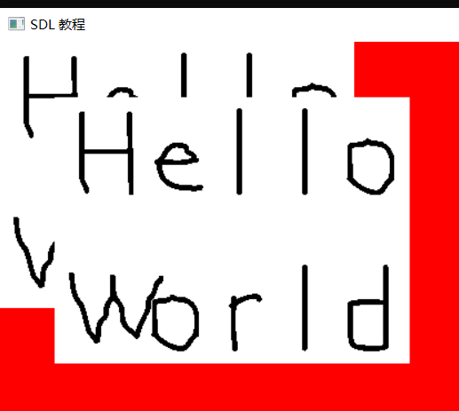
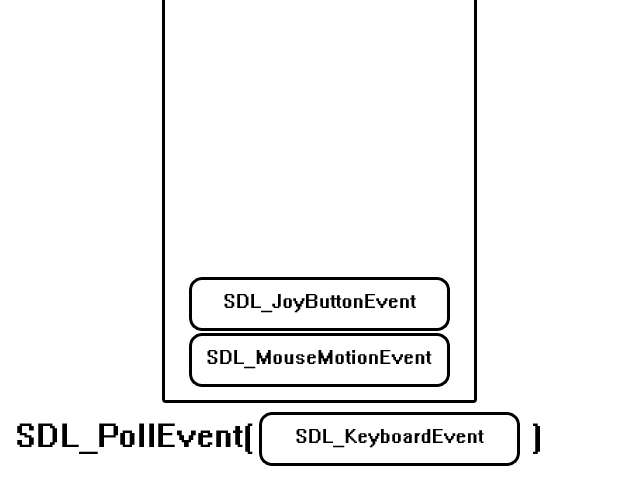

# 一、easyX图形库的使用

## 1、[窗口函数](https://so.csdn.net/so/search?q=窗口函数&spm=1001.2101.3001.7020) initgraph(int width,int height,int flag = NULL);

>   **initgraph**(int width, int height, int flag = NULL);  //用于初始化绘图窗口（创建窗口）

>   width 即窗口的宽    height 即窗口的高  flag 为窗口的样式默认为NULL 
>
>   第三个参数可以用来设置控制台和绘图窗口的最小化和关闭按钮
>
>   EW_SHOWCONSOLE    // 显示控制台
>
>   EW_NOCLOSE             // 没有关闭按钮  （可以用来恶搞 ^_^）
>
>   EW_NOMINIMIZE        // 没有最小化按钮  

>  **closegraph();**  //关闭绘图窗口

>  **cleardevice();** //清空绘图设备

```c++
int main(void)
{
	// 创建窗口
	initgraph(400, 600, EW_SHOWCONSOLE);
	//setbkcolor(RGB(33, 41, 88));
	setbkcolor(RED);
	// 清除屏幕所有内容
	cleardevice();

	getchar();
	return 0;
}
```


##  2、图形绘制

绘图函数从填充样式可分为无填充、有边框填充、无边框填充。


其他形状类似，只需要改掉circle即可


### 1.画圆 circle(int x,int y,int r);

>  画圆  **circle(int X,int Y,int R);**    //以（x，y）为圆心，R为半径画圆 另外两种样式相同

### 2.画矩形 rectangle(int x1,int y1,长, 宽);

> rectangle(int x1,int y1,int x2,int y2);  //以（x1，y1）为**左上顶点**（x2,y2）为**右下顶点**画矩形

### 3.画线条 line(int x1,int y1,int x2,int y2) 

> line(int x1,int y1,int x2,int y2) ;  //连接（x1，y1）和（x2，y2）的一条线段

### 4.设置填充颜色 setfillcolor(颜色);

> setfillcolor(颜色);  //设置填充颜色，如setfillcolor(RED);    // 是全局共享的

### 5.设置线条颜色  setlinecolor(颜色)；

> setlinecolor(颜色)； //设置线条颜色，如setlinecolor(YELLOW);

### 6.设置线条样式 setlinestyle(样式, 线宽);

> setlinestyle(样式, 线宽);    //设置线条样式，setlinestyle(PS_SOLID, 3);  宽为3的实线

### 7.设置背景颜色 setbkcolor(颜色);

> setbkcolor(颜色);   //设置背景颜色，如   setbkcolor(WHITE);

### 8.设置背景模式    setbkmode(模式);

>  setbkmode(模式);    //设置背景模式，一般使用设置为透明   setbkmode(**TRANSPARENT**);   //Transparent

## 3、文字绘制

### 1.  绘制文字 outtextxy(int x,int y,文字);

> outtextxy(int x,int y,LPCTSTR str); //在（x,y）输出文字str，如  outtextxy(10,10,"你好");

 注意：使用字符串时出现错误 

解决方法： 

​		1. 使用宏, _T();  (推荐)

​		1.在字符串前加上L。 即outtextxy(10,10,L"你好");

​       2.进入项目 -> 属性 ->配置属性 ->常规 -> 字符集 -> 改为多字节字符集

**绘制文字在窗口上**


**其他类型格式化输出在窗口上**


### 2.设置字体颜色   settextcolor(颜色);

>    settextcolor(颜色);    // 设置字体颜色，如   settextcolor(BLUE); 

### 3.设置字体样式  settextstyle(int Height,i  nt Width, 样式);

>  settextstyle(int Height,int Width, 样式); //设置字体类型，如settextstyle(30,0,"行楷");

 Height : 即字体的平均高度  Width : 即字体的平均宽度（为0表示自适应）

###  3.获取文本的宽度   textwidth(文本);

>    textwidth(文本);  //获取文字宽度，如   textwidth("哈哈哈哈");

### 4. 获取文本的高度   textheight(文本);

>    textheight(文本); //获取文本高度，如   textheight("嘿嘿");

### 5. 获取窗口的宽度和高度   getwidth()   getheight()

例子:

```c++
//绘制一个矩形,把文字居中显示到矩阵中间
void centerText()
{
	int rx = 150;
	int ry = 20;
	setfillcolor(YELLOW);
	setlinecolor(BLACK);
	setlinestyle(PS_SOLID, 3);
	fillrectangle(rx, ry, rx + 200, ry + 50);

	// 设置背景模式 //默认文字的背景颜色和窗口的一致
	setbkmode(TRANSPARENT);

	settextcolor(BLUE);
	settextstyle(26, 0, _T("黑体"));
	WCHAR centerText[100] = _T("无语....");

	int x = rx + (200 - textwidth(centerText)) / 2;
	int y = ry + (50 - textheight(centerText)) / 2;

	outtextxy(x, y, centerText);
}
```


## 4、图像处理函数

### 1.定义图像类型变量 IMAGE

> 在使用图像之前，需要先定义一个变量（对象），然后把图片加载进变量能使用。
>
> 定义一个图像变量，如 **IMAGE img**;

### 2.加载图像 loadimage(&img, 文件路径,宽, 高,是否调整 IMAGE大小来适应图片);

>  **loadimage**(IMAGE *pDstImg,文件路径, 宽,高, bool bResize = false); 

相对路径： ./ 表示当前文件夹下 ../ 表示上一级文件夹 如：./123.jpg

绝对路径：C:\\Users\\ASUS\\Desktop\\eaxyX项目\\eaxyX\\eaxyX\\123.jpg

如，**loadimage(&img,   T("./123.jpg"));** 

### 3.在设备上绘制图片 putimage(X,Y,&img)

>  **putimage(X,Y,&img,三元光栅操作码)** 
>
>  //把（x,y）作为左上角顶点放置图片,最后一个参数一般用不到

如，**putimage(0,0,&img);** //放在左上角 

例子:

```c
//定义一个图片变量
IMAGE zoye;
//加载图片到指定的图片变量
loadimage(&zoye，_T("./res/images/zoye.jpg"),getwidth( ),getheight());  //把图片输出到窗口上面
putimage(0，0，&zoye);
```


**透明贴图例子**


```c
IMAGE p1[2];
loadimage(pl +0，_T("./res /images/planeNormal_1.jpg"));
loadimage(pl + 1，_T("./res/images/planeNormal_2.jpg" ));
putimage(200，100，pl +0，NOTSRCERASE);
putimage(200，100,pl + 1,SRCINVERT);
```


**图片切割**


```c
IMAGE animals[2][10];
SetworkingImage(&animal);    //
for (int i = 0; i < 2; i++)
{
    for (int k = 0; k <10;k++)
    {
    	getimage( &animals[i][k]，(1-i)*39，k*39，39，39);  //
    }
}
SetworkingImage();

//  each
for (int i = 0; i < 10; i++)
{
	putimage(i* 39，0,&animals[0][i]，SRCAND);
    putimage(i * 39，0,&animals[1][i]，SRCPAINT);
}

```


## 5、鼠标消息函数(  graphics.h)

### 1. 鼠标消息判断 MouseHit()

> 用MouseHit()来判断是否有鼠标消息（左键，右键，中间，移动） 

### 2.鼠标消息MOUSEMSG类型及其成员

> 如 **MOUSEMSG**  msg;  
>
> 鼠标消息（msg）的成员
>
> uMsg,  //当前鼠标消息
>
> x,      //当前鼠标x坐标
>
> y,      //当前鼠标y坐标

> 使用鼠标消息的成员 如，msg.uMsg,msg.x,msg.y 

>  uMsg是用来判断鼠标消息的类型
>
> 主要的两个消息 WM_LBUTTONDOWN 鼠标左击消息
>
> ​             WM_RBUTTONDOWN 鼠标右击消息

###  3.鼠标消息接收 msg = GetMouseMsg();

> 如果有鼠标消息，就可以进行接收鼠标消息了 msg = GetMouseMsg();

```c
void MouseEvent()
{
	MOUSEMSG msg;
	// 如果鼠标消息,就获取鼠标消息
	if (MouseHit())
	{
		msg = GetMouseMsg();
		printf("%d %d", msg.x, msg.y);
		switch (msg.uMsg)
		{
		case WM_LBUTTONDOWN://左键按下
			printf("鼠标左键按下\n"); break;
		case WM_LBUTTONUP://弹起
			printf("鼠标左键弹起\n"); break;
		case WM_LBUTTONDBLCLK://双击
			printf("鼠标左键/双击\n"); break;  //需要 创建窗口(400, 600, EW_SHOWCONSOLE | EW_DBLCLKS);才能创建双击
		case WM_MOUSEWHEEL:
			//滚轮
			printf("鼠标滚轮%d\n", msg.wheel);
			break;
		case WM_MOUSEMOVE:
			//移动
			printf("鼠标移动\n"); break;
		default:
			break;
		}
	}
}

void test01()
{
	while (true)
	{
		MouseEvent();
	}
}


int main(void)
{
	// 创建窗口
	initgraph(400, 600, EW_SHOWCONSOLE | EW_DBLCLKS);
	//setbkcolor(RGB(33, 41, 88));
	setbkcolor(RED);
	// 清除屏幕所有内容
	cleardevice();

	test01();
	//drawShap();
	/*centerText();*/
	getchar();
	return 0;
}
```

例子;

```c++
bool button(const MOUSEMSG* msg)
{
	int x = 50;
	int y = 50;
	int w = 100;
	int h = 30;
	fillrectangle(x, y, x + w, y + h);
	if (msg->x > x && msg->x < x + w && msg->y > y && msg->y < y + h)
	{
		if (msg->uMsg == WM_LBUTTONDOWN)
		{
			return true;
		}
	}
	return false;
}

void test02()
{
	bool ret = false;
	while (true)
	{
		MOUSEMSG msg;
		if (MouseHit())
		{
			msg = GetMouseMsg();
			ret = button(&msg);
			if (ret)
			{
				outtextxy(100, 100, _T("按钮被按下"));
			}
		}
	}
}

int main(void)
{
	// 创建窗口
	initgraph(400, 600, EW_SHOWCONSOLE | EW_DBLCLKS);
	//setbkcolor(RGB(33, 41, 88));
	setbkcolor(RED);
	// 清除屏幕所有内容
	cleardevice();

	//test01();
	//drawShap();
	/*centerText();*/
	test02();
	getchar();
	return 0;
}
```

运行结果:


##  6、键盘消息函数(conio.h)

获取键盘消息的函数有两个

> getch();       //需要头文件conio.h
>
> GetAsyncKeyState(键值); //需要头文件windows.h,但EasyX包含了windows.h，无需添加

### 1.判断有无按键按下 kbhit()

> kbhit();   //当有按键按下函数返回1  在头文件conio.h中

###  2.getch() 用返回值来判断

> （1）与非ASCII表字符的按键比较，需要使用虚拟键值 上：72 下：80 左：75 右：77
>
> （2）如果是字母比较直接写字母，如'a'(区分大小写)

### 3. GetAsyncKeyState(键值)  需要传入键值 // 非常非常灵活 (VK_UP)

> 需要传入一个键值，如果按下返回真 
>
> 上： VK_UP    下：VK_DOWN   左：VK_LEFT   右：VK_RIGHT

```c
int x, y;  // 全局变量自动初始化为零

void draw()
{
	setfillcolor(RED);
	fillcircle(x, y, 5);
}


void keyEvent01()
{
	if (_kbhit())  // 判断是否有按键按下
	{
		// 上下左右
		char key = _getch();
		//printf("%d", key);
		switch (key)
		{
		case 72:
		case 'w':
		case 'W':
			y--;
			break;
		case 80:
		case 's':
		case 'S':
			y++;
			break;
		case 75:
		case 'a':
		case 'A':
			x--;
			break;
		case 77:
		case 'd':
		case 'D':
			x++;
			break;
		}
	}
}


void keyEvent02()
{
	//获以异步按键状念vk // 非常灵活
	if (GetAsyncKeyState(VK_UP))
	{
		printf("UP\n");
		y--;
	}
	if (GetAsyncKeyState(VK_DOWN))
	{
		printf("DOwN \n");
		y++;
	}
	if (GetAsyncKeyState(VK_LEFT))
	{
		printf("LEFT\n");
		x--;
	}
	if (GetAsyncKeyState(VK_RIGHT))
	{
		printf("RIGHT\n");
		x++;
	}

}


void test03()
{
	while (true)
	{
		draw();
		keyEvent01();
		//keyEvent02();

	}
}
```


##  7.双缓冲绘图

原理 :


**批量绘图 BeginBatchDraw(); 防止闪屏现象**

在设备上不断进行绘图时，会产生闪屏现象。针对这种现象，可以使用批量绘图来解决。

> BeginBatchDraw();     //开始双缓冲绘图，放在绘图之前

>  EndBatchDraw();     //结束双缓冲绘图，放在绘图之后 
>
>  或者 FlushBatchDraw();     

代码:

```c
int x, y;  // 全局变量自动初始化为零

void draw()
{
	setfillcolor(RED);
	fillcircle(x, y, 5);
}


void keyEvent01()
{
	if (_kbhit())  // 判断是否有按键按下
	{
		// 上下左右
		char key = _getch();
		//printf("%d", key);
		switch (key)
		{
		case 72:
		case 'w':
		case 'W':
			y--;
			break;
		case 80:
		case 's':
		case 'S':
			y++;
			break;
		case 75:
		case 'a':
		case 'A':
			x--;
			break;
		case 77:
		case 'd':
		case 'D':
			x++;
			break;
		}
	}
}


void keyEvent02()
{
	//获以异步按键状念vk // 非常灵活
	if (GetAsyncKeyState(VK_UP))
	{
		printf("UP\n");
		y--;
	}
	if (GetAsyncKeyState(VK_DOWN))
	{
		printf("DOwN \n");
		y++;
	}
	if (GetAsyncKeyState(VK_LEFT))
	{
		printf("LEFT\n");
		x--;
	}
	if (GetAsyncKeyState(VK_RIGHT))
	{
		printf("RIGHT\n");
		x++;
	}

}


void test03()
{
	// 双缓冲绘图  Batch n.分批
	BeginBatchDraw();
	while (true)
	{
		cleardevice();  // 清屏
		draw();
		keyEvent01();
		//keyEvent02();

		FlushBatchDraw();   //

	}
	EndBatchDraw();    //
}
```


##  8、 弹出对话框和修改窗口标题

### 1.获取窗口句柄 GetWnd()

>  HWND aaa;  //用HWND类型变量获取窗口句柄    //获取窗口句柄，之后可以操作窗口
>
> aaa = GetWnd(); 

### 2.修改窗口标题 SetWindowText(aaa,"标题")

>  SetWindowText(aaa,"标题")  //如 SetWindowText(aaa,"爱乐");
>
> 如果aaa在这里写NULL，就可以在窗口和对话框之间进行切换，现在必须先点对话框

### 3.设置对话框 MessageBox(aaa,"消息","对话框标题",  MB_OKCANCEL) 返回IDOK...

> MB_OKCANCEL 表示对话框的按钮，可进入定义看其他的，如MB_YESNO 

+ MessageBox函数返回int型值 点击确定返回IDOK ，点击取消返回IDCANCEL 

+ 如果是MB_YESNO，代表点击YES返回 IDYESE，点击NO返回IDNO

```java
//举个例子 
HWND abc = GetHWnd();   //获取窗口句柄
SetWindowText(abc, "路易斯");   //修改窗口标题 
MessageBox(abc,  "我用什么才能留住你", "博尔赫斯", MB_OKCANCEL);  //设置对话框
```

 

## 9、播放音乐

### 1.需要的头文件和静态库

> **mmsystem.h**
>
> 加载静态库 **#pragma comment (lib,"winmm.lib")** 

### 2.音乐播放函数 mciSendString

该函数的参数如下：

 **下面是该函数的使用方法：**

```c
//播放音乐mci media device interface多媒体设备接口
//open打开 play 播发 alias起别名
mciSendString(_T("open xx.mp3 alias yy"), nullptr, 0, nullptr);
mciSendString(_T("play yy"), nullptr, 0, nullptr);
```


```cpp
//使用方法
mciSendString("open ./绿色.mp3",NULL,0,NULL);  //打开音乐
mciSendString("play ./绿色.mp3",NULL,0,NULL);  //播放音乐
mciSendString("stop ./绿色.mp3",NULL,0,NULL);  //停止播放
mciSendString("play ./绿色.mp3 repeat",NULL,0,NULL);  //加上repeat后循环播放
//通过关键字alias 用BGM代替前面的文件路径
mciSendString("open ./绿色.mp3 alias BGM",NULL,0,NULL); 
```

 注意：printf(); scanf();函数的输入输出只会在控制台窗口显示，不会出现在绘图窗口


**扫雷**

```c
#include <stdio.h>
#include <time.h>
#include <stdlib.h>
#include <easyx.h>
#include <graphics.h>
#include <mmsystem.h>
#pragma comment (lib, "winmm.lib")

enum MyEnum
{
	ROW = 10,
	COL = 10
};

void initMap(int map[][10]);
void loadImg(IMAGE imgs[]);
void drawMap(int(*map)[10], IMAGE* imgs);
void showMap(int(*arr)[10]);
void mouseEvent(int map[][10]);
void openNull(int map[][10], int r, int c);
void jugde(int map[][10], int r, int c);
bool isOver = false;   // 失败(踩雷)
bool isWin = false;    // 胜利

int main(void)
{
	initgraph(COL * 40, ROW * 40, EW_SHOWCONSOLE);
	//播放音乐
	mciSendString("open ./images/start.mp3", NULL, 0, NULL);
	mciSendString("play ./images/start.mp3", NULL, 0, NULL);

	srand((unsigned int)time(NULL));
	//扫雷 数据
	int map[ROW][COL] = {0};
	// 通过界面把数据展现给用户看, 资源图片的名字是有意义的
	IMAGE imgs[12];
	initMap(map);
	loadImg(imgs);
	showMap(map);

	while (true)
	{
		mouseEvent(map);
		drawMap(map, imgs);

		HWND ret = GetHWnd();
		SetWindowText(ret, "扫雷");
		if (isOver || isWin)
		{
			char text[40] = {0};
			if (isOver)
			{
				strcpy(text, "你点到雷了, 是否重新再来一把 ?");
			}
			else
			{
				strcpy(text, "你过关了,是否再来一把?");
			}
			int result = MessageBox(ret, text, "提示", MB_OKCANCEL);
			if (result == IDOK)
			{
				initMap(map);
				isOver = false;
				isWin = false;
			}
			else
			{
				//exit(EXIT_FAILURE);//异常退出
				exit(0);//正常退出

			}

		}
	}

	getchar();
	return 0;
}

void initMap(int map[][10])
{
	//初始化全为0
	memset(map, 0, ROW * COL * 4);
	//随机10个雷 雷-1
	for (int k = 0; k < 10;)
	{
		int r = rand() % ROW;
		int c = rand() % COL;
		if (map[r][c] != -1)
		{
			map[r][c] = -1;
			// 遍历以雷区为中心的九宫格
			for (int i = r - 1; i <= r + 1; i++)
			{
				for (int j = c - 1; j <= c + 1; j++)
				{
					// 索引表示的话,通过长度的限制消除数组越界的东西
					if ((i >= 0 && i < ROW && j >= 0 && j < COL) && map[i][j] != -1)
					{
						map[i][j] ++;
					}
				}
			}
			k++;
		}
	}

	//加密格子  // 雷19(29) 数子 21-28 //标记 31 //加密图 30
	for (int i = 0; i < ROW; i++)
	{
		for (int j = 0; j < COL; j++)
		{
			map[i][j] += 20;
		}
	}

}

void loadImg(IMAGE imgs[])
{
	for (int i = 0; i < 12; i++)
	{
		char image[20] = {0};
		sprintf(image, "./images/%d.jpg", i);
		loadimage(imgs + i, image, 40, 40);
	}

	for (int i = 0; i < 12; i++)
	{
		char image[20] = {0};
		sprintf(image, "./images/%d.jpg", i);
		loadimage(imgs + i, image, 40, 40);
	}
}

void drawMap(int(*map)[10], IMAGE* imgs)
{
	//贴图片
	for (int i = 0; i < ROW; i++)   //对应y
	{
		for (int j = 0; j < COL; j++) //对应x
		{
			if (map[i][j] >= 0 && map[i][j] <= 8)
			{

				putimage(j * 40, i * 40, &imgs[map[i][j]]); //画图理解
			}
			else if (map[i][j] == -1)  //贴雷 
			{
				putimage(j * 40, i * 40, &imgs[9]);
			}

			else if (map[i][j] >= 19 && map[i][j] <= 28)
			{
				putimage(j * 40, i * 40, imgs + 10); //加密贴图:
			}
			else if (map[i][j] > 28)  //标记
			{
				putimage(j * 40, i * 40, imgs + 11);
			}
		}
	}
}

void showMap(int(*arr)[10])
{
	for (int i = 0; i < ROW; i++)
	{
		for (int j = 0; j < COL; j++)
		{
			printf("%2d ", arr[i][j]);
		}
		printf("\n");
	}
	printf("\n\n");
}

void mouseEvent(int map[][10])
{
	if (MouseHit())
	{
		MOUSEMSG msg = GetMouseMsg();
		//求出对应的行列
		int r = msg.y / 40;
		int c = msg.x / 40;
		// 鼠标左键点击打开对应格子, -20
		if (msg.uMsg == WM_LBUTTONDOWN)
		{
			// 点击格子播放
			mciSendString("close click", NULL, 0, NULL);
			mciSendString("open ./images/click.wav alias click", NULL, 0, NULL);
			mciSendString("play click", NULL, 0, NULL);

			if (map[r][c] >= 19 && map[r][c] <= 28)
			{
				map[r][c] -= 20;
				if (map[r][c] == 0)
				{
					mciSendString("close search", NULL, 0, NULL);
					mciSendString("open ./images/search.wav alias search", NULL, 0, NULL);
					mciSendString("play search", NULL, 0, NULL);
				}
				openNull(map, r, c);  //空白,炸开一片
				jugde(map, r, c);  // 踩雷
				showMap(map);
			}
		}
		// 右键标记
		else if (msg.uMsg == WM_RBUTTONDOWN)
		{
			mciSendString("close rightClick", NULL, 0, NULL);
			mciSendString("open ./images/rightClick.wav alias rightClick", NULL, 0, NULL);
			mciSendString("play rightClick", NULL, 0, NULL);
			if (map[r][c] >= 19 && map[r][c] <= 28)
			{
				map[r][c] += 20;
				showMap(map);
			}
			else if (map[r][c] > 28) //已经标记过了,取消标记
			{
				map[r][c] -= 20;
			}
		}

	}
}

void openNull(int map[][10], int r, int c)
{
	if (map[r][c] == 0)
	{
		// 遍历周围的
		for (int i = r - 1; i <= r + 1; i++)
		{
			for (int j = c - 1; j <= c + 1; j++)
			{
				// 周围的格子没有打开,就打开
				if ((i >= 0 && i < ROW && j >= 0 && j < COL) && map[i][j] >= 19 && map[i][j] <= 28)
				{
					map[i][j] -= 20;
					openNull(map, i, j);  // 递归

				}
			}
		}
	}
}

void jugde(int map[][10], int r, int c)
{
	// 如果点的雷
	if (map[r][c] == -1)
	{
		// 把所有的雷都打开
		for (int i = 0; i < ROW; i++)
		{
			for (int j = 0; j < COL; j++)
			{
				if (map[i][j] == 19)
					map[i][j] -= 20;
				//标记的雷也要打开
				else if (map[i][j] == 39)
					map[i][j] -= 40;
			}
		}
		isOver = true;
	}

	//把应该点开的格子都点开了，游戏就胜利了
	int cnt = 0;
	for (int i = 0; i < ROW; i++)
	{
		for (int j = 0; j < COL; j++)
		{
			if (map[i][j] >= 0 && map[i][j] <= 8) // 同计点开的
			{
				cnt++;
			}
		}
	}
	if (cnt == ROW * COL - 10)
	{
		isWin = true;
	}
}

/*
if (isOver)
{
	HWND ret = GetHWnd();
	int result = MessageBox(ret, "你点到雷了,是否重新再来一把?", "提示", MB_OKCANCEL);
	if (result == IDOK)
	{
		initMap(map);
		isOver = false;
	}
	else
	{
		exit(EXIT_FAILURE);
	}
}

if (isWin)
{
	HWND ret = GetHWnd();
	int result = MessageBox(ret, "你过关了,是否再来一把?", "提示", MB_OKCANCEL);
	if (result == IDOK)
	{
		initMap(map);
		isWin = false;
	}
	else
	{
		exit(EXIT_FAILURE);
	}
}
*/
```


# 二、SDL 简介

### 什么是 SDL？

Simple DirectMedia Layer 是一个跨平台开发库，旨在通过 OpenGL 和 Direct3D 提供对音频、键盘、鼠标、游戏杆和图形硬件的低级访问。它被视频播放软件、模拟器和流行游戏使用，包括[Valve](http://valvesoftware.com/)的获奖目录和许多[Humble Bundle](https://www.humblebundle.com/)游戏。

SDL 正式支持 Windows、Mac OS X、Linux、iOS 和[Android](https://wiki.libsdl.org/Android)。可以在源代码中找到对其他平台的支持。

SDL 是用 C 编写的，在本机上与 C++ 一起使用，并且有适用于其他几种语言的绑定，包括 C# 和 Python。

SDL 2.0 在[zlib 许可](http://www.gzip.org/zlib/zlib_license.html)下分发。此许可证允许您在任何软件中自由使用 SDL。简单直接媒体层库 (SDL) 是一个通用 API，它提供对音频、键盘、鼠标、游戏杆、通过 OpenGL 的 3D 硬件以及跨多个平台的 2D 帧缓冲区的低级别访问。

### SDL 可以做什么？

**视频**

- 3D图形：SDL 可与 OpenGL API 或 Direct3D API 结合使用，用于 3D 图形
- 加速 2D 渲染 API：支持简单的旋转、缩放和 alpha 混合，所有这些都使用现代 3D API 加速，使用 OpenGL 和 Direct3D 支持加速
- 创建和管理多个窗口

**输入事件**

- 提供的事件和 API 函数用于：
  - 应用程序和窗口状态更改
  - 鼠标输入
  - 键盘输入
  - 操纵杆和游戏控制器输入
  - 多点触控手势
- 可以使用[SDL_EventState](https://wiki.libsdl.org/SDL_EventState) ()启用或禁用每个事件
- 事件在发布到内部事件队列之前通过用户指定的过滤器函数
- 线程安全事件队列

**力反馈**

- Windows、Mac OS X 和 Linux 支持力反馈

**音频**

- 设置8位和16位音频、单声道立体声或5.1环绕声的音频播放，如果硬件不支持格式，可选择转换
- 音频在单独的线程中独立运行，通过用户回调机制填充
- 专为定制软件混音器设计，但[SDL_mixer](http://www.libsdl.org/projects/SDL_mixer/)提供完整的音频/音乐输出库

**文件 I/O 抽象**

- 用于打开、读取和写入数据的通用抽象
- 对文件和内存的内置支持

**共享对象支持**

- 加载共享对象（Windows 上的 DLL，Mac OS X 上的 .dylib，Linux 上的 .so）
- 共享对象中的查找函数

**线程**

- 简单的线程创建API
- 简单线程本地存储API
- 互斥体、信号量和条件变量
- 无锁编程的原子操作

**计时器**

- 获取经过的毫秒数
- 等待指定的毫秒数
- 在单独的线程中创建与代码一起运行的计时器
- 使用高分辨率计数器进行分析

**CPU 特性检测**

- 查询CPU数量
- 检测 CPU 特性和支持的指令集

**大端小端支持**

- 检测当前系统的字节序
- 用于快速交换数据值的例程
- 读取和写入指定字节序的数据

**电池管理**

- 查询电源管理状态

### SDL 在哪些平台上运行？

**视窗**

- 使用 Win32 API 进行显示，利用 Direct3D 进行硬件加速
- 使用 DirectSound 和 XAudio2 作为声音

**Mac OS X**

- 使用 Cocoa 进行视频显示，利用 OpenGL 进行硬件加速
- 使用 Core Audio 播放声音

**Linux**

- 使用 X11 进行视频显示，利用 OpenGL 进行硬件加速
- 使用 ALSA、OSS 和 PulseAudio API 来处理声音

**IOS**

- 使用 UIKit 进行视频显示，利用 OpenGL ES 2.0 进行硬件加速
- 使用 Core Audio 播放声音

**安卓**

- 使用 JNI 接口进行视频显示，利用 OpenGL ES 1.1 和 2.0 进行硬件加速
- 对声音使用 JNI 音频回调


## 如何获取和安装 SDL

### SDL2库下载

+ SDL2 核心库 [SDL2](https://libsdl.org/download-2.0.php)

+ SDL2 拓展库 [SDL2_image、SDL2_ttf、SDL2_mixer、SDL2_net](https://libsdl.org/projects/)

+ SDL2 第三方绘图库[SDL2_gfx 官网](https://www.ferzkopp.net/wordpress/2016/01/02/sdl_gfx-sdl2_gfx/)     [SDL2_gfx Github](https://github.com/topics/sdl2-gfx)

### 安装SDL2

1. 点击[SDL2 核心库下载](https://libsdl.org/download-2.0.php)下载SDL2库，如下图根据编译器选择不同版本(Visual Studo系列选择第一个)。


2. 下载出来会有一个压缩包，放到一个合适的目录(记住这个目录哦，经常要用的)，解压。


3. 进入解压后的目录，如下图：

+ docs：文档目录，只不过都是英文的
+ include：头文件目录，编程需要的
+ lib：库目录(静态库和动态库都有)


4. 给环境变量添加库目录，让程序运行的时候能够找到动态库。<font style="color:red">PS：配置好了记得重启Vs</font>


### 在Visual Studio中使用SDL

1. 创建一个空项目，如下图：


2. 进入菜单栏的项目->属性->VC++ 目录，配置包含目录和库目录(详见下图)，注意库目录的版本和你的项目版本要一直哦(图中两个三角形标记的位置，我这是x64的)。


3. 不要离开，还有静态库需要配置，进入链接器->输入->点击附加依赖项->填入SDL2.lib和SDLmain2.lib，然后确定就好


4. 最后加入如下代码，Ctrl+F5运行

```c
#include<SDL.h>

int main(int argc,char*argv[])
{
	//初始化SDL
	if (SDL_Init(SDL_INIT_VIDEO) <0)
	{
		SDL_Log("can not init SDL:%s", SDL_GetError());
		return -1;
	}

	return 0;
}
```


如果能出现黑窗口并且，没有任何错误提示，那么就恭喜你啦，SDL配置完成~(不过麻烦的是每次创建新项目和在x86、x64之间切换时，都要进行配置~后面将讲解更方便的方法)！

SDL 作为动态链接库。动态链接库包含 3 个部分：

- 头文件 (Library.h)
- 库文件（Windows 的Library.lib 或 *nix 的libLibrary.a）
- 二进制文件（Windows 的Library.dll 或*nix 的Library.so）

你的编译器需要能够在编译时找到头文件，以便它知道SDL 函数和结构是什么。可以将编译器配置为在 SDL 头文件所在的附加目录中进行搜索，或者将头文件与编译器附带的其余头文件一起放入。如果编译器提示找不到 SDL.h，则意味着头文件不在编译器查找头文件的位置。

在编译器编译所有源文件后，它必须将它们链接在一起。为了使程序正确链接，它需要知道所有函数的地址，包括 SDL 函数的地址。对于动态链接库，这些地址在库文件中。库文件具有导入地址表，因此您的程序可以在运行时导入函数。与头文件一样，您可以将编译器配置为在 SDL 库文件所在的附加目录中进行搜索，或者将库文件与编译器附带的其余库文件一起放入。您还必须告诉链接器链接到链接器中的库文件。如果链接器报错找不到-lSDL或SDL2.lib，它意味着库文件不在链接器寻找库文件的地方。 如果链接器报错了一个未定义的引用，这可能意味着它没有链接这个库。  

在您的程序被编译和链接之后，您需要能够在运行时链接到该库。为了运行动态链接的应用程序，您需要能够在运行时导入库二进制文件。当您运行程序时，您的操作系统需要能够找到库二进制文件。您可以将库二进制文件放在与可执行文件相同的目录中，也可以放在操作系统保存库二进制文件的目录中。

 

## SDL2教程

+ [SDL2 SDL中文教程 ](https://tjumyk.github.io/sdl-tutorial-cn/contents.html)

+ [SDL2各种教程集合](https://wiki.libsdl.org/Tutorials)

### 1.简单窗口

```c
#include<SDL.h>

//屏幕尺寸常量
const int SCREEN_WIDTH = 640;
const int SCREEN_HEIGHT = 480;
```

首先包含SDL.h头文件。  然后定义我们需要的窗口宽度和高度常量。

```c
int main(int argc,char*argv[])
{
	//初始化SDL子系统
	if (SDL_Init(SDL_INIT_VIDEO) != 0)
	{
		SDL_Log("can not init SDL:%s", SDL_GetError());
		return -1;
	}
```

注意主函数的形参，必须是一个整型，后跟上一个char*数组(参数分别代表命令行参数个数和命令行参数数组)，不能是其他形式的main函！

在主函数中我们先调用SDL_init初始化函数，如果不先初始化 SDL，就不能调用任何 SDL 函数。暂时我们只需要SDL的视频子系统，所以我们先只将 SDL_INIT_VIDEO 标志传递给它。

当发生错误时，SDL_Init 返回 负数。当出现错误时，我们可以将具体的错误原因打印到控制台。

在SDL中有一个和printf函数功能相同的函数，即SDL_Log。然后用SDL_GetError获取错误字符串并打印出来。

```c
	//创建窗口
	SDL_Window* window = SDL_CreateWindow(u8"C语言Plus",
		SDL_WINDOWPOS_UNDEFINED, 
		SDL_WINDOWPOS_UNDEFINED, 
		SCREEN_WIDTH, SCREEN_HEIGHT,
		SDL_WINDOW_SHOWN);
	//判断是否创建成功
	if (window == NULL)
	{
		SDL_Log("can not  create window:%s", SDL_GetError());
		return -1;
	}
```

如果SDL成功初始化，我们将使用SDL_CreateWindow创建一个窗口。 

+ 第一个参数设置窗口的标题；
+ 接下来两个参数分别是窗口的x和y，即窗口在屏幕上的位置，我们不关心位置在那里，所以直接传SDL_WINDOWPOS_UNDEFINED即可；

+ 接下来的两个参数分别表示窗口的宽度和高度；
+ 最后一个参数表示窗口创建成功之后显示出来。

如果有错误，SDL_CreateWindow 返回 NULL。我们将错误打印到控制台。


如果窗口被成功创建，则会显示到桌面。 

为了防止它消失，我们将调用SDL_Delay。 SDL_Delay将等待给定的毫秒数。 一毫秒是千分之一秒。 这意味着上面的代码将使窗口等待2000 /1000秒或2秒。  

需要注意的重要一点是，当SDL延迟时，它不能接受来自键盘或鼠标的输入。 当您运行这个程序时，如果它没有响应，请不要惊慌。 我们没有给它处理鼠标和键盘的代码。  

```c
	//延迟5秒
	SDL_Delay(5000);
	//销毁窗口
	SDL_DestroyWindow(window);
	//清理所有初始化的子系统
	SDL_Quit();
	return 0;
}
```

最后我们让程序延迟5秒再退出，否则窗口会一闪而过；退出之前需要调用SDL_DestroyWindow手动销毁窗口和调用SDL_Quit清理所有初始化的子系统。

**代码:**

```c
#include<SDL.h>

//sdl项目，这个main函数必须是带参数的版本
int main(int argc, char* argv[])
{
	//1，先初始化SDL库 返回0表示成功，否则表示失败
	if (SDL_Init(SDL_INIT_VIDEO) != 0)
	{
		SDL_Log("sdl init failed,%s\n", SDL_GetError());
	}

	//3，创建一个窗口 //u8解决乱码
	SDL_Window* window = SDL_CreateWindow(u8"SDL 教程", SDL_WINDOWPOS_UNDEFINED, SDL_WINDOWPOS_UNDEFINED, 640, 480, SDL_WINDOW_SHOWN);
	if (!window)
	{
		SDL_Log("create window failed,%s\n", SDL_GetError());
		SDL_Quit();
		return -1;
	}

	//获取窗口的表面
	SDL_Surface* winSfc = SDL_GetWindowSurface(window);

	//5,给窗口设置一个颜色
	//SDL_Rect rect = {50,50,60,30};
	//SDL_FillRect(winSfc, &rect, 0xff0000);
	SDL_FillRect(winSfc, NULL, 0xff0000);

	//6，更新一下窗口表面
	SDL_UpdateWindowSurface(window);

	//4,让程序暂停一会儿
	SDL_Delay(5000);

	//2，销毁窗口和关闭SDL库
	SDL_DestroyWindow(window);
	SDL_Quit();

	return 0;
}
```


### 2.在屏幕上显示一张图片


既然你已经配置好了SDL， 是时候来建立一个能加载并显示一张图片的基本图形程序了。

```c
//启动SDL并创建窗口
bool init(const char*title,int width,int height);

//释放媒体并关闭SDL
void clean();
```

在第一个教程中，我们将所有内容都放在 main 函数中。由于它是一个小程序，我们可以这样，但在实际程序中，代码尽可能模块化。这意味着你的代码是整齐的块，每个块都易于调试和重用。

这意味着我们有处理初始化和关闭 SDL 应用程序的函数。我们在源文件的顶部附近声明这些函数。

```c
//要渲染的窗口指针
SDL_Window* gWindow = NULL;
    
//窗口包含的表面
SDL_Surface* gWinSfc = NULL;
```

这里我们声明了一些全局变量。通常，你应该避免在大型程序中使用全局变量。我们在这里这样做的原因是因为我们希望源代码尽可能简单，但是在大型项目中全局变量会使事情变得更加复杂。由于这是一个单一的源文件程序，我们不必太担心。

这是一种称为 SDL 表面的新数据类型。SDL 表面只是一种图像数据类型，它包含图像的像素以及渲染它所需的所有数据。SDL 表面使用软件渲染，这意味着它使用 CPU 进行渲染。可以渲染硬件图像，但它有点困难，所以我们将首先通过简单的方法学习它。在以后的教程中，我们将介绍如何渲染 GPU 加速图像。

我们将在这里处理的图像是屏幕图像（您在窗口内看到的）和我们将从文件加载的图像。

请注意，这些是指向 SDL 表面的指针。原因是 :

1. 我们将动态分配内存来加载图像
2. 最好按内存位置引用图像。想象一下，你有一个砖墙游戏，由多次渲染的相同砖块图像组成（如超级马里奥兄弟）。当您可以拥有图像的一个副本并一遍又一遍地渲染它时，在内存中拥有数十个图像副本是很浪费的。

另外，请始终记住初始化您的指针。我们在声明它们时立即将它们设置为 NULL。

```c
bool init(const char*title,int width,int height)
{
	//初始化SDL
	if (SDL_Init(SDL_INIT_VIDEO) != 0)
	{
		return false;
	}
	//创建窗口
	gWindow = SDL_CreateWindow(title, SDL_WINDOWPOS_UNDEFINED, SDL_WINDOWPOS_UNDEFINED, width, height, SDL_WINDOW_SHOWN);
	if (!gWindow)
	{
		return false;
	}
	//获取窗口表面
	gWinSfc = SDL_GetWindowSurface(gWindow);
	if (!gWinSfc)
	{
		return false;
	}
	return true;
}
```

在上面的代码中，我们已经获取了SDL初始化和窗口创建代码，并将其放在自己的函数中。 

我们想在窗口内显示图像，为了做到这一点，我们需要获得窗口内的图像。 因此，我们调用SDL_GetWindowSurface来获取窗口所包含的表面。  

```c
void clean()
{
	SDL_DestroyWindow(gWindow);
	SDL_Quit();
}
```

在我们的清理代码中，我们像以前一样销毁窗口并退出SDL。

```c
int main(int argc, char* argv[])
{
	if (!init(u8"SDL2教程", 640, 480))
	{
		SDL_Log("Failed to initialize!\n");
	}

	//加载图片
	SDL_Surface* sfc = SDL_LoadBMP("./assets/lesson02/hello_world.bmp");
	if (!sfc)
	{
		SDL_Log("surface load failed,%s\n", SDL_GetError());
	}
	else
	{
		//把图片显示到窗口上
		SDL_BlitSurface(sfc, NULL, gWinSfc, NULL);
```

在我们的主函数中，我们初始化 SDL 并加载图像。如果成功，我们使用 SDL_BlitSurface 将加载的表面 blit 到屏幕表面上。

块传输的作用是获取源表面并将其副本标记到目标表面上。SDL_BlitSurface 的第一个参数是源图像。第三个参数是目的地。我们将在以后的教程中学习第二个和第四个参数。

现在，如果这是我们唯一的绘图代码，我们仍然不会在屏幕上看到我们加载的图像。还差一步。

```c
        //更新窗口表面
        SDL_UpdateWindowSurface( gWindow );
```

在屏幕上绘制了我们想要为该帧显示的所有内容后，我们必须使用 SDL_UpdateWindowSurface 更新屏幕。当你在屏幕上绘图时，你通常不会在屏幕上看到你看到的图像。默认情况下，大多数渲染系统都是双缓冲的。这两个缓冲区是前缓冲区和后缓冲区。

当你进行像 SDL_BlitSurface 这样的绘制调用时，你渲染到后台缓冲区。您在屏幕上看到的是前端缓冲区。我们这样做的原因是因为大多数框架需要在屏幕上绘制多个对象。如果我们只有一个前端缓冲区，我们将能够看到正在绘制的帧，这意味着我们会看到未完成的帧。所以我们要做的是首先将所有内容绘制到后台缓冲区，完成后我们交换后台缓冲区和前台缓冲区，这样现在用户就可以看到完成的帧了。

这也意味着您不会在每个 blit 之后调用 SDL_UpdateWindowSurface，只有在当前帧的所有 blit 都完成之后才会调用。

```c
            //等待2秒
			SDL_Delay( 2000 );
			//释放表面
			SDL_FreeSurface(sfc);
        }
    }

    //释放资源和关闭SDL
    clean();

    return 0;
}
```

现在我们已经把所有东西都渲染到了窗口上，我们延迟了两秒钟，这样窗口就不会消失了。等待完成后，我们关闭我们的程序。


#### Surface直接修改像素

```c
//输出像素格式
SDL_Log("%d\n", sfc->format->format);
//输出人看得懂的像素格式
SDL_Log("%s\n", SDL_GetPixelFormatName(sfc->format->format));
```

先输出sfc的像素格式，像素格式是由枚举`SDL_PixelFormatEnum`定义的，如果输出的是318769153，即对应的枚举是SDL_PIXELFORMAT_INDEX8，说明一个像素由八位表示(也就是图片是一张黑白图)。

如果要修改图片，让他能够呈现彩色，必须先对图片的格式进行转换。

```c
sfc = SDL_ConvertSurface(sfc, gWinSfc->format, 0);
```

通过SDL_ConvertSurface可以把sfc的像素格式转为指定的像素格式(这里是窗口的)，然后进行修改像素

```c
//修改图片的像素
Uint32* pixels = sfc->pixels;
for (int i = 0; i < 100; i++)
{
	   pixels[i] = 0xff00ff;//SDL_MapRGBA(sfc->format,255,0,0,255);
}
```

上面的代码在图片上画了一条品红色的线条。


#### **指定输出坐标**

```c
SDL_Rect  rect = { 50,50,0,0 };
//把图片显示到窗口上
SDL_BlitSurface(sfc, NULL, gWinSfc, &rect);
```

SDL_BlitSurface可以将sfc输出到gWinSfc，那么如何指定输出坐标呢，这个可以通过最后一个参数指定，这个参数需要一个SDL_Rect结构，而且只有x，y有效，w，h将被忽略，所以置为0即可！

#### **输出部分图片**

```c
SDL_Rect scaleRect = { 10,156,50,50 };
//把图片显示到窗口上
SDL_BlitSurface(sfc, &scaleRect, gWinSfc, NULL);
```

如果不想把整张图片都输出，则可以指定输出的图片中的某个矩形区域。


代码:

```c
#include<SDL.h>

//sdl项目，这个main函数必须是带参数的版本
int main(int argc, char* argv[])
{
	//1，先初始化SDL库 返回0表示成功，否则表示失败
	if (SDL_Init(SDL_INIT_VIDEO))
	{
		SDL_Log("sdl init failed,%s\n", SDL_GetError());
	}

	//3，创建一个窗口 //u8解决乱码
	SDL_Window* window = SDL_CreateWindow(u8"SDL 教程", SDL_WINDOWPOS_UNDEFINED, SDL_WINDOWPOS_UNDEFINED, 640, 480, SDL_WINDOW_SHOWN);
	if (!window)
	{
		SDL_Log("create window failed,%s\n", SDL_GetError());
		SDL_Quit();
		return -1;
	}

	//获取窗口的表面
	SDL_Surface* winSfc = SDL_GetWindowSurface(window);

	//5,给窗口设置一个颜色
	//SDL_Rect rect = {50,50,60,30};
	//SDL_FillRect(winSfc, &rect, 0xff0000);
	SDL_FillRect(winSfc, NULL, 0xff0000);

	// 绘制一张图片，SDL核心库，只支持bmp的图片 //加载图片
	SDL_Surface* hellostc = SDL_LoadBMP("./assets/hello_world.bmp");
	if (!hellostc)
	{
		SDL_Log("create window failed,%s\n", SDL_GetError());
	}
	else
	{
		//输出图片
		SDL_BlitSurface(hellostc, NULL, winSfc, NULL);
		// 指定输出位置屏幕
		SDL_Rect poseRect = {50, 50};
		SDL_BlitSurface(hellostc, NULL, winSfc, &poseRect);
		// 指定输出图片每一部分 900 300
		SDL_Rect areaRect = {0, 0, 300, 100}; //左上角(x,y),长,宽
		SDL_BlitSurface(hellostc, &areaRect, winSfc, &poseRect);
	}

	//6，更新一下窗口表面
	SDL_UpdateWindowSurface(window);

	//4,让程序暂停一会儿
	SDL_Delay(5000);
    
    //销毁图片
	SDL_FreeSurface(helloSfc);
	//2，销毁窗口和关闭SDL库
	SDL_DestroyWindow(window);  // 因为创建一个窗口是动态创建的
	SDL_Quit();

	return 0;
}
```



### 3.事件处理

#### 事件处理流程

除了将图像放在屏幕上之外，游戏还要求您处理来自用户的输入。您可以使用 SDL事件处理系统来做到这一点。(把一下代码放到main函数中)

```c
            //主循环标志
            bool isDone = false;
```

在输出表面和更新窗口表面之后，我们声明了一个退出标志，用于跟踪用户是否已退出。由于此时我们刚刚启动了应用程序，显然它被初始化为false。

我们还声明了一个[SDL_Event](http://wiki.libsdl.org/SDL_Event?highlight=(\bCategoryStruct\b)|(CategoryEvents))联合。SDL事件是有意义的，比如 [按键](http://wiki.libsdl.org/SDL_KeyboardEvent?highlight=(\bCategoryStruct\b)|(CategoryEvents))、 [鼠标移动](http://wiki.libsdl.org/SDL_MouseMotionEvent?highlight=(\bCategoryStruct\b)|(CategoryEvents))、 [操纵杆 按钮按下](http://wiki.libsdl.org/SDL_JoyButtonEvent?highlight=(\bCategoryStruct\b)|(CategoryEvents))等。在这个应用程序中，我们将找到退出事件来结束应用程序。

```c
            //应用程序主循环
            while( !isDone )
            {
```

在之前的教程中，我们让程序在关闭前等待几秒钟。 在这个应用程序中，我们让应用程序等到用户退出后才关闭。  

当用户没有退出时，我们会有应用程序循环。 这种在应用程序处于活动状态时持续运行的循环称为主循环，有时也称为游戏循环。 它是任何游戏应用程序的核心。  

```c
         		//事件处理
            	static SDL_Event ev ={0};

				//处理队列上的事件
                while( SDL_PollEvent( &ev ) != 0 )
                {
                    //用户请求退出
                    if( ev.type == SDL_QUIT )
                    {
                       isDone = true;
                    }
                }
```

在主循环里面写了事件循环。 这样做的作用是继续处理事件队列，直到它为空。  

当您按下一个键、移动鼠标或触摸触摸屏时，事件就会被放到事件队列中。  


然后事件队列将按照事件发生的顺序存储它们，等待您处理它们。 当您想知道发生了什么事件以便处理它们时，您可以轮询事件队列，通过调用SDL_PollEvent获取最近的事件。 SDL_PollEvent所做的就是从事件队列中取出最近的事件，并将该事件中的数据放入我们传递给函数的SDL_Event中。  



SDL_PollEvent 将不断从队列中取出事件，直到队列为空。当队列为空时，SDL_PollEvent 将返回 0。所以这段代码所做的就是不断轮询事件队列中的事件，直到它为空。如果来自事件队列的事件是 SDL_QUIT 事件（用户点击窗口右上角关闭按钮产生的事件），我们将退出标志设置为 true，以便我们可以退出应用程序。

```c
                //输出图片
                SDL_BlitSurface( gXOut, NULL, gScreenSurface, NULL );
            
                //更新窗口表面
                SDL_UpdateWindowSurface( gWindow );
            }
```

在我们处理完一帧的事件后，我们绘制到屏幕并更新它（如上[一教程中所述](https://lazyfoo.net/tutorials/SDL/02_getting_an_image_on_the_screen/index.php)）。如果退出标志设置为真，应用程序将在循环结束时退出。如果它仍然是假的，它将一直持续到用户 X 掉窗口。

#### 键盘事件   (DLK_UP和SDL_SCANCODE_UP)

退出事件只是 SDL 能够处理的事件之一。在游戏中大量使用的另一种输入是键盘。在本教程中，我们将根据您按下的键对图像进行移动

在源代码的顶部，我们声明了不同表面的枚举。  

```c
//要渲染的窗口指针
SDL_Window* gWindow = NULL;

//窗口包含的表面
SDL_Surface* gWinSfc = NULL;

//启动SDL并创建窗口
bool init(const char* title, int width, int height);

//释放媒体并关闭SDL
void clean();

//加载图片
SDL_Surface* loadSurface(const char* filename)
```

 除了常用的函数原型之外，我们还有一个名为loadSurface的新函数。 专门用来加载图片，以及在出错时能快速定位。  

对于这个程序来说，我们有一个指向SDL表面的指针，叫做gSfc，它指向了我们将要使用的图像。 根据用户按下的按键，我们将把gSfc进行移动。  

```c
SDL_Surface* loadSurface(const char* filename)
{
    SDL_Surface * surface = SDL_LoadBMP(filename);
    if (surface == NULL)
    {
        SDL_Log("Unable to load image %s! SDL Error: %s\n", filename, SDL_GetError());
        return NULL;
    }
    return surface;
}
```

上面是loadSurface函数，它加载图像并在出现错误时报告错误。 它与以前的方法基本相同，但是将图像加载和错误报告包含在一个函数中可以很容易地添加和调试图像加载。  

要记得最后要在clean函数中释放加载的表面哦~  


```c
    //加载图片
   gSfc = loadSurface("./assets/lesson02/hello_world.bmp");
	//定义坐标点
	int x = 0;
	int y = 0;


	//主循环标志
    bool quit = false;
    while (!quit)
    {
```

在main函数中，在进入主循环之前，我们先将图片进行加载，并且定义坐标点x和y。  

```c
   static SDL_Event ev;
        //处理队列中的事件
        while (SDL_PollEvent(&ev))
        {
            if (ev.type == SDL_QUIT)
            {
                quit = true;
            }
            //按键按下
            else if (ev.type == SDL_KEYDOWN)
            {
                switch (ev.key.keysym.sym)
                {
                case SDLK_UP:
                    y--;
                    break;
                case SDLK_DOWN:
                    y++;
                    break;
                case SDLK_LEFT:
                    x--;
                    break;
                case SDLK_RIGHT:
                    x++;
                    break;
                default:
                    x = 0;
                    y = 0;
                    break;
                }
            }
        }

		//清屏
        SDL_FillRect(gWinSfc, NULL, 0xffff);
		
        SDL_Rect posRect = { x,y,0,0 };
        //在窗口上显示图片
        SDL_BlitSurface(gSfc, NULL, gWinSfc, &posRect);
        SDL_UpdateWindowSurface(gWindow);
    }
```

这是我们的事件循环。如您所见，我们像在上一个教程中一样处理[关闭窗口](https://lazyfoo.net/tutorials/SDL/03_event_driven_programming/index.php)，然后处理 SDL_KEYDOWN 事件。当您按下键盘上的某个键时，就会发生此事件。[SDL 事件](http://wiki.libsdl.org/SDL_Event?highlight=(\bCategoryStruct\b)|(CategoryEvents))内部 是一个 [SDL 键盘事件](http://wiki.libsdl.org/SDL_KeyboardEvent)，它包含按键事件的信息。里面是一个 [SDL Keysym](http://wiki.libsdl.org/SDL_Keysym)，它包含有关按下的键的信息。该 Keysym 包含标识按下的键的 [SDL 键码](http://wiki.libsdl.org/SDL_Keycode)。 如您所见，此代码的作用是根据按下的键设置表面。如果您想了解其他键的其他键码是什么，请查看 SDL 文档。


代码:

```c
#include <SDL.h>

int main(int argc, char* argv[])
{
	if (SDL_Init(SDL_INIT_VIDEO) != 0)
	{
		SDL_Log("sdl init failed,%s", SDL_GetError());
		return -1;
	}

	SDL_Window* window = SDL_CreateWindow(u8"SDL", SDL_WINDOWPOS_UNDEFINED, SDL_WINDOWPOS_UNDEFINED, 640, 480, SDL_WINDOW_SHOWN);
	if (!window)
	{
		SDL_Log("sdl init failed,%s", SDL_GetError());
	}

	SDL_Surface* winSfc = SDL_GetWindowSurface(window);

	//填充矩形的坐标, 左下角(x,y)
	int x = 0;
	int y = 0;

	// 应用程序主循环
	bool isDone = false;
	while (!isDone)
	{
		// 事件循环
		SDL_Event ev = {0};
		while (SDL_PollEvent(&ev))
		{
			// 分发事件
			// 1.退出事件
			if (ev.type == SDL_QUIT)   //用户点击了窗口右上角的关闭按钮
			{
				isDone = true;
			}
			// 2.键盘事件(各种各样)   // DLK_UP
			else if (ev.type == SDL_KEYDOWN)
			{
				switch (ev.key.keysym.sym)
				{
				case SDLK_UP:
					//y--;
					break;
				case SDLK_DOWN:
					//y++;
					break;
				case SDLK_LEFT:
					//x--;
					break;
				case SDLK_RIGHT:
					//x++;
					break;
				default:
					break;
				}
			}
		}

		//非常流畅的按键处理  // SDL_SCANCODE_UP
		int num = 0;
		const Uint8* keys = SDL_GetKeyboardState(&num);
		if (keys[SDL_SCANCODE_UP])
		{
			y--;
		}
		if (keys[SDL_SCANCODE_DOWN])
		{
			y++;
		}
		if (keys[SDL_SCANCODE_LEFT])
		{
			x--;
		}
		if (keys[SDL_SCANCODE_RIGHT])
		{
			x++;
		}


		//使用白色填充窗口
		SDL_FillRect(winSfc, NULL, 0xFFFFFF);

		//绘制一个填充矩形
		SDL_Rect posRect = {x,y,50,50};
		SDL_FillRect(winSfc, &posRect, SDL_MapRGB(winSfc->format, 255, 0, 255));   //SDL_MapRGB更加方便, 第一个参数是哪里的像素格式

		//更新一下窗口表面
		SDL_UpdateWindowSurface(window);

	}

    //销毁图片
	SDL_FreeSurface(helloSfc);
    //
	SDL_DestroyWindow(window);
	SDL_Quit();
	return 0;
}
```


#### 鼠标事件

```c++
#include "Tools/Game.h"
#include "Tools/SeqList.h"
#include <SDL.h>

void mousePerssEvent(SDL_MouseButtonEvent* ev);
void mouseMoveEvent(SDL_MouseMotionEvent* ev);
void mouseReleaseEvent(SDL_MouseButtonEvent* ev);
void paint();


// 鼠标点击的点  // 全局变量自动初始化0
SDL_Point startPos;
SDL_Point endPos;
bool isPress = false;

int main(int argc, char* argv[])
{
	game_init(u8"绘图", 1080, 640);

	while (game_running())
	{
		SDL_Event ev = {0};
		while (SDL_PollEvent(&ev))
		{
			switch (ev.type)
			{
			case SDL_QUIT:
				gamer_Done();
				break;
			case SDL_MOUSEBUTTONDOWN:                  //鼠标按下
				mousePerssEvent(&ev.button);
				break;
				SDL_Log("%s", __FUNCTION__);
			case SDL_MOUSEBUTTONUP:                    // 鼠标释放
				mouseReleaseEvent(&ev.button);
				break;
			case SDL_MOUSEMOTION:                      // 鼠标移动
				mouseMoveEvent(&ev.motion);
				break;
			default:
				break;
			}
		}


		// 渲染
		SDL_SetRenderDrawColor(gGame.renderer, 255, 255, 255, 255);
		SDL_RenderClear(gGame.renderer);

		paint();
		SDL_RenderPresent(gGame.renderer);
	}

	game_clean();
	return 0;
}

// 鼠标按下
void mousePerssEvent(SDL_MouseButtonEvent* ev)
{
	isPress = true;

	endPos.x = startPos.x = ev->x;
	endPos.y = startPos.y = ev->y;
	SDL_Log("%s", __FUNCTION__);
}

// 鼠标移动
void mouseMoveEvent(SDL_MouseMotionEvent* ev)
{
	if (isPress)
	{
		endPos.x = ev->x;
		endPos.y = ev->y;
	}

	SDL_Log("%s", __FUNCTION__);

}

void mouseReleaseEvent(SDL_MouseButtonEvent* ev)
{
	/*endPos.x = ev->x;
	endPos.y = ev->y;*/
	isPress = false;

	SDL_Log("%s", __FUNCTION__);

}

void paint()
{
	SDL_SetRenderDrawColor(gGame.renderer, 255, 0, 0, 255);
	SDL_RenderDrawLine(gGame.renderer, startPos.x, startPos.y, endPos.x, endPos.y);

}

```


### 4.输出文字


### 5.播放音乐


### 6. 使用扩展库

核心:

```c
//初始化SDL_Image
int ret = IMG_Init(IMG_INIT_JPG | IMG_INIT_PNG);
//使用SDL_Image加载图片
SDL_Surface* monsterSfc = IMG_Load("./assets/monster.jpg");
```

代码:

```c
#include<SDL.h>
#include <SDL_image.h>   //
#include<stdbool.h>


int main(int argc, char* argv[])
{
	if (0 != SDL_Init(SDL_INIT_VIDEO))
	{
		SDL_Log("SDL init failed,%s\n", SDL_GetError());
		return -1;
	}

	//初始化SDL_Image
	int ret = IMG_Init(IMG_INIT_JPG | IMG_INIT_PNG);
	//SDL_Log("init flags,%d %d\n", ret, IMG_INIT_JPG | IMG_INIT_PNG);

	SDL_Window* window = SDL_CreateWindow(u8"SDL", SDL_WINDOWPOS_UNDEFINED, SDL_WINDOWPOS_UNDEFINED, 640, 480, SDL_WINDOW_SHOWN);
	SDL_Surface* winSfc = SDL_GetWindowSurface(window);

	//使用SDL_Image加载图片
	SDL_Surface* monsterSfc = IMG_Load("./assets/monster.jpg");
	if (!monsterSfc)
	{
		SDL_Log("img load failed,%s\n", IMG_GetError());
	}


	//填充矩形的坐标
	int x = 0;
	int y = 0;

	//应用程序主循环
	bool isDone = false;
	while (!isDone)
	{
		//事件循环
		SDL_Event ev = {0};
		while (SDL_PollEvent(&ev))
		{
			//分发事件
			//退出事件
			if (ev.type == SDL_QUIT)	//用户点击了窗口右上角的关闭按钮
			{
				isDone = true;
			}
			//键盘事件
			else if (ev.type == SDL_KEYDOWN)
			{
				switch (ev.key.keysym.sym)
				{
				case SDLK_UP:
					//y--;
					break;
				case SDLK_DOWN:
					//y++;
					break;
				case SDLK_LEFT:
					//x--;
					break;
				case SDLK_RIGHT:
					//x++;
					break;
				default:
					break;
				}
			}
		}

		//非常流畅的按键处理
		int num = 0;
		const Uint8* keys = SDL_GetKeyboardState(&num);
		if (keys[SDL_SCANCODE_UP])
		{
			y--;
		}
		if (keys[SDL_SCANCODE_DOWN])
		{
			y++;
		}
		if (keys[SDL_SCANCODE_LEFT])
		{
			x--;
		}
		if (keys[SDL_SCANCODE_RIGHT])
		{
			x++;
		}


		//使用白色填充窗口
		SDL_FillRect(winSfc, NULL, 0xFFFFFF);

		//输出图片
		SDL_BlitSurface(monsterSfc, NULL, winSfc, NULL);

		//绘制一个填充矩形
		SDL_Rect posRect = {x,y,50,50};
		SDL_FillRect(winSfc, &posRect, SDL_MapRGB(winSfc->format, 255, 0, 255));

		//更新一下窗口表面
		SDL_UpdateWindowSurface(window);
	}

	SDL_DestroyWindow(window);
	SDL_Quit();
	return 0;
}
```


### 7.渲染器代替surface

封装好的转换::

```c++
SDL_Texture* loadTexture(SDL_Renderer* render, const char* fileanme)
{
	//加载图片(可以使用第三方库)
	SDL_Surface* mmSfc = SDL_LoadBMP("./assets/hello_world.bmp");
	//把Surface转成Texture
	SDL_Texture* mmTexture = SDL_CreateTextureFromSurface(render, mmSfc);
	//释放掉surface
	SDL_FreeSurface(mmSfc);
	return mmTexture;
}
```


核心:

```c
..

//设置背景颜色
SDL_SetRenderDrawColor(render, 255, 0, 255, 255);
//清屏
SDL_RenderClear(render);


//设置渲染器绘制颜色
SDL_SetRenderDrawColor(render, 240, 210, 224, 255);

//绘制图形(特有)
SDL_RenderDrawLine(render, 0, 0, 640, 480);  // 绘制线条
SDL_Rect rect = {20,20,60,20};               //  绘制矩形
SDL_RenderFillRect(render, &rect);

//绘制图片
SDL_Rect dstRect = {20,0,300,300};
SDL_RenderCopy(render, mmTexture, NULL, &dstRect);


//渲染器登场
SDL_RenderPresent(render);
```


```c
#include<SDL.h>
#include<stdbool.h>
/*
* 前面学习的图片是Surface,SDL2增加了texture
* Surface 表面，实际上是一张图片		软件加速				遗孀
* texture 纹理，也是一张图片			支持硬件加速(更快)	    新宠
*
* 渲染器: render
*
*
*/

/*
SDL_Texture* loadTexture(SDL_Renderer* render, const char* fileanme)
{
	//加载图片
	SDL_Surface* mmSfc = SDL_LoadBMP("./assets/hello_world.bmp");
	//把Surface转成Texture
	SDL_Texture* mmTexture = SDL_CreateTextureFromSurface(render, mmSfc);
	//释放掉surface
	SDL_FreeSurface(mmSfc);
	return mmTexture;
}
*/

int main(int argc, char* argv[])
{
	if (0 != SDL_Init(SDL_INIT_VIDEO))
	{
		SDL_Log("SDL init failed,%s\n", SDL_GetError());
		return -1;
	}

	SDL_Window* window = SDL_CreateWindow(u8"SDL", SDL_WINDOWPOS_UNDEFINED, SDL_WINDOWPOS_UNDEFINED, 640, 480, SDL_WINDOW_SHOWN);
	//创建窗口渲染器 对那个窗口,-1代表自动,0
	SDL_Renderer* render = SDL_CreateRenderer(window, -1, 0);

	//加载图片
	SDL_Surface* mmSfc = SDL_LoadBMP("./assets/hello_world.bmp");
	//把Surface转成Texture
	SDL_Texture* mmTexture = SDL_CreateTextureFromSurface(render, mmSfc);
	//释放掉surface
	SDL_FreeSurface(mmSfc);

	//应用程序主循环
	bool isDone = false;
	while (!isDone)
	{
		//事件循环
		SDL_Event ev = {0};
		while (SDL_PollEvent(&ev))
		{
			//分发事件
			//退出事件
			if (ev.type == SDL_QUIT)	//用户点击了窗口右上角的关闭按钮
			{
				isDone = true;
			}
		}

		//设置背景颜色
		SDL_SetRenderDrawColor(render, 255, 0, 255, 255);
		//清屏
		SDL_RenderClear(render);


		//设置渲染器绘制颜色
		SDL_SetRenderDrawColor(render, 240, 210, 224, 255);
        
		//绘制图形(特有)
		SDL_RenderDrawLine(render, 0, 0, 640, 480);  // 绘制线条
		SDL_Rect rect = {20,20,60,20};      //  绘制矩形 // 一定不能用指针	SDL_Rect * rect 
		SDL_RenderFillRect(render, &rect);

		//绘制图片
		//SDL_Rect srcRect = {300,100,300,200};
		SDL_Rect dstRect = {20,0,300,300};
		// 图片的那一部分 到 窗口的那一部分
		//SDL_RenderCopy(render, mmTexture, &srcRect, &dstRect);
        // 绘制
		SDL_RenderCopy(render, mmTexture, NULL, &dstRect);


		//渲染器登场
		SDL_RenderPresent(render);
	}

	SDL_DestroyTexture(mmTexture);
	SDL_DestroyWindow(window);
	SDL_Quit();
	return 0;
}
```


# 画图工具

