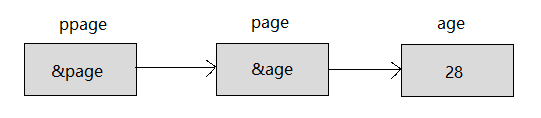

# 一、数组与指针

## 1.1 一维数组

### **1.1.1  数组名**

一维数组名指向第一个元素的指针(指向数组的首地址)

```c++
int a[4];
a 是 int类型
```

特殊情况：

* sizeof(数组名) :        计算整个数组的大小

* 对数组名取地址:     指向首地址但是步长跳越是整个数组长度. 

  ```c++
  int arr[5] = { 1, 2, 3, 4, 5 };
  
  int len = sizeof(arr)   //  5
      
  &arr   // 指向首地址
  arr    // 指向首地址
  &arr + 1      //  步长跳越的整个数组长度
  ```


### **1.1.2  指向一维数组的指针**

```c++
int arr[] = { 99, 15, 100, 888, 252 };

// 相同的都是指向数组首地址
int *p = arr;      
int *p = &arr[0]
```

==p  等价  arr==

**访问数组元素**

+ 下标法

  ```c++
  cout << arr[i]);
  ```

+ 指针法

  ```c++
  cout << *(arr + i));
  ```


###  技巧1.1.3一维数组表示二维数组

// 1. 创建10个箱子, 并且初始化为-1 
		**int* pTemp = new int[len * 10];**  // 一维数组表示二维数组

//pTemp[idx] [j];
			***(pTemp + (idx * 10) + j)**


## **1.2   数组指针**

```c++
int arr[] = { 1, 2, 3, 4, 5 };

// 数组指针
int(*p)[5]  = &arr;   
```

==*p  等价   arr==

**访问数组元素**

+ 下标法

  ```c++
  cout << (*P)[i];
  ```

+ 指针法

  ```c++
  cout <<  *( (*P) + i) );
  ```


## 1.3  二维数组

### **1.3.1  数组名**

二维数组名是指向第一个一维数组指针(指向第一个一维数组首地址)

```c++
int a[5][5];

a        是 int(*)[列数] 类型(一维数组指针)
*a       是 *a  是一维数组地址
a[0]     是 a[0]是一维数组地址(相当于一维数组名)
a[0][0]  是 int类型i
```

特殊情况：

* sizeof(数组名) :        计算整个数组的大小

* 对数组名取地址:     指向指向第一个一维数组的首地址但是步长跳越是整个数组长度. 

  ```c++
  int row = sizeof(arr)/sizeof(arr[0]);
  int col = sizeof(arr[0]) / sizeof(int);
  ```

  

### **1.3.2  指向二维数组的指针**

```c++
int arr[3][3] =
{
    { 1, 2, 3 },    // 数组名指向的首地址
    { 4, 5, 6 },
    { 7, 8, 9 }
};

int(*p)[3] = arr;   // arr就是数组指针 , int (*p) 是数组指针
```

==*(p + i) 等价 p[i]==

**访问数组元素**

+ 下标法

  ```c++
  cout << p[1][2];   // 5
  ```

+ 指针法

  ```c++
  cout <<   *( *(p + 1) + 2);   // 5
  ```

注意:  并不是使用的是二级指针


## 1.4    数组在函数中的传递

**相当于按引用传递**。再往本质上讲，数组（数组名）作为函数参数传递时，退化为指针。

 对于普通的数组

```c++
int array(int arr[], int n);
int array(int *arr, int n);    // 法二
-------------------
//二维数组
 int array(int arr2[][4], int n);
 int array(int (*arr2)[4], int n);   //二维数组名 等价与 一维数组的指针
```

对char型数组

```c++
void func(const char* s);
void func(char *s)            // 当想修改字符串实参 的内容时
```


# 二、动态数组

##  2.1   一维动态数组

c:

```c
char *naem = malloc(sizeof(char)*10);
```

c++:

```c++
char *name = new char[10];
int *dp = new int[10]; // 每个元素都没有初始化（值随机）
int *dp = new int[10] ();  // 每个元素初始化为0
int *dp = new int[10] = {1};  // 初始化第一个元素为1
delete[] dp;  // 动态释放
```

数组怎么用上面的指针就怎么使用

例子:

```c++
int arr[4] = {1, 2, 3, 4};

int* pArrNew = new int[4];
pArrNew = arr;

// each动态数组
for (int i = 0; i < 4; i++)
{
	cout << pArrNew[i];
}

delete [] pArrNew; // 会报错

//
int* pArr = new int[5];
for (int i = 0; i < 5; i++)
{
    pArr[i] = i;
}
delete [] pArr; // 不会报错
```

delete[动态数组](https://so.csdn.net/so/search?q=动态数组&spm=1001.2101.3001.7020)前需将指针拨回第一个元素


## 2.2   二维动态数组

c

```c
char **naem = malloc(sizeof(char *)*10);
```

c++

```c++
int** pArr = new int*[4];   // 几行
for (int i =0; i < 4; i++)
{
    parr[i] = new int[];   // l
}
```

例子:

```c
// 申请:
char ** naem =  malloc(sizeof(int *)*10);  // 10行  //二级指针每个元素指向的是一级指针

for (int i = 0; i < 10; i++)   // 每行 // 每个一级指针都申请一个一维数组
{
    name[i] = malloc(sizeof(int));  // int *    // 行去申请一维的指针
}


//释放: 
for ( int i = ; i < 3; i++)
{
 	free(name[i]);
}
free(name);
```

例子:

**二维动态数组初始化:**

```c++
int a[3][4] = 
{
    {1, 2, 3, 4},
    {5, 6, 7, 8},
    {9, 10, 11, 12}
}; //定义二维数组a，并赋值从1-12.

int ** p = NULL;  //定义二维指针。
int i, j;
p = (int **)malloc(sizeof(int *) *3);  //要访问的数组有三行，所以申请三个一维指针变量。
for(i = 0; i < 3; i ++)
{
    p[i] = a[i];  //将二维数组行地址赋值到对应的一维指针上。 // 实质就分配内存空间
}

for(i = 0; i < 3; i ++)
{
    for(j = 0; j < 4; j ++)
        printf("%d ", p[i][j]); //用指针输出元素。p[i][j]这里也可以写作*(*(p+i) + j)。
    printf("\n");  
}

free(p);//释放申请的内存。
```

int、char、string三种指针数组的初始化

```c++
int **a = new int *[10];
char **c = new char *[10];
string *str = new string[10];

char temp[20] = "偶稀饭你！";


//两层循环，int数组和char数组一并赋值了
for (int i = 0; i < 10; i++)
{
    a[i] = new int[10];    // 每行都申请一个一维数组
    c[i] = new char[20];
    for (int j = 0; j < 10; j++)
    {
        a[i][j] = 520;
    }
    memcpy(c[i], temp, sizeof(temp));
    c[i][sizeof(temp) + 1] = '\0';
}

//string数组赋值
for (int j = 0; j < 10; j++)
{
    str[j] = "稀饭你";
}

//输出
for (int k = 0; k < 10; k++)
{
    cout << *a[k] << endl
        << c[k] << endl
        << str[k] << endl
        << endl;
}
return 0;


520
偶稀饭你！
稀饭你
```


**单纯的二级指针指向一级:**

```
#include <iostream>
int main(int argc, char const* argv[])
{
    char test[10][10] = { {"一天"}, {"一夜"} };
    
    char* testp [10];
    for (int i = 0; i < 10; i++) {
        testp[i] = test[i];
    }
    
    char** temp = testp;
    
    std::cout << temp[0] <<  temp[1]  << std::endl;
    return 0;
}

一天	一夜
```


//


# 三、指针

## 3.1  指针共性

+ ==明确:  空指针和野指针都属于没有开辟内存==

  ```c
  Node * head, *p;  // ok 
  Node * head, p;   // err
  ```

+ **指针初始化 : int *p = 必须是地址(不确定先就置空);   ==普通类型必须是间接 .  数组和字符串常量可以直接==**

  ```c
  int *p = NULL;
  *p = 100;              //错的
   
  *p = a;                //错的
  
  int a = 100;
  p = &a;
  ```

+ **指针赋值:  必须是已分配了内存的指针(给他一个地址就是给他申请过的内存空间)才能进行赋值** 

  ```c
  int* a = malloc(sizeof(int)); // 有地址了
  if (a) // C6011:取消对NULL指针"__"的引用解决办法
  {
  	*a = 100; // 解引用赋值 
  	printf("%d", *a);
  	free(a);
  }
  ```

+ **指针置空:  p = NULL;**

+  **指针名 表示地址,   &变量也表示地址**


### 3.1.1   指针的运算

**算数运算：**

+ 指针是存储的地址，地址本质就是一个整数，因此，可以对指针执行四种算术运算：++、--、+、-(其他运算没有意义)。

  ```c
  // 解析是看类型解析
  char* pc = NULL;
  printf("%p %p\n",pc, pc+1);	//0 1
  int* pi = NULL;
  printf("%p %p\n",pi, pi+1);	//0 4
  double* pd = NULL;
  printf("%p %p\n",pd, pd+1);	//0 8
  ```

+ 总结:

  + 指针的每一次递增，它其实会指向下一个元素的存储单元。
  + 指针的每一次递减，它都会指向前一个元素的存储单元。
  + **指针在递增和递减时跳跃的字节数(步长)取决于指针所指向变量数据类型长度，**比如 int 就是 4 个字节
  + 不同类型的指针**所占内存大小都是一样**的(32位计算机4个字节，64位8个字节)

**关系运算：**

+ 一般只考虑== , >和<没什么意义

+ 指针可以用关系运算符进行比较，如 ==、< 和 >。如果 p1 和 p2 指向两个相关的变量，比如同一个数组中的不同元素，则可对 p1 和 p2 进行大小比较。

+ 总结：

  + 对相关变量的指针进行比较，才有意义

  + 大于小于常用在数组中，全等一般是判断指针是否为NULL

    

### 3.1.2  指针步长(重要)

核心:  **不同类型的指针有的意义  :  **

* 指针变量 +1后   跳跃字节数量不同
* 解引用的时候，取出字节数量不同
* ==注意: 数据本身是不会改变的,按照相应的解析,就能还原数据==

```C
void test01()
{
    // 1. 不同类型的指针, 指针变量+1后 跳跃字节数量不同
	char * p = NULL;
	printf("%d\n", p); //0    
	printf("%d\n", p+1);   // 1

	int * p1 = NULL;
	printf("%d\n", p1); //0
	printf("%d\n", p1 + 1); // 4
    
    double *p2 = NULL;
    printf("%d\n", p2);//0
	printf("%d\n", p2 + 1); // 8
}

//2、解引用时候  取多少字节数不同
void test02()
{
	char buf[1024] = { 0 }; //全零数组, 1024字节
	int a = 1000;  //4字节
    
    // 1
    memcpy(buf, &a, sizeof(int));       //从前开始覆盖原有部分数据:
    char * p = buf;  // 每一步只能取1节数
    printf("%d\n",  *(int*)p );  //取出4个字节 1000
    
    --------------------
        
    // 2    
    char buf[1024] = { 0 }; //全零数组, 1024字节
	int a = 1000;  //4字节
    
    memcpy(buf + 1, &a, sizeof(int));  // 在索引为1的位置塞入一个4字节的int数据
    char * p = buf;
    printf("%d\n",  *(int*)(p+1) );    // 100
}
```


1

2


## 3.2   一级指针


```c++
int a = 1025;
int *p1 = &a;  
```

**根据指针获取对应的内存的数据**:

+ &取地址符。用于获取变量所在的首地址

+ *****间接访问运算符，也叫作解引用运算符。用于获取地址对应的值。


**指针大小:**

指针作为一个变量是有大小的，其大小在32位平台是4个字节，64位平台上是8个字节，大小与指针的类型无关。

```c++
sizeof(char *)
sizeof(double *)
// 大小是一样的
```


##  3.3   二级指针



```c++
int age =28;
int *page = &age;
int **ppage = &page;
```

**根据指针获取对应的内存的数据 : **

+ &取地址符。用于获取变量所在的首地址

+ 解引用时, 一级指针加一个`*`，二级指针加两个`*`，三级指针加三个`*`，以此类推


# 代码

上述的测试代码

```c++
#include <iostream>

//指针

using namespace std;

void test();
void test01();

int main(void)
{
	test();
	//test01();
	return 0;
}

void test()
{//一级指针
	int a = 10;
	int* p = &a;
	//cout << *p;

	// 数组
	int arr[4] = {1, 2, 3, 4};
	int* pArr = arr;
	//cout << pArr[2];

	// 动态数组
	int* pArrNew = new int[4];
	pArrNew = arr;

	// each动态数组
	for (int i = 0; i < 4; i++)
	{
		cout << pArrNew[i];
        /cout << *(pArrNew + i);
	}


	// 指向二维数组
	int arr2[4][2] =
	{
		{1, 2},
		{3, 4},
		{5, 6},
		{7, 8},
	};

	int(*pArr2)[2] = arr2;

	// each
	for (int i = 0; i < 4; i++)
	{
		for (int j = 0; j < 2; j++)
		{
			cout << pArr2[i][j];
           // cout << *(*(pArr2 + i) + j);
		}
		cout << endl;
	}

}

void test01()
{//二级指针
	int** p2 = NULL;
	int a = 100;
	int* p1 = &a;
	p2 = &p1;
	cout << **p2;

	// 动态二维数组
	int** pArr2 = NULL;
	int arr2[4][2] =
	{
		{1, 2},
		{3, 4},
		{5, 6},
		{7, 8},
	};

	pArr2 = new int* [4];
	for (int i = 0; i < 4; i++)
	{
		pArr2[i] = arr2[i];
	}

	// each动态二维数组
	for (int i = 0; i < 4; i++)
	{
		for (int j = 0; j < 2; j++)
		{
			cout << pArr2[i][j];
		}
		cout << endl;
	}


}
```


# 结构体与指针

## 结构体指针

**指向另一个结构体**

+ 必须提前先声明出一个结构体(类比  类).

+ 当结构体中有指针类型,  必须逐个元素取赋值(涉及到深浅拷贝的问题)

```c
struct Student *ph = &hero;
```

例子:

```c
struct Student hero = {007,"007特工"};
struct Student *ph = &hero;

ph->name;
```

## 动态结构体

**动态开辟内存** 

c:

```c
struct Person * p2 = malloc(sizeof(struct Person));
```

c++:

```c++
name *p = new name;
```

例子:

```c++
struct name
{
    int a;
    char b[122];
    int c[10];
};

void test05()
{
    name *p = new name;
    
    p->a = 10;
    strcpy(p->b, "bbb");     // char字符串只能用strcpy();
    int a[10] = {0};
 	
    // each
    for (int i = 0; i < 10; i++)
    {
        p->c[i] = a[i];
    }
}
```

## 动态结构体数组

c::

```c
struct Person * personPoint = malloc(sizeof(struct Person) * 4);
```

c++:

```
Person * personPoint = new Person[4];
```

例子:

```c
struct Person * personPoint = malloc(sizeof(struct Person) * 4);
sprintf(personPoint[].name, "name_%d", i);
personPoint[i].age = i + 10;
```


## memset使用

[memset](https://so.csdn.net/so/search?q=memset&spm=1001.2101.3001.7020)可以方便的清空一个结构类型的变量或数组。如：

```cpp
struct sample_struct
{
    char csName[16];
    int iSeq;
    int iType;
};
```

结构体

```cpp
memset(&stTest,0,sizeof(struct sample_struct));
```

[结构体数组](https://so.csdn.net/so/search?q=数组&spm=1001.2101.3001.7020)：

```cpp
struct sample_struct TEST[10];
```

则

```c
memset(TEST,0,sizeof(struct sample_struct)*10);
```

 

#### 注意事项

+ memset初始化 int型 数组的时候只支持将数组中的所有元素初始化为 0 或 -1

+ memset() 可以初始化一个 bool数组 memset(b, true或false, sizeof(b));

```c++
#include<algorithm> 的 fill() 函数，可以方便快捷的初始化数组元素为规约范围内的任意值~
```

```c++
 例子：将数组元素全部初始化为233
int a[5]={0};
fill(a,a+5,233);
```


## 深浅拷贝问题

两个不是直接初始化结构体外:

```c++
#include <stdio.h>
#include <string.h>
#include <stdlib.h>
struct Person2
{
	char * name;
	int age;
};

void test02()
{
	struct Person2 p1;
	p1.name =  malloc(sizeof(char)* 64);
	strcpy(p1.name, "Tom");
	p1.age = 18;

	struct Person2 p2;
	p2.name = malloc(sizeof(char)* 128);
	strcpy(p2.name, "Jerry");
	p2.age = 20;

	//赋值
	// p1 = p2;  // 会出错

	//解决方式  手动进行赋值操作
    //核心
	///////////////////////////////////  
	if (p1.name!=NULL)
	{
		free(p1.name);
		p1.name = NULL;
	}

	p1.name = malloc(strlen(p2.name) + 1);
	strcpy(p1.name, p2.name);

	p1.age = p2.age;

	////////////////////////////////////

	printf("P1 姓名 : %s  年龄:  %d\n", p1.name, p1.age);
	printf("P2 姓名 : %s, 年龄:  %d\n", p2.name, p2.age);


  // 除了两结构体都是通过初始化赋值外
   struct Person2 p3 = {"p3", 10};
   struct Person2 p4 = {0};
   struct Person2 p5 = {"p5", 100};
   printf("P3 姓名 : %s  年龄: %d\n", p3.name, p3.age);
   p4 = p3;
   printf("P4 姓名 : %s, 年龄:  %d\n", p4.name, p4.age);
   p5 = p3;
   printf("P5 姓名 : %s, 年龄:  %d\n", p5.name, p5.age);


//    p2 = p5;  // 报错
//    p5 = p2;  // 报错


	//堆区开辟的内容 自己管理释放
	if (p1.name != NULL)
	{
		free(p1.name);
		p1.name = NULL;
	}

	if (p2.name != NULL)
	{
		free(p2.name);
		p2.name = NULL;
	}

}

int main()
{
    test02();    
    return 0;
}
```


